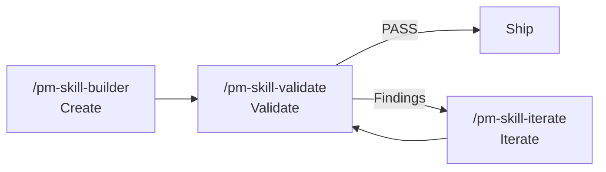

# PM-Skills Quick Start

## What's Included

- **29 shipped PM skills in `skills/`** (25 phase skills across 6 phases, 1 foundation skill, 3 utility skills)
- **30 slash-command docs in `commands/`** (29 skill commands plus the `/kickoff` workflow bundle)
- **Workflow bundles** for multi-skill processes (Triple Diamond, Lean Startup, Feature Kickoff)
- **MCP sync guardrail** via GitHub Actions (`validate-mcp-sync`, observe-first rollout)

## Installation

### Claude.ai / Claude Desktop

1. Go to **Settings > Capabilities** (Desktop) or **Project Settings > Add Files** (Claude.ai)
2. Upload the latest release ZIP (`pm-skills-vX.X.X.zip`) from [Releases](https://github.com/product-on-purpose/pm-skills/releases)
3. Skills are now available in your conversations

### Claude Code

Clone or copy to your project:

```bash
git clone https://github.com/product-on-purpose/pm-skills.git
```

Or download and extract the latest ZIP from [Releases](https://github.com/product-on-purpose/pm-skills/releases) to your project root.

### Other AI Agents

Point your agent to `AGENTS.md` for skill discovery. Each skill is self-contained in `skills/{skill-name}/SKILL.md` (e.g., `skills/deliver-prd/SKILL.md`).

More detail: see `docs/getting-started.md` for the long-form guide.

## Usage

### Slash Commands

```
/prd "Feature description"
/hypothesis "Assumption to test"
/acceptance-criteria "Story or feature slice"
/user-stories "PRD or feature context"
/competitive-analysis "Market or product area"
```

See `AGENTS.md` for the complete command list.

### Workflow Bundles

Run multi-skill workflows:

```
/kickoff "Feature name"  # Problem → Hypothesis → PRD → Stories
```

Bundle definitions are in `_bundles/`.

## Skill Lifecycle Tools

Three utility skills manage the skill library itself:



See `docs/pm-skill-lifecycle.md` for detailed workflow patterns.

## File Structure

```
skills/            # All 29 skill definitions (25 phase + 1 foundation + 3 utility, flat)
commands/          # 29 command markdown files (+ .gitkeep)
_bundles/          # Multi-skill workflows
scripts/           # sync, validation, and release helpers
.claude/pm-skills-for-claude.md  # instructions for Claude Code users
AGENTS.md          # Agent discovery index
```

For Claude Code discovery, run `./scripts/sync-claude.sh` (or `.ps1`) to populate `.claude/skills` and `.claude/commands` from the flat source.

## Learn More

- Full documentation: https://github.com/product-on-purpose/pm-skills
- Skill specification: https://agentskills.io/specification

---

*Built by [Product on Purpose](https://github.com/product-on-purpose) for PMs who ship.*
