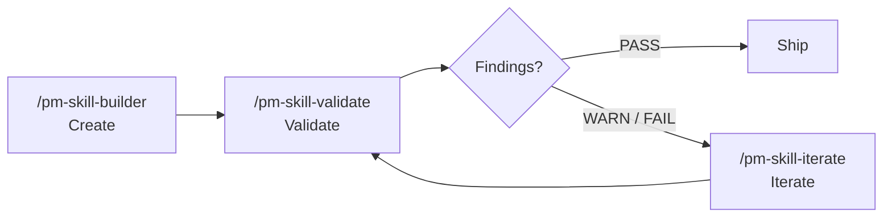

<a id="readme-top"></a>

<h1 align="center">
  <a href="https://github.com/product-on-purpose/pm-skills">PM-Skills</a>
  <br>
</h1>

<h4 align=”center”>A curated collection of 38 best-practice, plug-and-play product management “agent skills” (25 phase skills + 7 foundation skills + 6 utility skills) plus templates and workflows for consistent, professional PM outputs.</h4>

<p align="center">
  <a href="https://github.com/product-on-purpose/pm-skills/issues/new?labels=bug">Report a Bug</a>
  ·
  <a href="https://github.com/product-on-purpose/pm-skills/issues/new?labels=enhancement">Request a Feature</a>
  ·
  <a href="https://github.com/product-on-purpose/pm-skills/discussions">Ask a Question</a>
</p>

<p align="center">
  
  <a href="https://github.com/product-on-purpose/pm-skills/blob/main/LICENSE">
    
  </a>
  <a href="https://github.com/product-on-purpose/pm-skills/releases">
    
  </a>
  <a href="#the-skills">
    
  </a>
  <a href="https://agentskills.io/specification">
    
  </a>
  <a href="https://skills.sh/product-on-purpose/pm-skills">
    
  </a>
  <a href="CONTRIBUTING.md">
    
  </a>
</p>

<p align="center">
  <a href="https://github.com/product-on-purpose/pm-skills/stargazers">
    
  </a>
  <a href="https://github.com/product-on-purpose/pm-skills/network/members">
    
  </a>
  <a href="https://github.com/product-on-purpose/pm-skills/issues">
    
  </a>
  <a href="https://github.com/product-on-purpose/pm-skills/graphs/contributors">
    
  </a>
  
</p>

<!-- ========== NEW: MCP Cross-Reference Badge + Callout ========== -->
<p align="center">
  <a href="https://github.com/product-on-purpose/pm-skills-mcp">
    
  </a>
</p>

> **🔥MCP Server Available!** If you are using VS Code, Claude Desktop, Claude Code (CLI), Github Copilot, Cursor, etc... check out **[pm-skills-mcp](https://github.com/product-on-purpose/pm-skills-mcp)** for instant MCP access to the shipped skill library and workflows - no file management required.

---

<!-- ========== END NEW ========== -->

<p align="center">
  <a href="#the-big-idea">About</a> •
  <a href="#getting-started">Getting Started</a> •
  <a href="#the-skills">Skills</a> •
  <a href="#workflows">Workflows</a> •
  <a href="#project-status">Status</a> •
  <a href="#contributing">Contributing</a> •
  <a href="#community">Community</a>
</p>

<details>
<summary><strong>Table of Contents</strong></summary>

- [The Big Idea](#the-big-idea)
  - [The Problem](#the-problem)
  - [The Solution](#the-solution)
  - [Key Features](#key-features)
  - [Built with...](#built-with)
  - [Founded on...](#founded-on)
  - [Works for...](#works-for)
  - [Comparison: `pm-skills` (this repo) vs. `pm-skills-mcp`](#comparison-pm-skills-this-repo-vs-pm-skills-mcp)
- [Getting Started](#getting-started)
  - [Install as Claude Code Plugin](#install-as-claude-code-plugin)
  - [Installation Options](#installation-options)
  - [Quick Start by Platform](#quick-start-by-platform)
  - [Releases](#releases)
  - [Primary: skills CLI (via skills.sh)](#primary-skills-cli-via-skillssh)
  - [Alternative: openskills CLI](#alternative-openskills-cli)
- [Usage](#usage)
  - [How Skills Work](#how-skills-work)
  - [The Skills](#the-skills)
  - [Quick Examples](#quick-examples)
  - [Workflows](#workflows)
- [Project Status](#project-status)
  - [Project Structure](#project-structure)
  - [Changelog](#changelog)
  - [Milestones](#milestones)
  - [Roadmap](#roadmap)
- [Contributing](#contributing)
  - [How to Contribute](#how-to-contribute)
  - [Reporting Bugs](#reporting-bugs)
- [FAQ](#faq)
- [About](#about)
  - [Author](#author)
  - [License](#license)
- [Community](#community)

</details>

---

**Quick Start** (Clone and go!)
```bash
git clone https://github.com/product-on-purpose/pm-skills.git && cd pm-skills
```

---

**What's New (Recent Releases)**
<details open>
<summary>v2.11.1 - skills.sh CLI Compatibility Patch</summary>

- **Install in one command**: `npx skills add product-on-purpose/pm-skills` now installs all 38 skills through the open [`skills` CLI](https://github.com/vercel-labs/skills) and the [skills.sh directory](https://skills.sh). Previously broken for 6 foundation skills due to a YAML-frontmatter quirk.
- **6 foundation SKILL.md files fixed**: leading HTML attribution comment removed (it was breaking strict YAML parsers). Attribution preserved via the identical comment right after the frontmatter.
- **`foundation-meeting-synthesize`**: description reworded to remove inline `: ` that was truncating it under strict YAML; version 1.0.0 to 1.0.1.
- **25 stale tracked files removed** from `.claude/skills/` (pre-v1 personal-setup relics that were shipping as phantom bonus skills on install).
- **Two new lint rules** in `scripts/lint-skills-frontmatter.sh/.ps1`: first line of every SKILL.md must be `---`; unquoted descriptions must not contain inline `: `. Closes the gap between our validator and the real CLI consumer.
- **README install surface**: new `npx skills add` one-liner at the top of Getting Started + skills.sh badge + Installation Options table row.
- **Distribution plan**: six-phase skills.sh submission approach documented at [`docs/internal/distribution/2026-04-22_skills-sh.md`](docs/internal/distribution/2026-04-22_skills-sh.md). Phases 0 through 3 complete with this release; Phase 5 (soft-launch for install telemetry) is a post-release workstream.
- **Em-dash sweep completion**: 376 tracked files, 5,805 em-dash characters replaced per the 2026-04-13 standing style rule.
- **Stale skill-count reconciliation**: 8 current-state references to `27 skills` or `31 skills` updated to `38 skills` across 5 files. Historical per-release snapshots in this section preserved as accurate records.
- No behavioral changes to any skill. Safe patch upgrade.
- Release note: [`docs/releases/Release_v2.11.1.md`](docs/releases/Release_v2.11.1.md).

</details>
<details>
<summary>v2.11.0 - Meeting Skills Family + Lean Canvas: first cross-cutting skill-family contract</summary>

- **New foundation skill**: `foundation-lean-canvas` (`/lean-canvas`) . one-page business thesis across nine interlocking blocks (problem, customer, UVP, solution, channels, revenue, cost, metrics, unfair advantage). Two modes: `content` (structured markdown) and `visual` (self-contained HTML with A3 landscape print styling).
- **New foundation family . the 5-skill Meeting Skills Family**, governed by a canonical contract ([`docs/reference/skill-families/meeting-skills-contract.md`](docs/reference/skill-families/meeting-skills-contract.md)) with enforcing CI:
  - `foundation-meeting-agenda` (`/meeting-agenda`) . attendee-facing structural agenda with time-boxed topics, type tags, owners, prep; 10 meeting-type variants
  - `foundation-meeting-brief` (`/meeting-brief`) . private strategic prep with stakeholder reads, ranked outcomes, anticipated Q&A
  - `foundation-meeting-recap` (`/meeting-recap`) . topic-segmented post-meeting summary with decisions bold-flagged and actions inline; auto-discovers sibling agenda
  - `foundation-meeting-synthesize` (`/meeting-synthesize`) . cross-meeting archaeology surfacing patterns, trajectories, contradictions
  - `foundation-stakeholder-update` (`/stakeholder-update`) . async outward comms with 5 channel × 5 audience variants
- **New pattern**: `docs/reference/skill-families/` . canonical home for cross-cutting skill-family contracts. Meeting Skills Contract is the first entry; future families (research, delivery) can add entries.
- **New CI**: `validate-meeting-skills-family.sh/.ps1` . enforcing validation of contract conformance, filename convention, and shareable-boundary structure.
- **New end-user guide**: [Using the Meeting Skills Family](docs/guides/using-meeting-skills.md) with mermaid diagrams covering skill chain, go-mode flow, and family lifecycle.
- **Sample library**: 94 → 120 outputs; 15 thread-aligned samples (3 per meeting skill × storevine/brainshelf/workbench) added.
- **Process improvement**: Pre-release checklist now requires a Phase 0 Adversarial Review Loop (Codex adversarial review → resolution → re-run until findings stabilize below IMPORTANT). Codified from v2.11.0 experience where Round 2 of review surfaced 6 additional IMPORTANT issues in the Round 1 resolution pass itself.
- Repo now ships 38 skills (25 phase + 7 foundation + 6 utility), 45 command docs, and 9 workflows.
- Release note: [`docs/releases/Release_v2.11.0.md`](docs/releases/Release_v2.11.0.md).

</details>
<details>
<summary>v2.10.x - Utility skill expansion: mermaid diagrams, slideshows, self-updating</summary>

- **New skill**: `utility-mermaid-diagrams` (`/mermaid-diagrams`) . 15 diagram types with dual-lens navigation (type catalog + PM use-case guide), dedicated syntax validity reference, and worked examples.
- **New skill**: `utility-slideshow-creator` (`/slideshow-creator`) . generates professional presentations from JSON deck specs; 18 slide types with dark/light variants and Google Slides compatibility.
- **New skill**: `utility-update-pm-skills` (`/update-pm-skills`) . checks for newer releases, previews changes with `--report-only`, and applies updates with confirmation. Includes backup, value-delta report, and post-update smoke test.
- **Sample library**: 84 → 91 outputs, now covering all 32 skills.
- **Tooling**: `generate-skill-pages.py` now computes skill/command/workflow counts dynamically, eliminating stale-count drift.
- Repo now ships 32 skills, 39 command docs, and 9 workflows.
- v2.10.1 patch: backlog spec drafts for 10 upcoming skills, generated docs/skills/ pages, F-25 scope moved to agent-config-toolkit.
- v2.10.2 patch: corrected plugin / marketplace manifest skill counts (29 → 32) to match repo state; extended `check-count-consistency` CI to scan JSON manifests and closed an off-by-one in its threshold comparison; fixed README "10 workflows" to "9 workflows".

</details>
<details>
<summary>v2.9.0 - Workflows: rename + expansion (3 → 9)</summary>

- **BREAKING:** Renamed `_bundles/` → `_workflows/` and `docs/bundles/` → `docs/workflows/`
- **BREAKING:** `/kickoff` command replaced by `/workflow-feature-kickoff`
- **6 new workflows**: Customer Discovery, Sprint Planning, Product Strategy, Post-Launch Learning, Stakeholder Alignment, Technical Discovery
- **7 `/workflow-*` slash commands** (1 renamed + 6 new)
- **New script**: `scripts/generate-workflow-pages.py` . generates docs site pages from source workflows
- **URL redirects** for old `/bundles/*` doc site paths via `mkdocs-redirects`
- **Terminology guard**: `scripts/check-stale-bundle-refs.sh/.ps1` prevents regression
- Repo now ships 31 skills, 38 command docs, and 9 workflows.
- Release note: [`docs/releases/Release_v2.9.0.md`](docs/releases/Release_v2.9.0.md).

</details>
<details>
<summary>v2.8.0 - PM skill lifecycle: Create, Validate, Iterate</summary>

- **New skill**: `utility-pm-skill-validate` (`/pm-skill-validate`) . audits a skill against structural conventions and quality criteria, producing a severity-graded validation report.
- **New skill**: `utility-pm-skill-iterate` (`/pm-skill-iterate`) . applies targeted improvements based on feedback or validation reports, with before/after previews and version bump suggestions.
- **New CI**: `validate-skill-history` and `validate-skills-manifest` advisory scripts for skill versioning governance.
- **New guide**: `docs/pm-skill-lifecycle.md` . workflow patterns for the Create → Validate → Iterate lifecycle.
- **Governance**: `docs/internal/skill-versioning.md` . SemVer rules, HISTORY.md contract, skills-manifest.yaml format.
- Repo now ships 29 skills, 30 command docs, and 3 workflows.
- Release note: [`docs/releases/Release_v2.8.0.md`](docs/releases/Release_v2.8.0.md).

</details>
<details>
<summary>v2.7.0 - Utility skills, enhanced CI, and release packaging hygiene</summary>

- **New skill**: `deliver-acceptance-criteria` . Given/When/Then acceptance criteria for stories and features.
- **New skill**: `utility-pm-skill-builder` . first utility-classified skill; interactive builder for creating new PM skills with gap analysis, classification, and draft file generation.
- **Enhanced CI**: extended frontmatter linter, AGENTS.md sync validator, MCP impact detection.
- **Release packaging**: `docs/internal/**` excluded from published ZIPs while staying tracked in-repo.
- **Documentation**: new `docs/pm-skill-anatomy.md` guide, comprehensive public docs refresh.
- Repo now ships 27 skills, 28 command docs, and 3 workflows.
- Release note: [`docs/releases/Release_v2.7.0.md`](docs/releases/Release_v2.7.0.md).

</details>
<details>
<summary>v2.6.x - Claude plugin packaging + sample library recovery</summary>

**v2.6.1** . Sample library recovery and packaging inclusion:
- Restored and normalized the shipped sample-output corpus under `library/skill-output-samples/`.
- Added sample-library staging to release packagers so ZIP artifacts include sample outputs.
- Release note: `docs/releases/Release_v2.6.1.md`.

**v2.6.0** . Claude plugin packaging release:
- Added Claude plugin manifest support via `.claude-plugin/plugin.json`.
- Release packaging now includes `.claude-plugin/` and enforces plugin-manifest version alignment with the release version.
- Release note: `docs/releases/Release_v2.6.0.md`.

</details>

[View previous release details](#previous-release-details) | [Full changelog](#changelog)

---

## The Big Idea

**Stop prompt-fumbling. Start shipping.** Every time you ask an AI to help with product management, you start from zero. Generic responses. Inconsistent formats. Missing critical sections. Hours lost to repetitive prompt crafting.

PM-Skills changes that and gives your AI-tool-of-choice instant access to:

- **Professional frameworks** refined across hundreds of product launches
- **Production-ready templates** that capture institutional PM knowledge
- **Real-world examples** that set the quality bar

```
You: "Create a PRD for our new search feature"

AI + PM-Skills: Generates a comprehensive PRD with problem statement,
                success metrics, user stories, scope definition, and
                technical considerations-all in professional format.
```

### The Problem

Every time you ask an AI to help with product management, you start from zero. Generic responses. Inconsistent formats. Missing critical sections. Hours spent prompt-engineering the same workflows.

### The Solution

**PM-Skills** gives your AI instant access to field-tested frameworks, templates, and examples for every stage of product development.

| Without PM-Skills                 | With PM-Skills                  |
| --------------------------------- | ------------------------------- |
| ⚠️ Generic AI responses          | ✅ Professional PM frameworks   |
| ⚠️ Inconsistent formats          | ✅ Production-ready templates   |
| ⚠️ Missing key sections          | ✅ Comprehensive coverage       |
| ⚠️ Starting from scratch         | ✅ Building on best practices   |
| ⚠️ Prompt engineering every time | ✅ One command, instant results |

### Key Features

- ✅ **32 Production-Ready Skills** covering the complete product lifecycle (25 phase skills + 1 foundation skill + 6 utility skills)
- ✅ **Triple Diamond Framework** organizing Discover, Define, Develop, Deliver, Measure, and Iterate phases
- ✅ **9 Workflows** for common PM processes (Feature Kickoff, Lean Startup, Triple Diamond, and 6 more)
- ✅ **Slash Commands** for Claude Code users-instant access to every skill
- ✅ **Auto-Discovery** via AGENTS.md in GitHub Copilot, Cursor, and Windsurf
- ✅ **Agent Skills Spec** compliant-works across AI assistants
- ✅ **Best-Practice Templates** based on industry best practices
- ✅ **Comprehensive Documentation** with examples and references
- ✅ **Apache 2.0 Licensed** for commercial and personal use

### Skill Lifecycle Tools

PM-Skills includes three utility skills that form a complete **Create → Validate → Iterate** lifecycle for managing skills themselves:



| Tool | Command | What it does |
|------|---------|-------------|
| **Builder** | `/pm-skill-builder` | Creates a new skill from an idea . runs gap analysis against all existing skills, classifies by type and phase, generates draft files to a staging area, and promotes on confirmation |
| **Validator** | `/pm-skill-validate` | Audits an existing skill against structural conventions and quality criteria . produces a report with severity-graded findings and actionable recommendations |
| **Iterator** | `/pm-skill-iterate` | Applies targeted improvements to a skill based on feedback or a validation report . previews changes, writes on confirmation, suggests a version bump |

**Why this matters:** Skills are living artifacts that evolve. The builder creates them, the validator catches drift and quality gaps, and the iterator applies fixes. Together they keep the library consistent as it grows.

**Quick example:**
```bash
# Create a new skill
/pm-skill-builder "A skill for writing stakeholder update emails"

# Validate it meets conventions
/pm-skill-validate stakeholder-update-email

# Fix any findings
/pm-skill-iterate stakeholder-update-email   # paste the validation report
```

See [PM-Skill Lifecycle](docs/pm-skill-lifecycle.md) for workflow patterns and detailed usage.

### Built with...

<p align="left">
  <a href="https://agentskills.io/specification">
    
  </a>
  <a href="https://github.github.com/gfm/">
    
  </a>
  <a href="https://github.com/features/actions">
    
  </a>
</p>

- **[Agent Skills Specification](https://agentskills.io/specification)** - Open standard for AI-agent skills
- **[GitHub Flavored Markdown](https://github.github.com/gfm/)** - Universal documentation format
- **[Keep a Changelog](https://keepachangelog.com/)** - Structured release documentation
- **[Best-README-Template](https://github.com/othneildrew/Best-README-Template)** - README inspiration

### Founded on...

- **[Triple Diamond Framework](https://medium.com/zendesk-creative-blog/the-zendesk-triple-diamond-process-fd857a11c179)** - Product development methodology
- **[Teresa Torres' Opportunity Solution Trees](https://www.producttalk.org/opportunity-solution-tree/)** - Outcome-driven discovery
- **[Jobs to be Done Framework](https://jtbd.info/)** - Customer motivation framework
- **[Architecture Decision Records](https://adr.github.io/)** - Technical decision documentation
- **[Design Council's Double Diamond](https://www.designcouncil.org.uk/our-resources/framework-for-innovation/)** - Foundation of our Triple Diamond framework
- **[Michael Nygard](https://cognitect.com/blog/2011/11/15/documenting-architecture-decisions)** - ADR format we adapted

### Works for...

PM-Skills follows the **[Agent Skills Specification](https://agentskills.io/specification)** and works natively across the AI ecosystem.

<!-- ========== UPDATED: Platform Compatibility Table with MCP Column ========== -->
#### Platform Compatibility

| Platform            | Status       | Method                                                                      | Notes                                  |
| ------------------- | ------------ | --------------------------------------------------------------------------- | -------------------------------------- |
| **Claude Code**     | ✅ Native    | Slash commands; optional `sync-claude.(sh|ps1)` to populate `.claude/` cache | Best experience with `/prd`, etc.; helper needed for openskills-style discovery |
| **Claude.ai**       | ✅ Native    | ZIP upload                                                                  | Upload to Projects                     |
| **Claude Desktop**  | ✅ Native    | ZIP upload or [MCP](https://github.com/product-on-purpose/pm-skills-mcp)    | MCP recommended for programmatic access |
| **GitHub Copilot**  | ✅ Native    | AGENTS.md discovery                                                         | Auto-discovers in repo                 |
| **Cursor**          | ✅ Native    | AGENTS.md or [MCP](https://github.com/product-on-purpose/pm-skills-mcp)     | MCP for programmatic tool access; sync helper optional if using openskills      |
| **Windsurf**        | ✅ Native    | AGENTS.md discovery                                                         | Auto-discovers; sync helper not needed |
| **VS Code**         | ✅ Native    | Via extensions                                                              | Cline, Continue, or manual             |
| **OpenCode**        | ✅ Native    | Skill format                                                                | Direct skill loading                   |
| **Any MCP Client**  | ✅ Universal | [pm-skills-mcp](https://github.com/product-on-purpose/pm-skills-mcp)        | Protocol-level access                  |
| **ChatGPT / Codex** | 🔶 Manual    | Copy skill content                                                          | No native support                      |
| **Other AI Tools**  | 🔶 Manual    | Copy skill content                                                          | Works with any LLM                     |

### Comparison: `pm-skills` (this repo) vs. `pm-skills-mcp`

`PM-Skills` is available in two complementary forms:

|  | pm-skills (this repo) | [pm-skills-mcp](https://github.com/product-on-purpose/pm-skills-mcp) |
|---|---|---|
| **What it is** | Skill library as markdown files | MCP server wrapping the skill library |
| **Access method** | Git clone, ZIP upload | `npx pm-skills-mcp` |
| **Setup time** | 2-5 minutes | 30 seconds |
| **Skill invocation** | Slash commands (Claude Code) | MCP tool calls |
| **Auto-discovery** | AGENTS.md (Copilot, Cursor, Windsurf) | MCP protocol (Claude Desktop, Cursor) |
| **Template access** | Navigate file system | URI-based resources |
| **Workflows** | Manual orchestration | Tool-based execution |
| **Customization** | Edit files directly | Set `PM_SKILLS_PATH` to custom folder |
| **Updates** | `git pull` | `npm update pm-skills-mcp` |

> Note: pm-skills-mcp v1.x targets the legacy nested layout; use pm-skills-mcp v2.4+ for version-aligned parity with pm-skills v2.4+.

**Use `pm-skills` (this repo) when:**
- You prefer slash commands in Claude Code (`/prd`, `/hypothesis`)
- You want to browse, read, and customize skill files directly
- You're using GitHub Copilot or Windsurf with AGENTS.md discovery
- You want to fork and heavily customize skills for your team

**Use [pm-skills-mcp](https://github.com/product-on-purpose/pm-skills-mcp) when:**
- You want instant setup with `npx pm-skills-mcp`
- You're using Claude Desktop, Cursor, or any MCP client
- You want programmatic tool access without managing files

Both approaches give you access to the same 32 production-ready PM skills (25 phase skills + 1 foundation skill + 6 utility skills).

See the [Ecosystem Overview](docs/reference/ecosystem.md) for a detailed comparison.

<p align="right">(<a href="#readme-top">back to top</a>)</p>

---

## Getting Started

**Fastest path:** Install all 38 skills into your agent with one command, using the open [`skills` CLI](https://github.com/vercel-labs/skills):

```bash
npx skills add product-on-purpose/pm-skills
```

Works with Claude Code, Cursor, GitHub Copilot, Cline, and any agent supported by the `skills` CLI. Skills land in your agent's default skills directory and are ready to use immediately.

**Prefer a manual clone?** The classic path still works:

```bash
git clone https://github.com/product-on-purpose/pm-skills.git && cd pm-skills
```

**Need platform-specific instructions?** See [Quick Start by Platform](#quick-start-by-platform) below.

**Want a detailed walkthrough?** Check our [Getting Started Guide](docs/getting-started.md).

**Docs navigation:** Quickest: this README’s Quick Start or `QUICKSTART.md` in the repo/release ZIP. Detailed: `docs/getting-started.md` (long-form).

### Install as Claude Code Plugin

Use this option if your Claude client supports plugin-manifest install flows.

1. Clone the repo or extract the release ZIP.
2. During plugin setup, select the manifest at `.claude-plugin/plugin.json`.
3. Complete install in your client and reload if prompted.

Example local setup:

```bash
git clone https://github.com/product-on-purpose/pm-skills.git
cd pm-skills
# Then point your client to: .claude-plugin/plugin.json
```

### Installation Options

| Method                 | Best For                                  | Command / Action                              |
| ---------------------- | ----------------------------------------- | --------------------------------------------- |
| **`skills` CLI**       | Any agent supported by the open skills ecosystem (Claude Code, Cursor, Copilot, Cline) | `npx skills add product-on-purpose/pm-skills` |
| **Git Clone**          | Claude Code, Copilot, Cursor, Windsurf    | `git clone https://github.com/product-on-purpose/pm-skills.git` |
| **ZIP Download**       | Claude.ai, Claude Desktop                 | [Download Latest Release](https://github.com/product-on-purpose/pm-skills/releases/latest) |
| **MCP Server**         | Programmatic tool access                  | `npx pm-skills-mcp` ([pm-skills-mcp](https://github.com/product-on-purpose/pm-skills-mcp)) |


### Quick Start by Platform

<details>
<summary><strong>Claude Code</strong></summary>

**Fastest install (one command):**

```bash
npx skills add product-on-purpose/pm-skills
```

Installs all 38 skills into your agent's default skills directory. Slash commands (`/prd`, `/hypothesis`, `/user-stories`, etc.) become available immediately. No clone, no sync helper.

**Alternative: clone the full repo** (gives you the sample library, library/skill-output-samples, internal docs, and workflows alongside the skills):

```bash
# Clone the repo to get slash commands + everything else
git clone https://github.com/product-on-purpose/pm-skills.git
cd pm-skills

# Use any skill with slash commands
/prd "Search feature for e-commerce platform"
/hypothesis "Will one-page checkout increase conversion?"
/user-stories "Recurring tasks feature from PRD"
```

All 38 skills are available as `/skill-name` commands. See [commands/](commands/) for the full list.

Need `.claude/skills` for openskills or certain discovery flows? After cloning, run:

```bash
./scripts/sync-claude.sh   # macOS/Linux
./scripts/sync-claude.ps1  # Windows
```

This regenerates `.claude/skills` and `.claude/commands` from the flat source; keep them untracked.

</details>

<details>
<summary><strong>Claude.ai / Claude Desktop</strong></summary>

1. Download `pm-skills-vX.X.X.zip` from [Releases](https://github.com/product-on-purpose/pm-skills/releases)
2. Upload in Claude.ai or Desktop:
   - **Claude.ai**: Project Settings → Add Files → Upload ZIP
   - **Desktop**: Settings → Capabilities → Upload ZIP
3. Use skills by name: "Use the prd skill to create requirements for..."

See `QUICKSTART.md` in the archive for detailed instructions.

</details>

<!-- ========== NEW: MCP Server Quick Start ========== -->
<details>
<summary><strong>MCP Server (Claude Desktop, Cursor, Any MCP Client)</strong></summary>

For [MCP-compatible clients](https://modelcontextprotocol.io), use [pm-skills-mcp](https://github.com/product-on-purpose/pm-skills-mcp):

```json
{
  "mcpServers": {
    "pm-skills": {
      "command": "npx",
      "args": ["pm-skills-mcp"]
    }
  }
}
```

All 26 domain and foundation skills become available as programmatic tools (the utility skill is designed for Claude Code environments). See the [pm-skills-mcp README](https://github.com/product-on-purpose/pm-skills-mcp#getting-started) for client-specific setup.

</details>
<!-- ========== END NEW ========== -->

<details>
<summary><strong>GitHub Copilot</strong></summary>

Copilot auto-discovers skills via `AGENTS.md`:

```bash
# Clone into your project or as a submodule
git clone https://github.com/product-on-purpose/pm-skills.git

# Or add as submodule
git submodule add https://github.com/product-on-purpose/pm-skills.git
```

Copilot Chat will see the skills. Ask: "Use the prd skill to create requirements for user authentication"

Setup checklist:
1. Open a workspace that includes `pm-skills` (repo root or submodule).
2. Use Copilot Chat in agent/workspace context.
3. Invoke skills by name, for example: `Use the hypothesis skill for checkout abandonment`.

</details>

<details>
<summary><strong>OpenCode</strong></summary>

OpenCode can load PM-Skills directly from this repository:

```bash
git clone https://github.com/product-on-purpose/pm-skills.git
cd pm-skills
```

Setup checklist:
1. Configure OpenCode to use this folder as a skills source.
2. If your OpenCode flow expects `.claude/skills/`, run `./scripts/sync-claude.sh` (or `.ps1`) once after clone.
3. Invoke by skill name (example: `Use the prd skill for ...`).

</details>

<details>
<summary><strong>Cursor / Windsurf</strong></summary>

Both IDEs auto-discover skills via `AGENTS.md`:

```bash
# Clone into your workspace
git clone https://github.com/product-on-purpose/pm-skills.git
```

Open the folder in Cursor or Windsurf. The AI assistant will automatically discover and can use all 38 skills.

</details>

<details>
<summary><strong>VS Code (Cline / Continue)</strong></summary>

**With Cline or Continue extensions:**
1. Clone pm-skills into your workspace
2. The extension will discover skills via `AGENTS.md`
3. Ask: "Use the hypothesis skill to test my assumption about..."

**Manual approach:**
1. Open any `SKILL.md` file from `skills/{phase-skill}/` (e.g., `skills/deliver-prd/`)
2. Copy the content into your AI chat
3. Ask the AI to follow the skill instructions

</details>

<details>
<summary><strong>ChatGPT / Other LLMs</strong></summary>

ChatGPT and other LLMs don't support Agent Skills natively, but you can use skills manually:

1. Clone or download pm-skills
2. Open the skill you need (e.g., `skills/deliver-prd/SKILL.md`)
3. Copy the full content into your ChatGPT conversation
4. Ask: "Follow these instructions to create a PRD for [your topic]"

The skill content provides all the context the LLM needs to produce professional output.

</details>

### Releases

All releases are available on the [GitHub Releases](https://github.com/product-on-purpose/pm-skills/releases) page:

- **`pm-skills-vX.X.X.zip`** . Complete package with all skills, commands, workflows, and documentation
- **Latest stable:** `v2.10.2` (Plugin manifest drift fix and count-consistency CI hardening)
- **Latest release notes:** [CHANGELOG.md](CHANGELOG.md#2102---2026-04-14)
- **Published tag:** [`v2.10.2`](https://github.com/product-on-purpose/pm-skills/releases/tag/v2.10.2)
- **Documentation site:** [product-on-purpose.github.io/pm-skills](https://product-on-purpose.github.io/pm-skills/)

Each release includes `QUICKSTART.md` with installation and usage instructions.
Release notes are published in `docs/releases/` (for example, `docs/releases/Release_v2.2.md`).

[](https://github.com/product-on-purpose/pm-skills/releases/latest)

### Primary: skills CLI (via skills.sh)

The open [`skills` CLI](https://github.com/vercel-labs/skills) from Vercel Labs is the recommended install path for most agents. One command, no configuration:

```bash
npx skills add product-on-purpose/pm-skills
```

This clones pm-skills, scans the `skills/` directory, and installs all 38 skills into your agent's default skills directory. Supported agents include Claude Code, Cursor, GitHub Copilot, Cline, and others. Discoverable via the [skills.sh directory](https://skills.sh/product-on-purpose/pm-skills).

Telemetry is anonymous and opt-out via `DISABLE_TELEMETRY=1` or `DO_NOT_TRACK=1` in your environment.

### Alternative: openskills CLI

> **Note:** The [openskills CLI](https://github.com/numman-ali/openskills) discovers skills in `.claude/skills/` directories. PM-Skills ships a flat `skills/{phase-skill}/` structure plus a sync helper that populates `.claude/skills/` locally. Run `./scripts/sync-claude.sh` (or `.ps1`) after cloning to enable discovery.

```bash
# Works for repos with .claude/skills/ structure (e.g., anthropics/skills)
npm i -g openskills
openskills install anthropics/skills
openskills sync
```

<p align="right">(<a href="#readme-top">back to top</a>)</p>

---

## Usage

PM-Skills provides three components that work together to accelerate your product management work:

| Component    | What it is                                                  | When to use                                               |
| ------------ | ----------------------------------------------------------- | --------------------------------------------------------- |
| **Skills**   | Self-contained instruction sets with templates and examples | Single artifacts (PRD, user stories, retro)               |
| **Commands** | Slash commands for Claude Code (e.g., `/prd`)               | Quick access to individual skills                         |
| **Workflows**  | Curated multi-skill processes                              | End-to-end processes (feature kickoff, validation cycles) |

**Skills** are the atomic building blocks-each one teaches your AI how to produce a specific PM artifact with professional quality. **Commands** give you instant access to skills via `/skill-name` syntax. **Workflows** chain multiple skills together for complete product development processes.

### How Skills Work

Each skill is a self-contained instruction set:

```
skills/{phase-skill}/
├── SKILL.md              # Instructions for the AI
└── references/
    ├── TEMPLATE.md       # Output structure
    └── EXAMPLE.md        # Real-world example
```

**Your prompt:** "Create a PRD for adding dark mode to our app"

**The AI:**

1. Reads `skills/{phase-skill}/SKILL.md` for instructions
2. Follows the structured approach (problem → solution → metrics → scope)
3. Uses `TEMPLATE.md` for formatting
4. References `EXAMPLE.md` for quality benchmarks
5. Outputs a complete, professional PRD

### The Skills

PM-Skills covers the complete product lifecycle using the **Triple Diamond** framework (25 phase skills) plus foundation and utility capabilities:

#### 🔍 Discover - *Find the right problem*

| Skill                    | What it does                                | Command                 |
| ------------------------ | ------------------------------------------- | ----------------------- |
| **interview-synthesis**  | Turn user research into actionable insights | `/interview-synthesis`  |
| **competitive-analysis** | Map the landscape, find opportunities       | `/competitive-analysis` |
| **stakeholder-summary**  | Understand who matters and what they need   | `/stakeholder-summary`  |

#### 📋 Define - *Frame the problem*

| Skill                 | What it does                              | Command              |
| --------------------- | ----------------------------------------- | -------------------- |
| **problem-statement** | Crystal-clear problem framing             | `/problem-statement` |
| **hypothesis**        | Testable assumptions with success metrics | `/hypothesis`        |
| **opportunity-tree**  | Teresa Torres-style outcome mapping       | `/opportunity-tree`  |
| **jtbd-canvas**       | Jobs to be Done framework                 | `/jtbd-canvas`       |

#### 💡 Develop - *Explore solutions*

| Skill                | What it does                                  | Command             |
| -------------------- | --------------------------------------------- | ------------------- |
| **solution-brief**   | One-page solution pitch                       | `/solution-brief`   |
| **spike-summary**    | Document technical explorations               | `/spike-summary`    |
| **adr**              | Architecture Decision Records (Nygard format) | `/adr`              |
| **design-rationale** | Why you made that design choice               | `/design-rationale` |

#### 🚀 Deliver - *Ship it*

| Skill                | What it does                                      | Command             |
| -------------------- | ------------------------------------------------- | ------------------- |
| **prd**                  | Comprehensive product requirements                | `/prd`                  |
| **user-stories**         | INVEST-compliant stories with acceptance criteria | `/user-stories`         |
| **acceptance-criteria**  | Given/When/Then testable scenarios               | `/acceptance-criteria`  |
| **edge-cases**           | Error states, boundaries, recovery paths          | `/edge-cases`           |
| **launch-checklist**     | Never miss a launch step again                    | `/launch-checklist`     |
| **release-notes**        | User-facing release communication                 | `/release-notes`        |

#### 📊 Measure - *Validate with data*

| Skill                      | What it does                        | Command                   |
| -------------------------- | ----------------------------------- | ------------------------- |
| **experiment-design**      | Rigorous A/B test planning          | `/experiment-design`      |
| **instrumentation-spec**   | Event tracking requirements         | `/instrumentation-spec`   |
| **dashboard-requirements** | Analytics dashboard specs           | `/dashboard-requirements` |
| **experiment-results**     | Document learnings from experiments | `/experiment-results`     |

#### 🔄 Iterate - *Learn and improve*

| Skill                | What it does                             | Command             |
| -------------------- | ---------------------------------------- | ------------------- |
| **retrospective**    | Team retros that drive action            | `/retrospective`    |
| **lessons-log**      | Build organizational memory              | `/lessons-log`      |
| **refinement-notes** | Capture backlog refinement outcomes      | `/refinement-notes` |
| **pivot-decision**   | Evidence-based pivot/persevere framework | `/pivot-decision`   |

#### 🧭 Foundation - *Cross-cutting capability*

| Skill                | What it does                                                                 | Command      |
| -------------------- | ---------------------------------------------------------------------------- | ------------ |
| **persona**          | Generate product or marketing personas with evidence and confidence | `/persona`   |

#### 🔧 Utility - *Meta-tooling*

| Skill                  | What it does                                                    | Command              |
| ---------------------- | --------------------------------------------------------------- | -------------------- |
| **pm-skill-builder**   | Create new PM skills with gap analysis and guided drafting      | `/pm-skill-builder`  |
| **pm-skill-validate**  | Audit a skill against structural conventions and quality criteria | `/pm-skill-validate` |
| **pm-skill-iterate**   | Apply targeted improvements from feedback or validation reports | `/pm-skill-iterate`  |
| **mermaid-diagrams**   | Create syntactically valid mermaid diagrams for product documents | `/mermaid-diagrams`  |
| **slideshow-creator** | Generate professional presentations from JSON deck specs | `/slideshow-creator` |
| **update-pm-skills** | Check for updates and update local pm-skills installation | `/update-pm-skills` |

### Quick Examples

**Generate a comprehensive PRD:**

```
/prd "Add real-time collaboration to document editor"
```

**Create user stories from requirements:**

```
/user-stories "Dark mode feature from PRD.md"
```

**Design an A/B test:**

```
/experiment-design "Test impact of simplified onboarding flow"
```

**Document a technical decision:**

```
/adr "Decision to use PostgreSQL for primary database"
```

**Synthesize user research:**

```
/interview-synthesis "5 customer interviews about payment flows"
```

### Workflows

While individual skills are powerful on their own, real product work rarely happens in isolation. Workflows combine multiple skills into guided, end-to-end processes that mirror how experienced product managers actually work.

Each workflow provides a **sequence of skills** with handoff guidance between steps, ensuring context flows naturally from discovery through delivery. Workflows are opinionated-they encode PM best practices about which artifacts to create and in what order.

**Don't know where to start?** Use a workflow:

| Workflow                                                | Best for          | Skills included                                                        |
| ------------------------------------------------------- | ----------------- | ---------------------------------------------------------------------- |
| **[Feature Kickoff](_workflows/feature-kickoff.md)** | New features      | problem-statement → hypothesis → prd → user-stories → launch-checklist |
| **[Lean Startup](_workflows/lean-startup.md)**       | Rapid validation  | hypothesis → experiment-design → experiment-results → pivot-decision   |
| **[Triple Diamond](_workflows/triple-diamond.md)**   | Major initiatives | Full 25 phase-skill flow across 6 phases                                |
| **[Customer Discovery](_workflows/customer-discovery.md)** | Research synthesis | Transform raw research into a validated problem |
| **[Sprint Planning](_workflows/sprint-planning.md)** | Sprint prep | Prepare sprint-ready stories from a backlog |
| **[Product Strategy](_workflows/product-strategy.md)** | Strategic initiatives | Frame a major strategic initiative |
| **[Post-Launch Learning](_workflows/post-launch-learning.md)** | Post-launch | Measure results and capture learnings after launch |
| **[Stakeholder Alignment](_workflows/stakeholder-alignment.md)** | Leadership buy-in | Build a case for leadership buy-in |
| **[Technical Discovery](_workflows/technical-discovery.md)** | Tech feasibility | Evaluate technical feasibility and architecture |

#### Workflow Examples

**For new features**, use the [Feature Kickoff](_workflows/feature-kickoff.md) workflow:

```
/workflow-feature-kickoff "Mobile push notifications"
```

This automatically executes:

1. `problem-statement` - Frame the problem
2. `hypothesis` - Define testable assumptions
3. `prd` - Create comprehensive requirements
4. `user-stories` - Generate implementation stories
5. `launch-checklist` - Plan the launch

**For rapid validation**, use the [Lean Startup](_workflows/lean-startup.md) workflow:

```
Build → Measure → Learn cycle with hypothesis, experiments, and pivot decisions
```

**For major initiatives**, use the [Triple Diamond](_workflows/triple-diamond.md) workflow:

```
Complete product development across all 6 phases and 25 phase skills
```

For detailed skill documentation and examples, see the [skills/](skills/) directory.

<p align="right">(<a href="#readme-top">back to top</a>)</p>

---

## Project Status

### Project Structure

```
pm-skills/
├── skills/                     # 38 PM skills (25 phase + 7 foundation + 6 utility)
├── commands/                   # Slash commands (45) mapping to skills/workflows
├── _workflows/                 # 9 workflows: feature-kickoff, lean-startup, triple-diamond, and 6 more
├── library/                    # Sample output library (skill-output-samples) and related corpus docs
├── scripts/                    # sync-claude.(sh|ps1), build-release.(sh|ps1), validate-commands.(sh|ps1)
├── .github/                    # CI workflows + automation scripts (validate-mcp-sync)
├── docs/                       # Documentation and guides
│   ├── getting-started.md      # Setup guide
│   ├── guides/                 # How-to guides (using-skills.md, authoring-pm-skills.md, mcp-integration.md)
│   ├── reference/              # Technical specs (categories.md, ecosystem.md, project-structure.md)
│   └── templates/              # Skill template (SKILL.md, TEMPLATE.md, EXAMPLE.md)
├── AGENTS.md                   # Universal agent discovery file
├── CONTRIBUTING.md             # Contribution guidelines
└── CHANGELOG.md                # Version history
```

See [docs/reference/project-structure.md](docs/reference/project-structure.md) for detailed descriptions.

### Previous Release Details

<a id="previous-release-details"></a>

<details>
<summary>v2.5.x - Persona skill + foundation/utility taxonomy</summary>

**v2.5.2** . Public release-doc readability and hygiene:
- Public release docs rewritten in user-first language.
- No skill, command, template, or workflow behavior changes.
- Release note: `docs/releases/Release_v2.5.2.md`.

**v2.5.1** . Agent workspace canonicalization:
- Canonical `AGENTS/claude` workspace + clean-worktree cut/tag/publish runbook.
- Release note: see `CHANGELOG.md`.

**v2.5.0** . Persona + foundation/utility + sample library:
- Persona skill shipment + foundation/utility taxonomy + sample output library.
- Content-alignment checks for the sample library complete and documented.
- Release note: `docs/releases/Release_v2.5.0.md`.

</details>
<details>
<summary>v2.4.x - Contract lock closure + governance</summary>

**v2.4.3** . Release metadata/link alignment patch.
**v2.4.2** . Governance and tracked-vs-local artifact hygiene.
**v2.4.1** . Docs/release alignment follow-up.
**v2.4.0** . Output and configuration contract lock closure.
- Release notes: `docs/releases/Release_v2.4.md` through `Release_v2.4.3.md`.

</details>
<details>
<summary>v2.2.0–v2.3.0 - MCP sync guardrails + governance baseline</summary>

**v2.3.0** . MCP sync guardrail defaults to blocking mode.
**v2.2.0** . Cross-repo sync checker (observe mode), planning/backlog governance.
- Release notes: `docs/releases/Release_v2.2.md`, `Release_v2.3.md`.

</details>
<details>
<summary>v2.0.x and earlier</summary>

**v2.0.x** . Flat skill layout (`skills/{phase-skill}/`), sync helpers, build scripts, docs refresh.
**v1.x** . Security hardening, CI governance, documentation baseline, slash-command completion.
**v0.x** . Initial repository scaffolding and early phased skill build-out.
- See `CHANGELOG.md` for dated release-by-release detail.

</details>

### Changelog
See [CHANGELOG.md](CHANGELOG.md) for full details.

| Version   | Date       | Highlights                                                              |
| --------- | ---------- | ----------------------------------------------------------------------- |
| **2.9.0** | 2026-04-06 | Workflows: rename bundles → workflows + expand 3 → 9, 7 `/workflow-*` commands, URL redirects |
| **2.8.2** | 2026-04-04 | Docs site polish + versioning concepts page |
| **2.8.1** | 2026-04-04 | MkDocs Material documentation site launch |
| **2.8.0** | 2026-04-03 | PM skill lifecycle: `pm-skill-validate`, `pm-skill-iterate`, lifecycle guide, skill versioning |
| **2.7.0** | 2026-03-22 | Utility skills (`pm-skill-builder`), `acceptance-criteria` skill, enhanced CI, release packaging hygiene, docs refresh |
| **2.6.1** | 2026-03-04 | Sample-library recovery, naming/path normalization, and release ZIP inclusion |
| **2.6.0** | 2026-03-04 | Claude plugin packaging release with staged manifest version checks |
| **2.5.2** | 2026-03-04 | Public release-doc readability and hygiene patch (user-first wording, no local-only path references) |
| **2.5.1** | 2026-03-04 | Canonical `AGENTS/claude` workspace + clean-worktree cut/tag/publish runbook |
| **2.5.0** | 2026-03-02 | Persona skill shipment + foundation/utility taxonomy + sample-library quality closure |
| **2.4.3** | 2026-02-16 | Patch release to include post-`v2.4.2` documentation/release-link updates |
| **2.4.2** | 2026-02-16 | Governance/artifact-placement patch + v2.5 continuity kickoff docs |
| **2.4.1** | 2026-02-16 | Docs/release-alignment patch follow-up (no contract behavior changes) |
| **2.4.0** | 2026-02-16 | Output and configuration contract lock closure + release cut |
| **2.3.0** | 2026-02-13 | MCP alignment closure + blocking-default sync guardrail |
| **2.2.0** | 2026-02-13 | MCP drift guardrail (observe mode), planning/backlog governance, release execution checklists |
| **2.1.0** | 2026-01-27 | MCP alignment milestone documentation update                             |
| **2.0.0** | 2026-01-26 | Flat `skills/{phase-skill}/`, sync helpers, build scripts, docs refresh |
| **1.2.0** | 2026-01-20 | Security policy, CodeQL scanning, Dependabot, issue/PR templates        |
| **1.1.1** | 2026-01-20 | openskills#48 fix verified, CODE_OF_CONDUCT, open-skills submissions    |
| **1.1.0** | 2026-01-16 | Documentation overhaul, README redesign, FAQ, collapsible TOC           |
| **1.0.1** | 2026-01-15 | Slash-command baseline completion for the initial shipped skill set     |
| **1.0.0** | 2026-01-14 | First stable Triple Diamond baseline, workflows, and AGENTS.md   |
| **0.3.0** | 2026-01-14 | P1 skill-lane expansion and GitHub Actions workflow setup               |
| **0.2.0** | 2026-01-14 | P0 core-skill baseline and early project structure                      |
| **0.1.0** | 2026-01-14 | Initial project structure, foundation infrastructure                    |

<p align="right">(<a href="#readme-top">back to top</a>)</p>

### Milestones

Maintenance milestone documentation:

- [2026-03 baseline cleanup](docs/internal/milestones/2026-03-baseline-cleanup/README.md)

### Roadmap

See the [open issues](https://github.com/product-on-purpose/pm-skills/issues) for a full list of proposed features and known issues.

- [x] Launch with 32 shipped skills (25 phase skills + 1 foundation skill + 6 utility skills)
- [x] Add workflows (Feature Kickoff, Lean Startup, Triple Diamond)
- [x] GitHub Copilot, Cursor, and Windsurf integration via AGENTS.md
- [x] Slash commands for Claude Code
- [x] Apache 2.0 license for commercial use
- [x] openskills CLI support ([#48](https://github.com/numman-ali/openskills/issues/48) resolved in v1.3.1)
- [x] pm-skills-mcp package (https://github.com/product-on-purpose/pm-skills-mcp) with v2.4 direct-version-tracking milestone documented
- [x] v2.2 guardrails release: observe-first cross-repo sync validation + planning/backlog governance
- [x] v2.4 contract lock release: output behavior and configuration contracts closed and validated

**In Progress**
- Documentation, examples, and ecosystem polish for shipped surfaces
- Contributor-facing guidance and schema alignment follow-up

#### Backlog / Considering

- [ ] New skills?! Which?
- [ ] Community skill contributions and marketplace
- [x] Skill versioning and compatibility tracking
- [x] Additional workflows (shipped in v2.9.0)
    - [x] Product Strategy workflow
    - [x] Customer Discovery workflow
    - [x] Stakeholder Alignment workflow
    - [x] Sprint Planning workflow
    - [x] Post-Launch Learning workflow
    - [x] Technical Discovery workflow
- [ ] Multi-language support
    - [ ] Spanish translations
    - [ ] Portuguese translations
    - [ ] French translations
- [ ] Integration guides for additional AI assistants
    - [ ] Gemini integration
    - [ ] ChatGPT Plus integration
- [ ] Advanced features
    - [ ] Skill composition and chaining
    - [ ] Custom skill templates
    - [ ] Team-specific skill customization

#### Top Feature Requests

Coming soon

#### Top Bugs

Coming soon

<p align="right">(<a href="#readme-top">back to top</a>)</p>

---

## Contributing

Contributions are what make the open-source community such an amazing place to learn, inspire, and create. Any contributions you make will benefit everybody else and are **greatly appreciated**.

### How to Contribute

**Quick contribution steps:**

1. Fork the Project
2. Create your Feature Branch (`git checkout -b feature/AmazingSkill`)
3. Commit your Changes using [Conventional Commits](https://www.conventionalcommits.org/) (`git commit -m 'feat: add amazing skill'`)
4. Push to the Branch (`git push origin feature/AmazingSkill`)
5. Open a Pull Request

**Please read our [CONTRIBUTING.md](CONTRIBUTING.md) for detailed guidelines on:**

- Code of conduct
- Development process
- Skill contribution guidelines
- Testing requirements
- Documentation standards

### Reporting Bugs

Please try to create bug reports that are:

- ✅ **Reproducible** - Include steps to reproduce the problem
- ✅ **Specific** - Include as much detail as possible (version, environment, etc.)
- ✅ **Unique** - Do not duplicate existing opened issues
- ✅ **Scoped** - One bug per report

<p align="right">(<a href="#readme-top">back to top</a>)</p>

---

## FAQ

<details>
<summary><strong>Do I need to install all 38 skills?</strong></summary>

No! You can use individual skills as needed. Each skill is self-contained and works independently. If you only need PRDs, just reference the `skills/deliver-prd/` skill. The workflows are optional guides, not requirements.

</details>

<details>
<summary><strong>Can I use PM-Skills with ChatGPT?</strong></summary>

Yes, with some limitations. You can copy the contents of any `SKILL.md` file into your ChatGPT conversation as context. However, ChatGPT doesn't support the Agent Skills Specification natively, so you won't get automatic skill discovery or slash commands. For the best experience, we recommend Claude, GitHub Copilot, Cursor, or Windsurf.

</details>

<details>
<summary><strong>How do I customize a skill for my team?</strong></summary>

Fork the repository and modify the `SKILL.md`, `TEMPLATE.md`, or `EXAMPLE.md` files to match your team's standards. You can add company-specific sections, change terminology, or adjust the output format. The Apache 2.0 license allows commercial use and modification.

</details>

<details>
<summary><strong>What's the difference between skills and workflows?</strong></summary>

**Skills** are atomic units-each produces one PM artifact (a PRD, a hypothesis, user stories, etc.). **Workflows** chain multiple skills together in a recommended sequence. Use skills when you need a specific output; use workflows when you want guided end-to-end processes.

</details>

<details>
<summary><strong>Why doesn't PM-Skills work with openskills CLI?</strong></summary>

The openskills CLI discovers skills in `.claude/skills/` directories. PM-Skills now ships flat `skills/{phase-skill}/` plus foundation capabilities and a sync helper that populates `.claude/skills/` locally. Clone the repo, run `./scripts/sync-claude.sh` (or `.ps1`), and openskills/Claude Code will discover all shipped skills.

</details>

<details>
<summary><strong>Can I contribute new skills?</strong></summary>

Absolutely! Check out our [authoring guide](docs/guides/authoring-pm-skills.md) for the full process. We use a curated contribution model-submit a proposal via GitHub issue first, then create your skill following our template structure. All contributions are reviewed for quality and alignment with PM best practices.

</details>

<details>
<summary><strong>How do slash commands work in Claude Code?</strong></summary>

Slash commands (like `/prd` or `/hypothesis`) are shortcuts that invoke the corresponding skill. When you type `/prd \"my feature\"`, Claude Code reads the skill instructions from `skills/deliver-prd/SKILL.md` and generates output following the template. No additional setup required-the commands are defined in the `commands/` directory.

</details>

<!-- ========== NEW: MCP FAQ ========== -->
<details>
<summary><strong>What's the difference between pm-skills and pm-skills-mcp?</strong></summary>

**pm-skills** (this repo) is the source skill library with all 38 PM skills as markdown files. It's best for Claude Code slash commands, file browsing, and customization.

**pm-skills-mcp** wraps these same skills in an MCP server for programmatic access. It's best for Claude Desktop, Cursor, and any MCP-compatible client.

Both give you access to identical skills.choose based on your preferred client and workflow. See the [Ecosystem Overview](docs/reference/ecosystem.md) for a detailed comparison.

</details>
<!-- ========== END NEW ========== -->

<p align="right">(<a href="#readme-top">back to top</a>)</p>

---

## About

### Author

<p align="center">
  <a href="https://github.com/jprisant">
    
  </a>
</p>

Howdy, I'm Jonathan Prisant, a product leader/manager/nerd in the church technology space who gets unreasonably excited about understanding + solving problems, serving humans, designing elegant systems, and getting stuff done. I enjoy optimizing and scaling workflows more than is probably healthy... NOT because I'm particularly fond of "business process definition", but because I think in systems and value the outcomes of increased "effectiveness and efficiency" (i.e. doing less of the boring work and more of the work I actually enjoy).

I am a follower of Jesus Christ, grateful husband to my beloved, proud (and exhausted) daddy, D&D geek, 3d printing enthusiast, formerly-consistent strength trainer, smart home enthusiast, insatiable learner, compulsive tech-experimenter, writer-of-words that aggregate into sentences and paragraphs, and a bunch of other stuff too. I have too many projects going on across too many domains and need better self control, but hopefully you find this open-source repo helpful and useful.

*If PM-Skills has helped you ship better products, consider giving the repo a star and sharing it with your team.*

### License

Distributed under the **Apache License 2.0**. See [LICENSE](LICENSE) for more information.

This means you can:

- Use PM-Skills commercially
- Modify and distribute
- Use privately
- Include in proprietary software

The only requirements are attribution and including the license notice.

<p align="right">(<a href="#readme-top">back to top</a>)</p>

---

## Community

Have ideas for making PM-Skills even better? Here are some ways to contribute and connect:

**Feature Ideas**

- Open a [feature request](https://github.com/product-on-purpose/pm-skills/issues/new?labels=enhancement) to suggest new skills or improvements
- Join the [Discussions](https://github.com/product-on-purpose/pm-skills/discussions) to brainstorm with the community

**Skill Contributions**

- Check out our [authoring guide](docs/guides/authoring-pm-skills.md) to create your own skills
- Review the [skill template](docs/templates/skill-template/) for the expected structure

**Spread the Word**

- Give the repo a star if you find it useful
- Share PM-Skills on Twitter, LinkedIn, or your favorite PM community
- Write a blog post about how you use PM-Skills in your workflow

**Feedback**

- Found something confusing? [Open an issue](https://github.com/product-on-purpose/pm-skills/issues/new)
- Want to chat? Start a [discussion](https://github.com/product-on-purpose/pm-skills/discussions)

---

<p align="center">
  <strong>Built with purpose by <a href="https://github.com/product-on-purpose">Product on Purpose</a></strong><br>
  <sub>Helping teams ship better products with AI-powered PM workflows</sub>
</p>

<p align="right">(<a href="#readme-top">back to top</a>)</p>
