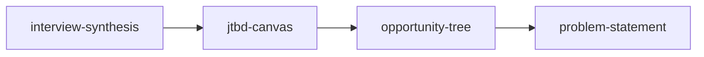

# Customer Discovery Workflow

> **Transform raw research into a clear, validated problem worth solving.**

---

## Workflow Metadata

| Field | Value |
|-------|-------|
| **Workflow** | Customer Discovery |
| **Command** | `/workflow-customer-discovery` |
| **Skills** | `interview-synthesis` -> `jtbd-canvas` -> `opportunity-tree` -> `problem-statement` |
| **Phases Covered** | Discover, Define |
| **Estimated Duration** | 2-4 hours |
| **Prerequisite Inputs** | Raw research data (interview transcripts, survey results, support tickets, or observation notes) |
| **Final Output** | A validated, well-framed problem statement grounded in research evidence |

---

## When to Use This Workflow

Use the Customer Discovery workflow when:

- You have completed user interviews and need to extract actionable insights
- You are starting a new initiative and want to ground it in real customer evidence before jumping to solutions
- You need to build a compelling case for *why* a problem matters before proposing *what* to build
- Your team is debating which problem to solve and you need a structured way to evaluate opportunities
- You want to move from anecdotal customer feedback to structured problem framing

**Do NOT use this workflow when:**

- You already have a well-defined problem and need to move to solution design (use [Feature Kickoff](feature-kickoff.md) instead)
- You are validating an existing hypothesis with experiments (use [Lean Startup](lean-startup.md) instead)
- You need a full end-to-end product development workflow (use [Triple Diamond](triple-diamond.md) instead)

---

## Workflow Steps

### Step 1: Interview Synthesis

**Skill:** [`interview-synthesis`](../skills/discover-interview-synthesis/SKILL.md)
**Command:** `/interview-synthesis`

**What you do:**

Provide your raw research inputs: interview transcripts, survey responses, support ticket themes, or observation notes. The skill synthesizes these into structured findings with patterns, quotes, and themes.

**Input requirements:**

- At least 3-5 data sources (interviews, surveys, tickets) for meaningful pattern detection
- Raw or lightly edited transcripts preferred over pre-summarized notes

**Output:** A structured synthesis document with identified patterns, key quotes, behavioral themes, and preliminary insights.

**Handoff to next step:** The synthesis document's "Key Themes" and "Behavioral Patterns" sections become the primary input for JTBD analysis. Look specifically for recurring pain points, workarounds, and unmet needs.

---

### Step 2: Jobs to Be Done Canvas

**Skill:** [`jtbd-canvas`](../skills/define-jtbd-canvas/SKILL.md)
**Command:** `/jtbd-canvas`

**What you do:**

Using the themes and patterns from Step 1, frame the customer's underlying jobs, desired outcomes, and current alternatives. This shifts the lens from "what users said" to "what users are trying to accomplish."

**Input requirements:**

- Interview synthesis output from Step 1
- Specific focus area or customer segment (if you identified multiple in Step 1, pick the highest-signal one)

**Output:** A JTBD canvas mapping functional jobs, emotional jobs, social jobs, desired outcomes, and current alternatives/workarounds.

**Handoff to next step:** The JTBD canvas's "Desired Outcomes" and gaps between current alternatives and ideal outcomes feed directly into the opportunity tree. The jobs become the outcome nodes.

---

### Step 3: Opportunity Tree

**Skill:** [`opportunity-tree`](../skills/define-opportunity-tree/SKILL.md)
**Command:** `/opportunity-tree`

**What you do:**

Organize the jobs and desired outcomes from Step 2 into a Teresa Torres-style opportunity tree. Map the outcome you are targeting, the opportunities (unmet needs/pain points) that could drive that outcome, and potential solution directions.

**Input requirements:**

- JTBD canvas from Step 2
- A target outcome or business objective to anchor the tree

**Output:** A structured opportunity tree with outcome, opportunity nodes (prioritized), and initial solution hypotheses.

**Handoff to next step:** Select the highest-priority opportunity from the tree. This opportunity, combined with the evidence trail from Steps 1-3, becomes the foundation for a rigorous problem statement.

---

### Step 4: Problem Statement

**Skill:** [`problem-statement`](../skills/define-problem-statement/SKILL.md)
**Command:** `/problem-statement`

**What you do:**

Synthesize everything into a crystal-clear problem statement. This is the capstone artifact: a concise, evidence-backed framing of who has the problem, what the problem is, why it matters, and how you will know when it is solved.

**Input requirements:**

- Selected opportunity from Step 3
- Supporting evidence from Steps 1-2 (quotes, patterns, JTBD gaps)
- Business context (why this matters to your organization)

**Output:** A problem statement document with problem framing, affected users, impact assessment, success criteria, and evidence summary.

---

## Context Flow Diagram

```
Raw Research Data
       |
       v
[interview-synthesis]
  Patterns, themes, quotes
       |
       v
[jtbd-canvas]
  Jobs, outcomes, alternatives
       |
       v
[opportunity-tree]
  Prioritized opportunities
       |
       v
[problem-statement]
  Validated problem framing
```



---

## Tips and Variations

**Lightweight version:** If you only have 1-2 interviews, skip Step 3 (opportunity-tree) and go directly from JTBD canvas to problem statement. The opportunity tree adds the most value when you have enough data to identify multiple competing opportunities.

**Team workshop version:** Run Steps 1-2 asynchronously, then facilitate a live session where the team builds the opportunity tree together in Step 3. This drives alignment and shared ownership of the problem framing.

**Continuous discovery version:** Re-run Step 1 periodically as you accumulate more interviews. Update the JTBD canvas and opportunity tree incrementally rather than rebuilding from scratch.

**Pairing with other workflows:** After completing this workflow, the problem statement output is a natural input to:
- [Feature Kickoff](feature-kickoff.md) workflow (problem-statement -> hypothesis -> prd -> user-stories -> launch-checklist)
- [Lean Startup](lean-startup.md) workflow (use the problem statement to form your initial hypothesis)

---

## Quality Checklist

Before considering this workflow complete, verify:

- [ ] Synthesis includes direct evidence (quotes, data points), not just interpretations
- [ ] JTBD canvas distinguishes between functional and emotional jobs
- [ ] Opportunity tree has a clear outcome anchor tied to a business objective
- [ ] Problem statement is specific enough to evaluate potential solutions against
- [ ] Problem statement does NOT embed a solution (it should describe the problem space, not a feature)
- [ ] Evidence trail is traceable from raw research through to final problem statement

---

## See Also

- [Feature Kickoff](feature-kickoff.md) . When the problem is clear and you are ready to move to execution
- [Product Strategy](product-strategy.md) . When discovery findings need to feed into broader strategic framing
- [Triple Diamond](triple-diamond.md) . For a comprehensive end-to-end product development workflow

---

*Part of [PM-Skills](../README.md) . Open source Product Management skills for AI agents*
