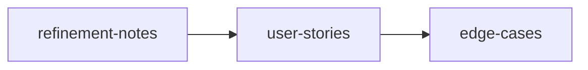

# Sprint Planning Workflow

> **Turn a prioritized backlog into sprint-ready stories with comprehensive edge case coverage.**

---

## Workflow Metadata

| Field | Value |
|-------|-------|
| **Workflow** | Sprint Planning |
| **Command** | `/workflow-sprint-planning` |
| **Skills** | `refinement-notes` -> `user-stories` -> `edge-cases` |
| **Phases Covered** | Deliver |
| **Estimated Duration** | 1-2 hours |
| **Prerequisite Inputs** | A PRD, solution brief, or prioritized backlog items |
| **Final Output** | Sprint-ready user stories with acceptance criteria and documented edge cases |

---

## When to Use This Workflow

Use the Sprint Planning workflow when:

- You have a PRD or solution brief and need to break it down into implementable stories
- You are preparing for a backlog refinement or sprint planning ceremony
- You want to ensure edge cases, error states, and boundary conditions are captured before development begins
- You are running a recurring sprint cadence and want consistent, high-quality story output

**Do NOT use this workflow when:**

- You do not yet have a defined solution (use [Customer Discovery](customer-discovery.md) or [Feature Kickoff](feature-kickoff.md) first)
- You need to validate whether you should build this at all (use [Lean Startup](lean-startup.md) instead)
- You need to define requirements from scratch (use the `/prd` skill directly)

---

## Workflow Steps

### Step 1: Refinement Notes

**Skill:** [`refinement-notes`](../skills/iterate-refinement-notes/SKILL.md)
**Command:** `/refinement-notes`

**What you do:**

Review the backlog items, PRD, or solution brief and capture refinement outcomes: scope clarifications, open questions resolved, dependencies identified, and priority decisions. This step simulates (or documents) the refinement conversation.

**Input requirements:**

- PRD, solution brief, or list of backlog items
- Any context about technical constraints, dependencies, or recent decisions

**Output:** Structured refinement notes documenting scope decisions, resolved questions, identified risks, and agreed-upon priorities for the upcoming sprint.

**Handoff to next step:** The "Scope Decisions" and "Prioritized Items" sections from refinement notes become the input for story writing. Items marked as out-of-scope or deferred should be excluded from the next step.

---

### Step 2: User Stories

**Skill:** [`user-stories`](../skills/deliver-user-stories/SKILL.md)
**Command:** `/user-stories`

**What you do:**

Generate INVEST-compliant user stories for the in-scope items from Step 1. Each story includes a user role, action, benefit, and detailed acceptance criteria.

**Input requirements:**

- Refinement notes from Step 1 (specifically the in-scope, prioritized items)
- Target user personas or roles
- Any sizing guidance (e.g., "keep stories to 1-3 day effort")

**Output:** A set of user stories with acceptance criteria, organized by priority or functional area.

**Handoff to next step:** The complete set of user stories feeds into edge case analysis. Pay special attention to stories that involve user input, state transitions, integrations, or data manipulation, as these are the richest sources of edge cases.

---

### Step 3: Edge Cases

**Skill:** [`edge-cases`](../skills/deliver-edge-cases/SKILL.md)
**Command:** `/edge-cases`

**What you do:**

Systematically identify edge cases, error states, boundary conditions, and recovery paths for the user stories from Step 2. This step catches the scenarios that are easy to miss during development but expensive to fix after launch.

**Input requirements:**

- User stories from Step 2
- Technical context (APIs, data models, integrations) if available
- Known constraints (rate limits, character limits, supported formats, etc.)

**Output:** A documented set of edge cases per story (or per feature area), including error states, boundary conditions, concurrency scenarios, and recommended handling/recovery paths.

---

## Context Flow Diagram

```
PRD / Solution Brief / Backlog
       |
       v
[refinement-notes]
  Scope, priorities, risks
       |
       v
[user-stories]
  INVEST stories + acceptance criteria
       |
       v
[edge-cases]
  Error states, boundaries, recovery
```



---

## Tips and Variations

**Recurring use:** This is the most "repeatable" workflow. Run it every sprint. Over time, you will build a library of edge case patterns that accelerate future sprints.

**Lightweight version:** If your backlog is already well-refined, skip Step 1 and jump directly from your existing backlog items to user stories.

**Enhanced version:** Add `/instrumentation-spec` as a Step 4 to ensure every story includes event tracking requirements. This prevents the common problem of shipping features without analytics.

**Team collaboration:** Run Step 1 as a live team exercise (refinement meeting), then use Steps 2-3 asynchronously to produce the written artifacts. Share the edge cases document with engineering for review before sprint commitment.

**Pairing with other workflows:**
- Follows naturally from [Feature Kickoff](feature-kickoff.md) (which ends with user stories but skips edge cases)
- Follows from [Product Strategy](product-strategy.md) (solution brief -> this workflow for execution planning)

---

## Quality Checklist

Before considering this workflow complete, verify:

- [ ] Refinement notes clearly distinguish in-scope vs. deferred items
- [ ] Every user story follows the "As a [role], I want [action], so that [benefit]" format
- [ ] Stories are INVEST-compliant (Independent, Negotiable, Valuable, Estimable, Small, Testable)
- [ ] Acceptance criteria are specific and testable (not vague or aspirational)
- [ ] Edge cases cover: empty states, error states, boundary values, concurrent access, and permission/auth scenarios
- [ ] Edge cases include recommended handling (not just "what could go wrong" but "what should happen")
- [ ] Stories are sized appropriately for a single sprint (no epics disguised as stories)

---

## See Also

- [Feature Kickoff](feature-kickoff.md) . For the full problem-to-stories flow when starting from scratch
- [Post-Launch Learning](post-launch-learning.md) . After the sprint ships, measure results and capture learnings

---

*Part of [PM-Skills](../README.md) . Open source Product Management skills for AI agents*
