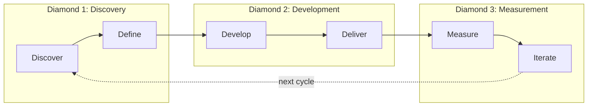

# Triple Diamond Workflow

> Complete product development cycle from discovery to iteration

The Triple Diamond framework extends the traditional Double Diamond design model to encompass the full product lifecycle, adding dedicated phases for measurement and continuous improvement.

## Workflow Metadata

| Field | Value |
|-------|-------|
| **Workflow** | Triple Diamond |
| **Command** | No dedicated command yet -- reference file directly |
| **Skills** | All 25 phase skills across 6 phases |
| **Phases Covered** | All 6 (Discover, Define, Develop, Deliver, Measure, Iterate) |
| **Estimated Duration** | Weeks to months (comprehensive) |
| **Prerequisite Inputs** | A new product or major initiative |
| **Final Output** | Complete product development cycle from research to iteration |

---

## Overview

The Triple Diamond consists of six phases organized into three diamonds:

```
Diamond 1: Discovery & Definition
┌─────────────────────────────────────────┐
│                                         │
│    DISCOVER          DEFINE             │
│    (Diverge)         (Converge)         │
│                                         │
└─────────────────────────────────────────┘

Diamond 2: Development & Delivery
┌─────────────────────────────────────────┐
│                                         │
│    DEVELOP           DELIVER            │
│    (Diverge)         (Converge)         │
│                                         │
└─────────────────────────────────────────┘

Diamond 3: Measurement & Iteration
┌─────────────────────────────────────────┐
│                                         │
│    MEASURE           ITERATE            │
│    (Diverge)         (Converge)         │
│                                         │
└─────────────────────────────────────────┘
```



---

## When to Use

Use the Triple Diamond when:

- **Starting a new product or major initiative** . need comprehensive discovery and validation
- **Building features with significant uncertainty** . multiple unknowns about users or solutions
- **Establishing a new team or practice** . want structured approach to build discipline
- **Working on high-stakes projects** . cost of failure is high, need thorough validation

Consider a lighter approach (see [feature-kickoff.md](feature-kickoff.md)) when:

- Requirements are well understood
- Building incremental improvements
- Time-constrained rapid development

---

## Phase 1: Discover

**Goal:** Understand the problem space through research

**Activities:**
- User research and interviews
- Market and competitive analysis
- Stakeholder mapping
- Opportunity identification

### Skills

| Skill | Description |
|-------|-------------|
| [`discover-interview-synthesis`](../skills/discover-interview-synthesis/SKILL.md) | Synthesize user research into actionable insights |
| [`discover-competitive-analysis`](../skills/discover-competitive-analysis/SKILL.md) | Map competitive landscape and identify opportunities |
| [`discover-stakeholder-summary`](../skills/discover-stakeholder-summary/SKILL.md) | Document stakeholder needs and constraints |

### Key Outputs

- Research synthesis with themes and patterns
- Competitive landscape map
- Stakeholder map with communication plan
- List of opportunities to explore

### Transition Criteria

Move to Define when:
- [ ] Conducted research with target users (5+ interviews recommended)
- [ ] Understand competitive landscape
- [ ] Identified key stakeholders and their needs
- [ ] Have clear opportunities to evaluate

---

## Phase 2: Define

**Goal:** Frame the problem and form hypotheses

**Activities:**
- Problem definition and scoping
- Opportunity prioritization
- Hypothesis formation
- Jobs-to-be-done analysis

### Skills

| Skill | Description |
|-------|-------------|
| [`define-problem-statement`](../skills/define-problem-statement/SKILL.md) | Create clear problem framing with success criteria |
| [`define-hypothesis`](../skills/define-hypothesis/SKILL.md) | Define testable assumptions with metrics |
| [`define-opportunity-tree`](../skills/define-opportunity-tree/SKILL.md) | Map outcome-driven opportunities |
| [`define-jtbd-canvas`](../skills/define-jtbd-canvas/SKILL.md) | Apply Jobs to be Done framework |

### Key Outputs

- Problem statement with success criteria
- Prioritized opportunity tree
- Testable hypotheses
- Clear understanding of the job to be done

### Transition Criteria

Move to Develop when:
- [ ] Problem is clearly defined and scoped
- [ ] Have measurable success criteria
- [ ] Hypotheses are specific and testable
- [ ] Team is aligned on what problem to solve

---

## Phase 3: Develop

**Goal:** Explore solution approaches

**Activities:**
- Solution ideation and exploration
- Technical spikes and feasibility analysis
- Design exploration
- Architecture decisions

### Skills

| Skill | Description |
|-------|-------------|
| [`develop-solution-brief`](../skills/develop-solution-brief/SKILL.md) | Document proposed solution approach |
| [`develop-spike-summary`](../skills/develop-spike-summary/SKILL.md) | Capture time-boxed exploration results |
| [`develop-adr`](../skills/develop-adr/SKILL.md) | Record architecture decisions |
| [`develop-design-rationale`](../skills/develop-design-rationale/SKILL.md) | Document design decision reasoning |

### Key Outputs

- Solution brief with trade-offs
- Technical spike results
- Architecture Decision Records
- Design rationale documentation

### Transition Criteria

Move to Deliver when:
- [ ] Solution approach is validated
- [ ] Key technical decisions are made and documented
- [ ] Team is confident in feasibility
- [ ] Major risks are identified and mitigated

---

## Phase 4: Deliver

**Goal:** Specify, build, and ship

**Activities:**
- Requirements specification
- User story creation
- Edge case analysis
- Launch preparation

### Skills

| Skill | Description |
|-------|-------------|
| [`deliver-prd`](../skills/deliver-prd/SKILL.md) | Write comprehensive product requirements |
| [`deliver-user-stories`](../skills/deliver-user-stories/SKILL.md) | Generate user stories with acceptance criteria |
| [`deliver-edge-cases`](../skills/deliver-edge-cases/SKILL.md) | Document error states and recovery paths |
| [`deliver-launch-checklist`](../skills/deliver-launch-checklist/SKILL.md) | Pre-launch validation checklist |
| [`deliver-release-notes`](../skills/deliver-release-notes/SKILL.md) | User-facing release documentation |

### Key Outputs

- Complete PRD
- User stories with acceptance criteria
- Edge case documentation
- Launch checklist (signed off)
- Release notes

### Transition Criteria

Move to Measure when:
- [ ] Feature is shipped to users
- [ ] Instrumentation is in place
- [ ] All launch checklist items complete
- [ ] Release notes published

---

## Phase 5: Measure

**Goal:** Validate with data

**Activities:**
- Experiment design and execution
- Analytics instrumentation
- Dashboard creation
- Results analysis

### Skills

| Skill | Description |
|-------|-------------|
| [`measure-experiment-design`](../skills/measure-experiment-design/SKILL.md) | Design A/B tests and experiments |
| [`measure-instrumentation-spec`](../skills/measure-instrumentation-spec/SKILL.md) | Define event tracking requirements |
| [`measure-dashboard-requirements`](../skills/measure-dashboard-requirements/SKILL.md) | Specify analytics dashboard needs |
| [`measure-experiment-results`](../skills/measure-experiment-results/SKILL.md) | Document experiment outcomes |

### Key Outputs

- Experiment design with success criteria
- Instrumentation specification
- Dashboard with key metrics
- Experiment results documentation

### Transition Criteria

Move to Iterate when:
- [ ] Experiments have reached statistical significance
- [ ] Results are documented and communicated
- [ ] Have clear learnings (positive or negative)
- [ ] Data supports next steps decision

---

## Phase 6: Iterate

**Goal:** Learn and improve continuously

**Activities:**
- Team retrospectives
- Lessons documentation
- Backlog refinement
- Pivot/persevere decisions

### Skills

| Skill | Description |
|-------|-------------|
| [`iterate-retrospective`](../skills/iterate-retrospective/SKILL.md) | Facilitate team retrospectives |
| [`iterate-lessons-log`](../skills/iterate-lessons-log/SKILL.md) | Build organizational memory |
| [`iterate-refinement-notes`](../skills/iterate-refinement-notes/SKILL.md) | Document backlog refinement outcomes |
| [`iterate-pivot-decision`](../skills/iterate-pivot-decision/SKILL.md) | Framework for pivot/persevere decisions |

### Key Outputs

- Retrospective action items
- Lessons log entries
- Refined backlog
- Clear decision on next iteration

### Cycle Continuation

Based on learnings, return to:
- **Discover** . if fundamental assumptions were wrong
- **Define** . if problem needs reframing
- **Develop** . if solution needs significant changes
- **Deliver** . if incremental improvements are needed

---

## Full Skill Inventory

### By Phase

| Phase | Skills (4) |
|-------|-----------|
| Discover | interview-synthesis, competitive-analysis, stakeholder-summary |
| Define | problem-statement, hypothesis, opportunity-tree, jtbd-canvas |
| Develop | solution-brief, spike-summary, adr, design-rationale |
| Deliver | prd, user-stories, edge-cases, launch-checklist, release-notes |
| Measure | experiment-design, instrumentation-spec, dashboard-requirements, experiment-results |
| Iterate | retrospective, lessons-log, refinement-notes, pivot-decision |

### By Category

| Category | Skills |
|----------|--------|
| research | interview-synthesis, competitive-analysis, stakeholder-summary |
| problem-framing | problem-statement, opportunity-tree, jtbd-canvas |
| ideation | hypothesis, solution-brief |
| specification | prd, user-stories, edge-cases, adr, design-rationale |
| validation | experiment-design, instrumentation-spec, dashboard-requirements |
| reflection | experiment-results, retrospective, lessons-log, pivot-decision |
| coordination | spike-summary, launch-checklist, release-notes, refinement-notes |

---

## Suggested Sequence

For a typical feature development, follow this path:

```
1. competitive-analysis     → Understand market context
2. interview-synthesis      → Gather user insights
3. stakeholder-summary      → Map organizational context
         ↓
4. problem-statement        → Frame the problem
5. jtbd-canvas              → Understand the job
6. opportunity-tree         → Identify opportunities
7. hypothesis               → Form testable assumptions
         ↓
8. solution-brief           → Propose solution
9. spike-summary            → Validate feasibility
10. adr                     → Document architecture decisions
11. design-rationale        → Document design decisions
         ↓
12. prd                     → Specify requirements
13. user-stories            → Break into stories
14. edge-cases              → Cover edge cases
15. instrumentation-spec    → Plan measurement
16. launch-checklist        → Prepare for launch
17. release-notes           → Communicate to users
         ↓
18. experiment-design       → Plan experiments
19. dashboard-requirements  → Build visibility
20. experiment-results      → Analyze outcomes
         ↓
21. retrospective           → Reflect as team
22. lessons-log             → Capture learnings
23. refinement-notes        → Plan next iteration
24. pivot-decision          → Decide direction
```

Not every project needs every skill. Use judgment to select the appropriate subset based on project scope, uncertainty level, and team needs.

---

## Quality Checklist

Before considering this workflow complete, verify:

- [ ] Research covers at least 5 user interviews or equivalent
- [ ] Problem statement is validated with stakeholders
- [ ] Architecture decisions are documented with context and alternatives
- [ ] All user stories have acceptance criteria
- [ ] Experiment design includes guardrail metrics
- [ ] Retrospective action items have owners and deadlines

---

## See Also

- [Lean Startup Workflow](lean-startup.md) . For rapid Build-Measure-Learn cycles
- [Feature Kickoff Workflow](feature-kickoff.md) . Quick-start for well-understood features

---

*Part of [PM-Skills](../README.md) . Open source Product Management skills for AI agents*

