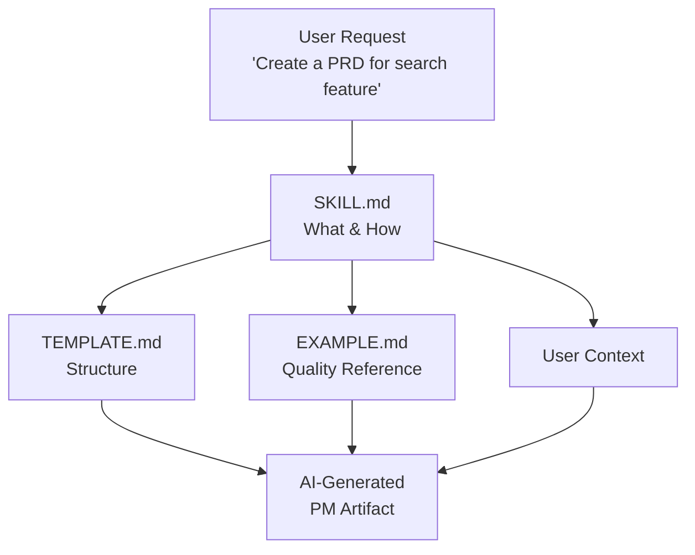

# Agent Skill Anatomy: A Deconstructed Guide

A comprehensive reference for understanding the structure, components, and standards of agent skills according to the [agentskills.io specification](https://agentskills.io/specification).

---

## Table of Contents

- [Introduction](#introduction)
- [The Three-Layer Model](#the-three-layer-model)
  - [Layer 1: SKILL.md . The Instructions](#layer-1-skillmd--the-instructions)
  - [Layer 2: TEMPLATE.md . The Structure](#layer-2-templatemd--the-structure)
  - [Layer 3: EXAMPLE.md . The Quality Benchmark](#layer-3-examplemd--the-quality-benchmark)
  - [How the Three Layers Work Together](#how-the-three-layers-work-together)
- [File System Anatomy](#file-system-anatomy)
  - [Directory Structure](#directory-structure)
  - [Naming Conventions](#naming-conventions)
  - [Optional Directories](#optional-directories)
- [SKILL.md Deep Dive](#skillmd-deep-dive)
  - [Frontmatter Schema](#frontmatter-schema)
  - [Markdown Content Structure](#markdown-content-structure)
- [Progressive Disclosure Model](#progressive-disclosure-model)
- [Cross-Platform Portability](#cross-platform-portability)
- [Practical Examples](#practical-examples)
  - [Simple Skill: problem-statement](#simple-skill-problem-statement)
  - [Complex Skill: prd](#complex-skill-prd)
  - [Template: The Canonical Template](#template-the-canonical-template)
- [Authoring Checklist](#authoring-checklist)
- [Additional Resources](#additional-resources)

---

## Introduction

> **Scope note:** This guide is the spec-level, cross-platform anatomy reference for agent skills. If a future `docs/pm-skill-anatomy.md` lands, keep that file focused on PM-Skills-specific authoring workflow and repo conventions so it complements this guide instead of duplicating it.

### What is an Agent Skill?

An **agent skill** is a structured instruction set that teaches an AI assistant how to create a specific type of artifact. In the context of product management, skills enable AI agents to produce professional PM documents like PRDs, user stories, problem statements, and retrospectives with consistent quality and format.

Think of a skill as a recipe card for an AI:
- **The instructions** tell the AI what questions to ask and what sections to include
- **The template** shows the exact format to use
- **The example** demonstrates what a great result looks like

### Why the agentskills.io Standard Exists

The [agentskills.io specification](https://agentskills.io/specification) provides a universal standard for agent skills, enabling:

**Portability**: Skills written to this standard work across multiple AI platforms (Claude, GitHub Copilot, Cursor, VS Code Copilot, OpenAI Codex) without modification.

**Reusability**: Skills can be shared, forked, and adapted across teams, organizations, and communities.

**Discoverability**: Standardized metadata enables AI agents to automatically find and select the right skill for a given task.

**Consistency**: Following a common structure ensures skills produce predictable, high-quality outputs.

### Who Should Read This Guide

**Skill Users** (Beginners): If you're using existing skills to generate PM artifacts, read [The Three-Layer Model](#the-three-layer-model) to understand how skills work. This knowledge helps you provide better context and get better results.

**Skill Navigators** (Intermediate): If you're exploring skill repositories or choosing which skills to use, read [File System Anatomy](#file-system-anatomy) and [Progressive Disclosure](#progressive-disclosure-model) to understand organization and discovery.

**Skill Authors** (Advanced): If you're creating new skills or contributing to skill repositories, read the entire guide, especially [SKILL.md Deep Dive](#skillmd-deep-dive) and [Authoring Checklist](#authoring-checklist).

---

## The Three-Layer Model

Every skill consists of three essential files that work together to guide the AI from instruction to output.



### Layer 1: SKILL.md . The Instructions

**Purpose**: Provides step-by-step instructions for the AI to follow when creating the artifact.

**What it contains**:
- **Frontmatter** (YAML metadata): Machine-readable information about the skill (name, description, category)
- **Overview**: What the artifact is and why it matters
- **When to Use**: Specific situations that trigger this skill
- **Instructions**: Step-by-step process the AI follows
- **Quality Checklist**: Criteria for validating the output
- **References**: Links to the template and example

**How agents use it**: When invoked, the AI reads SKILL.md to understand what artifact to create, what information to gather from the user, and what process to follow.

**Annotated example** from `skills/define-problem-statement/SKILL.md`:

````markdown
---
name: define-problem-statement             # ← Required: Unique identifier
description: Creates a clear problem...    # ← Required: What it does
phase: define                              # ← Domain skills require a phase
version: "2.0.0"                           # ← Root semantic version
updated: 2026-01-26                        # ← ISO update date
license: Apache-2.0                        # ← Required in pm-skills
metadata:                                  # ← Optional: Extended metadata
  category: problem-framing                #   Category from taxonomy
  frameworks: [triple-diamond, lean-startup, design-thinking]
  author: product-on-purpose               #   Creator/maintainer
---

# Problem Statement                        # ← H1 title

A problem statement is a concise document...  # ← Overview paragraph

## When to Use                             # ← Situational triggers

- Starting a new initiative...
- Realigning a drifted project...

## Instructions                            # ← Step-by-step process

When asked to create a problem statement, follow these steps:

1. **Identify the User Segment**          # ← Each step has title
   Ask who is experiencing this problem... # ← and explanation

2. **Understand the Pain Points**
   Explore what friction...

## Output Format / Contract                # ← Reference to template

Use `references/TEMPLATE.md` as the output format.

## Quality Checklist                       # ← Validation criteria

- [ ] Problem is specific to a defined user segment
- [ ] Impact is quantified with data...

## Examples                                # ← Reference to example

See `references/EXAMPLE.md` for a completed example.
````

### Layer 2: TEMPLATE.md . The Structure

**Purpose**: Defines the exact output structure and format the AI should produce.

**What it contains**:
- **Frontmatter** with artifact metadata
- **Section headings** defining the document structure
- **HTML comments** providing guidance on what content goes in each section
- **Placeholder text** showing format expectations

**How agents use it**: The AI uses the template as a skeleton, filling in each section with content appropriate to the user's context while maintaining the prescribed structure.

**Example snippet** from `skills/define-problem-statement/references/TEMPLATE.md`:

````markdown
---
artifact: problem-statement               # ← Artifact type
version: "1.0"                            # ← Template version
created: <YYYY-MM-DD>                     # ← Placeholder for date
status: draft                             # ← Initial status
---

# Problem Statement: [Problem Title]      # ← Title with placeholder

## Problem Summary                        # ← Section heading
<!-- 2-3 sentences that capture the essence... -->  # ← Guidance comment

[Describe the problem in clear, jargon-free language...]  # ← Content hint

## User Impact                            # ← Next section

### Who is affected?
<!-- Specific user segment, persona, or role -->

[User segment description]

### How are they affected?
<!-- Describe the friction, frustration, or unmet need -->

[Pain point description]
````

**Key features**:
- HTML comments (`<!-- -->`) guide the AI without appearing in final output
- Placeholders like `[Problem Title]` and `<YYYY-MM-DD>` signal dynamic content
- Hierarchical headings show information architecture
- Frontmatter enables artifact tracking and versioning

### Layer 3: EXAMPLE.md . The Quality Benchmark

**Purpose**: Demonstrates what a completed, high-quality output looks like in practice.

**What it contains**:
- **Complete artifact** with no placeholders
- **Realistic scenario** that PMs can relate to
- **Appropriate detail level** showing depth and breadth expectations
- **Professional tone** modeling voice and style

**How agents use it**: The AI references the example to calibrate quality, tone, level of detail, and how to handle ambiguity or edge cases.

**Example snippet** from `skills/define-problem-statement/references/EXAMPLE.md`:

````markdown
---
artifact: problem-statement
version: "1.0"
created: 2026-01-14                       # ← Actual date
status: complete                          # ← Finished status
context: E-commerce company...            # ← Real scenario context
---

# Problem Statement: Mobile Checkout Abandonment  # ← Specific title

## Problem Summary                        # ← Fully written sections

Mobile shoppers on our e-commerce platform abandon their carts at 
checkout at significantly higher rates than desktop users. Despite 
having items in their cart and reaching the checkout page, 73% of 
mobile users leave without completing their purchase, representing 
a substantial revenue opportunity and a frustrating experience for 
customers who intended to buy.                    # ← Real content

## User Impact

### Who is affected?

Mobile shoppers who add items to their cart and initiate checkout. 
This segment represents 62% of our total traffic and skews toward 
younger demographics (18-34) who prefer shopping on their phones.
                                                  # ← Specific numbers
### How are they affected?

Users report frustration with:
- Small form fields difficult to complete on mobile keyboards
- Having to re-enter payment information each session...
                                                  # ← Realistic details
````

**Quality indicators**:
- Specific numbers (73% abandonment, 62% of traffic) not vague estimates
- Named scenario (e-commerce mobile checkout) not generic placeholders
- Concrete details (form fields, payment re-entry) not abstract concepts
- Professional but accessible language

### How the Three Layers Work Together

```
┌─────────────────────────────────────────────────────────────┐
│  Skill Invocation: /problem-statement "checkout issues"    │
└────────────────────────┬────────────────────────────────────┘
                         │
        ┌────────────────┼────────────────┐
        │                │                │
        ▼                ▼                ▼
   ┌─────────┐      ┌─────────┐     ┌─────────┐
   │ SKILL   │      │TEMPLATE │     │ EXAMPLE │
   │  .md    │      │  .md    │     │  .md    │
   └────┬────┘      └────┬────┘     └────┬────┘
        │                │                │
        │   ①Instructions│                │
        ├───────────────>│                │
        │                │                │
        │                │   ②Structure   │
        │                ├───────────────>│
        │                │                │
        │                │                │   ③Quality
        │                │                ├──────────┐
        │                │                │          ▼
        │                │                │    ┌──────────┐
        │                │                │    │ AI Agent │
        │                │                │    │ combines │
        │                │                │    │ all 3    │
        │                │                │    └────┬─────┘
        │                │                │         │
        └────────────────┴────────────────┴─────────┘
                                                     │
                                                     ▼
                                        ┌─────────────────────┐
                                        │  Generated Artifact │
                                        │  - Follows steps    │
                                        │  - Matches structure│
                                        │  - Meets quality bar│
                                        └─────────────────────┘
```

**The Process**:

1. **Instructions Guide** (SKILL.md): AI reads what to do
   - "Identify the user segment"
   - "Quantify the business impact"
   - "Define success metrics"

2. **Structure Constrains** (TEMPLATE.md): AI knows where to put it
   - User segment goes in "Who is affected?" section
   - Business impact goes in "Business Impact" section
   - Success metrics get their own section with baseline/target table

3. **Example Calibrates** (EXAMPLE.md): AI knows how much detail
   - User segment: 1-2 sentences with demographic info
   - Business impact: Quantified with dollar amounts and percentages
   - Success metrics: Specific numbers with timeframes

**Result**: Consistent, complete, high-quality artifact every time.

---

## File System Anatomy

### Directory Structure

Per the [agentskills.io specification](https://agentskills.io/specification), skills follow a standardized directory layout:

```
skills/<skill-name>/
├── SKILL.md              # Required: Main instruction file
└── references/           # Required: Support files directory
    ├── TEMPLATE.md       # Required: Output structure
    └── EXAMPLE.md        # Required: Quality benchmark
```

**PM-Skills specific structure** uses a flat directory with two naming patterns:

```
skills/
├── discover-competitive-analysis/
│   ├── SKILL.md
│   └── references/
│       ├── TEMPLATE.md
│       └── EXAMPLE.md
├── define-problem-statement/
├── develop-adr/
├── deliver-prd/
├── foundation-persona/
├── measure-experiment-design/
└── iterate-retrospective/
```

**Naming model**:
- Domain skills use one of the six lifecycle phases in both frontmatter and directory names (`deliver-prd`, `measure-experiment-design`).
- Foundation and utility skills use `classification` and omit `phase` (`foundation-persona`).

**Why flat + typed naming?** Keeps paths short while preserving the repo's two-axis model: lifecycle `phase` for domain skills, `classification` for non-phase skills. Categories continue to live in metadata; see [categories.md](reference/categories.md) for taxonomy.

### Naming Conventions

Per the agentskills.io specification, skill names must follow strict rules:

**Pattern**: `^[a-z0-9]+(-[a-z0-9]+)*$`

**Rules**:

| Rule | Valid ✓ | Invalid ✗ |
|------|---------|-----------|
| Lowercase only | `problem-statement` | `Problem-Statement` |
| Hyphens for word separation | `user-stories` | `user_stories` |
| No consecutive hyphens | `edge-cases` | `edge--cases` |
| No leading/trailing hyphens | `prd` | `-prd` or `prd-` |
| Length: 1-64 characters | `retrospective` | (65+ chars) |
| Letters, numbers, hyphens only | `v2-roadmap` | `adr!` or `v2.roadmap` |
| **Must match directory name** | Dir: `prd/`, name: `prd` | Dir: `prd/`, name: `PRD` |

**Best practices**:
- Use the output artifact name when obvious: `prd`, `adr`, `retrospective`
- Prefer concrete nouns over verbs: `user-stories` not `write-stories`
- Keep concise (1-3 words): `problem-statement` not `detailed-problem-analysis-document`
- Use well-known abbreviations: `prd`, `adr`, `jtbd` are acceptable

### Optional Directories

The agentskills.io specification allows additional directories for skill-specific needs:

```
skills/<skill-name>/
├── SKILL.md
├── references/
│   ├── TEMPLATE.md
│   └── EXAMPLE.md
├── scripts/              # ← Optional: Automation scripts
│   ├── validate.sh       #   Validation scripts
│   └── transform.py      #   Output transformers
└── assets/               # ← Optional: Supporting files
    ├── diagram.png       #   Images
    └── data.json         #   Sample data
```

**When to use optional directories**:

**`scripts/`**: For skills that benefit from validation or transformation
- Example: A `prd` skill might include a script to validate completeness
- Example: A `user-stories` skill might include a Jira import formatter

**`assets/`**: For skills requiring reference materials
- Example: A `competitive-analysis` skill might include comparison templates
- Example: A `dashboard-requirements` skill might include chart type examples

**Note**: Most skills don't need these. The three core files are sufficient for 95% of use cases.

---

## SKILL.md Deep Dive

### Frontmatter Schema

Frontmatter is YAML metadata enclosed in triple dashes (`---`) at the very start of SKILL.md. It provides machine-readable information for discovery and invocation.

#### Complete Frontmatter Structure

````yaml
---
name: deliver-skill-name                  # ← REQUIRED
description: What it does and when...     # ← REQUIRED
phase: deliver                            # ← Required for domain skills
# classification: foundation              # ← Use instead of phase for non-domain skills
version: "1.0.0"                          # ← REQUIRED root semantic version
updated: 2026-03-19                       # ← REQUIRED root ISO date
license: Apache-2.0                       # ← REQUIRED in pm-skills
metadata:                                 # ← Optional container
  category: specification                 #   One of 7 categories
  frameworks: [triple-diamond]            #   Array of methodology identifiers
  author: product-on-purpose              #   Creator/maintainer
---
````

#### Required Fields

##### `name`

**Type**: `string`  
**Pattern**: `^[a-z0-9]+(-[a-z0-9]+)*$`  
**Length**: 1-64 characters  
**Purpose**: Unique identifier for skill invocation and directory naming

**Validation rules**:
- Lowercase letters (a-z) and numbers (0-9) only
- Hyphens (-) separate words
- No spaces, underscores, or special characters
- No consecutive hyphens
- Cannot start or end with hyphen
- Must exactly match parent directory name

**Examples**:

```yaml
# Valid ✓
name: define-problem-statement
name: deliver-prd
name: deliver-user-stories
name: define-jtbd-canvas
name: v2-roadmap

# Invalid ✗
name: Problem-Statement    # uppercase
name: problem_statement    # underscore
name: problem statement    # space
name: problem--statement   # consecutive hyphens
name: -problem-statement   # leading hyphen
name: PRD                  # uppercase
```

**Common mistake**: Name doesn't match directory

```yaml
# In file: skills/define-problem-statement/SKILL.md
name: problem-framing             # ✗ WRONG - must be "define-problem-statement"
name: define-problem-statement    # ✓ CORRECT
```

##### `description`

**Type**: `string`  
**Length**: 1-1024 characters (recommended: 150-300)  
**Purpose**: Human and machine-readable summary for discovery and selection

**Structure**: `[Action verb] [artifact] [key details]. Use when [trigger 1], [trigger 2], [trigger 3].`

**Writing effective descriptions**:

✓ **DO**:
- Start with action verb: Creates, Generates, Documents, Designs, Analyzes
- State primary output artifact
- Include 1-3 "Use when..." triggers with situational keywords
- Use specific terminology users might search for
- Aim for 150-300 characters

✗ **DON'T**:
- Use vague statements: "Helps with product work"
- Include redundant phrases: "This skill is used for..."
- Use marketing language: "amazing", "powerful", "best"
- Make it too short (< 50 chars) or too long (> 500 chars)

**Examples**:

```yaml
# Good ✓
description: Creates a comprehensive Product Requirements Document that aligns stakeholders on what to build, why, and how success will be measured. Use when specifying features, epics, or product initiatives for engineering handoff.

description: Synthesizes user research interviews into actionable insights, patterns, and recommendations. Use after conducting user interviews, customer calls, or usability sessions to extract and communicate findings.

# Poor ✗
description: Helps with PRDs                    # Too vague, no triggers
description: This skill creates PRDs            # Redundant phrasing
description: The ultimate PRD generator!        # Marketing language
description: PRD                                # Way too short
```

#### Optional Fields

##### `license`

**Type**: `string`  
**Default**: `Apache-2.0`  
**Purpose**: SPDX license identifier

All pm-skills use Apache-2.0, but third-party skills can specify different licenses.

```yaml
license: Apache-2.0      # pm-skills standard
license: MIT             # permissive alternative
license: CC-BY-4.0       # creative commons
```

**Reference**: [SPDX License List](https://spdx.org/licenses/)

##### `metadata` Container

**Type**: `object`  
**Purpose**: PM-skills specific extensions and categorization

###### `metadata.category`

**Type**: `string`  
**Enum**: One of 7 valid categories  
**Purpose**: Framework-agnostic PM activity classification

**Valid categories**:

| Category | What it represents | Example skills |
|----------|-------------------|----------------|
| `research` | Understanding users, market, context | interview-synthesis, competitive-analysis, stakeholder-summary |
| `problem-framing` | Defining what problem to solve | problem-statement, opportunity-tree, jtbd-canvas |
| `ideation` | Generating and evaluating solutions | hypothesis, solution-brief |
| `specification` | Detailing what to build | prd, user-stories, edge-cases, adr, design-rationale |
| `validation` | Testing assumptions with data | experiment-design, instrumentation-spec, dashboard-requirements |
| `reflection` | Learning and improving | experiment-results, retrospective, lessons-log, pivot-decision |
| `coordination` | Aligning teams and stakeholders | launch-checklist, release-notes, spike-summary, refinement-notes |

**See**: [categories.md](reference/categories.md) for detailed taxonomy

**Example**:

```yaml
metadata:
  category: specification   # ✓ Valid
  category: planning        # ✗ Invalid - not in enum
```

###### `metadata.frameworks`

**Type**: `array` of `string`  
**Purpose**: List of PM methodologies this skill supports

**Standard identifiers**:
- `triple-diamond` . 6-phase delivery process (Discover→Iterate)
- `lean-startup` . Build-Measure-Learn cycle
- `design-thinking` . Empathize-Define-Ideate-Prototype-Test
- `scrum` . Sprint-based agile
- `kanban` . Flow-based agile
- `safe` . Scaled Agile Framework

**Best practice**: Include all applicable frameworks, not just the primary one.

```yaml
metadata:
  frameworks: [triple-diamond, lean-startup, design-thinking]  # Typical
  frameworks: [triple-diamond]                                  # Framework-specific
  frameworks: [scrum, kanban]                                   # Agile-specific
```

###### `metadata.author`

**Type**: `string`  
**Purpose**: Skill creator or maintainer identifier

**Format options**:
- Organization name: `product-on-purpose`
- GitHub username: `@username`
- Full name: `Jane Smith`

```yaml
metadata:
  author: product-on-purpose   # Organization
  author: "@jsmith"            # GitHub handle
  author: "Jane Smith"         # Full name
```

###### `classification`

**Type**: `string`  
**Enum**: `domain | foundation | utility`  
**Purpose**: Distinguish phase-based PM skills from non-phase skill families

**Rules**:
- Omit for ordinary domain skills if you want default domain behavior
- Use `foundation` for non-phase foundation skills like `foundation-persona`
- Use `utility` for non-phase helper skills

###### `phase`

**Type**: `string`  
**Enum**: `discover | define | develop | deliver | measure | iterate`  
**Purpose**: Lifecycle grouping for domain skills

**Rules**:
- Required when `classification` is `domain`
- Required when `classification` is omitted
- Must be omitted when `classification` is `foundation` or `utility`

###### `version`

**Type**: `string`  
**Pattern**: `^\d+\.\d+\.\d+$` (semantic versioning)  
**Purpose**: Track skill evolution

**Critical**: Use one quoted root `version` field. `metadata.version` is not allowed.

```yaml
version: "1.0.0"    # ✓ CORRECT - quoted root field
version: 1.0.0      # ✗ WRONG - YAML interprets as float 1.0
```

###### `updated`

**Type**: `string`  
**Pattern**: `^\d{4}-\d{2}-\d{2}$`  
**Purpose**: Record the last edited date for the skill

```yaml
updated: 2026-03-19
```

#### Complete Frontmatter Examples

**Minimal (required fields only)**:

```yaml
---
name: my-skill
description: Creates a brief artifact for quick documentation needs.
---
```

**Recommended (all standard fields)**:

```yaml
---
name: define-problem-statement
description: Creates a clear problem framing document with user impact, business context, and success criteria. Use when starting a new initiative, realigning a drifted project, or communicating up to leadership.
phase: define
version: "2.0.0"
updated: 2026-01-26
license: Apache-2.0
metadata:
  category: problem-framing
  frameworks: [triple-diamond, lean-startup, design-thinking]
  author: product-on-purpose
---
```

**Foundation (non-phase)**:

```yaml
---
name: foundation-persona
description: Generates an evidence-calibrated product or marketing persona using the canonical v2.5 output contract. Use when shaping artifact perspective, stress-testing decisions, or framing product and GTM strategy.
classification: foundation
version: "2.5.0"
updated: 2026-03-02
license: Apache-2.0
metadata:
  category: research
  frameworks: [triple-diamond, lean-startup, design-thinking]
  author: product-on-purpose
---
```

**Reference**: See [frontmatter-schema.yaml](reference/frontmatter-schema.yaml) for complete validation rules and examples.

### Markdown Content Structure

After the frontmatter, SKILL.md contains structured markdown content following this standard pattern:

#### Section 1: Skill Title (H1)

```markdown
# Problem Statement
```

**Rules**:
- One H1 per document
- Appears immediately after frontmatter
- Title case, descriptive
- Should match the artifact type

#### Section 2: Overview Paragraph

```markdown
A problem statement is a concise document that frames the problem you're 
solving, articulates the impact on users and the business, and defines clear 
success criteria. It serves as the foundation for all subsequent product work 
by ensuring alignment on *what* problem to solve before jumping to *how* to 
solve it.
```

**Purpose**: Quick context for humans and AI about what this skill produces and why it matters.

**Guidelines**:
- 2-4 sentences
- Explain what the artifact is
- State why it's valuable
- Mention what gap it fills

#### Section 3: When to Use (H2)

```markdown
## When to Use

- Starting a new initiative or project to establish shared understanding
- Realigning a drifted project back to its original intent
- Communicating up to leadership or stakeholders about priorities
- Evaluating whether a proposed solution actually addresses the core problem
- Onboarding new team members to provide context
```

**Purpose**: Trigger keywords for AI discovery and situational guidance for users.

**Guidelines**:
- 4-6 bullet points
- Specific situations, not vague phrases
- Include action verbs users might say
- Cover different use cases

#### Section 4: Instructions (H2)

```markdown
## Instructions

When asked to create a problem statement, follow these steps:

1. **Identify the User Segment**
   Ask who is experiencing this problem. Get specific about the user persona, 
   role, or segment. Avoid vague descriptions like "users" . instead target 
   "mobile shoppers completing checkout" or "enterprise admins managing 50+ users."

2. **Understand the Pain Points**
   Explore what friction, frustration, or unmet need the user experiences. 
   Ask probing questions to understand the severity and frequency of the problem.

3. **Establish Business Context**
   Connect the user problem to business impact. How does this problem affect 
   revenue, retention, growth, or strategic goals?

[... more steps ...]
```

**Purpose**: Step-by-step process the AI follows to create the artifact.

**Guidelines**:
- 5-10 steps typical
- Each step has:
  - **Bold title** stating the action
  - Explanation of what to do and why
  - Guidance on how to do it well
- Sequential order
- Include what information to gather
- Mention what to skip or defer

**Side-by-side comparison** (Template vs. Actual):

| Template Pattern | Actual Implementation (problem-statement) |
|------------------|-------------------------------------------|
| `1. **<Step Title>**` | `1. **Identify the User Segment**` |
| `<What to do and why>` | `Ask who is experiencing this problem. Get specific about the user persona, role, or segment.` |
| `2. **<Step Title>**` | `2. **Understand the Pain Points**` |
| `<What to do and why>` | `Explore what friction, frustration, or unmet need the user experiences.` |

#### Section 5: Output Format / Contract (H2)

```markdown
## Output Contract

Use `references/TEMPLATE.md` as the output format.
```

**Purpose**: Direct the AI to the template file for structural guidance.

**Standard phrasing**: Always reference `references/TEMPLATE.md` exactly. Legacy skills often title this section `Output Format`; newer builder-aligned skills prefer `Output Contract`.

#### Section 6: Quality Checklist (H2)

```markdown
## Quality Checklist

Before finalizing, verify:

- [ ] Problem is specific to a defined user segment (not "all users")
- [ ] Impact is quantified with data or reasonable estimates
- [ ] Success metrics have baselines and targets
- [ ] Problem describes the "what" without prescribing the "how"
- [ ] Business context explains why this matters now
- [ ] Open questions are captured for follow-up
```

**Purpose**: Validation criteria the AI uses to check output quality.

**Guidelines**:
- 5-8 checkbox items
- Specific and verifiable criteria
- Focus on common failure modes
- Actionable (can be fixed if not met)

**Example comparison**:

| Poor Checklist Item ✗ | Good Checklist Item ✓ |
|----------------------|----------------------|
| "Problem is clear" | "Problem is specific to a defined user segment (not 'all users')" |
| "Good metrics" | "Success metrics have baselines and targets" |
| "Complete document" | "Document is readable in under 15 minutes" |

#### Section 7: Examples (H2)

```markdown
## Examples

See `references/EXAMPLE.md` for a completed example.
```

**Purpose**: Direct the AI to the example file for quality calibration.

**Standard phrasing**: Always reference `references/EXAMPLE.md` exactly.

#### Complete Structure Diagram

```
┌─────────────────────────────────────────┐
│ ---                                     │
│ name: skill-name                        │ ← Frontmatter (YAML)
│ description: ...                        │
│ ---                                     │
├─────────────────────────────────────────┤
│ # Skill Title                           │ ← H1
├─────────────────────────────────────────┤
│ Overview paragraph explaining           │
│ what this skill does...                 │ ← Overview
├─────────────────────────────────────────┤
│ ## When to Use                          │
│ - Situation 1                           │
│ - Situation 2                           │ ← Triggers
│ - Situation 3                           │
├─────────────────────────────────────────┤
│ ## Instructions                         │
│                                         │
│ 1. **Step Title**                       │
│    What to do and why...                │
│                                         │ ← Process
│ 2. **Step Title**                       │
│    What to do and why...                │
├─────────────────────────────────────────┤
│ ## Output Format / Contract             │
│                                         │
│ Use references/TEMPLATE.md as output...│ ← Template ref
├─────────────────────────────────────────┤
│ ## Quality Checklist                    │
│                                         │
│ - [ ] Criterion 1                       │
│ - [ ] Criterion 2                       │ ← Validation
│ - [ ] Criterion 3                       │
├─────────────────────────────────────────┤
│ ## Examples                             │
│                                         │
│ See references/EXAMPLE.md...            │ ← Example ref
└─────────────────────────────────────────┘
```

---

## Progressive Disclosure Model

The agentskills.io specification uses progressive loading to optimize context window usage and agent response time.

### How Progressive Disclosure Works

```
Discovery Phase                  Invocation Phase
     │                                │
     ▼                                ▼
┌──────────┐                    ┌──────────┐
│ AGENTS.md│                    │ SKILL.md │
│  loaded  │                    │  loaded  │
└────┬─────┘                    └────┬─────┘
     │                                │
     │ Reads:                         │ Reads:
     │ - name                         │ - Full frontmatter
     │ - description                  │ - All instructions
     │                                │ - Template reference
     │                                │ - Example reference
     ▼                                ▼
┌──────────────────┐           ┌──────────────────┐
│ AI sees 40 skills│           │ AI loads 1 skill │
│ (~6KB metadata)  │           │ (full content)   │
└──────────────────┘           └──────────────────┘
                                       │
                                       ▼
                               ┌────────────────┐
                               │  TEMPLATE.md   │
                               │  EXAMPLE.md    │
                               │  loaded on     │
                               │  demand        │
                               └────────────────┘
```

### Phase 1: Discovery

**What loads**: Only `name` and `description` from frontmatter

**Where from**: `AGENTS.md` file at repository root or `SKILL.md` frontmatter during skill indexing

**Current repo note**: `AGENTS.md` registers all 40 skills in `skills/`, including domain, foundation, and utility classifications.

**Purpose**: Allow AI to scan all available skills quickly and select the appropriate one

**Benefit**: Minimal context window usage during skill selection

**Example** (from AGENTS.md):

```markdown
#### problem-statement
**Path:** `skills/define-problem-statement/SKILL.md`

Creates a clear problem framing document with user impact, business context, 
and success criteria. Use when starting a new initiative, realigning a 
drifted project, or communicating up to leadership.
```

**AI decision process**:

```
User: "I need to frame the checkout issue we're seeing"

AI scans AGENTS.md:
  - "problem-statement" description mentions "framing"
  - Keywords match: "framing", "initiative"
  → Selects problem-statement skill
```

### Phase 2: Invocation

**What loads**: Full SKILL.md content

**When**: After skill selection, before artifact generation

**Purpose**: Provide complete instructions, quality criteria, and references

**Benefit**: Context-appropriate loading.only the selected skill loads, not all 40 skills

**What the AI reads**:

```markdown
---
name: define-problem-statement
description: Creates a clear problem framing document...
phase: define
version: "2.0.0"
updated: 2026-01-26
license: Apache-2.0
metadata:
  category: problem-framing
  frameworks: [triple-diamond, lean-startup, design-thinking]
  author: product-on-purpose
---

# Problem Statement

[Full overview paragraph]

## When to Use
[Full list]

## Instructions
[All 6 steps with details]

## Output Contract
Use `references/TEMPLATE.md` as the output format...

## Quality Checklist
[All criteria]

## Examples
See `references/EXAMPLE.md`...
```

### Phase 3: Template & Example Loading

**What loads**: TEMPLATE.md and EXAMPLE.md (on demand)

**When**: During artifact generation as needed

**Purpose**: Provide structure and quality benchmarks

**Benefit**: Further context optimization.template/example only load if AI needs them

**Loading pattern**:

```
AI follows SKILL.md instructions
     │
     ├─> Needs structure? → Load TEMPLATE.md
     │
     └─> Needs quality check? → Load EXAMPLE.md
```

### Why This Matters

**Context window efficiency**:
- Discovery: ~7KB (40 skill names + descriptions)
- Invocation: ~15KB (1 full SKILL.md + template + example)
- Without progressive loading: ~500KB (all 40 skills fully loaded)

**Faster agent response**:
- Skill selection happens instantly (minimal data to parse)
- Only relevant content loads for generation
- Reduces token usage and costs

**Scalability**:
- Repositories can grow to 100s of skills
- AI only loads what it needs
- Performance remains constant

**Platform compatibility**:
- Claude Code automatically implements this
- GitHub Copilot uses AGENTS.md for discovery
- Cursor and VS Code support progressive loading
- Manual copy-paste still works (user chooses what to paste)

---

## Cross-Platform Portability

Skills written to the agentskills.io specification work across multiple AI platforms without modification.

### Supported Platforms

| Platform | Discovery Method | Invocation Method | Slash Commands |
|----------|------------------|-------------------|----------------|
| **Claude Code** | AGENTS.md | Native skill support | Yes (`/skill-name`) |
| **GitHub Copilot** | AGENTS.md | `@workspace` context | Partial |
| **VS Code Copilot** | AGENTS.md | Agent mode | Via extensions |
| **Cursor** | AGENTS.md | Agent skills feature | Yes (custom) |
| **OpenAI Codex** | Manual/API | API integration | Via custom tools |

### How Portability Works

The agentskills.io specification defines:

1. **Standard file structure** . All platforms know where to find SKILL.md, TEMPLATE.md, EXAMPLE.md
2. **Standard metadata** . Frontmatter schema is universal across platforms
3. **Standard discovery** . AGENTS.md file format is consistent
4. **Markdown format** . Platform-agnostic, human-readable

**Example**: The same `prd` skill works identically on:

```
Claude Code:       /prd "search feature"
GitHub Copilot:    "Use the prd skill for search feature"
Cursor:            /prd "search feature"
VS Code:           Agent: "Use prd skill for search feature"
ChatGPT:           [Paste SKILL.md] "Create PRD for search feature"
```

### Platform-Specific Implementation Guides

**VS Code Agent Skills**:
- [Official VS Code Agent Skills Documentation](https://code.visualstudio.com/docs/copilot/customization/agent-skills)
- Uses `.github/copilot-skills.md` or `AGENTS.md` for discovery
- Skills work in Copilot Chat with `@workspace`

**Cursor Agent Skills**:
- [Cursor Agent Skills Documentation](https://cursor.com/docs/context/skills)
- Auto-discovers AGENTS.md in workspace
- Supports custom slash commands via `.cursorrules`

**GitHub Copilot**:
- Reads AGENTS.md for context-aware suggestions
- Skills invoked via natural language in Copilot Chat
- Works with both workspace and global scope

**Claude Code**:
- Native support for agentskills.io specification
- Automatic AGENTS.md parsing
- Slash command generation from `commands/` directory

### Writing Portable Skills

**DO**:
- ✓ Follow agentskills.io specification exactly
- ✓ Use standard frontmatter fields
- ✓ Keep instructions platform-agnostic
- ✓ Test on multiple platforms if possible
- ✓ Use relative paths for internal references

**DON'T**:
- ✗ Include platform-specific commands in SKILL.md
- ✗ Assume slash command availability
- ✗ Hard-code file paths
- ✗ Use proprietary extensions or features

**Example portable instruction**:

```markdown
<!-- Good ✓ -->
## Instructions

1. **Gather User Research**
   Review available user interview notes, support tickets, or analytics.

<!-- Bad ✗ -->
## Instructions

1. **Gather User Research**
   Use the Claude Code /search command to find interview notes.
   [Platform-specific - won't work on other platforms]
```

### Cross-Platform Testing Checklist

When authoring skills for maximum portability:

- [ ] Skill works with basic copy-paste (universal baseline)
- [ ] AGENTS.md entry is complete and accurate
- [ ] No platform-specific commands in instructions
- [ ] Frontmatter validates against schema
- [ ] Relative paths work from any starting location
- [ ] Instructions are clear without platform context

---

## Practical Examples

### Simple Skill: define-problem-statement

**Full SKILL.md** (annotated):

````markdown
<!-- PM-Skills | https://github.com/product-on-purpose/pm-skills | Apache 2.0 -->
---
name: define-problem-statement             # ← Matches directory name exactly
description: Creates a clear problem framing document with user impact, business context, and success criteria. Use when starting a new initiative, realigning a drifted project, or communicating up to leadership.
                                           # ← Description includes triggers
phase: define                              # ← Domain skills require a phase
version: "2.0.0"                           # ← Root semantic version
updated: 2026-01-26                        # ← Root update date
license: Apache-2.0                        # ← Standard license
metadata:
  category: problem-framing                # ← Category from taxonomy
  frameworks: [triple-diamond, lean-startup, design-thinking]
                                           # ← Multiple frameworks
  author: product-on-purpose               # ← Consistent authorship
---

# Problem Statement                        # ← H1 title

A problem statement is a concise document that frames the problem you're 
solving, articulates the impact on users and the business, and defines clear 
success criteria. It serves as the foundation for all subsequent product work 
by ensuring alignment on *what* problem to solve before jumping to *how* to 
solve it.
                                           # ← Overview explains value

## When to Use                             # ← Situational triggers

- Starting a new initiative or project to establish shared understanding
- Realigning a drifted project back to its original intent
- Communicating up to leadership or stakeholders about priorities
- Evaluating whether a proposed solution actually addresses the core problem
- Onboarding new team members to provide context
                                           # ← Specific situations

## Instructions                            # ← Step-by-step process

When asked to create a problem statement, follow these steps:

1. **Identify the User Segment**          # ← Actionable step title
   Ask who is experiencing this problem. Get specific about the user persona, 
   role, or segment. Avoid vague descriptions like "users" . instead target 
   "mobile shoppers completing checkout" or "enterprise admins managing 50+ users."
                                           # ← Detailed guidance

2. **Understand the Pain Points**
   Explore what friction, frustration, or unmet need the user experiences. 
   Ask probing questions to understand the severity and frequency of the problem. 
   Look for evidence from user research, support tickets, or behavioral data.

3. **Establish Business Context**
   Connect the user problem to business impact. How does this problem affect 
   revenue, retention, growth, or strategic goals? Why should the organization 
   invest in solving this now versus later?

4. **Define Success Metrics**
   Identify how you will measure success. What metrics will move if this 
   problem is solved? Establish current baselines and target improvements. 
   Be specific and time-bound.

5. **Surface Constraints and Considerations**
   Note any technical limitations, resource constraints, regulatory requirements, 
   or dependencies that will shape the solution space.

6. **Capture Open Questions**
   Document what you don't know yet. What assumptions need validation? 
   What additional research is needed?

## Output Contract                        # ← Template reference

Use `references/TEMPLATE.md` as the output format.

## Quality Checklist                       # ← Validation criteria

Before finalizing, verify:

- [ ] Problem is specific to a defined user segment (not "all users")
- [ ] Impact is quantified with data or reasonable estimates
- [ ] Success metrics have baselines and targets
- [ ] Problem describes the "what" without prescribing the "how"
- [ ] Business context explains why this matters now
- [ ] Open questions are captured for follow-up

## Examples                                # ← Example reference

See `references/EXAMPLE.md` for a completed example.
````

**Link to actual file**: [skills/define-problem-statement/SKILL.md](../skills/define-problem-statement/SKILL.md)

**Why this is a "simple" skill**:
- Straightforward 6-step process
- Single artifact output
- No complex dependencies
- Clear quality criteria
- Relatable use case

### Complex Skill: prd

**Frontmatter + Key Sections** (annotated):

````markdown
<!-- PM-Skills | https://github.com/product-on-purpose/pm-skills | Apache 2.0 -->
---
name: deliver-prd                          # ← Directory-matching identifier
description: Creates a comprehensive Product Requirements Document that aligns stakeholders on what to build, why, and how success will be measured. Use when specifying features, epics, or product initiatives for engineering handoff.
                                           # ← Long description with multiple triggers
phase: deliver                             # ← Domain classification uses phase
version: "2.0.0"                           # ← Root semantic version
updated: 2026-01-26                        # ← Root update date
license: Apache-2.0
metadata:
  category: specification                  # ← Different category
  frameworks: [triple-diamond, lean-startup, design-thinking]
  author: product-on-purpose
---

# Product Requirements Document (PRD)      # ← Formal title with abbreviation

A Product Requirements Document is the primary specification artifact that 
communicates what to build and why. It bridges the gap between problem 
understanding and engineering implementation by providing clear requirements, 
success criteria, and scope boundaries. A good PRD enables engineering to 
build the right thing while maintaining flexibility on implementation details.
                                           # ← Sophisticated overview

## When to Use                             # ← 5 triggers vs. 3-4 typical

- After problem and solution alignment, before engineering work begins
- When specifying features, epics, or product initiatives for handoff
- When multiple teams need to coordinate on a shared deliverable
- When stakeholders need to approve scope before investment
- As reference documentation during development and QA

## Instructions                            # ← More detailed steps

When asked to create a PRD, follow these steps:

1. **Summarize the Problem**              # ← Builds on prior artifacts
   Start with a brief recap of the problem being solved. Link to the problem 
   statement if available. Ensure readers understand *why* this work matters 
   before diving into *what* to build.

2. **Define Goals and Success Metrics**   # ← Specific measurement focus
   Articulate what success looks like. Include specific, measurable metrics 
   with baselines and targets. These metrics should connect directly to the 
   problem being solved.

3. **Outline the Solution**
   Describe the proposed solution at a high level. Focus on user-facing 
   functionality and key capabilities. Include enough detail for stakeholders 
   to evaluate the approach without over-specifying implementation.

4. **Detail Functional Requirements**     # ← Core specification work
   Break down what the system must do. Use user stories or requirement 
   statements. Each requirement should be testable . someone should be able 
   to verify if it's met.

5. **Define Scope Boundaries**            # ← Critical for project management
   Explicitly state what's in scope, out of scope, and deferred to future 
   iterations. Clear scope prevents scope creep and sets realistic expectations.

6. **Address Technical Considerations**   # ← Cross-functional awareness
   Note any technical constraints, architectural decisions, or integration 
   requirements. Don't design the system, but surface considerations 
   engineering needs to know.

7. **Identify Dependencies and Risks**    # ← Risk management
   List external dependencies, assumptions, and risks that could impact 
   delivery. Include mitigation strategies where applicable.

8. **Propose Timeline and Milestones**    # ← Project planning
   Outline key phases and checkpoints. This helps stakeholders understand 
   the delivery plan without committing to specific dates prematurely.

## Output Contract

Use `references/TEMPLATE.md` as the output format.

## Quality Checklist                       # ← Comprehensive validation

Before finalizing, verify:

- [ ] Problem and "why now" are clearly articulated
- [ ] Success metrics are specific and measurable
- [ ] Scope boundaries are explicit (in/out/future)
- [ ] Requirements are testable and unambiguous
- [ ] Technical considerations are surfaced without over-specifying
- [ ] Dependencies and risks are documented with owners
- [ ] Document is readable in under 15 minutes
                                           # ← Usability criterion

## Examples

See `references/EXAMPLE.md` for a completed example.
````

**Link to actual file**: [skills/deliver-prd/SKILL.md](../skills/deliver-prd/SKILL.md)

**Why this is a "complex" skill**:
- 8-step process (vs. 5-6 typical)
- Multiple concerns (technical, scope, risk, timeline)
- Cross-functional coordination
- Builds on prior artifacts (problem statement)
- More comprehensive quality criteria
- Higher stakes (engineering handoff)

**Advanced patterns shown**:
- **Artifact chaining**: References problem statement
- **Scope management**: Explicit in/out/future boundaries
- **Stakeholder alignment**: Multiple audiences (engineering, leadership, QA)
- **Time constraints**: "Readable in under 15 minutes" ensures usability

### Template: The Canonical Template

**Link**: [docs/templates/skill-template/SKILL.md](../templates/skill-template/SKILL.md)

**What to customize**:

```yaml
---
name: <phase-or-classification-skill-name> # ← Change to your skill name
description: <1-2 sentences...>            # ← Write specific description
phase: <discover|define|develop|deliver|measure|iterate>
# classification: foundation               # ← Use this instead of phase for non-domain skills
version: "1.0.0"                           # ← One quoted root version
updated: 2026-03-19                        # ← Set current ISO date
license: Apache-2.0                        # ← Keep as-is for pm-skills
metadata:
  category: <one of 7 categories>          # ← Choose from taxonomy
  frameworks: [triple-diamond, lean-startup, design-thinking]
                                           # ← Update for your skill
  author: product-on-purpose               # ← Keep as-is or use your name
---

# <Skill Title>                            # ← Descriptive title

<One paragraph overview...>                # ← Explain value proposition

## When to Use                             # ← List 4-6 situations

- <Situation 1>                            # ← Be specific
- <Situation 2>
- <Situation 3>

## Instructions                            # ← Define 5-10 steps

When asked to <create artifact>, follow these steps:

1. **<Step 1 Title>**                     # ← Actionable title
   <What to do and why>                    # ← Detailed guidance

2. **<Step 2 Title>**
   <What to do and why>

[Continue with remaining steps]

## Output Contract

Use `references/TEMPLATE.md` as the output format.
                                           # ← Keep the template reference explicit

## Quality Checklist                       # ← Define 5-8 criteria

Before finalizing, verify:

- [ ] <Quality criterion 1>                # ← Specific and testable
- [ ] <Quality criterion 2>
- [ ] <Quality criterion 3>

## Examples

See `references/EXAMPLE.md` for a completed example.
                                           # ← Keep this exact wording
```

**What to preserve**:
- Overall structure (section order)
- Section headings (H2 names)
- Template and example references (exact wording)
- Frontmatter field names and types

**Common customization mistakes**:

| Don't ✗ | Do ✓ |
|---------|------|
| Change H2 headings | Keep standard headings |
| Remove quality checklist | Always include validation criteria |
| Add marketing language | Keep professional, instructional tone |
| Skip the overview | Always explain value |
| Use vague descriptions | Include specific triggers and keywords |

---

## Authoring Checklist

Quick reference for skill authors before submission. For complete guidance, see [docs/guides/authoring-pm-skills.md](guides/authoring-pm-skills.md).

### Directory & Files

- [ ] Directory path is `skills/<skill-name>/`
- [ ] Directory name exactly matches `name` field in frontmatter
- [ ] Contains `SKILL.md` file
- [ ] Contains `references/TEMPLATE.md` file
- [ ] Contains `references/EXAMPLE.md` file
- [ ] Optional: Slash command at `commands/<skill-name>.md`

### Frontmatter Validation

- [ ] `name` is lowercase with hyphens only
- [ ] `name` matches parent directory name exactly
- [ ] `description` is 50-300 characters with trigger keywords
- [ ] `description` starts with action verb and includes "Use when..."
- [ ] `category` is one of 7 valid values from [categories.md](reference/categories.md)
- [ ] `frameworks` array includes all applicable methodologies
- [ ] `version` is quoted (`"1.0.0"` not `1.0.0`)
- [ ] `license` is `Apache-2.0` (for pm-skills contributions)

### SKILL.md Content

- [ ] Overview paragraph explains artifact and value (2-4 sentences)
- [ ] 4-6 "When to Use" situations are specific and actionable
- [ ] 5-10 instruction steps with clear titles and guidance
- [ ] Each step explains what to do and why
- [ ] References `references/TEMPLATE.md` for output format
- [ ] References `references/EXAMPLE.md` for quality example
- [ ] 5-8 quality checklist items are specific and testable

### TEMPLATE.md

- [ ] Frontmatter includes `artifact`, `version`, `created`, `status`
- [ ] Section headings match instruction steps
- [ ] HTML comments provide guidance for each section
- [ ] No placeholder text left unfilled (use `[Description]` format)
- [ ] Structure supports the quality checklist criteria

### EXAMPLE.md

- [ ] Complete (no `[TBD]`, `TODO`, or placeholder text)
- [ ] Frontmatter includes actual values (date, status: complete, context)
- [ ] Realistic scenario relatable to most PMs
- [ ] Demonstrates appropriate detail level
- [ ] Follows template structure exactly
- [ ] Professional tone and language
- [ ] Internally consistent (no contradictions)

### Quality & Testing

- [ ] Tested with 3+ different scenarios
- [ ] Output consistently matches template structure
- [ ] Output quality comparable to example
- [ ] AI doesn't ask excessive clarifying questions
- [ ] Works with natural language invocation
- [ ] Slash command works (if created)

### Documentation

- [ ] Entry added to `AGENTS.md` in the appropriate phase or non-phase section
- [ ] Command added to `AGENTS.md` Commands table (if applicable)
- [ ] No references to gitignored or private paths
- [ ] All internal links use relative paths
- [ ] All external links resolve correctly

---

## Additional Resources

### Official Specifications

- **[agentskills.io Specification](https://agentskills.io/specification)** . Canonical standard for agent skills
- **[agentskills/agentskills on GitHub](https://github.com/agentskills/agentskills)** . Reference implementation and examples

### PM-Skills Documentation

- **[Getting Started Guide](getting-started.md)** . Installation and first steps
- **[Using Skills Guide](guides/using-skills.md)** . From beginner to advanced usage
- **[Authoring PM-Skills](guides/authoring-pm-skills.md)** . Complete authoring guide
- **[Frontmatter Schema](reference/frontmatter-schema.yaml)** . Field-by-field validation reference
- **[Category Taxonomy](reference/categories.md)** . All 7 categories explained
- **[Contributing Guidelines](../CONTRIBUTING.md)** . How to contribute to pm-skills

### Community & Ecosystem

- **[PM-Skills Repository](https://github.com/product-on-purpose/pm-skills)** . Main repository
- **[Skill Template](../templates/skill-template/SKILL.md)** . Starting point for new skills
- **[Triple Diamond Framework](frameworks/triple-diamond-delivery-process.md)** . The organizing methodology

### Platform Documentation

- **[VS Code Agent Skills](https://code.visualstudio.com/docs/copilot/customization/agent-skills)** . Using skills in VS Code Copilot
- **[Cursor Agent Skills](https://cursor.com/docs/context/skills)** . Using skills in Cursor

### Standards & References

- **[Semantic Versioning](https://semver.org/)** . Version numbering standard
- **[SPDX Licenses](https://spdx.org/licenses/)** . License identifier list
- **[Markdown Guide](https://www.markdownguide.org/)** . Markdown syntax reference
- **[YAML Specification](https://yaml.org/spec/)** . YAML format details

---

## Quick Reference Tables

### File Structure Summary

| File | Required | Purpose |
|------|----------|---------|
| `SKILL.md` | Yes | Instructions for AI |
| `references/TEMPLATE.md` | Yes | Output structure |
| `references/EXAMPLE.md` | Yes | Quality benchmark |
| `scripts/` | No | Automation tools |
| `assets/` | No | Supporting files |

### Frontmatter Fields

| Field | Required | Type | Example |
|-------|----------|------|---------|
| `name` | Yes | string | `problem-statement` |
| `description` | Yes | string | `Creates a clear problem...` |
| `phase` | Conditional | enum | `deliver` |
| `classification` | Conditional | enum | `foundation` |
| `version` | Yes | string | `"2.0.0"` |
| `updated` | Yes | string | `2026-01-26` |
| `license` | Yes | string | `Apache-2.0` |
| `metadata.category` | No | enum | `problem-framing` |
| `metadata.frameworks` | No | array | `[triple-diamond]` |
| `metadata.author` | No | string | `product-on-purpose` |

### Section Order in SKILL.md

| Order | Section | Required |
|-------|---------|----------|
| 1 | Frontmatter (YAML) | Yes |
| 2 | Title (H1) | Yes |
| 3 | Overview paragraph | Yes |
| 4 | When to Use (H2) | Yes |
| 5 | Instructions (H2) | Yes |
| 6 | Output Format / Contract (H2) | Yes |
| 7 | Quality Checklist (H2) | Yes |
| 8 | Examples (H2) | Yes |

### Common Validation Errors

| Error | Fix |
|-------|-----|
| Name mismatch | Ensure `name` exactly matches directory name |
| Unquoted version | Change `version: 1.0.0` to `version: "1.0.0"` |
| Invalid category | Use one of 7 valid categories from taxonomy |
| Missing description triggers | Add "Use when..." phrases |
| Template reference broken | Use exact path: `references/TEMPLATE.md` |

---

*Part of [PM-Skills](../README.md) . Open source Product Management skills for AI agents*

*Built by [Product on Purpose](https://github.com/product-on-purpose) for PMs who ship.*
