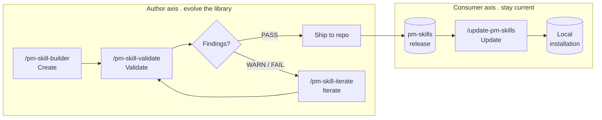
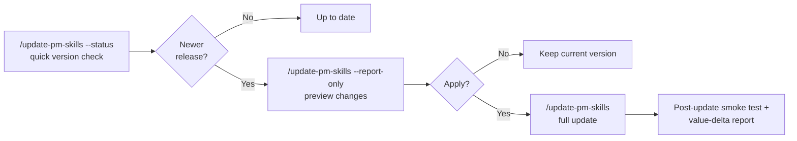
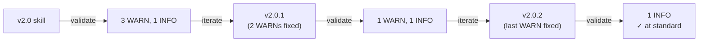

# PM-Skill Lifecycle

A practical guide to creating, validating, iterating, and updating PM skills. For how skills are *structured*, see [PM-Skill Anatomy](skill-anatomy.md). This guide covers how skills *evolve*.

---

## The Lifecycle Model

PM skills evolve along two axes:

- **Author axis** . how maintainers create and improve skills in the library (builder → validator → iterator).
- **Consumer axis** . how users keep their local installation current with the upstream library (updater).



| Tool | Axis | Command | What it does |
|------|------|---------|-------------|
| **Builder** | Author | `/pm-skill-builder` | Creates a new skill from an idea . gap analysis, classification, draft files, staging, promotion |
| **Validator** | Author | `/pm-skill-validate` | Audits an existing skill against structural conventions and quality criteria . produces a report |
| **Iterator** | Author | `/pm-skill-iterate` | Applies targeted improvements to an existing skill . previews changes, writes on confirmation |
| **Updater** | Consumer | `/update-pm-skills` | Checks for newer pm-skills releases, previews changes, and applies the update with confirmation |

### Why four tools instead of one?

Each tool has a single job. This keeps them focused, independently testable, and composable:

- The **builder** knows how to create files from scratch but doesn't know how to audit them.
- The **validator** knows how to assess quality but doesn't modify anything.
- The **iterator** knows how to apply changes but relies on the validator (or user feedback) to say *what* to change.
- The **updater** is consumer-side . it doesn't author skills, it propagates upstream changes into a local installation safely (preview, backup, validated copy, value-delta report).

You can use any tool independently or chain them together.

---

## The Consumer Flow

The updater is used after the authoring loop has shipped a new release. It answers: *"Is my local pm-skills out of date, and what would change if I updated?"*



Key safety properties: validated-before-copy, optional backup, value-delta report documenting what changed, and a degraded mode for no-network environments.

---

## When to Use Each Tool

| I want to... | Use |
|-------------|-----|
| Create a new PM skill from an idea | `/pm-skill-builder` |
| Check if a skill meets repo conventions | `/pm-skill-validate {skill}` |
| Audit all skills after a convention change | `/pm-skill-validate --all` |
| Fix issues found by the validator | `/pm-skill-iterate {skill}` with the validation report |
| Apply specific feedback to a skill | `/pm-skill-iterate {skill} "feedback"` |
| Improve a skill's example or template | `/pm-skill-iterate {skill} "make the example more realistic"` |
| Check if my local pm-skills is out of date | `/update-pm-skills --status` |
| Preview what an update would change | `/update-pm-skills --report-only` |
| Apply the latest pm-skills release locally | `/update-pm-skills` |

---

## Workflow Patterns

### Pattern 1: New Skill

Create a skill from scratch, validate it, fix any issues, and ship.

```
/pm-skill-builder "A skill for creating stakeholder update emails"
  → Builder runs gap analysis, classifies, generates draft files
  → Promotes files to canonical locations

/pm-skill-validate stakeholder-update-email
  → Produces validation report (should be mostly PASS for builder output)
  → Fix any findings manually or with /pm-skill-iterate

commit and ship
```

**When to use:** Starting from zero. The builder handles classification, naming, gap analysis, and file generation. Validation confirms the builder's output meets conventions.

### Pattern 2: Improve an Existing Skill

Validate first to identify what needs work, then iterate to fix it.

```
/pm-skill-validate deliver-prd
  → Report shows: WARN on output-contract-coverage, INFO on when-not-to-use

/pm-skill-iterate deliver-prd
  → Paste or reference the validation report
  → Iterator normalizes findings into intended changes
  → Preview → confirm → apply
  → Suggests version bump (patch for clarifications, minor for new sections)

/pm-skill-validate deliver-prd
  → Confirm the issues are resolved

commit and ship
```

**When to use:** A skill exists and works but could be better . unclear output contract, incomplete example, vague checklist items.

### Pattern 3: Convention Change Rollout

A repo convention changed (e.g., "all skills must have a Limitations section"). Audit all skills to see which need updating, then iterate each one.

```
/pm-skill-validate --all
  → Batch summary table shows which skills fail the new convention
  → Identify the affected skills

/pm-skill-validate deliver-prd
  → Detailed report for one affected skill

/pm-skill-iterate deliver-prd
  → "Add a Limitations section per the new convention"
  → Preview → confirm → apply

(repeat for each affected skill)

commit and ship
```

**When to use:** A structural or quality convention is added or changed and you need to bring existing skills into compliance.

### Pattern 4: Feedback Loop

You received feedback on a skill (from a user, a review, or your own testing). Apply it directly, then validate.

```
/pm-skill-iterate deliver-prd "The example uses a B2C scenario but most users are B2B . rewrite with a SaaS enterprise example"
  → Iterator reads current files
  → Normalizes feedback into intended changes (EXAMPLE.md rewrite)
  → Preview → confirm → apply

/pm-skill-validate deliver-prd
  → Confirm the skill still passes after the change

commit and ship
```

**When to use:** You have specific feedback and don't need to audit first . you already know what to change.

---

## How the Tools Relate to Versioning

Each skill has its own independent version in its `SKILL.md` frontmatter, following [Semantic Versioning](https://semver.org/spec/v2.0.0.html):

| Change type | Version bump | Example |
|------------|-------------|---------|
| Wording clarified, examples improved | **Patch** (2.0.0 → 2.0.1) | Reworded checklist, better example scenario |
| New optional capability added | **Minor** (2.0.0 → 2.1.0) | New optional output section, handles more scenarios |
| Required contract changed | **Major** (2.0.0 → 3.0.0) | Command renamed, required section removed |

**The iterator suggests version bumps** based on what it changed, but doesn't write the version number until you confirm. This prevents compounding bumps when you iterate multiple times before releasing.

**HISTORY.md** is created when a skill ships its second version. It connects versions to efforts and releases. The iterator offers to create or update HISTORY.md at the right moment . you don't need to manage it manually.

For the full versioning governance, see `docs/internal/skill-versioning.md`.

---

## How the Validator Relates to CI

The repo has CI scripts that run on every push and PR (see `.github/workflows/validation.yml`). The validator goes deeper:

| | CI Scripts | `/pm-skill-validate` |
|-|-----------|---------------------|
| **What it checks** | Structure: frontmatter fields, file presence, naming, word count | Structure (same as CI) + quality: output contract coverage, example completeness, checklist verifiability, placeholder leakage |
| **How it runs** | Automated on push/PR | Interactive, on demand |
| **Output** | Pass/fail per file | Structured report with severity levels, check IDs, target file paths, and actionable recommendations |
| **Who consumes it** | GitHub Actions | You, or `/pm-skill-iterate` |
| **When to use** | Always (runs automatically) | Before shipping a new or modified skill, or when auditing quality |

**Rule of thumb:** If CI passes, the skill is *structurally valid*. If the validator passes, the skill is *structurally valid and quality-checked*.

---

## The Quality Standard Model

The validator checks skills against two standards:

1. **Current library conventions** . what the shipped library actually does today. These are the checks that matter for structural compliance. Failures here mean something is genuinely wrong.

2. **The v2.8 standard** . what newly-built skills (created with `/pm-skill-builder`) meet. These are surfaced as WARN or INFO findings on older skills.

This means **older skills may legitimately receive quality findings** when validated. That's expected . the library converges toward the higher standard over time through the lifecycle, not retroactively. Each iteration brings a skill closer to the current standard.



---

## Quick Reference

| Action | Command |
|--------|---------|
| Create a new skill | `/pm-skill-builder "description"` |
| Validate one skill | `/pm-skill-validate {skill-name}` |
| Validate all skills (structural only) | `/pm-skill-validate --all` |
| Iterate with validation report | `/pm-skill-iterate {skill-name}` + paste report |
| Iterate with feedback | `/pm-skill-iterate {skill-name} "feedback"` |
| Check skill structure (anatomy) | See [PM-Skill Anatomy](skill-anatomy.md) |
| Check versioning rules | See `docs/internal/skill-versioning.md` |
