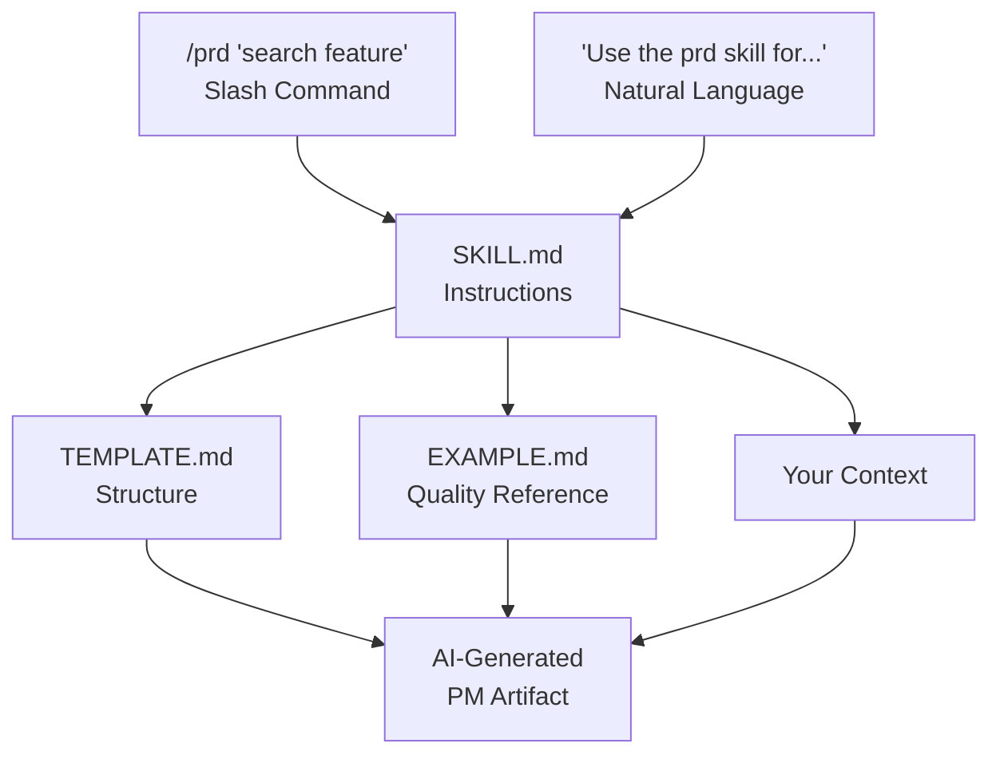
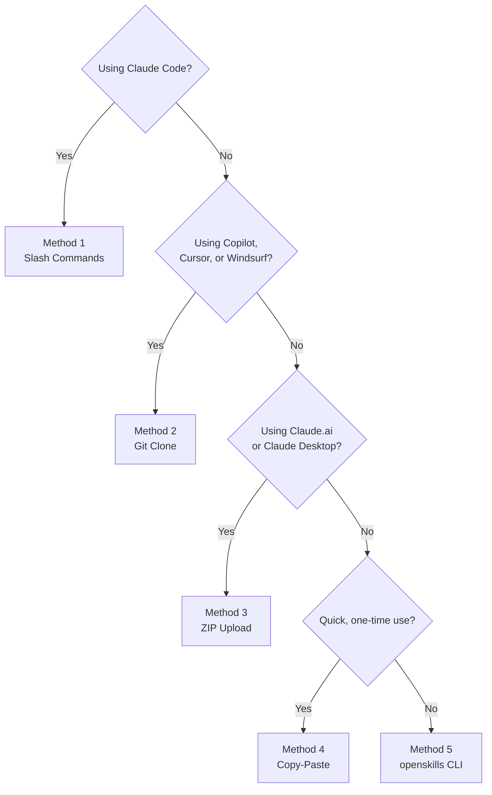

# Getting Started with PM-Skills

**Quick Start (3 steps)**
1) Clone or download the latest ZIP: `git clone https://github.com/product-on-purpose/pm-skills.git` (or get the ZIP from Releases).  
2) (Claude Code/openskills only) Run the sync helper to populate `.claude/skills` and `.claude/commands`:  
   - macOS/Linux: `./scripts/sync-claude.sh`  
   - Windows: `./scripts/sync-claude.ps1`  
3) Use a slash command: `/prd "Feature description"` or `/hypothesis "Assumption to test"`.

Prefer the full walkthrough? Read on.

Welcome to PM-Skills! This guide will help you understand what this repository offers and how to use it, regardless of your technical background.

---

## Table of Contents

- [What is PM-Skills?](#what-is-pm-skills)
- [Core Concepts](#core-concepts)
  - [What are Skills?](#what-are-skills)
  - [What are Slash Commands?](#what-are-slash-commands)
  - [How Skills and Commands Relate](#how-skills-and-commands-relate)
- [Ways to Use PM-Skills](#ways-to-use-pm-skills)
- [Method 1: Claude Code (Slash Commands)](#method-1-claude-code-slash-commands)
- [Method 2: Git Clone (Any AI Assistant)](#method-2-git-clone-any-ai-assistant)
- [Method 3: Claude.ai / Claude Desktop](#method-3-claudeai--claude-desktop)
- [Method 4: Copy-Paste (Universal)](#method-4-copy-paste-universal)
- [Method 5: openskills CLI](#method-5-openskills-cli)
- [Choosing the Right Method](#choosing-the-right-method)
- [Your First Skill](#your-first-skill)
- [Workflows](#workflows)
- [Troubleshooting](#troubleshooting)
- [Next Steps](#next-steps)

---

## What is PM-Skills?

**PM-Skills** is an open-source collection of 32 product management skills that teach AI assistants how to create professional PM documents. The current repo includes 25 phase skills, 1 foundation skill, and 6 utility skills. Think of it as a playbook that transforms generic AI responses into polished, consistent PM artifacts.

### The Problem It Solves

Without PM-Skills:
```
You: "Write me a PRD"
AI: *Produces a generic document missing key sections, inconsistent format*
```

With PM-Skills:
```
You: "Write me a PRD"
AI: *Produces a comprehensive PRD with problem statement, success metrics,
    user stories, scope boundaries, technical considerations—all in a
    professional, consistent format*
```

### What You Get

- **32 skills in `skills/`** covering the PM lifecycle (25 phase skills + 1 foundation skill + 6 utility skills)
- **Professional templates** based on industry best practices
- **Real-world examples** showing what good looks like
- **Works with any AI assistant** (Claude, ChatGPT, Copilot, etc.)

---

## Core Concepts

### What are Skills?

A **skill** is a structured instruction set that teaches an AI assistant how to create a specific type of PM artifact.

#### For Non-Technical Users

Think of a skill like a recipe card for an AI chef:
- The **instructions** tell the AI what questions to ask and what sections to include
- The **template** shows the exact format to use
- The **example** demonstrates what a great result looks like

When you ask the AI to create a PRD, it reads the "PRD recipe" and follows it step by step.

#### For Technical Users

Each skill is a directory containing:

```
skills/<skill-name>/
├── SKILL.md              # Prompt instructions for the AI
├── references/
│   ├── TEMPLATE.md       # Output structure/format
│   └── EXAMPLE.md        # Annotated real-world example
```

The `SKILL.md` file contains:
- YAML frontmatter with metadata (`name`, `description`, `version`, `updated`, `license`, and either `phase` or `classification`)
- Structured instructions the AI follows
- Guidance on information gathering and output formatting

Skills follow the [Agent Skills Specification](https://agentskills.io/specification) for interoperability across AI platforms.

---

### What are Slash Commands?

A **slash command** is a shortcut that invokes a skill in AI assistants that support them.

#### For Non-Technical Users

Instead of typing:
> "Please use the PRD skill to create a product requirements document for a search feature"

You can simply type:
> `/prd search feature for e-commerce platform`

The slash (`/`) tells the AI "use this skill" and everything after is your context.

#### For Technical Users

Slash commands are defined in the `commands/` directory as markdown files:

```markdown
---
description: Create a Product Requirements Document
---

Use the `prd` skill to create a comprehensive Product Requirements Document.

Read the skill instructions from `skills/<skill-name>/SKILL.md` and follow them.

Context from user: $ARGUMENTS
```

The `$ARGUMENTS` variable captures everything typed after the command name.

**Note:** Slash commands are platform-specific. They work natively in Claude Code but require different invocation methods on other platforms.

---

### How Skills and Commands Relate



**Key insight:** Skills are the underlying content. Commands are just one way to invoke them.

---

## Ways to Use PM-Skills

| Method | Best For | Setup Time | Technical Level |
|--------|----------|------------|-----------------|
| [Claude Code](#method-1-claude-code-slash-commands) | Developers using Claude Code | None | Low |
| [Git Clone](#method-2-git-clone-any-ai-assistant) | Copilot, Cursor, Windsurf users | 1 minute | Low |
| [Claude.ai](#method-3-claudeai--claude-desktop) | Claude web/desktop users | 2 minutes | Low |
| [Copy-Paste](#method-4-copy-paste-universal) | Any AI (ChatGPT, etc.) | None | None |
| [openskills CLI](#method-5-openskills-cli) | Advanced users managing multiple skill sets | 5 minutes | Medium |

---

## Method 1: Claude Code (Slash Commands)

**Best for:** Developers using Claude Code CLI or IDE extension

### For Non-Technical Users

If you're using Claude Code, skills work automatically. Just type a slash command:

```
/prd "Search feature for our e-commerce platform"
```

That's it! Claude will create a full PRD using the skill.

### For Technical Users

#### How It Works

Claude Code discovers the registered skill set via `AGENTS.md` and command definitions in `commands/`. The full repo catalog lives under `skills/`, including any path-only skills that have not been wired into `AGENTS.md` or slash commands yet.

#### Setup

1. Navigate to a directory containing pm-skills (clone it or work within the repo)
2. Start using slash commands immediately

#### Usage

```bash
# Basic usage
/prd "feature description"

# With more context
/prd "We need a search feature for our e-commerce platform.
      Users currently can't find products easily.
      Target: 20% improvement in product discovery."

# Chain skills
/problem-statement "checkout abandonment issue"
# ... review output ...
/hypothesis "from the problem statement above"
# ... review output ...
/prd "based on the hypothesis above"
```

#### Available Commands

The repo currently ships 39 command markdown files: 32 skill commands plus 7 workflow commands.

| Phase | Commands |
|-------|----------|
| Discover | `/interview-synthesis`, `/competitive-analysis`, `/stakeholder-summary` |
| Define | `/problem-statement`, `/hypothesis`, `/opportunity-tree`, `/jtbd-canvas` |
| Develop | `/solution-brief`, `/spike-summary`, `/adr`, `/design-rationale` |
| Deliver | `/prd`, `/user-stories`, `/acceptance-criteria`, `/edge-cases`, `/launch-checklist`, `/release-notes` |
| Measure | `/experiment-design`, `/instrumentation-spec`, `/dashboard-requirements`, `/experiment-results` |
| Iterate | `/retrospective`, `/lessons-log`, `/refinement-notes`, `/pivot-decision` |
| Utility | `/pm-skill-builder`, `/pm-skill-validate`, `/pm-skill-iterate`, `/mermaid-diagrams`, `/slideshow-creator`, `/update-pm-skills` |
| Foundation | `/persona` |

Plus workflows: `/workflow-feature-kickoff`

---

## Method 2: Git Clone (Any AI Assistant)

**Best for:** GitHub Copilot, Cursor, Windsurf, and other AGENTS.md-compatible tools

### For Non-Technical Users

1. **Download the repository:**
   - Go to [github.com/product-on-purpose/pm-skills](https://github.com/product-on-purpose/pm-skills)
   - Click the green "Code" button
   - Click "Download ZIP"
   - Unzip to a folder you'll remember

2. **Open in your coding tool:**
   - Open VS Code, Cursor, or your editor
   - Open the pm-skills folder

3. **Use the skills:**
   - Your AI assistant will automatically see the skills
   - Ask: "Use the prd skill to create a PRD for [your feature]"

### For Technical Users

#### Setup

```bash
# Clone the repository
git clone https://github.com/product-on-purpose/pm-skills.git

# Or add as a submodule to your project
git submodule add https://github.com/product-on-purpose/pm-skills.git .pm-skills
```

#### How It Works

Modern AI coding assistants discover skills through the `AGENTS.md` file at the repository root. This file:
- Lists all 32 registered skills with paths and descriptions
- Provides workflows
- Documents available commands

When you ask the AI to use a skill, it:
1. Reads `AGENTS.md` to locate the skill
2. Reads `SKILL.md` for instructions
3. Reads `TEMPLATE.md` and `EXAMPLE.md` from references
4. Generates output following the instructions

#### Usage

```
You: "Use the prd skill to create a PRD for adding dark mode"

AI: *Reads skills/deliver-prd/SKILL.md and follows the instructions*
```

Or reference skills directly:

```
You: "Read skills/deliver-prd/SKILL.md and create a PRD for dark mode"
```

#### Keeping Updated

```bash
# If cloned directly
cd pm-skills
git pull origin main

# If using submodule
git submodule update --remote .pm-skills
```

---

## Method 3: Claude.ai / Claude Desktop

**Best for:** Users of Claude's web interface or desktop application

### For Non-Technical Users

1. **Download the skills:**
   - Go to the [Releases page](https://github.com/product-on-purpose/pm-skills/releases)
   - Download the latest `pm-skills-vX.X.X.zip` file

2. **Upload to Claude:**
   - Open Claude.ai or Claude Desktop
   - Go to **Settings** (gear icon)
   - Find **Projects** or **Capabilities**
   - Click **Add files** or **Upload**
   - Select the ZIP file you downloaded

3. **Use the skills:**
   - In any conversation, type: "Use the prd skill to create a PRD for [your feature]"
   - Claude will read the skill files and follow them

### For Technical Users

#### Setup Options

**Option A: Project Knowledge**

1. Create a new Project in Claude
2. Upload skill files to Project Knowledge
3. Skills persist across conversations in that project

**Option B: Conversation Upload**

1. Upload individual skill files at conversation start
2. Reference them: "Using the uploaded prd skill..."

#### Structuring Uploads

For best results, upload:
- The specific `SKILL.md` you need
- Its `references/TEMPLATE.md`
- Its `references/EXAMPLE.md`

Or upload the entire `skills/` directory if your use case varies.

#### Usage

```
You: "I've uploaded the prd skill. Please use it to create a PRD
      for a feature that adds collaborative editing to our docs app."

Claude: *Reads the skill files and produces a structured PRD*
```

---

## Method 4: Copy-Paste (Universal)

**Best for:** Any AI assistant (ChatGPT, Gemini, local LLMs, etc.)

### For Non-Technical Users

This method works with any AI—no setup required.

1. **Find the skill you need:**
   - Go to [github.com/product-on-purpose/pm-skills](https://github.com/product-on-purpose/pm-skills)
   - Navigate to `skills/` → choose a skill (names are prefixed by phase, e.g., `deliver-prd`)
   - Example: `skills/deliver-prd/`

2. **Copy the skill content:**
   - Click on `SKILL.md`
   - Click "Raw" to see plain text
   - Select all and copy (Ctrl+A, Ctrl+C)

3. **Paste into your AI:**
   - Start a new chat
   - Paste the skill content
   - Add your request: "Now create a PRD for [your feature]"

4. **Optional: Add template and example:**
   - Also copy `references/TEMPLATE.md` for structure
   - Copy `references/EXAMPLE.md` for quality reference

### For Technical Users

#### Minimal Copy-Paste

```markdown
[Paste contents of SKILL.md]

---

Now use these instructions to create a PRD for: [your context]
```

#### Full Copy-Paste (Recommended)

```markdown
# SKILL INSTRUCTIONS
[Paste contents of SKILL.md]

# OUTPUT TEMPLATE
[Paste contents of references/TEMPLATE.md]

# QUALITY EXAMPLE
[Paste contents of references/EXAMPLE.md]

---

Using the above skill instructions, template, and example as reference,
create a PRD for: [your context]
```

#### Automating Copy-Paste

Create a script to concatenate files:

```bash
#!/bin/bash
# Usage: ./get-skill.sh prd

SKILL=$1
cat skills/$SKILL/SKILL.md
echo -e "\n---\n# TEMPLATE\n"
cat skills/$SKILL/references/TEMPLATE.md
echo -e "\n---\n# EXAMPLE\n"
cat skills/$SKILL/references/EXAMPLE.md
```

---

## Method 5: openskills CLI

**Best for:** Power users managing multiple skill repositories

### For Non-Technical Users

This method requires comfort with command-line tools. If that's not you, use one of the earlier methods instead.

### For Technical Users

#### Prerequisites

- Node.js 18+ installed
- npm or yarn

#### Setup

```bash
# Install openskills globally
npm install -g openskills

# Install pm-skills
openskills install product-on-purpose/pm-skills

# Sync to your environment
openskills sync
```

#### Known Issues

> **Note:** openskills previously had issues with nested directories. pm-skills now ships flat `skills/phase-skill/` plus a sync helper that populates `.claude/skills/`. After cloning, run `./scripts/sync-claude.sh` (or `.ps1`) before using openskills or Claude Code.

#### Usage

Once installed, skills are available globally:

```bash
# List installed skills
openskills list

# Use in conversations
# Skills are auto-discovered by compatible AI assistants
```

#### Managing Multiple Skill Sets

```bash
# Install additional skill repositories
openskills install another-org/their-skills

# Update all skills
openskills update

# Remove a skill set
openskills remove product-on-purpose/pm-skills
```

---

## Choosing the Right Method

### Decision Tree



### Comparison Matrix

| Feature | Claude Code | Git Clone | Claude Upload | Copy-Paste | openskills |
|---------|-------------|-----------|---------------|------------|------------|
| Setup time | None | 1 min | 2 min | None | 5 min |
| Slash commands | Yes | No | No | No | Varies |
| Auto-updates | Yes | Manual | Manual | N/A | Yes |
| Works offline | Yes | Yes | Yes | Yes | Yes |
| Any AI platform | No | Most | Claude only | Yes | Most |
| Skill chaining | Easy | Easy | Medium | Hard | Easy |

---

## Your First Skill

Let's walk through using a skill for the first time.

### Scenario

You're starting a new feature and want to create a proper problem statement.

### Step 1: Choose Your Method

Pick the method that matches your setup (see above).

### Step 2: Invoke the Skill

**Claude Code:**
```
/problem-statement "Users are abandoning checkout because the process
is too long. We lose about $50k/month in abandoned carts."
```

**Other AI assistants:**
```
Use the problem-statement skill to create a problem statement for:
Users are abandoning checkout because the process is too long.
We lose about $50k/month in abandoned carts.
```

### Step 3: Provide More Context

The AI will likely ask clarifying questions:
- Who specifically experiences this problem?
- What have you tried before?
- What constraints exist?

Answer these to improve the output.

### Step 4: Review and Iterate

The AI produces a structured problem statement. Review it and ask for:
- More detail in specific sections
- Different framing
- Additional considerations

### Step 5: Chain to Next Skill

Once satisfied, use another skill:

```
Now use the hypothesis skill to create a testable hypothesis
based on this problem statement.
```

---

## Workflows

Workflows are pre-defined sequences of skills for common PM processes.

### Feature Kickoff Workflow

**Use when:** Starting a new feature from scratch

**Skills included:**
1. `problem-statement` → Frame the problem
2. `hypothesis` → Define testable assumptions
3. `prd` → Specify requirements
4. `user-stories` → Break down for engineering
5. `launch-checklist` → Prepare for release

**Invocation:**
```
# Claude Code
/workflow-feature-kickoff "New search feature for e-commerce platform"

# Other assistants
"Run the feature kickoff workflow for: [your feature]"
```

### Lean Startup Workflow

**Use when:** Rapid experimentation and validation

**Skills included:**
1. `hypothesis` → State your assumption
2. `experiment-design` → Plan validation
3. `experiment-results` → Analyze outcomes
4. `pivot-decision` → Decide next steps

### Triple Diamond Workflow

**Use when:** Comprehensive product development

**Skills included:** All 25 phase skills across 6 phases

### Additional Workflows (v2.9.0)

| Workflow | Command | Use When |
|----------|---------|----------|
| Customer Discovery | `/workflow-customer-discovery` | Transforming raw research into a validated problem |
| Sprint Planning | `/workflow-sprint-planning` | Preparing sprint-ready stories from a backlog |
| Product Strategy | `/workflow-product-strategy` | Framing a major strategic initiative |
| Post-Launch Learning | `/workflow-post-launch-learning` | Measuring results and capturing learnings after launch |
| Stakeholder Alignment | `/workflow-stakeholder-alignment` | Getting leadership buy-in before committing resources |
| Technical Discovery | `/workflow-technical-discovery` | Evaluating technical feasibility and architecture |

See `_workflows/` directory for detailed workflow documentation.

---

## Troubleshooting

### "The AI doesn't seem to know about the skills"

**Cause:** Skills aren't properly loaded or discovered.

**Solutions:**
- Ensure `AGENTS.md` is visible to the AI
- Try explicit paths: "Read `skills/deliver-prd/SKILL.md`"
- Upload files directly in Claude.ai/Desktop
- Check that you're in the correct directory

### "The output doesn't match the template"

**Cause:** AI didn't read the template file.

**Solutions:**
- Explicitly reference the template: "Use the template in `references/TEMPLATE.md`"
- Upload/paste the template alongside the skill
- Ask: "Reformat the output to match the template structure"

### "The AI asks too many questions"

**Cause:** Not enough context provided upfront.

**Solutions:**
- Provide more detail in your initial request
- Include: who, what, why, constraints, prior attempts
- Pre-answer common questions in your prompt

### "Slash commands aren't working"

**Cause:** Platform doesn't support them or commands aren't discovered.

**Solutions:**
- Verify you're using Claude Code (not Claude.ai)
- Check `commands/` directory exists
- Use natural language: "Use the prd skill..." instead

### "I get different results each time"

**Cause:** AI variance is normal; context matters.

**Solutions:**
- Provide consistent, detailed context
- Save good outputs as additional examples
- Use the same conversation thread for related artifacts

---

## Next Steps

### Learn More

- [Categories Reference](../reference/categories.md) — Understand skill organization
- [Frontmatter Schema](../reference/frontmatter-schema.yaml) — Technical skill structure
- [Triple Diamond Framework](../concepts/triple-diamond.md) — The organizing methodology

### Explore Skills

Browse by phase:
- **Discover:** interview-synthesis, competitive-analysis, stakeholder-summary
- **Define:** problem-statement, hypothesis, opportunity-tree, jtbd-canvas
- **Develop:** solution-brief, spike-summary, adr, design-rationale
- **Deliver:** prd, user-stories, edge-cases, launch-checklist, release-notes
- **Measure:** experiment-design, instrumentation-spec, dashboard-requirements, experiment-results
- **Iterate:** retrospective, lessons-log, refinement-notes, pivot-decision

### Contribute

Have ideas for new skills or improvements?
- See contribution guidelines in README (Contributing section)
- Open an issue on GitHub
- Submit a pull request

---

## Quick Reference Card

### Skill Invocation Cheat Sheet

| Platform | How to Invoke |
|----------|---------------|
| Claude Code | `/skill-name "context"` |
| Copilot/Cursor | "Use the skill-name skill to..." |
| Claude.ai | Upload ZIP, then "Use the skill-name skill to..." |
| ChatGPT/Other | Copy-paste SKILL.md, then "Create a..." |

### Most-Used Skills

| Need | Skill | Command |
|------|-------|---------|
| Define the problem | problem-statement | `/problem-statement` |
| Write requirements | prd | `/prd` |
| Create user stories | user-stories | `/user-stories` |
| Plan an experiment | experiment-design | `/experiment-design` |
| Prepare for launch | launch-checklist | `/launch-checklist` |

### Skill → Output Mapping

| Skill | Produces |
|-------|----------|
| problem-statement | Problem framing document |
| prd | Product Requirements Document |
| user-stories | User stories with acceptance criteria |
| hypothesis | Testable hypothesis statement |
| experiment-design | A/B test plan |
| retrospective | Team retro summary with actions |

---

*Built by [Product on Purpose](https://github.com/product-on-purpose) for PMs who ship.*
