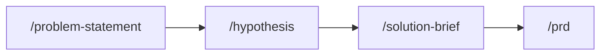
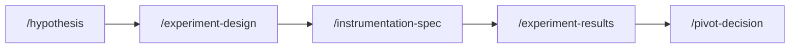
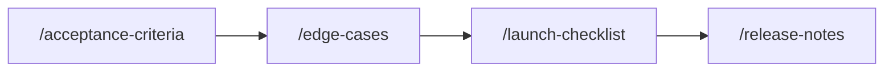
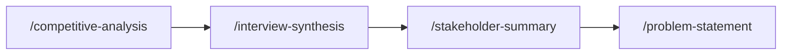
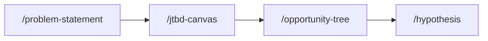
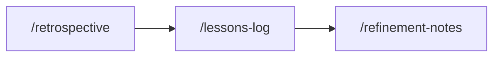

# Recipes

Recipes are concrete, step-by-step workflows that chain multiple skills together for common PM tasks. Each recipe shows the skills to use, the order to use them, and what each step produces.

## Pitch a Feature

Go from "I have an idea" to a stakeholder-ready package.



| Step | Skill | What you get |
|------|-------|-------------|
| 1 | `/problem-statement` | Clear articulation of the problem and why it matters now |
| 2 | `/hypothesis` | Testable assumption with success metrics |
| 3 | `/solution-brief` | One-page overview for stakeholder alignment |
| 4 | `/prd` | Full requirements document for engineering handoff |

**When to use:** You've identified an opportunity and need to build the case before committing engineering resources.

---

## Run an Experiment

Design, instrument, execute, and decide.



| Step | Skill | What you get |
|------|-------|-------------|
| 1 | `/hypothesis` | The assumption you're testing |
| 2 | `/experiment-design` | A/B test design with variants, metrics, and sample size |
| 3 | `/instrumentation-spec` | Event tracking spec for your analytics platform |
| 4 | `/experiment-results` | Statistical analysis with segments and learnings |
| 5 | `/pivot-decision` | Ship, iterate, or kill — with evidence |

**When to use:** You want to validate an assumption with data before building the full feature.

---

## Launch a Feature

From acceptance criteria to release notes.



| Step | Skill | What you get |
|------|-------|-------------|
| 1 | `/acceptance-criteria` | Given/When/Then criteria for QA |
| 2 | `/edge-cases` | Failure modes and error states |
| 3 | `/launch-checklist` | Pre-launch readiness across engineering, QA, marketing, legal |
| 4 | `/release-notes` | User-facing announcement |

**When to use:** The feature is built and you're preparing to ship.

---

## Discover and Frame a Problem

Go from "we should look into this" to a well-framed problem.



| Step | Skill | What you get |
|------|-------|-------------|
| 1 | `/competitive-analysis` | Market landscape and positioning gaps |
| 2 | `/interview-synthesis` | Themes and insights from user research |
| 3 | `/stakeholder-summary` | Who cares, what they need, how to align them |
| 4 | `/problem-statement` | Clear problem with success criteria |

**When to use:** You're in early discovery and need to build understanding before defining solutions.

---

## Define the Opportunity Space

Map the problem to solutions to testable assumptions.



| Step | Skill | What you get |
|------|-------|-------------|
| 1 | `/problem-statement` | The problem you're solving |
| 2 | `/jtbd-canvas` | Jobs customers are hiring your product to do |
| 3 | `/opportunity-tree` | Outcome-driven tree mapping opportunities to solutions |
| 4 | `/hypothesis` | Testable assumptions for the most promising solutions |

**When to use:** You have a validated problem and want to systematically explore the solution space.

---

## Sprint Retrospective and Refinement

Close the loop on a sprint and plan the next one.



| Step | Skill | What you get |
|------|-------|-------------|
| 1 | `/retrospective` | What went well, what to improve, action items |
| 2 | `/lessons-log` | Structured lesson with root cause and recommendations |
| 3 | `/refinement-notes` | Next sprint's stories, decisions, and blockers |

**When to use:** End of a sprint or milestone — reflect, learn, and plan.

---

## Full Lifecycle (Kitchen Sink)

Use the `/kickoff` bundle to start, then extend through all 6 phases.

```
/kickoff "Feature name"
```

This runs: Problem Statement → Hypothesis → PRD → User Stories.

Then extend with:

- **Develop:** `/solution-brief`, `/adr`, `/design-rationale`
- **Deliver:** `/acceptance-criteria`, `/edge-cases`, `/launch-checklist`, `/release-notes`
- **Measure:** `/experiment-design`, `/instrumentation-spec`, `/dashboard-requirements`, `/experiment-results`
- **Iterate:** `/retrospective`, `/lessons-log`, `/refinement-notes`, `/pivot-decision`

Or see a complete lifecycle in action: [Follow the Product showcase](../showcase/).
