# Skill Finder

Not sure which skill to use? Start here.

## By what you need to do

```mermaid
flowchart TD
    A{"What do you need to do?"} -- "Understand the\nmarket or users" --> DISCOVER
    A -- "Frame the\nproblem" --> DEFINE
    A -- "Design the\nsolution" --> DEVELOP
    A -- "Ship the\nfeature" --> DELIVER
    A -- "Measure\nresults" --> MEASURE
    A -- "Learn and\nimprove" --> ITERATE

    DISCOVER{"Discover"} -- "Analyze competitors" --> S1["/competitive-analysis"]
    DISCOVER -- "Synthesize interviews" --> S2["/interview-synthesis"]
    DISCOVER -- "Map stakeholders" --> S3["/stakeholder-summary"]

    DEFINE{"Define"} -- "State the problem" --> S4["/problem-statement"]
    DEFINE -- "Form a hypothesis" --> S5["/hypothesis"]
    DEFINE -- "Map opportunities" --> S6["/opportunity-tree"]
    DEFINE -- "Understand jobs-to-be-done" --> S7["/jtbd-canvas"]

    DEVELOP{"Develop"} -- "Propose a solution" --> S8["/solution-brief"]
    DEVELOP -- "Record a tech spike" --> S9["/spike-summary"]
    DEVELOP -- "Document a decision" --> S10["/adr"]
    DEVELOP -- "Explain design rationale" --> S11["/design-rationale"]

    DELIVER{"Deliver"} -- "Write requirements" --> S12["/prd"]
    DELIVER -- "Write user stories" --> S13["/user-stories"]
    DELIVER -- "Define acceptance criteria" --> S14["/acceptance-criteria"]
    DELIVER -- "Document edge cases" --> S15["/edge-cases"]
    DELIVER -- "Prepare for launch" --> S16["/launch-checklist"]
    DELIVER -- "Announce the release" --> S17["/release-notes"]

    MEASURE{"Measure"} -- "Design an experiment" --> S18["/experiment-design"]
    MEASURE -- "Specify tracking" --> S19["/instrumentation-spec"]
    MEASURE -- "Define a dashboard" --> S20["/dashboard-requirements"]
    MEASURE -- "Analyze results" --> S21["/experiment-results"]

    ITERATE{"Iterate"} -- "Run a retrospective" --> S22["/retrospective"]
    ITERATE -- "Log a lesson" --> S23["/lessons-log"]
    ITERATE -- "Refine the backlog" --> S24["/refinement-notes"]
    ITERATE -- "Decide: pivot or persevere" --> S25["/pivot-decision"]
```

## By artifact type

| I need a... | Use | Phase |
|------------|-----|-------|
| Architecture Decision Record | `/adr` | Develop |
| Acceptance criteria | `/acceptance-criteria` | Deliver |
| Backlog refinement notes | `/refinement-notes` | Iterate |
| Competitive analysis | `/competitive-analysis` | Discover |
| Dashboard requirements | `/dashboard-requirements` | Measure |
| Design rationale | `/design-rationale` | Develop |
| Edge cases document | `/edge-cases` | Deliver |
| Experiment design | `/experiment-design` | Measure |
| Experiment results | `/experiment-results` | Measure |
| Hypothesis | `/hypothesis` | Define |
| Instrumentation spec | `/instrumentation-spec` | Measure |
| Interview synthesis | `/interview-synthesis` | Discover |
| JTBD canvas | `/jtbd-canvas` | Define |
| Launch checklist | `/launch-checklist` | Deliver |
| Lessons learned | `/lessons-log` | Iterate |
| Opportunity tree | `/opportunity-tree` | Define |
| Persona | `/persona` | Foundation |
| Pivot/persevere decision | `/pivot-decision` | Iterate |
| PRD | `/prd` | Deliver |
| Problem statement | `/problem-statement` | Define |
| Release notes | `/release-notes` | Deliver |
| Retrospective | `/retrospective` | Iterate |
| Solution brief | `/solution-brief` | Develop |
| Spike summary | `/spike-summary` | Develop |
| Stakeholder summary | `/stakeholder-summary` | Discover |
| User stories | `/user-stories` | Deliver |

## By phase

| Phase | Focus | Skills |
|-------|-------|--------|
| [Discover](../skills/discover/) | Research and context | competitive-analysis, interview-synthesis, stakeholder-summary |
| [Define](../skills/define/) | Problem framing | problem-statement, hypothesis, opportunity-tree, jtbd-canvas |
| [Develop](../skills/develop/) | Solution design | solution-brief, spike-summary, adr, design-rationale |
| [Deliver](../skills/deliver/) | Handoff and launch | prd, user-stories, acceptance-criteria, edge-cases, launch-checklist, release-notes |
| [Measure](../skills/measure/) | Data and testing | experiment-design, instrumentation-spec, dashboard-requirements, experiment-results |
| [Iterate](../skills/iterate/) | Learning and adapting | retrospective, lessons-log, refinement-notes, pivot-decision |
| [Foundation](../skills/foundation/) | Cross-cutting | persona |
| [Utility](../skills/utility/) | Skill lifecycle | pm-skill-builder, pm-skill-validate, pm-skill-iterate |

## Still not sure?

- **Confused between two skills?** Check the [Skill Comparisons](../concepts/comparisons.md) page
- **Want a multi-step workflow?** Check the [Recipes](recipes.md) page
- **Want to see real output?** Check the [Showcase](../showcase/) to see every skill in action
