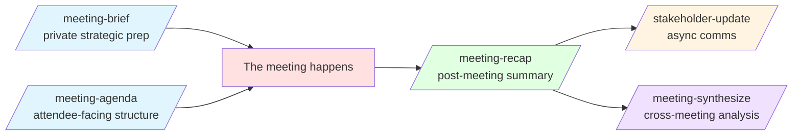
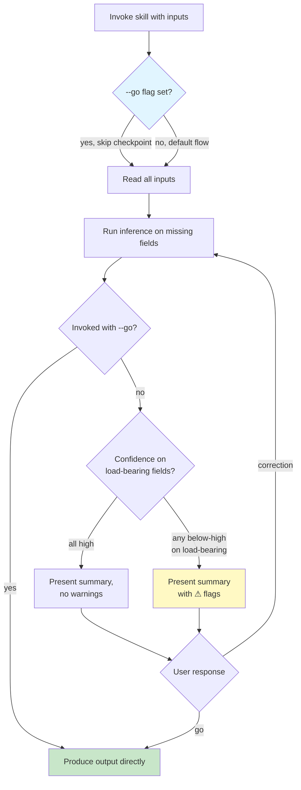
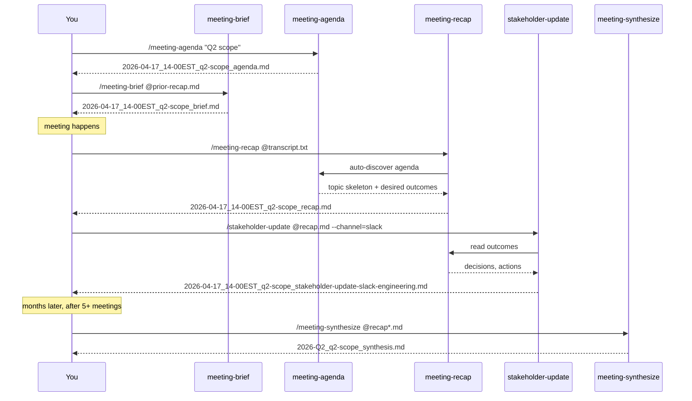

# Using the Meeting Skills Family

The Meeting Skills Family is a coordinated set of five `foundation-meeting-*` skills for the meeting lifecycle: pre-meeting prep, post-meeting summarization, cross-meeting analysis, and outward stakeholder communication. This guide walks you through the family as a PM would encounter it in practice.

Read the [family contract](../reference/skill-families/meeting-skills-contract.md) if you need the formal specification. This guide is for getting started.

## The five skills at a glance



| Skill | Phase | Audience | Key output |
|-------|-------|----------|-----------|
| `/meeting-agenda` | Pre-meeting | Attendees | Time-boxed topics, owners, prep |
| `/meeting-brief` | Pre-meeting | You (private) | Stakeholder reads, messages, asks |
| `/meeting-recap` | Post-meeting | Attendees | Topic summary, decisions, actions |
| `/meeting-synthesize` | Cross-meeting | You / leadership | Themes, contradictions, follow-ups |
| `/stakeholder-update` | Post-meeting | Non-attendees | Channel-tailored outward comms |

## Your first meeting with pm-skills

Imagine you have a cross-functional decision meeting Thursday afternoon. Four attendees. You're chairing. You have 30 minutes.

### Step 1 — Write the agenda (2 minutes of your time)

```bash
/meeting-agenda "Thursday 2pm EST cross-functional sync on Q2 scope; 4 attendees; 45 min"
```

The skill will:

1. Run the **anti-meeting check** — "does this actually need to be a meeting?" If your objective can be handled async, it'll recommend that instead. Override if needed.
2. Present an **inference summary** — "Inferred: meeting type = decision-making, duration = 45 min (as specified), meeting objective inferred from topic." Say `go` to accept, or correct any value.
3. Produce an agenda with type-tagged topics, time allocations, owners, and attendee prep.

Copy the shareable summary at the top of the output into your meeting invite. Done.

### Step 2 — (Optional) Private brief (3 minutes)

For the CFO-is-present decision meeting, you want private tactical prep. Run:

```bash
/meeting-brief @notes.md @prior-recap.md "Q2 scope meeting; CFO will push on capacity"
```

The skill reads your context, pulls in related prior recaps (auto-discovered via filename-chaining when available), and produces a brief with:

- Stakeholder reads (position, stakes, concerns, tactical notes)
- Ranked desired outcomes (must / should / nice)
- Key messages phrased for delivery
- Anticipated Q&A
- Specific asks by name

**The brief is private by default** (`visibility: private` in frontmatter). It's your prep, not a shared artifact.

### Step 3 — The meeting happens

Run the meeting. Take live notes or let a transcription tool (Krisp, Otter, Fireflies, Zoom) capture it.

### Step 4 — Recap the meeting (5 minutes of your time)

```bash
/meeting-recap @transcript.txt
```

The skill:

1. **Auto-discovers the agenda** from Step 1 (filename prefix match)
2. Uses the agenda topic list as scaffold for the recap
3. Extracts decisions (bold-flagged), actions (with owner + due date), open questions
4. Reconciles what was planned vs. what actually happened
5. Produces a consolidated action-by-owner view at the end

**Fabrication prohibition**: if an action lacks an explicit owner in the transcript, the recap tags it `[owner: unassigned]` rather than guessing. If more than 30% of actions lack owners, a `⚠ Ownership reconciliation required` section surfaces near the top.

Copy the shareable summary into Slack for the attendees. Post the full recap to the meeting's doc.

### Step 5 — Stakeholder update (2 minutes)

For non-attendees (engineering leads, leadership) who need to know outcomes:

```bash
/stakeholder-update @recap.md --channel=slack --audience=engineering
```

Or:

```bash
/stakeholder-update @recap.md --channel=email --audience=leadership --cta="confirm capacity impact by Friday"
```

The skill:

1. Reads the recap, extracts outcomes relevant to the target audience
2. Detects thread continuation (prior updates on the same project auto-linked)
3. Translates technical-to-business language as needed for the audience variant
4. Produces a channel-tailored message inside a `## Shareable update` section — **copy only that section**, everything below is internal audit notes

### Step 6 — Later: cross-meeting synthesis

After your Q2 initiative has spanned 5-8 meetings over a few months, run:

```bash
/meeting-synthesize @recap1.md @recap2.md @recap3.md @recap4.md @recap5.md
```

Or narrow by filter:

```bash
/meeting-synthesize --quarter=2026-Q2 --format=board-prep
```

Produces a cross-meeting artifact with:

- Plain-text timeline (chronological key events)
- Themes with confidence markers
- Stakeholder position tracking (how views evolved)
- Consolidated decision list
- **Decision evolution** (resolved) vs. **unresolved contradictions** (flagged with `⚠`)
- Prioritized follow-up suggestions (High / Medium / Low)

Use for board prep, onboarding new team members, or project retrospective input.

## The go-mode pattern

Every meeting skill follows the same behavioral contract: **read → infer → present summary → accept `go` or corrections**.



**Load-bearing inference gates**: stakeholder positions, primary ask, and decision-maker attribution trigger a `⚠` flag when inferred below-high confidence. You can still say `go`, but the flag ensures you see the risk before producing tactical guidance on weak inferences.

**Explicit go-mode**: pass `--go` to skip the checkpoint entirely. Useful when you trust the defaults or want a one-shot artifact.

## When the skills chain

The skills are designed to discover each other via filenames. Here's the chain in practice:



Chaining is **filename-based** — no separate IDs, no lookup tables. The filename itself is the identifier, and skills cross-reference each other via the `related_*` frontmatter fields and auto-discovery scans.

## File naming: quick reference

```
# Single-meeting artifacts
YYYY-MM-DD_HH-MMtimezone_title_{agenda|brief|recap}[_prepared-YYYY-MM-DD].md

# Stakeholder-update (variant suffix)
YYYY-MM-DD_HH-MMtimezone_title_stakeholder-update-{channel}-{audience}[_prepared-YYYY-MM-DD].md

# Synthesis
YYYY-Qn_topic_synthesis.md
YYYY-MM-DD-to-YYYY-MM-DD_topic_synthesis.md
```

Examples:

- `2026-04-17_14-00EST_search-feature-kickoff_agenda.md`
- `2026-04-17_14-00EST_search-feature-kickoff_stakeholder-update-email-leadership.md`
- `2026-Q1_search-feature_synthesis.md`

## Common pitfalls

**"Why does the anti-meeting check keep triggering?"** (v1.1.0)

The check now requires a positive synchronous-value statement. Restate your meeting's purpose in terms of: tradeoff to discuss, conflict to resolve, co-creation, relationship-building, or blocker escalation. If none apply, the async alternative is genuinely the better path.

**"The inferred meeting type is wrong."**

The inference summary is a checkpoint for exactly this. Say `meeting type is actually {correct-type}` and the skill will re-infer dependent values (duration, variant behavior) from the correction.

**"I have 60% of actions without owners — the recap is unusable."**

The v1.1.0 recap surfaces a `⚠ Ownership reconciliation required` section when unassigned ratio exceeds 30%. Use it as your action plan: the section lists each unassigned action and suggests a follow-up mechanism (15-min sync, Slack thread, async survey). Don't ship the recap until you've closed the reconciliation.

**"I accidentally pasted the whole stakeholder-update including the audit notes."**

The `## Shareable update` section (v1.1.0) marks the copy-safe boundary explicitly. Everything below the `> [End of Shareable update section...]` marker is internal. Copy only above the marker.

## Related

- [Family contract](../reference/skill-families/meeting-skills-contract.md) — formal specification
- [Foundation skills](../skills/foundation/) — all foundation-phase skills including the meeting family
- Individual skill docs — [`/meeting-agenda`](../skills/foundation/foundation-meeting-agenda.md), [`/meeting-brief`](../skills/foundation/foundation-meeting-brief.md), [`/meeting-recap`](../skills/foundation/foundation-meeting-recap.md), [`/meeting-synthesize`](../skills/foundation/foundation-meeting-synthesize.md), [`/stakeholder-update`](../skills/foundation/foundation-stakeholder-update.md)
- Sample outputs — [`library/skill-output-samples/foundation-meeting-*/`](https://github.com/product-on-purpose/pm-skills/tree/main/library/skill-output-samples)
