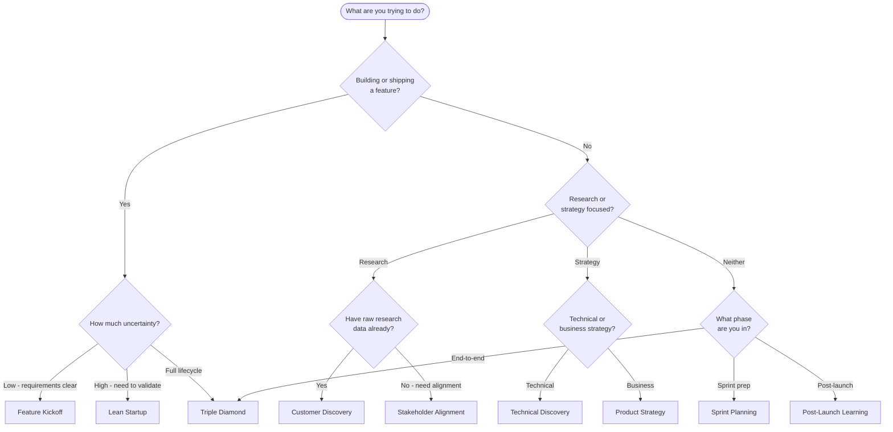

# Using Workflows

Workflows chain multiple PM skills into end-to-end sequences for common product management processes. Instead of invoking skills one at a time, a workflow runs them in order, passing context forward from each step to the next.

PM Skills includes **9 pre-built workflows** covering feature development, research, strategy, experimentation, and more.

---

## Which Workflow Should I Use?

Use this decision tree to find the right starting point based on your situation.



**Still unsure?** Start with **Feature Kickoff** for most feature work, or **Triple Diamond** when you need comprehensive coverage.

---

## Workflow Comparison Matrix

| Workflow | Use Case | Skills | Complexity | Duration |
|----------|----------|:------:|:----------:|:--------:|
| **Feature Kickoff** | Standard feature development | 5 | Medium | Session |
| **Customer Discovery** | Research to problem framing | 4 | Medium | Session |
| **Sprint Planning** | Sprint-ready stories from backlog | 3 | Light | Quick |
| **Product Strategy** | Strategic initiative framing | 5 | Heavy | Multi-session |
| **Post-Launch Learning** | Ship-to-learn feedback loop | 5 | Heavy | Multi-session |
| **Stakeholder Alignment** | Leadership buy-in | 4 | Medium | Session |
| **Lean Startup** | Rapid build-measure-learn | 4 | Medium | Session |
| **Technical Discovery** | Feasibility and architecture | 3 | Light | Quick |
| **Triple Diamond** | Comprehensive product development | 25 | Heavy | Multi-session |

**Complexity key:**

- **Light** (3 skills) -- Focused, can finish in under 2 hours
- **Medium** (4-5 skills) -- A working session, typically half a day
- **Heavy** (5+ skills or broad scope) -- Multiple sessions over days

**Duration key:**

- **Quick** -- Under 2 hours
- **Session** -- Half day (3-6 hours)
- **Multi-session** -- Multiple days

---

## Invoking Workflows

### Claude Code (slash commands)

Each workflow has a `/workflow-{name}` slash command:

```
/workflow-feature-kickoff "Save for Later feature for shopping cart"
```

```
/workflow-lean-startup "Test whether users want dark mode"
```

```
/workflow-sprint-planning "Q3 backlog for payments team"
```

All 9 workflow commands:

| Command | Workflow |
|---------|----------|
| `/workflow-feature-kickoff` | Feature Kickoff |
| `/workflow-customer-discovery` | Customer Discovery |
| `/workflow-sprint-planning` | Sprint Planning |
| `/workflow-product-strategy` | Product Strategy |
| `/workflow-post-launch-learning` | Post-Launch Learning |
| `/workflow-stakeholder-alignment` | Stakeholder Alignment |
| `/workflow-lean-startup` | Lean Startup |
| `/workflow-technical-discovery` | Technical Discovery |
| `/workflow-triple-diamond` | Triple Diamond |

### Other AI platforms

If your platform does not support slash commands, reference the workflow by name:

```
Run the Feature Kickoff workflow for adding a
"Save for Later" feature to our shopping cart.
```

The AI will recognize the workflow name and run the skills in sequence.

### What happens when you invoke a workflow

The AI works through each skill in order, using the output of each step as context for the next:

```
Starting Feature Kickoff workflow...

Step 1/5: Problem Statement
[Produces problem statement]

Step 2/5: Hypothesis
[Produces hypothesis based on problem statement]

Step 3/5: PRD
[Produces PRD based on hypothesis]

Step 4/5: User Stories
[Produces user stories from PRD]

Step 5/5: Launch Checklist
[Produces launch checklist]
```

---

## Customizing Workflows

You do not have to run every workflow exactly as defined. All workflows support these modifications at invocation time.

### Skip steps you don't need

```
Run the Feature Kickoff workflow, but skip the launch checklist --
we have an existing template for that.
```

### Add extra steps

```
Run Feature Kickoff, and also include edge-cases
after the user stories.
```

### Stop mid-workflow for review

```
Run Feature Kickoff through the PRD step,
then stop for review before continuing.
```

### Provide existing artifacts

If you already have outputs from earlier work, feed them in to skip ahead:

```
Here is our existing problem statement: [paste or attach].
Run Feature Kickoff starting from the hypothesis step.
```

### Combine workflows

Chain workflows together for broader coverage:

```
Run Customer Discovery first, then feed the results
into Feature Kickoff to take it through to launch.
```

This effectively creates a custom sequence: interview-synthesis, jtbd-canvas, opportunity-tree, problem-statement, hypothesis, prd, user-stories, launch-checklist.

---

## Building Custom Workflows

You can create new workflows by adding a Markdown file to the `_workflows/` directory.

### Workflow file structure

Each workflow file follows this pattern:

```markdown
# Workflow Name

> One-line description

Longer description of when and why to use this workflow.

## Workflow Metadata

| Field | Value |
|-------|-------|
| **Workflow** | Workflow Name |
| **Command** | `/workflow-your-name` |
| **Skills** | `skill-a` -> `skill-b` -> `skill-c` |
| **Phases Covered** | Define, Deliver |
| **Estimated Duration** | 2-4 hours |
| **Prerequisite Inputs** | What the user needs to bring |
| **Final Output** | What the workflow produces |

## When to Use
...

## Core Sequence
### Step 1: Skill Name
**Skill:** skill-reference
**Purpose:** Why this step exists
**Key Outputs:** What it produces
...
```

### Steps to create a new workflow

1. **Pick your skill sequence.** Review the [skills catalog](../skills/index.md) and select 3-8 skills that form a logical chain.
2. **Create the file.** Add `_workflows/your-workflow-name.md` following the structure above.
3. **Add a slash command.** Create `commands/workflow-your-workflow-name.md` so users can invoke it with `/workflow-your-workflow-name`.
4. **Register in the docs.** Add an entry in `docs/workflows/index.md` and update the nav in `mkdocs.yml` if you want it in the documentation site.
5. **Test the sequence.** Run the workflow end-to-end to verify that each skill's output provides useful context for the next step.

### Design tips

- **3-8 skills** is the sweet spot. Fewer than 3 is just individual skill use; more than 8 gets unwieldy.
- **Order matters.** Each skill should build on the output of the previous one.
- **Document "When to Use" and "Don't Use When."** This helps users pick the right workflow.
- **Include optional extensions.** Suggest skills that can be added for more depth without making them mandatory.

---

## Workflow Reference

For full details on each workflow -- skill sequences, step-by-step guides, examples, and optional extensions -- see the [Workflows section](../workflows/index.md).

| Workflow | Skills Chained |
|----------|---------------|
| [Feature Kickoff](../workflows/feature-kickoff.md) | problem-statement, hypothesis, prd, user-stories, launch-checklist |
| [Customer Discovery](../workflows/customer-discovery.md) | interview-synthesis, jtbd-canvas, opportunity-tree, problem-statement |
| [Sprint Planning](../workflows/sprint-planning.md) | refinement-notes, user-stories, edge-cases |
| [Product Strategy](../workflows/product-strategy.md) | competitive-analysis, stakeholder-summary, opportunity-tree, solution-brief, adr |
| [Post-Launch Learning](../workflows/post-launch-learning.md) | instrumentation-spec, dashboard-requirements, experiment-results, retrospective, lessons-log |
| [Stakeholder Alignment](../workflows/stakeholder-alignment.md) | stakeholder-summary, problem-statement, solution-brief, launch-checklist |
| [Lean Startup](../workflows/lean-startup.md) | hypothesis, experiment-design, experiment-results, pivot-decision |
| [Technical Discovery](../workflows/technical-discovery.md) | spike-summary, adr, design-rationale |
| [Triple Diamond](../workflows/triple-diamond.md) | All 25 phase skills across 6 phases |

---

*Part of [PM Skills](https://github.com/product-on-purpose/pm-skills) -- Open-source Product Management skills for AI agents*
