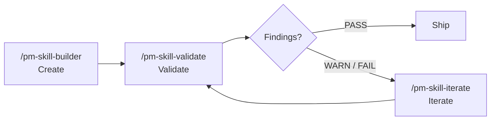

# PM Skills

**29 best-practice product management skills for AI agents.**

PM Skills is an open-source collection of reusable instruction sets that teach AI assistants how to produce professional PM artifacts — PRDs, user stories, acceptance criteria, experiment designs, and more.

## Key Features

- **29 Production-Ready Skills** covering the complete product lifecycle (Discover, Define, Develop, Deliver, Measure, Iterate)
- **Triple Diamond Framework** organizing skills across 6 phases
- **Skill Lifecycle Tools** — Create, Validate, and Iterate skills with `/pm-skill-builder`, `/pm-skill-validate`, `/pm-skill-iterate`
- **Works everywhere** — Claude Code, Cursor, GitHub Copilot, Windsurf, VS Code, and any MCP client
- **Apache 2.0 Licensed** for commercial and personal use

## Quick Start

```bash
git clone https://github.com/product-on-purpose/pm-skills.git
cd pm-skills
```

Then use any skill with a slash command:

```
/prd "Search feature for e-commerce platform"
/hypothesis "Will one-page checkout increase conversion?"
/acceptance-criteria "User can reset password via email"
```

See the [Getting Started Guide](getting-started.md) for platform-specific setup.

## The Lifecycle



## Links

- [GitHub Repository](https://github.com/product-on-purpose/pm-skills)
- [MCP Server](https://github.com/product-on-purpose/pm-skills-mcp)
- [Agent Skills Specification](https://agentskills.io/specification)
- [Changelog](https://github.com/product-on-purpose/pm-skills/blob/main/CHANGELOG.md)
