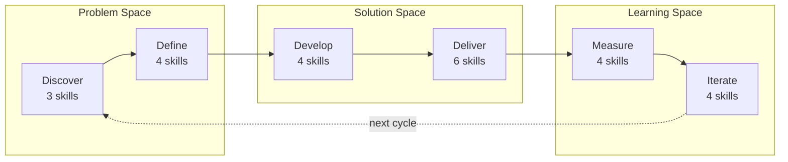
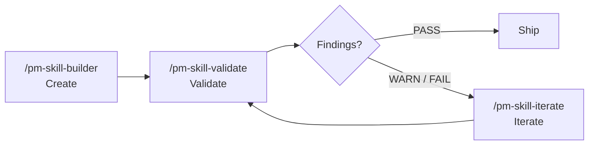

# PM Skills

**38 best-practice product management skills for AI agents.**

PM Skills teaches AI assistants how to produce professional PM artifacts - PRDs, user stories, acceptance criteria, experiment designs, and more. One command, consistent output, every time.

## The Triple Diamond

Skills are organized across 6 phases of the Triple Diamond framework - three diamonds covering the problem space, the solution space, and the learning space.



[:octicons-arrow-right-24: Learn about the Triple Diamond](concepts/triple-diamond.md)

## The Skills

<div class="grid cards" markdown>

-   :material-magnify: **Discover** - 3 skills

    ---

    Research, competitive analysis, stakeholder mapping

    [:octicons-arrow-right-24: Browse](skills/discover/)

-   :material-target: **Define** - 4 skills

    ---

    Problem framing, hypotheses, opportunity trees, JTBD

    [:octicons-arrow-right-24: Browse](skills/define/)

-   :material-wrench: **Develop** - 4 skills

    ---

    Solution briefs, ADRs, design rationale, spikes

    [:octicons-arrow-right-24: Browse](skills/develop/)

-   :material-rocket-launch: **Deliver** - 6 skills

    ---

    PRDs, user stories, acceptance criteria, edge cases, launch, release notes

    [:octicons-arrow-right-24: Browse](skills/deliver/)

-   :material-chart-line: **Measure** - 4 skills

    ---

    Experiments, instrumentation, dashboards, results

    [:octicons-arrow-right-24: Browse](skills/measure/)

-   :material-refresh: **Iterate** - 4 skills

    ---

    Retrospectives, lessons, refinement, pivot decisions

    [:octicons-arrow-right-24: Browse](skills/iterate/)

-   :material-layers-triple: **Foundation** - 7 skills

    ---

    Cross-cutting persona generation

    [:octicons-arrow-right-24: Browse](skills/foundation/)

-   :material-tools: **Utility** - 6 skills

    ---

    Create, validate, iterate skills, generate diagrams and presentations, and update the library

    [:octicons-arrow-right-24: Browse](skills/utility/)

</div>

## Skills by Phase

25 domain skills across 6 phases, plus foundation and utility:


**Plus:** `/lean-canvas` `/persona` `/meeting-agenda` `/meeting-brief` `/meeting-recap` `/meeting-synthesize` `/stakeholder-update` (Foundation - cross-cutting) · `/pm-skill-builder` `/pm-skill-validate` `/pm-skill-iterate` `/mermaid-diagrams` `/slideshow-creator` `/update-pm-skills` (Utility)

## The Skill Lifecycle

Three utility skills form a self-reinforcing quality loop for managing the skill library itself:



**Create** a new skill with guided gap analysis and classification. **Validate** it against structural conventions and quality criteria. **Iterate** to fix findings from the validation report or apply feedback. Repeat until passing, then ship.

The lifecycle tools are what keep the library consistent as it grows - the validator catches drift, and the iterator applies fixes with version tracking and change summaries.

[:octicons-arrow-right-24: Learn more about the lifecycle](concepts/skill-lifecycle.md) · [:octicons-arrow-right-24: Skill versioning](concepts/versioning.md)

## Quick Start

```bash
git clone https://github.com/product-on-purpose/pm-skills.git
cd pm-skills
```

Then use any skill:

```
/prd "Search feature for e-commerce platform"
/hypothesis "Will one-page checkout increase conversion?"
/acceptance-criteria "User can reset password via email"
```

[:octicons-arrow-right-24: Full setup guide](getting-started/) · [:octicons-arrow-right-24: Find the right skill](guides/skill-finder.md) · [:octicons-arrow-right-24: Recipes](guides/recipes.md)

## See It In Action

Follow three fictional companies through the complete product lifecycle - from discovery research to pivot decisions - with real prompts and full outputs.

<div class="grid cards" markdown>

-   :material-store: **Storevine** - B2B Ecommerce

    ---

    Building email marketing for 15K merchants. Organized prompts.

    [:octicons-arrow-right-24: Follow the journey](showcase/storevine.md)

-   :material-bookshelf: **Brainshelf** - Consumer PKM

    ---

    Building a morning digest for 22K users. Casual prompts.

    [:octicons-arrow-right-24: Follow the journey](showcase/brainshelf.md)

-   :material-office-building: **Workbench** - Enterprise Collaboration

    ---

    Building document templates for 500 enterprises. Structured prompts.

    [:octicons-arrow-right-24: Follow the journey](showcase/workbench.md)

</div>

## Works Everywhere

| Platform | Method |
|----------|--------|
| **Claude Code** | Slash commands (`/prd`, `/hypothesis`, etc.) |
| **GitHub Copilot** | AGENTS.md auto-discovery |
| **Cursor / Windsurf** | AGENTS.md or [MCP server](https://github.com/product-on-purpose/pm-skills-mcp) |
| **Claude.ai / Desktop** | ZIP upload or MCP |
| **Any MCP client** | [pm-skills-mcp](https://github.com/product-on-purpose/pm-skills-mcp) |

## Workflows

9 guided multi-skill workflows for common PM processes. Each chains skills in a recommended sequence with handoff guidance.

| Workflow | Best for | Skills |
|----------|----------|--------|
| [Feature Kickoff](workflows/feature-kickoff.md) | New features | problem-statement → hypothesis → prd → user-stories → launch-checklist |
| [Lean Startup](workflows/lean-startup.md) | Rapid validation | hypothesis → experiment-design → experiment-results → pivot-decision |
| [Triple Diamond](workflows/triple-diamond.md) | Major initiatives | All 25 phase skills across 6 phases |
| [Customer Discovery](workflows/customer-discovery.md) | Research → problem | interview-synthesis → jtbd-canvas → opportunity-tree → problem-statement |
| [Sprint Planning](workflows/sprint-planning.md) | Sprint-ready stories | refinement-notes → user-stories → edge-cases |
| [Product Strategy](workflows/product-strategy.md) | Strategic framing | competitive-analysis → stakeholder-summary → opportunity-tree → solution-brief → adr |
| [Post-Launch Learning](workflows/post-launch-learning.md) | Ship → learn | instrumentation-spec → dashboard-requirements → experiment-results → retrospective → lessons-log |
| [Stakeholder Alignment](workflows/stakeholder-alignment.md) | Leadership buy-in | stakeholder-summary → problem-statement → solution-brief → launch-checklist |
| [Technical Discovery](workflows/technical-discovery.md) | Feasibility | spike-summary → adr → design-rationale |

[:octicons-arrow-right-24: All workflows](workflows/)

## Recent Releases

| Version | Date | Highlights |
|---------|------|-----------|
| **[v2.11.1](releases/Release_v2.11.1.md)** | 2026-04-22 | skills.sh CLI compatibility patch: unblocks `npx skills add product-on-purpose/pm-skills`; lint hardening; em-dash sweep completion |
| **[v2.11.0](releases/Release_v2.11.0.md)** | 2026-04-18 | Meeting Skills Family: 5 foundation skills + canonical contract + enforcing CI; lean-canvas; 32 to 38 skills |
| [v2.10.2](releases/Release_v2.10.2.md) | 2026-04-14 | Manifest drift fix + JSON count CI extension |
| [v2.10.1](releases/Release_v2.10.1.md) | 2026-04-13 | Post-v2.10.0 polish: dynamic skill-page counts, backlog spec drafts |
| [v2.10.0](releases/Release_v2.10.0.md) | 2026-04-11 | Utility skill expansion: `/mermaid-diagrams`, `/slideshow-creator`, `/update-pm-skills` |
| [v2.9.1](releases/Release_v2.9.1.md) | 2026-04-10 | Workflows guide + docs count consistency CI |
| [v2.9.0](releases/Release_v2.9.0.md) | 2026-04-06 | Workflows: rename bundles to workflows, expand 3 to 9, 7 `/workflow-*` commands |

[:octicons-arrow-right-24: All releases](releases/) · [:octicons-arrow-right-24: Full changelog](changelog.md)

## Links

- [:fontawesome-brands-github: GitHub Repository](https://github.com/product-on-purpose/pm-skills)
- [:material-server: MCP Server](https://github.com/product-on-purpose/pm-skills-mcp)
- [:material-file-document: Agent Skills Specification](https://agentskills.io/specification)
- [:material-tag: Browse by tag](tags.md)
