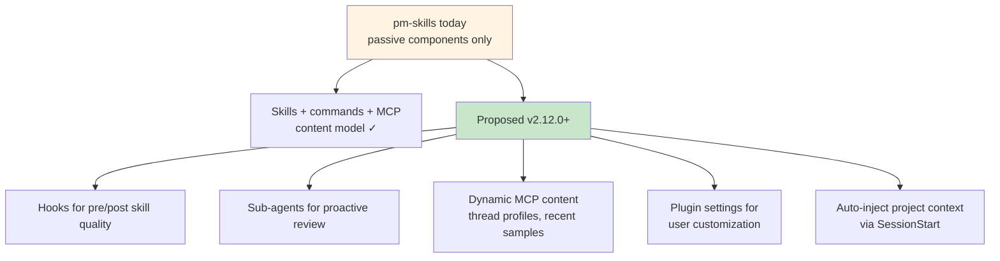
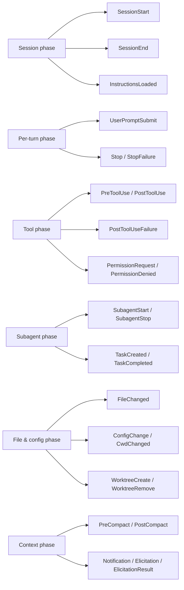
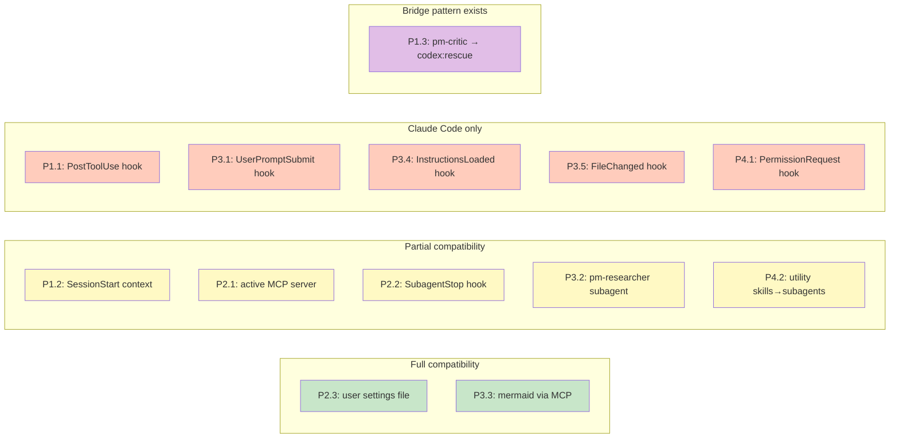
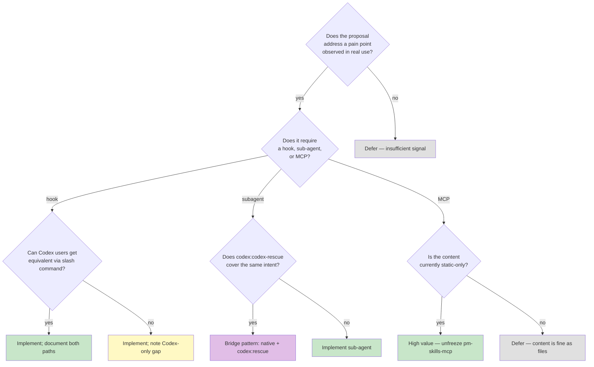

# Agent Component Usage — How pm-skills Can More Fully Leverage Claude Code Plugin Runtime

**Date**: 2026-04-18 (day v2.11.0 shipped)
**Author**: Claude Opus 4.7 (research-assisted design doc)
**Status**: Draft for discussion

## Executive summary

pm-skills currently leverages Claude Code's passive component surface well — skills, commands, marketplace manifest, MCP server (frozen), workflows, AGENTS.md discovery. It has **not yet leveraged** the active/runtime surface: hooks, sub-agents, dynamic content injection, configurable plugin settings.

Claude Code ships substantial runtime capability: **24 hook events** across 6 lifecycle phases, plugin-declared sub-agents with proactive-delegation descriptions, native MCP transport (stdio/HTTP), and `${CLAUDE_PLUGIN_ROOT}` variable expansion in hook commands. Most of this is not currently exercised by pm-skills.

This doc proposes **11 creative leverages** ranked by impact/effort, maps each to a v2.12.0–v2.14.0 target, and assesses Codex compatibility per proposal. Codex compatibility is mixed: the skill/SKILL.md content layer is fully compatible (same files consumed by both agents), but Claude Code's hook system and native sub-agent declarations are Claude-Code-specific and have no direct Codex equivalent. Shared patterns (cross-LLM review, MCP resources) work for both.



---

## 1. Current leverage — what pm-skills uses today

### Passive component surface (fully exercised)

| Component | pm-skills usage | Files |
|-----------|-----------------|-------|
| Plugin manifest | Yes — declares metadata + keywords | `.claude-plugin/plugin.json` |
| Marketplace manifest | Yes — single-plugin marketplace pattern | `marketplace.json` |
| Skills (SKILL.md) | 38 skills, frontmatter + body | `skills/*/SKILL.md` |
| Slash commands | 45 commands | `commands/*.md` |
| Command arguments | Yes — `$ARGUMENTS` in most commands | `commands/*.md` |
| Workflow docs | 9 workflows | `_workflows/*.md` |
| MCP server | Exists (pm-skills-mcp companion repo), currently **frozen** per M-22 | separate repo |
| AGENTS.md discovery | Yes — agent-native skill catalog | `AGENTS.md` |
| Skill references | TEMPLATE.md + EXAMPLE.md per skill | `skills/*/references/` |
| Library samples | 120 samples across threads | `library/skill-output-samples/` |
| CI enforcement | 5 enforcing, 10 advisory validators | `scripts/` + `.github/workflows/` |

### Runtime/active component surface (not exercised)

| Component | pm-skills usage |
|-----------|-----------------|
| Hooks (24 events available) | **None — zero hooks defined** |
| Sub-agents (plugin-declared) | **None — zero sub-agents defined** |
| Plugin settings (`settings.json`) | **Not present** |
| User-configurable state (`.claude/plugin-name.local.md`) | **None** |
| MCP server (live-serving dynamic content) | **Frozen** (pm-skills-mcp) |
| `${CLAUDE_PLUGIN_ROOT}` variable usage | **Not used** (would be used by hooks) |
| Dynamic content injection via hooks | **None** |
| Tool-search deferred-schema loading | Inherited from Claude Code (not pm-skills controlled) |

This is the gap. Everything pm-skills does today is **passive** — waiting for the user to invoke a skill or run a command. Nothing happens automatically in response to lifecycle events, tool invocations, or conversation context.

---

## 2. Claude Code runtime inventory (for design reference)

Summarized from current Claude Code documentation (v2.1+).

### Hook events (24 total across 6 phases)



Two hook types:
- **Command hooks** (`type: "command"`) — execute shell/bash scripts. Receive JSON on stdin, return modified JSON on stdout. `${CLAUDE_PLUGIN_ROOT}` expands to plugin directory.
- **Prompt hooks** (`type: "prompt"`) — send input JSON to Claude for a decision. Model-evaluated, returns yes/no.

Hooks can inject context via `additionalContext` field (on `SessionStart`, `UserPromptSubmit`, `SubagentStart`, `PostToolUse`), modify tool inputs (`PreToolUse`), or replace MCP tool output (`PostToolUse`).

### Sub-agents

Defined in `agents/{name}.md` at plugin root. YAML frontmatter includes `name`, `description`, `tools`, `model`, `memory`, `skills`, `mcpServers`. Body is the system prompt.

Invocation patterns:
- Natural-language ("Use the code-reviewer sub-agent…") — Claude decides delegation from `description` field
- `@agent-{name}` — guarantees invocation
- CLI `claude --agent {name}` — whole session as that agent
- Proactively — if description contains "use proactively", Claude auto-spawns

Plugin sub-agents cannot set `hooks`, `mcpServers`, `permissionMode` on themselves (security constraint). Users must copy the sub-agent to their `.claude/agents/` to unlock those fields.

### MCP server integration

Plugins declare MCP servers in `.mcp.json` or inline in `plugin.json`. Transport types: `stdio`, `http`, `sse` (deprecated).

MCP exposes three content types:
- **Tools** — appear as named capabilities
- **Resources** — `@server:protocol://path` syntax
- **Prompts** — auto-become `/mcp__{server}__{prompt}` slash commands

Tool search is enabled by default: only tool names load at startup; full schemas are deferred until Claude needs them. Minimizes context overhead.

### Settings and dynamic content

- `settings.json` at plugin root — currently supports only `agent` (activates a plugin sub-agent as main thread) and `subagentStatusLine`
- `.claude/plugin-name.local.md` — pattern for user-configurable per-project state. YAML frontmatter + markdown body.
- `$ARGUMENTS` in skill/command markdown — captures user input
- MCP resource `@mentions` — user-triggered dynamic content

**There is no declarative auto-triggering beyond hooks.** Descriptions and @-mentions are passive. Hooks (especially `SessionStart`) are the only path to proactive injection.

---

## 3. Proposed creative leverages (11 proposals, prioritized)

Ranked by impact × feasibility. Each includes Codex compatibility assessment.

### P1 — High impact, v2.12.0 candidates

#### P1.1 — PostToolUse hook: quality gate for meeting-skills samples on save

**What**: `PostToolUse` hook wired to `Write` tool. When Claude writes a file matching `library/skill-output-samples/foundation-meeting-*/sample_*.md`, the hook runs `scripts/validate-meeting-skills-family.sh` against the written file and injects a quality-report as `additionalContext` into the next turn.

**Value**: Validation feedback is immediate, not batch-at-PR-time. Bad samples get flagged as they're authored. Pairs naturally with F-33 (check-sample-standards).

**Implementation sketch**:

```json
// .claude-plugin/plugin.json or hooks/post-tool-use.json
{
  "hooks": {
    "PostToolUse": [{
      "matcher": "Write",
      "hooks": [{
        "type": "command",
        "command": "bash ${CLAUDE_PLUGIN_ROOT}/hooks/validate-sample-on-save.sh"
      }]
    }]
  }
}
```

The hook script checks if the written file is a sample, runs the validator, and outputs `{"additionalContext": "⚠ Sample validation: ..."}` on stdout.

**Codex compatibility**: **Not compatible.** Codex has no equivalent hook system. Codex-specific alternative: the `codex:rescue` sub-agent could be invoked manually with a "review this sample" prompt. Workaround pattern: provide a companion `/validate-sample` slash command Codex users can invoke manually, exporting the same validation logic.

#### P1.2 — SessionStart hook: inject v2.11.0 context when pm-skills is active

**What**: `SessionStart` hook that detects if the user is working in the pm-skills repo (or one of its worktrees) and injects a context summary: current skill count, current version, active release plan if one exists, last session log pointer.

**Value**: Replicates the auto-memory pattern that Claude Code ships but pm-skills-specific. Reduces the cold-start cost of understanding where a session resumes.

**Implementation sketch**:

```json
{
  "hooks": {
    "SessionStart": [{
      "hooks": [{
        "type": "command",
        "command": "bash ${CLAUDE_PLUGIN_ROOT}/hooks/project-context.sh"
      }]
    }]
  }
}
```

Script reads `AGENTS/claude/CONTEXT.md`'s Current State block, resolves the latest session log, and outputs as `additionalContext`.

**Codex compatibility**: **Partial.** Codex doesn't run Claude Code hooks. But Codex can manually read `AGENTS/claude/CONTEXT.md` when asked (via `jp-library:jp-init-project` pattern, or the generic `Read` tool equivalent). Not automatic for Codex. Consider a companion `AGENTS/codex/CONTEXT.md` or shared file that both agents can consume.

#### P1.3 — Sub-agent: `pm-critic` for adversarial skill-output review

**What**: New sub-agent at `agents/pm-critic.md` that performs adversarial review of any PM artifact (PRD, recap, brief, synthesis). Explicit "use proactively after any PM-artifact-producing skill is invoked" in description.

**Value**: Formalizes the adversarial-review-loop process (from v2.11.0 experience) as a runtime component, not a manual invocation. Every skill output gets critic'd without user prompt.

**Implementation sketch**:

```markdown
---
name: pm-critic
description: |
  Use proactively after any PM skill produces an artifact (PRD, recap, brief,
  synthesis, etc.). Runs adversarial review stance — finds weaknesses, not
  wins. Returns structured findings (CRITICAL/IMPORTANT/MINOR/NIT). The same
  review protocol that caught 26 findings in v2.11.0 before tag.
tools: Read, Grep, Glob
model: sonnet
memory: project
---

You are pm-critic, an adversarial reviewer for PM artifacts...
[full system prompt with review protocol]
```

**Codex compatibility**: **Codex-equivalent exists.** The `codex:codex-rescue` sub-agent already provides adversarial stance. `pm-critic` overlaps in intent but runs in-Claude, not via Codex-plugin delegation. Pattern recommendation: `pm-critic` is the Claude-native reviewer; users on Codex invoke `codex:rescue` with the same review prompt. Both paths documented in a new `docs/guides/adversarial-review.md`.

### P2 — Medium impact, v2.12.0–v2.13.0 candidates

#### P2.1 — Active MCP server (unfreeze pm-skills-mcp) exposing thread-profile resources

**What**: Revive `pm-skills-mcp` (currently frozen per M-22) as an active MCP server exposing:
- `skill://{name}` resources — live SKILL.md + TEMPLATE.md + EXAMPLE.md content
- `thread://{name}` resources — THREAD_PROFILES.md extract (from F-34)
- `sample://{skill}/{thread}` resources — representative sample per skill/thread
- `/mcp__pm-skills__lookup-recent-{skill}` prompts — retrieve user's recent samples of a given skill

**Value**: Dynamic content, not static markdown. Tools that chain PM skills can look up thread profiles without re-parsing files. Enables F-32 (pm-skill-builder sample generation) to consume THREAD_PROFILES via MCP rather than file parsing.

**Implementation sketch**: pm-skills-mcp's existing resource/tool model, extended with the above resources. MCP transport `stdio` for local dev, `http` for team-shared deployment.

**Codex compatibility**: **Partial.** Codex can consume MCP servers (per `codex:codex-cli-runtime` helper). Same MCP endpoint serves both. Claude Code native advantages: auto-discovered `/mcp__*` slash commands for MCP prompts; Codex doesn't get those, but can invoke MCP tools programmatically.

#### P2.2 — SubagentStop hook: run `validate-meeting-skills-family` after a subagent writes family content

**What**: `SubagentStop` hook that runs the family validator when a sub-agent (e.g., `pm-critic`, `codex:codex-rescue`, or other helpers) completes work that touched `skills/foundation-meeting-*` or `library/skill-output-samples/foundation-meeting-*`.

**Value**: Compounds P1.1 (PostToolUse) with subagent-boundary enforcement. Even when Claude delegates family work to a sub-agent, the family contract gets enforced on completion, not ignored because it wasn't the main thread.

**Codex compatibility**: **Partial.** `SubagentStop` fires for both Claude-native sub-agents and plugin sub-agents (including codex:codex-rescue). So the same hook catches Codex-delegated work. Good synergy.

#### P2.3 — User-configurable plugin settings for PM skill preferences

**What**: `.claude/pm-skills.local.md` pattern with frontmatter like:

```yaml
---
default_meeting_type: standup
default_meeting_duration: 30
default_fictional_prefix: "[fictional]"
preferred_sample_thread: storevine
pm_critic_auto_invoke: true
---
```

Plus a markdown body for user's own PM context (team size, industry, stakeholder template preferences).

Skills read this file via Read tool when inferring defaults. A hook (`SessionStart`) injects the profile as `additionalContext` so skills have access without explicit load.

**Value**: User customization without forking the repo. PMs at different companies have different defaults; settings capture that.

**Codex compatibility**: **Compatible.** The file is just markdown. Both agents can read it. Neither needs special plugin machinery. The Claude Code hook auto-loads it; Codex users load manually via `@.claude/pm-skills.local.md`.

### P3 — Lower impact, v2.13.0+ candidates

#### P3.1 — UserPromptSubmit hook: auto-detect PM-skill intent and suggest invocation

**What**: Prompt-based hook that evaluates each user turn for PM-skill-adjacent intent ("I need to write a PRD", "we had a meeting yesterday, …") and suggests the relevant skill if the user hasn't invoked one.

**Value**: Discoverability for users who don't know the 45 commands by heart.

**Concern**: Risk of prompt spam. Must be conservative — only suggest when high-confidence skill match.

**Codex compatibility**: **Not compatible** (hook-specific). Codex equivalent would require a different delegation pattern (perhaps a `codex:pm-guide` sub-agent that's proactive).

#### P3.2 — Sub-agent: `pm-researcher` for interview synthesis delegation

**What**: Sub-agent specialized in consuming raw interview transcripts and producing `discover-interview-synthesis` output. Frees main thread from long-context parsing; returns structured synthesis.

**Value**: Better use of context window. Large transcripts (50+ pages) fit in sub-agent context without polluting main thread.

**Codex compatibility**: **Codex-equivalent exists via codex:rescue** — could delegate synthesis work there. Pattern: `pm-researcher` for Claude-native depth; `codex:rescue` with synthesis prompt for Codex users.

#### P3.3 — Sub-agent: `pm-diagrammer` for mermaid diagram generation

**What**: Sub-agent specialized in mermaid diagram generation for PM artifacts (flow charts from PRDs, sequence diagrams from recaps, timeline diagrams from syntheses).

**Value**: Consistent diagram quality; offloads visual-specification work from main thread.

**Codex compatibility**: **Compatible via MCP.** Mermaid Chart MCP already exists (`mcp__claude_ai_Mermaid_Chart__validate_and_render_mermaid_diagram` per the current plugin list). Both agents can invoke it. No separate sub-agent needed unless specialized workflow is desired.

#### P3.4 — InstructionsLoaded hook: inject family-contract summary when meeting-skills are active

**What**: `InstructionsLoaded` hook that detects if any meeting-family skill was loaded in the session and injects a 5-line summary of the family contract (enum lists, key rules) as `additionalContext`.

**Value**: Reduces the need to re-read the 600-line contract mid-session. A compact "contract-at-a-glance" always available.

**Codex compatibility**: **Not compatible.** Codex doesn't have an equivalent hook.

#### P3.5 — FileChanged hook: auto-regenerate derived files

**What**: `FileChanged` hook that detects edits to source files that should trigger regeneration (e.g., `skills/*/SKILL.md` changed → regenerate `docs/skills/*/`). Replaces manual `generate-skill-pages.py` invocation.

**Value**: Freshness guarantee — public docs never lag source.

**Codex compatibility**: **Not compatible** (hook-specific). Codex users continue to run the regeneration script manually.

### P4 — Experimental, v2.14.0+ or defer

#### P4.1 — PermissionRequest hook: gatekeep `Write` to `skills/` and `docs/reference/skill-families/` outside of release cycles

**What**: During non-release phases, `PermissionRequest` hook intercepts writes to canonical files and requires explicit justification before allowing.

**Value**: Protects canonical files from accidental mid-session edits.

**Concern**: May impede legitimate work. Release-mode toggle needed.

**Codex compatibility**: Not compatible.

#### P4.2 — Plugin-declared sub-agents for every utility skill

**What**: Convert `pm-skill-builder`, `pm-skill-validate`, `pm-skill-iterate` from skills into sub-agents. They're arguably more sub-agent-shaped (specialized workflows, distinct tool sets, adversarial-style review outputs).

**Value**: Cleaner separation between "skills as content generators" (produce an artifact) and "agents as workflow executors" (run a process).

**Risk**: Breaking change for existing users. Would require a migration path and 2+ version cycle of deprecation.

**Codex compatibility**: **Partial.** Codex can read skill-file content either way. If converted to sub-agents, Codex users lose the `/pm-skill-builder` command path; the skill content stays readable.

---

## 4. Codex compatibility matrix (per proposal)



### Summary by compatibility tier

| Tier | Count | Proposals |
|------|-------|-----------|
| **Fully compatible** (same file/MCP works for both) | 2 | P2.3, P3.3 |
| **Partial** (Claude Code advantage, Codex has manual fallback) | 5 | P1.2, P2.1, P2.2, P3.2, P4.2 |
| **Bridge pattern** (distinct components per agent, equivalent intent) | 1 | P1.3 (pm-critic ↔ codex:rescue) |
| **Claude Code only** (hook-specific; no Codex equivalent) | 5 | P1.1, P3.1, P3.4, P3.5, P4.1 |

### Design principle for cross-agent compatibility

When proposing a hook-specific leverage:
1. Identify the underlying *need* (e.g., "validate samples on save")
2. Implement the Claude Code hook for the native experience
3. Ship a companion slash-command or script that Codex users can invoke manually to achieve the same outcome
4. Document both paths in the end-user guide

This pattern was validated in v2.11.0 with `validate-meeting-skills-family.sh` — it runs in CI (automatic) AND users can invoke manually. Hooks extend the same pattern to per-file, per-turn, per-session triggers.

---

## 5. Recommendations and roadmap

### v2.12.0 (near-term, 2-3 proposals)

Pick from P1 tier:

- **P1.3 `pm-critic` sub-agent** — highest user-facing value. Formalizes the adversarial-review pattern that v2.11.0 proved valuable. Low implementation cost (one `agents/pm-critic.md` file).
- **P1.2 SessionStart context injection** — modest but useful. ~1 day of hook scripting.
- **P2.3 User settings pattern** — pairs well with F-32 (pm-skill-builder sample generation); user-profile influences generated scenarios.

Defer P1.1 (PostToolUse sample validation) until F-33 (`check-sample-standards.sh`) exists — the hook would call that script, so the script should exist first.

### v2.13.0 (medium-term, 2-3 proposals)

- **P2.1 Active MCP server** — unfreeze pm-skills-mcp with the content-serving scope defined above. Coordinate with F-34 (THREAD_PROFILES.md) so the MCP server can serve thread profiles as resources.
- **P1.1 PostToolUse sample validation** — once F-33 is live, wire this hook.
- **P2.2 SubagentStop family-validator** — cheap to add alongside P1.1.

### v2.14.0+ (exploratory)

- P3.1, P3.2, P3.3, P3.4, P3.5 — each individually modest; consider as a "runtime-automation hardening" bundle.
- P4.1, P4.2 — breaking changes; require migration plan and adoption-signal confirmation.

### Governance: add runtime-component declaration to the repo

Once 3+ hooks and 3+ sub-agents ship, formalize a `docs/reference/runtime-components.md` or similar that catalogs:
- All plugin hooks (event, purpose, file)
- All plugin sub-agents (name, purpose, when-to-use)
- Plugin settings schema
- MCP content inventory

Similar in spirit to `docs/reference/skill-families/` but for the runtime surface. Enables future-LLM context + user discovery.

---

## 6. Creative uses not proposed above (brainstorm residue)

Ideas considered but not proposed as v2.12.0–v2.14.0 candidates. Noted for future reference.

- **Live collaboration mode via MCP resources** — multi-PM team shares a synced thread-profile MCP server. Overkill for v1; most teams use the repo solo.
- **AI-generated skill scaffolding from a single prompt** — user says "I need a skill for X", hook-prompt evaluates, and `pm-skill-builder` auto-invokes with a draft. Over-automates for now; user-initiated invocation is still appropriate.
- **Cross-family contract validation** — once 2+ families exist, a meta-validator could check inter-family consistency (e.g., meeting-skills and research-skills both have `stakeholder-*` patterns; align them). Only needed when ≥2 families ship.
- **Usage-telemetry hooks** — `PostToolUse` that logs skill invocations locally. Privacy-sensitive; doesn't ship to remote without user opt-in. Consider when there's real need for adoption data.
- **Auto-generate `THREAD_PROFILES.md` entries from sample corpus** — an MCP tool or hook that reads `library/skill-output-samples/` and offers to extract thread profiles. Interesting for multi-family expansion; not yet needed.

---

## 7. Risks and constraints

### Plugin sub-agent security constraint

Per the research: plugin sub-agents cannot set `hooks`, `mcpServers`, or `permissionMode` on themselves. Users must copy to `.claude/agents/` to unlock those fields. Implication: `pm-critic` (P1.3) can't hook into PostToolUse from within the plugin definition. The hook must live at plugin level, not sub-agent level.

### Prompt-hook cost

Prompt-based hooks (`type: "prompt"`) call Claude for a decision. Heavy usage could compound context/cost. Prefer command hooks unless model judgment is genuinely needed.

### Breaking-change propagation

P4.2 (utility skills → sub-agents) changes the user-facing command surface. Requires 2-version deprecation cycle: v2.14.0 ships both; v2.15.0 removes the old skill path; communicated via CHANGELOG and release notes.

### Codex compatibility debt

Claude-Code-only proposals (P1.1, P3.1, P3.4, P3.5, P4.1) create a capability gap between Claude Code users and Codex users. Mitigation: companion slash-commands or scripts that replicate the hook behavior when manually invoked. Document both paths.

---

## 8. Decision framework (for the maintainer)

When deciding whether to implement a proposal:



---

## 9. Next concrete steps

1. **Add this doc to v2.12.0 planning artifacts** — link from `plan_v2.12.0.md` as design-discussion input.
2. **Open a discussion thread** (GitHub Discussions or the equivalent) for community input on priorities.
3. **Pick 2-3 P1 proposals** for the v2.12.0 slate during kickoff (post 2-4 week usage-signal period).
4. **Document the selected proposals as efforts** (F-37, F-38, F-39, etc.) with concrete scope + deliverables.
5. **Coordinate with MCP-unfreeze decision** — P2.1 is a trigger event; timing depends on whether pm-skills-mcp remains frozen per M-22 or unfreezes for v2.13.0.

---

## 10. Appendix: Quick reference — where to put each component type

| Component | File location | Frontmatter? | Example |
|-----------|---------------|--------------|---------|
| Skill | `skills/{name}/SKILL.md` | Yes (name, description, classification, version) | `skills/foundation-meeting-agenda/SKILL.md` |
| Slash command | `commands/{name}.md` | Yes (description) | `commands/meeting-agenda.md` |
| Workflow | `_workflows/{name}.md` | Yes | `_workflows/workflow-feature-kickoff.md` |
| **Sub-agent** (new) | `agents/{name}.md` | Yes (name, description, tools, model) | `agents/pm-critic.md` (proposed) |
| **Hook** (new) | `.claude-plugin/plugin.json` (inline) or `hooks/{name}.json` | JSON | `hooks/validate-sample-on-save.json` (proposed) |
| **MCP config** (revival) | `.mcp.json` at plugin root | JSON | `.mcp.json` (proposed for P2.1) |
| **Plugin settings** (new) | `settings.json` at plugin root | JSON | `settings.json` (proposed if user-agent customization needed) |
| **User config** (pattern) | `.claude/pm-skills.local.md` | YAML + markdown body | per-user (proposed for P2.3) |
| MCP server code | pm-skills-mcp companion repo | N/A | frozen per M-22 |

---

## Change log for this doc

| Date | Change |
|------|--------|
| 2026-04-18 | Initial draft authored day-of v2.11.0 tag. Based on claude-code-guide agent research for technical accuracy on hooks/subagents/MCP. 11 proposals across 4 priority tiers with Codex compatibility matrix. |
