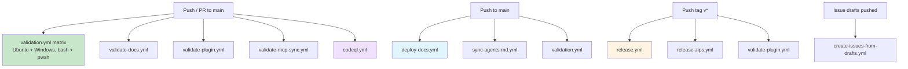
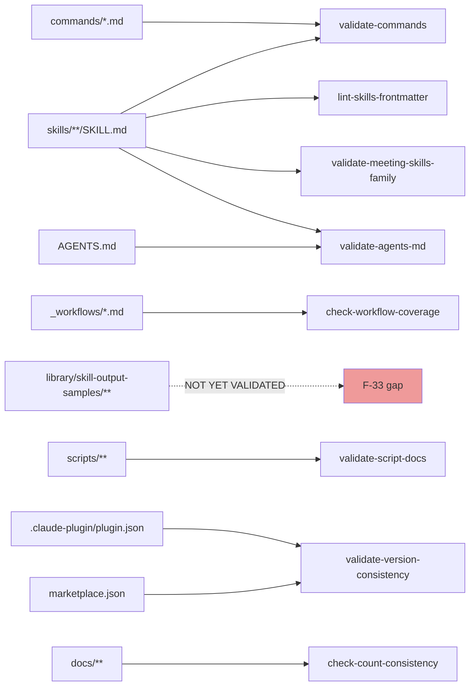
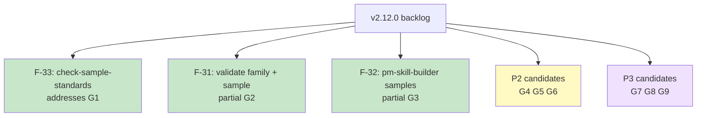

# CI Audit. Post-v2.11.0 (2026-04-18)

**Date**: 2026-04-18 (same day as v2.11.0 tag)
**Scope**: Complete inventory and coverage analysis of CI scripts, GitHub Actions workflows, enforcement posture, and gaps
**Trigger**: Post-release audit at user request following v2.11.0 tag
**Author**: Claude Opus 4.7

Complements (not duplicates) `docs/internal/release-plans/v2.11.0/plan_v2.11_ci-coverage-analysis.md` which focused on utility-skill currency and family-aware validation gaps. This audit takes a broader view across all CI and identifies gaps beyond those documented in v2.11.0 planning.

---

## Executive summary

pm-skills currently ships **17 validator/check scripts** (each with `.sh` + `.ps1` + `.md` triplet) and **10 GitHub Actions workflows**. The main validation workflow (`validation.yml`) invokes 15 of the 17 scripts (the other 2. `build-release` and `sync-claude`. are tooling rather than validators). Enforcement posture is **roughly 1/3 enforcing, 2/3 advisory**.

**Overall health**: strong. Clear enforcement/advisory tiering. Clean separation of validation (PR/push time), build (tag time), deployment (push to main), and automation (sync, issues). Gaps exist but none are release-blocking.

**Top 3 gaps** (detail below):

1. **No sample-standards enforcement**. `library/skill-output-samples/*/sample_*.md` files aren't validated against SAMPLE_CREATION.md conventions. F-33 (v2.12.0) addresses.
2. **No family-registration validation**. `validate-meeting-skills-family.sh` hardcodes the 5 meeting skills by name; can't detect missing family-contract-reference on a new family skill. Partially addressed by F-31 (v2.12.0).
3. **No utility-skill content-currency check**. utility skills like `pm-skill-builder` embed example skill counts ("27 skills" in v1.0.0) that silently drift. `check-count-consistency` flags advisory; no enforcing mechanism. F-32 (v2.12.0) addresses by generating fresh content.

---

## Inventory

### CI scripts (17 in `scripts/`)

All scripts ship as a triplet: `.sh` (bash, Linux/macOS) + `.ps1` (PowerShell, Windows) + `.md` (documentation).

| Script | Purpose | Enforcement | Invoked in |
|--------|---------|-------------|-----------|
| `validate-commands` | Every slash command maps to a valid skill | **Enforcing** | validation.yml |
| `validate-agents-md` | AGENTS.md lists match skills/ directory | **Enforcing** | validation.yml |
| `lint-skills-frontmatter` | Skill YAML frontmatter conforms to convention | **Enforcing** | validation.yml |
| `validate-meeting-skills-family` | Meeting Skills Family Contract conformance (v2.11.0 new) | **Enforcing** | validation.yml |
| `validate-version-consistency` | `plugin.json` version == `marketplace.json` version | **Enforcing** | validation.yml |
| `check-mcp-impact` | Advisory detection of PR changes that affect MCP | Advisory | validation.yml (`continue-on-error: true`) |
| `check-context-currency` | AGENTS/claude/CONTEXT.md freshness | Advisory | validation.yml |
| `validate-skill-history` | HISTORY.md conforms to governance when present | Advisory | validation.yml |
| `validate-skills-manifest` | skills-manifest.yaml conforms to schema | Advisory | validation.yml |
| `check-stale-bundle-refs` | Prevents regression of old "bundles" terminology (renamed to workflows in v2.9.0) | Advisory | validation.yml |
| `validate-gitignore-pm-skills` | `_pm-skills/` in .gitignore | Advisory | validation.yml |
| `validate-script-docs` | Every `.sh` / `.ps1` has matching `.md` | Advisory | validation.yml |
| `check-workflow-coverage` | Every new workflow doc has a slash command | Advisory | validation.yml |
| `check-count-consistency` | Documented skill/command/workflow counts match filesystem | Advisory | validation.yml |
| `check-generated-freshness` | Auto-generated files regenerated when source changed | Advisory | validation.yml |
| `build-release` | Builds release zip artifact (tag-time tool, not validator) | N/A | release.yml |
| `sync-claude` | Regenerates `.claude/` workspace from flat source (dev tool) | N/A | Manual |

### GitHub Actions workflows (10 in `.github/workflows/`)

| Workflow | Triggers | Purpose | Status |
|----------|----------|---------|--------|
| `validation.yml` | Push/PR to main | Main validator matrix (bash + pwsh on Ubuntu + Windows) | Primary |
| `validate-docs.yml` | Push/PR to main (doc paths) | MkDocs build validation; catches broken docs site before deploy | Focused |
| `validate-plugin.yml` | Push/PR/tag (plugin paths) | Claude plugin manifest and packaging validation | Focused |
| `validate-mcp-sync.yml` | Push/PR/manual (skill/command paths) | Checks pm-skills-mcp is in sync with pm-skills | Frozen (M-22 decoupled) |
| `deploy-docs.yml` | Push to main (doc paths) | Deploys MkDocs Material site to GitHub Pages | Deployment |
| `sync-agents-md.yml` | Push to main (skill/workflow/command paths) | Auto-generates AGENTS.md from source files | Automation |
| `release.yml` | Push tag `v*` | Builds release artifact | Tag-triggered |
| `release-zips.yml` | Push tag `v*` | Builds release zip | Tag-triggered |
| `create-issues-from-drafts.yml` | Issue-draft push | Creates issues from draft files | Automation |
| `codeql.yml` | Push/PR scheduled | CodeQL security scanning | Security |

### Dependency graph

---

## Enforcement posture analysis

### Enforcing (5 scripts, blocks merges)

These fail CI and block the merge when violated:

1. `validate-commands`. critical: broken commands mean users invoke skills that don't exist
2. `validate-agents-md`. critical: AGENTS.md is how many agents discover skills
3. `lint-skills-frontmatter`. critical: malformed frontmatter breaks loading
4. `validate-meeting-skills-family`. critical: family contract conformance (v2.11.0 new)
5. `validate-version-consistency`. critical: plugin + marketplace version drift breaks packaging

**Assessment**: appropriately scoped. These are the bare-minimum correctness gates.

### Advisory (10 scripts, warn but don't block)

These log findings but allow merges:

1. `check-mcp-impact`. informational for MCP maintainers (MCP frozen per M-22)
2. `check-context-currency`. AGENTS/claude/CONTEXT.md ages; refresh at release time
3. `validate-skill-history`. HISTORY.md conformance when present (most skills at v1.0.0 have none)
4. `validate-skills-manifest`. release-specific manifest schema
5. `check-stale-bundle-refs`. terminology-regression prevention (important during v2.9.0 rename era; less critical now)
6. `validate-gitignore-pm-skills`. dev-workflow ergonomics
7. `validate-script-docs`. `.md` companion file coverage
8. `check-workflow-coverage`. new workflow should have slash command
9. `check-count-consistency`. documented counts vs. filesystem
10. `check-generated-freshness`. auto-generated file staleness

**Assessment**: mix of "truly advisory" (e.g., check-context-currency is useful info) and "should probably be enforcing" (e.g., `check-count-consistency` would have caught the 109/120 drift discovered in v2.11.0 Round 2 review).

### Enforcement gap candidates

Scripts that should consider promotion from advisory to enforcing:

| Script | Current | Recommended | Rationale |
|--------|---------|-------------|-----------|
| `check-count-consistency` | Advisory | Advisory+enforcing for current-state docs only; advisory for historical release-note blocks | Historical release blocks legitimately reference past counts; current-state docs should not drift |
| `validate-script-docs` | Advisory | Enforcing | Low cost to keep `.md` companions; matches existing `.sh + .ps1 + .md` convention |
| `check-workflow-coverage` | Advisory | Enforcing | Same as above. low cost, high discoverability value |

Not promoting any of these in v2.11.0 because each is a separate consideration; tracked for v2.12.0 hardening pass.

---

## Coverage analysis by concern

### Skill-level concerns (well covered)

| Concern | Script(s) | Coverage |
|---------|-----------|----------|
| Frontmatter correctness | `lint-skills-frontmatter` | All skills |
| Command ↔ skill mapping | `validate-commands` | All slash commands |
| Discoverability via AGENTS.md | `validate-agents-md` | All skills |
| Version governance (HISTORY.md) | `validate-skill-history` | Skills at v1.1.0+ only |
| Release manifest | `validate-skills-manifest` | Per-release artifact |

### Family-level concerns (partial coverage, v2.11.0 first family)

| Concern | Script(s) | Coverage |
|---------|-----------|----------|
| Meeting Skills Family contract | `validate-meeting-skills-family` | Meeting family only (hardcoded by name) |
| Future skill families | **None** | **GAP**. would need a generic `validate-skill-family-registration` script |

### Sample-level concerns (large gap)

| Concern | Script(s) | Coverage |
|---------|-----------|----------|
| Sample filename convention | Partial via `validate-meeting-skills-family` (meeting samples only) | Meeting family only |
| Sample section structure (Scenario/Prompt/Output) | **None** | **GAP**. SAMPLE_CREATION.md not enforced |
| Sample frontmatter (8 fields) | **None** | **GAP** |
| Fictional-marker discipline | **None** | **GAP**. requires content-level inspection |

**F-33 (v2.12.0)** addresses this gap with `check-sample-standards.sh`.

### Release-level concerns (well covered)

| Concern | Script(s) | Coverage |
|---------|-----------|----------|
| Version consistency across manifests | `validate-version-consistency` | Enforcing |
| Plugin packaging | `validate-plugin.yml` workflow | Tag and PR |
| MCP sync | `validate-mcp-sync.yml` (frozen per M-22) | N/A currently |
| Release artifact build | `release.yml` + `release-zips.yml` | Tag-triggered |

### Documentation concerns (mixed coverage)

| Concern | Script(s) | Coverage |
|---------|-----------|----------|
| MkDocs site builds | `validate-docs.yml` workflow | Full |
| Count consistency in docs | `check-count-consistency` | Advisory |
| CONTEXT.md freshness | `check-context-currency` | Advisory |
| Script docs completeness | `validate-script-docs` | Advisory |
| Workflow-doc coverage | `check-workflow-coverage` | Advisory |

### Content-currency concerns (significant gap)

| Concern | Script(s) | Coverage |
|---------|-----------|----------|
| Utility-skill embedded-count drift (e.g., pm-skill-builder "27 skills") | `check-count-consistency` flags advisory | **Partial**. flags drift, doesn't force refresh |
| Historical release-note references | Intentionally allowed | N/A (design intent) |
| Worked-example content drift vs. current state | **None** | **GAP** |

**F-32 (v2.12.0)** indirectly addresses by regenerating samples; a dedicated `check-utility-skill-currency` script would make currency verifiable.

---

## Workflow analysis

### validation.yml. the main matrix

**Strengths**:
- Cross-platform matrix (Ubuntu + Windows) ensures `.sh` and `.ps1` parity
- `fail-fast: false` lets all checks run even when one fails
- Clear enforcing/advisory distinction via `continue-on-error`
- All 15 validator scripts represented

**Observations**:
- No matrix for `macos-latest`. probably fine since pm-skills is mostly text-content, but worth adding if sample-generation (F-32) introduces platform-specific code
- Runs on every push to main AND every PR to main. duplicate runs when PR merges, but acceptable cost for confidence

### validate-docs.yml. scoped to docs

**Strengths**:
- Path-filtered triggers (only runs on doc changes). keeps CI fast
- Validates MkDocs build before deploy
- Separate from `validation.yml`. good separation of concerns

**Observations**:
- No link-check step visible; broken internal links would deploy
- Could integrate with `mkdocs-strict` flag for stronger validation

### validate-plugin.yml. plugin packaging

**Strengths**:
- Triggers on tag pushes AND PRs. catches issues pre-merge AND pre-release
- Tests the actual plugin manifest

**Observations**:
- Good coverage; no obvious gaps

### validate-mcp-sync.yml. currently frozen

**Status**: per M-22 (v2.11.0 decision), pm-skills-mcp is frozen and no longer gates releases. This workflow still runs and reports sync status but shouldn't block.

**Observations**:
- Workflow-dispatch input `mode: observe|block` allows runtime toggling
- Worth confirming this is set to `observe` post-v2.11.0

### deploy-docs.yml

**Strengths**:
- Deploys on main push (doc-path filtered)
- Separate deploy action, not inline mkdocs

**Observations**:
- No post-deploy smoke test (does the deployed site render?)
- No rollback mechanism on failure

### release.yml + release-zips.yml

**Strengths**:
- Trigger on tag push; idiomatic
- Separate workflow for zip artifacts vs. primary release

**Observations**:
- Neither creates a GitHub Release automatically; has to be done manually via `gh release create` or web UI
- Worth considering auto-release creation from the release notes file

### sync-agents-md.yml

**Strengths**:
- Auto-sync AGENTS.md from source. matches existing pattern

**Observations**:
- Makes the enforcing `validate-agents-md` check usually pass by construction; the check is still useful for manual drift detection

### codeql.yml. security

**Standard GitHub security scanning**; no pm-skills-specific concerns.

### create-issues-from-drafts.yml

**Strengths**:
- Automates the ISSUE_DRAFTS.md → GitHub issues flow

**Observations**:
- Not directly CI; process automation

---

## Gaps identified

### P1 (recommend addressing in v2.12.0)

**G1: Sample-standards enforcement** (already tracked as F-33)

No script validates `library/skill-output-samples/*/sample_*.md` against SAMPLE_CREATION.md conventions. Would catch:
- Wrong filename thread slot (storevine/brainshelf/workbench/orbit/legacy only)
- Missing required sections (`## Scenario`, `## Prompt`, `## Output`)
- Missing 8-field top-level frontmatter
- Unresolved placeholders (`TBD`, `TODO`, `<placeholder>`)
- Fictional-marker discipline (advisory. rule-based regex)

**Evidence from v2.11.0**: initial 10 meeting samples violated SAMPLE_CREATION.md silently; caught only by manual pre-release review.

**G2: Generic family-registration validator** (partially addressed by F-31)

Current `validate-meeting-skills-family.sh` hardcodes the 5 meeting skills by name in `FAMILY_SKILLS` array. A new skill family (e.g., Research Family) would need a new script per family, not generalize existing logic. A `validate-skill-family-registration` script that:
- Detects family membership via `metadata.frameworks` frontmatter marker
- Loads the family's contract path from convention
- Runs the family's validator

...would scale better than per-family script proliferation.

**F-31 (v2.12.0)** partially addresses via `utility-pm-skill-validate` family-awareness.

**G3: Utility-skill content-currency enforcement** (partially addressed by F-32)

Utility skills like `pm-skill-builder` embed example skill counts and specific skill names in SKILL.md and EXAMPLE.md. These go stale silently. `check-count-consistency` flags advisory but doesn't force a refresh mechanism.

**F-32 (v2.12.0)** addresses by making the builder regenerate its own samples; a dedicated `check-utility-skill-currency` would extend to SKILL.md + EXAMPLE.md content-level references.

### P2 (consider for v2.12.0–v2.13.0)

**G4: Link checking in docs**

`validate-docs.yml` builds MkDocs but doesn't run a link checker. Internal dead links can deploy silently. Consider integrating `mkdocs-linkcheck` plugin or a post-build step.

**G5: GitHub Release auto-creation on tag**

`release.yml` builds artifacts but doesn't create a GitHub Release. Requires manual `gh release create v2.X.Y --notes-file docs/releases/Release_v2.X.Y.md` after tag push. Consider automating.

**G6: Contract-validator version sync**

`validate-meeting-skills-family.sh` doesn't verify its own expectations match the contract's declared version. If contract bumps to v1.2.0 and validator isn't updated, validator silently passes state that contract considers invalid.

Low priority because only two artifacts exist; easy to keep in sync manually. Gets trickier with multiple families.

### P3 (nice-to-have; not urgent)

**G7: macOS matrix leg**

Currently Ubuntu + Windows. Add `macos-latest` if sample-generation or other platform-specific code enters the repo.

**G8: Post-deploy docs smoke test**

`deploy-docs.yml` doesn't verify the deployed site renders. Broken MkDocs Material themes could ship. Low frequency, but a post-deploy check would catch it.

**G9: Promoted-to-enforcing candidates**

From the Enforcement Gap Candidates table above:
- `validate-script-docs` (advisory → enforcing)
- `check-workflow-coverage` (advisory → enforcing)
- `check-count-consistency` (split: enforcing for current-state paths; advisory for historical release-note sections)

---

## Recommendations prioritized

### For v2.12.0 (already in backlog)

- **F-33**. `check-sample-standards.sh` + `.ps1` + `.md`. closes G1. Advisory-first (2 weeks) then enforcing.
- **F-31**. pm-skill-validate gains family + sample awareness. partially closes G2.
- **F-32**. pm-skill-builder generates samples. partially closes G3.

### For v2.12.0 (new tracking. not yet in backlog)

- **New candidate effort F-36**. generic skill-family-registration validator (completes G2 beyond what F-31 does internally). Small effort, ~2-3 days. Create as effort brief if v2.12.0 scope allows.

### For v2.12.0 or later (nice-to-haves)

- **G4** link checking. add `mkdocs-linkcheck` to `validate-docs.yml`
- **G5** auto-release creation. modify `release.yml` to call `gh release create` with release notes file
- **G9** enforcement promotions. one-by-one, with 2-week advisory-observation periods

---

## Security and compliance

### Present

- `codeql.yml`. GitHub's CodeQL security scanning (standard)
- No secrets in repo (verified via file types; no `.env` or credential files)
- Plugin description does not reveal internal repo structure

### Absent (but probably not needed for this repo)

- No SAST tools beyond CodeQL. appropriate for a docs-heavy repo
- No dependency scanning (Dependabot or equivalent). worth enabling if Python requirements in `requirements-docs.txt` are used, but low priority
- No signed commits enforcement. worth considering for release commits specifically

---

## Process observations

### What v2.11.0 proved about the CI

1. **Mechanical validators catch structural issues reliably**. All 5 enforcing validators caught what they were designed to catch throughout the release cycle.
2. **Adversarial review catches cross-reference issues that validators can't**. Round 2 Codex review surfaced 6 IMPORTANT findings that all validators had passed on. all were within-document self-contradictions or semantic inconsistencies.
3. **Passive-voice checklist items don't execute**. The sample-count check in the v2.11.0 pre-release checklist was passive and silently missed the 109→120 drift; concrete-command enforcement now in the checklist.
4. **Advisory-only checks accumulate drift**. `check-count-consistency` has flagged historical references for a long time; some are intentional-historical (OK), but enforcement for current-state references would prevent the drift from accumulating.

### Process improvement implemented in v2.11.0

- **Phase 0 Adversarial Review Loop** added to pre-release checklist. run Codex review after each resolution pass until findings stabilize below IMPORTANT severity
- **Concrete sample-count command** required in Phase 2c. prevents passive-voice check from silently passing

---

## Audit conclusions

**Overall CI health: good**. The main validators are appropriately enforcing; advisory checks provide visibility without blocking legitimate historical references.

**Three real gaps** (G1, G2, G3). all already tracked in v2.11.0 / v2.12.0 planning:
- G1 closed by F-33
- G2 partially closed by F-31, fully closed if F-36 is added
- G3 partially closed by F-32

**Six nice-to-have improvements** (G4–G9). none are release-blocking; candidates for v2.12.0–v2.13.0 hardening passes.

**Next audit recommended**: post-v2.12.0 tag, to evaluate whether F-31/F-32/F-33/F-36 adequately close G1/G2/G3 and whether any new gaps surface from the sample-automation changes.

---

## Appendix: audit methodology

1. Listed all scripts in `scripts/` via directory inventory
2. Read `.github/workflows/*.yml` to map script → workflow usage
3. Parsed `validation.yml` for enforcement posture (`continue-on-error` presence)
4. Cross-referenced against v2.11.0 CI coverage analysis (`plan_v2.11_ci-coverage-analysis.md`) for recently-identified gaps
5. Examined each non-`validation.yml` workflow for scope and trigger configuration
6. Mapped concerns (skill / family / sample / release / docs / content-currency) to script coverage
7. Identified gaps and prioritized by severity and existing backlog alignment

No scripts were executed as part of this audit. it is a static review of configuration and scripts as they exist at v2.11.0 tag.

---

## Change log for this audit

| Date | Change |
|------|--------|
| 2026-04-18 | Initial CI audit authored at post-v2.11.0 time. Static review of scripts/ and .github/workflows/. Gaps G1–G9 identified; G1–G3 already in v2.12.0 backlog via F-31/F-32/F-33. |
