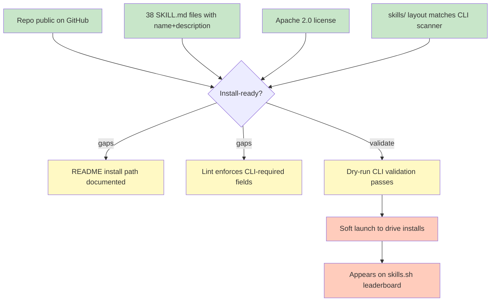

# Submitting pm-skills to skills.sh. Execution Plan

**Purpose**: Capture everything required to get the pm-skills repo indexed on [skills.sh](https://skills.sh), ranked on the leaderboard, and consistently discoverable via the `npx skills` CLI. Used as a single source of truth for the submission effort and as a template for future open-source distribution channels.

**Audience**: Maintainer (JP) plus any agent/collaborator continuing the work.

**Out of scope for this plan**:
- Submitting pm-skills-mcp (MCP server is a different distribution channel).
- Submitting individual skills to third-party marketplaces (Anthropic, Cursor, Copilot storefronts if/when they exist).
- Paid/promoted placement on skills.sh.

---

## TL;DR

skills.sh is a passive directory. There is no submission form. It indexes repos that users install via the Vercel-authored `npx skills` CLI and ranks them by anonymous install telemetry.

To "submit" pm-skills means three things:

1. Make the repo installable by `npx skills add product-on-purpose/pm-skills` without errors.
2. Make the repo's first-impression surface (README, tags, GitHub metadata) compelling enough for PMs to install it.
3. Drive enough installs that pm-skills crosses the leaderboard visibility threshold (roughly 1K+ weekly installs based on current leaders).

Item 1 is mostly done. Items 2 and 3 are where the real work is.

---

## State overview



Legend: green = verified in repo today, yellow = gap to close, orange = launch/growth work.

---

## How skills.sh actually works (load-bearing context)

Write this down because the CLI is the entire contract. Everything else is downstream.

- **Canonical CLI**: [`vercel-labs/skills`](https://github.com/vercel-labs/skills), invoked as `npx skills`.
- **Install command**: `npx skills add <owner>/<repo>`. The CLI clones the repo, scans for SKILL.md files, and drops them into the calling agent's skills directory (Claude Code, Cursor, Copilot, Cline, etc.).
- **Discovery paths** the scanner checks, in order:
  1. Root directory (if it contains `SKILL.md`).
  2. `skills/`, `skills/.curated/`, `skills/.experimental/`, `skills/.system/`.
  3. Agent-specific: `.agents/skills/`, `.claude/skills/`, `.cursor/skills/`, etc.
  4. `.claude-plugin/marketplace.json` or `.claude-plugin/plugin.json` (plugin path).
  5. Recursive fallback if nothing found above.
- **SKILL.md contract**:
  - Required: `name` (lowercase, hyphens allowed), `description`.
  - Optional: `metadata.internal: true` hides the skill from discovery unless `INSTALL_INTERNAL_SKILLS=1` is set.
  - All other frontmatter fields are passed through untouched.
- **Indexing / ranking**: skills.sh ranks by weekly installs from CLI telemetry. Disabled by `DISABLE_TELEMETRY`, `DO_NOT_TRACK`, or any CI environment. No installs => no leaderboard appearance.
- **Skill-detail page fields surfaced**: skill name, description, install count, owner/repo, GitHub stars, first-seen date, security-audit badges, per-agent install counts.

**Implication**: every structural piece we add (marketplace.json, tags, richer metadata) is discretionary polish. The only hard gates are "repo public + valid SKILL.md + CLI install succeeds."

---

## Current state audit (2026-04-22)

| Requirement | Status | Evidence |
|-------------|--------|----------|
| Public GitHub repo at `<owner>/pm-skills` | Done | `github.com/product-on-purpose/pm-skills` |
| Apache 2.0 license file | Done | `LICENSE` in repo root |
| Skills under `skills/` path | Done | 38 skills at `skills/{phase-skill}/SKILL.md` |
| SKILL.md has `name` (lowercase-hyphen) | Done (sample verified) | `skills/deliver-prd/SKILL.md:2` |
| SKILL.md has `description` | Done (sample verified) | `skills/deliver-prd/SKILL.md:3` |
| Lint catches missing `name`/`description` | Partial | `scripts/lint-skills-frontmatter.sh` exists but CLI-required vs repo-required fields not separated |
| README install command prominent | Gap | README has project context but no `npx skills add` one-liner above the fold |
| `.claude-plugin/marketplace.json` | Not present | Optional. Would enable plugin-marketplace path alongside CLI scan |
| Telemetry-ready repo signature | Done | No custom CLI intercepts, standard folder layout |
| Dry-run CLI install verified | Not yet | Needs `npx skills add` against the live repo to confirm all 38 skills discovered |

**Reading**: the repo is install-ready today. Gaps are distribution hygiene, not blockers.

---

## Execution plan

Phased so each phase is a standalone commit-and-ship unit. Any phase can be skipped if judged low-value at review time.

### Phase 0. Confirm prerequisites (timebox: 15 min)

- [ ] Confirm canonical GitHub coordinates for the install shorthand. Current best guess: `product-on-purpose/pm-skills`. Verify by visiting the repo URL and confirming it is public.
- [ ] Confirm LICENSE file is present in repo root and readable as `Apache-2.0` by GitHub's auto-detection.
- [ ] Confirm `README.md` in repo root (not `/docs`) because skills.sh and GitHub surface the root README.
- [ ] Note the canonical install command for later use: `npx skills add product-on-purpose/pm-skills`.

**Exit criteria**: we have the exact install string and know the repo metadata is clean.

### Phase 1. Structural validation pass (timebox: 60 min)

Goal: prove every SKILL.md meets CLI minimum and that lint enforces it going forward.

- [ ] Run current `scripts/lint-skills-frontmatter.sh` (or `.ps1`) against all 38 skills. Capture output.
- [ ] Add or extend the lint script to fail if **any** SKILL.md is missing `name` or `description`, or if `name` violates `^[a-z][a-z0-9-]*$`. This is the CLI contract, not just our repo contract.
- [ ] Smoke-test all 38 skills by grepping for required fields:
  ```bash
  for f in skills/*/SKILL.md; do
    grep -q "^name:" "$f" || echo "MISSING name: $f"
    grep -q "^description:" "$f" || echo "MISSING description: $f"
  done
  ```
- [ ] Spot-check 3 `description` strings against the agentskills.io trigger-clarity guidance. Each should read as a capability statement the agent would match on.
- [ ] Commit lint change as `chore(ci): enforce skills.sh CLI-required frontmatter fields`.

**Exit criteria**: lint fails loudly on missing `name`/`description`; all 38 skills pass.

### Phase 2. README install surface (timebox: 45 min)

Goal: when a PM lands on the GitHub repo from skills.sh, the install path is unmissable in the first screen.

- [ ] Add an "Install" section as the first substantive section after the hero/summary:
  ```markdown
  ## Install

  Install the full bundle of 38 PM skills into your agent of choice:

  \`\`\`bash
  npx skills add product-on-purpose/pm-skills
  \`\`\`

  Works with Claude Code, Cursor, GitHub Copilot, Cline, and any agent
  supported by the [`skills` CLI](https://github.com/vercel-labs/skills).
  ```
- [ ] Add a shield/badge row for: Apache-2.0 license, install-command copy-paste, skills.sh listing (add link once live).
- [ ] Confirm the 38-skill inventory is scannable. Link to `AGENTS.md` or a dedicated `SKILLS.md` if the README gets too long.
- [ ] Add a "Compatibility" subsection calling out the agentskills.io spec compliance and Triple Diamond framing. This differentiates pm-skills from vendor/general bundles on the leaderboard.
- [ ] Commit as `docs(readme): add skills.sh install path and compatibility shields`.

**Exit criteria**: README opens with install command inside the first 500 lines. GitHub preview card renders with description + badges.

### Phase 3. Dry-run validation against live CLI (timebox: 30 min)

Goal: prove the CLI actually discovers all 38 skills before we announce anything.

- [ ] Run the CLI against the public repo in a scratch directory:
  ```bash
  mkdir -p /tmp/pm-skills-dryrun && cd /tmp/pm-skills-dryrun
  npx skills add product-on-purpose/pm-skills --dry-run 2>&1 | tee dryrun.log
  ```
  (If `--dry-run` is not supported, run without it and inspect what lands in `.claude/skills/` or equivalent.)
- [ ] Confirm count matches: the CLI should report 38 skills discovered and installed.
- [ ] Confirm none are silently skipped (check for "skipped" / "invalid" lines in the log).
- [ ] If any skills are dropped, reverse-engineer why, patch, and re-run until all 38 land.
- [ ] Archive the dry-run log in `_NOTES/` (gitignored) for troubleshooting reference.

**Exit criteria**: clean 38-skill install from a fresh environment.

### Phase 4. Optional: plugin-marketplace manifest (timebox: 2 hours, defer if unclear ROI)

Goal: unlock the Claude Code plugin-marketplace path as a second distribution surface. Does not affect skills.sh ranking directly but improves Claude Code's native plugin browser experience.

- [ ] Draft `.claude-plugin/marketplace.json` declaring pm-skills as a plugin with the 38 skills listed.
- [ ] Decide whether to expose commands (`commands/`) and workflows (`_workflows/`) through the same manifest or keep them CLI-only.
- [ ] Validate manifest against Claude Code's plugin schema (run `plugin-validator` agent if available, or consult [Claude Code plugin docs](https://docs.claude.com/claude-code/plugins)).
- [ ] Verify: `npx skills add product-on-purpose/pm-skills` behavior is unchanged (marketplace manifest should not regress the scan path).
- [ ] Commit as `feat(distribution): add .claude-plugin/marketplace.json for plugin discovery`.

**Decision point before starting Phase 4**: has any installer actually asked for this? If no, defer until a concrete ask surfaces.

### Phase 5. Soft launch for install telemetry (timebox: ongoing, 2 weeks)

Goal: seed enough weekly installs that pm-skills crosses the skills.sh visibility threshold. Current leaderboard top entries are in the 1K–1M install range; realistic first-milestone target is 100 installs in week 1.

- [ ] Publish a LinkedIn post from JP's account with the install one-liner, the 38-skill pitch, and a screenshot of one skill in action.
- [ ] Submit to `r/ProductManagement` and `r/ChatGPT` (light touch, non-promotional tone).
- [ ] Mention in Lenny's Newsletter community / Reforma community / relevant PM Slacks that permit open-source sharing.
- [ ] Write a short Medium / Substack post framing "I built 38 PM skills for AI agents" with the install command.
- [ ] Ask 5 PMs in the user's network for a friendly install + quick review (install counts as telemetry signal regardless).
- [ ] Monitor the repo's skills.sh detail page weekly: https://skills.sh/product-on-purpose/pm-skills (check URL format matches vercel-labs examples).

**Exit criteria**: >= 100 installs in week 1, appearance on skills.sh detail page with non-zero install count.

### Phase 6. Monitor, iterate, and close the loop (timebox: 1 hour / week for 4 weeks)

- [ ] Weekly: record install count, skills.sh rank if applicable, and any error reports from installers.
- [ ] Identify the top 3 skills by install-rate and the bottom 3. Hypothesis: brief, action-oriented descriptions beat verbose ones on the leaderboard.
- [ ] If install counts stall < 50/week, revisit descriptions for trigger clarity (run `utility-pm-skill-validate` against the lowest-performing skills).
- [ ] At 4 weeks, write a short retro in `docs/internal/distribution/2026-05-20_skills-sh-retro.md` with lessons learned and whether to invest further.

---

## Validation checklist (run before announcing)

Mechanical checks that must all pass before any external link-sharing:

- [ ] `scripts/lint-skills-frontmatter.sh` exits 0 with strict CLI-field enforcement.
- [ ] `scripts/validate-agents-md.sh` exits 0 (AGENTS.md still reflects reality).
- [ ] All 38 SKILL.md files have `name` matching `^[a-z][a-z0-9-]*$` and a non-empty `description`.
- [ ] README renders on GitHub with install command visible above the fold.
- [ ] Dry-run `npx skills add` succeeds and reports 38 skills.
- [ ] `LICENSE` file auto-detected as Apache 2.0 on GitHub.
- [ ] No PII or internal-only info in any tracked file that would ship via the CLI.
- [ ] skills.sh detail page resolves (may 404 until first install telemetry arrives; confirm post-launch).

---

## Risks and mitigations

| Risk | Likelihood | Impact | Mitigation |
|------|-----------|--------|------------|
| Zero installs => no leaderboard presence | High | Medium | Phase 5 soft-launch plan. Accept that visibility takes weeks. |
| CLI scanner skips some skills due to frontmatter quirk | Medium | High | Phase 3 dry-run before announcing. |
| skills.sh changes indexing rules without notice | Low | Medium | Subscribe to vercel-labs/skills releases; re-audit quarterly. |
| PM audience installs once and churns | Medium | Medium | Phase 6 retro to iterate on skill descriptions. |
| Install command includes wrong GitHub org/repo | Low | High | Phase 0 verifies exact shorthand before any public use. |
| Apache 2.0 auto-detection fails due to modified LICENSE | Low | Low | Verify with GitHub's license badge in Phase 0. |
| Telemetry disabled in target audience's environments | Medium | Low | Unavoidable. Focus on raw install counts, not conversion. |

---

## Open questions

Resolve these before Phase 5, or document the assumption we're proceeding under.

1. **Versioning surface**: does skills.sh surface repo tags, or only the default branch? If tags matter, we should ensure `main` reflects the latest shipped state between tag cuts. **Action**: inspect an existing leaderboard entry's detail page and check if it references a version string.
2. **Description source of truth**: does skills.sh pull the per-skill description from SKILL.md frontmatter or the root README? **Action**: confirm by checking a competitor's skills.sh page against their SKILL.md.
3. **Category / tag support**: we have `metadata.category` in our frontmatter. Is it rendered anywhere? **Action**: test post-launch.
4. **Withdraw path**: if we need to delist a skill, is deletion in Git sufficient, or does skills.sh cache stale entries? **Action**: document worst case as "archive the skill folder and ship a deprecation note."
5. **MCP relationship**: pm-skills-mcp packages a subset (28 of 38 skills). Do we mention MCP in the README, or keep skills.sh messaging CLI-only to avoid confusion? **Recommendation**: CLI-only in the Install section, MCP mentioned separately under "Other deployment options."

---

## Success metrics

Define what "submitted successfully" means so we can close this effort.

- **Primary**: pm-skills listed on skills.sh with at least one install attributed via CLI telemetry. Target: within 14 days of Phase 5 kickoff.
- **Secondary**: 100+ weekly installs sustained for 2 consecutive weeks. Target: within 30 days.
- **Aspirational**: leaderboard entry in the top 100 skill collections. Target: within 90 days. Achievable only if we seed a distribution channel (newsletter, community post) that reaches a PM audience of 5K+.

Non-goals: dethroning `find-skills` (1.2M installs, system-adjacent skill). pm-skills is a niche vertical, not a horizontal utility.

---

## Decisions log

Record binding calls made during this effort so future-us knows why things look the way they do.

- **2026-04-22**: Canonical install shorthand will be `product-on-purpose/pm-skills`. Alternate orgs not considered.
- **2026-04-22**: Phase 4 (plugin-marketplace manifest) is deferred until post-launch unless a concrete user asks for it. Rationale: skills.sh ranking is driven by CLI telemetry, not plugin manifests.
- **2026-04-22**: Soft-launch channel priority: LinkedIn > PM Slack communities > Medium/Substack > Reddit. Rationale: JP's PM network lives on LinkedIn; Reddit rewards repeat engagement we cannot sustain.

---

## References

- [skills.sh directory](https://skills.sh/)
- [vercel-labs/skills CLI on GitHub](https://github.com/vercel-labs/skills)
- [Vercel KB: Agent Skills creating, installing, and sharing](https://vercel.com/kb/guide/agent-skills-creating-installing-and-sharing-reusable-agent-context)
- [agentskills.io specification](https://agentskills.io/specification)
- [find-skills leaderboard entry (example rendering)](https://skills.sh/vercel-labs/skills/find-skills)
- Related internal: `docs/internal/backlog-canonical.md`, `AGENTS.md`, `scripts/lint-skills-frontmatter.sh`
