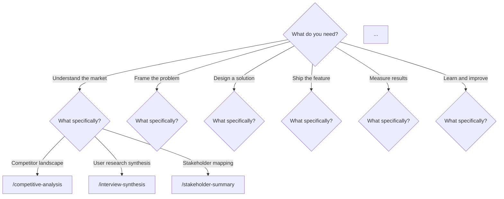
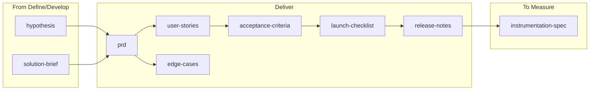

# MkDocs Site Enhancements . Plan and Execution

Status: Planned
Created: 2026-04-04
Owner: Maintainers

## Context

The MkDocs Material site launched with Phase 0-1.5 (foundation, content migration, skill page generation). The site builds, deploys, and has all 29 skill pages with full nav. This plan covers the next wave of enhancements to make the site more engaging, useful, and differentiated.

## Enhancement Summary

| # | Enhancement | Effort | Impact | New pages |
|---|-------------|--------|--------|-----------|
| E-01 | Custom landing page with grid cards | Low | High | Rewrite `docs/index.md` |
| E-02 | Tags plugin + skill tagging | Low | High | `docs/tags.md` + config |
| E-03 | Skill "quick try" snippets | Low | High | Modify generation script |
| E-04 | Interactive skill finder | Medium | High | `docs/guides/skill-finder.md` |
| E-05 | Social cards | Medium | High | Config only |
| E-06 | Recipes section | Medium | High | `docs/guides/recipes.md` |
| E-07 | Skill comparison pages | Medium | Medium | `docs/concepts/comparisons.md` |
| E-08 | Phase overview mermaid flows | Medium | Medium | Modify generation script |
| E-09 | "Follow the Product" showcase | High | High | `docs/showcase/` (4 pages) |
| E-10 | Per-skill real-world samples | High | High | Modify generation script |
| E-11 | Prompt gallery | Medium | Medium | `docs/guides/prompt-gallery.md` |

---

## E-01: Custom Landing Page with Grid Cards

### What
Replace the current stub `docs/index.md` with a polished Material-style landing page using grid cards showing the 6 Triple Diamond phases as a visual gateway to skills.

### Design

```markdown
# PM Skills

Hero text + badge row

## The Skills

Grid of 6+2 cards (Discover, Define, Develop, Deliver, Measure, Iterate, Foundation, Utility)
Each card: phase icon, skill count, one-line focus description, link to phase index

## The Lifecycle

Mermaid diagram (already exists in current index.md)

## Quick Start

3 code blocks: clone, use a skill, chain skills

## Built For Every Platform

Compatibility table (from README)
```

### Files
- Modify: `docs/index.md`

### Implementation
Use Material's [grid cards](https://squidfunk.github.io/mkdocs-material/reference/grids/) with `attr_list` and `md_in_html` extensions (already enabled).

```markdown
<div class="grid cards" markdown>

- :material-magnify: **Discover** . 3 skills
  ---
  Research, competitive analysis, stakeholder mapping
  [:octicons-arrow-right-24: Browse](skills/discover/)

- :material-target: **Define** . 4 skills
  ---
  Problem framing, hypotheses, opportunity trees
  [:octicons-arrow-right-24: Browse](skills/define/)

...
</div>
```

### Effort: ~30 min

---

## E-02: Tags Plugin + Skill Tagging

### What
Enable the built-in tags plugin so users can browse skills by category (research, specification, coordination, validation, reflection, ideation, problem-framing) in addition to phase.

### Design
- Tags page at `docs/tags.md` shows all tags with linked pages
- Each generated skill page already has `tags:` in frontmatter (phase + category)
- Tags appear as clickable badges on each skill page

### Files
- Modify: `mkdocs.yml` (enable tags plugin, add `tags_file: tags.md`)
- Create: `docs/tags.md` (minimal . just needs frontmatter, plugin auto-populates)
- Already done: generation script adds tags to frontmatter

### mkdocs.yml change
```yaml
plugins:
  - tags:
      tags_file: tags.md
```

### docs/tags.md
```markdown
---
title: Tags
---

# Tags
```
(The plugin fills in the rest automatically.)

### Effort: ~10 min

---

## E-03: Skill "Quick Try" Snippets

### What
Add a copy-pasteable slash command example at the very top of every skill page, above the fold. One tap to copy, paste into Claude Code.

### Design
After the Quick Facts admonition, add:

```markdown
## Try it now

```
/prd "Search feature for e-commerce platform"
```
```

### Files
- Modify: `scripts/generate-skill-pages.py` (add the snippet after quick facts, derive a realistic prompt per skill)

### Implementation
The script already knows the command name. Add a mapping of skill → example prompt, or generate a generic one from the description:

```python
# After quick facts admonition
lines.append("## Try it now")
lines.append("")
lines.append("```")
lines.append(f'/{cmd} "Your context here"')
lines.append("```")
```

For a more engaging version, hardcode realistic prompts for each skill (or derive from the sample library scenarios).

### Effort: ~20 min (generic) or ~1 hour (realistic per-skill prompts from sample library)

---

## E-04: Interactive Skill Finder

### What
A decision tree page: "What PM artifact do you need?" → branches by activity → recommends a skill.

### Design

```markdown
# Skill Finder

Answer a few questions to find the right skill for your task.



## By artifact type

| I need a... | Use | Phase |
|------------|-----|-------|
| PRD | `/prd` | Deliver |
| User stories | `/user-stories` | Deliver |
| Hypothesis | `/hypothesis` | Define |
| ...
```

### Files
- Create: `docs/guides/skill-finder.md`
- Modify: `mkdocs.yml` nav (add to Guides)

### Effort: ~45 min

---

## E-05: Social Cards

### What
Enable the social plugin so every page generates an OpenGraph preview card. When someone shares a link on Slack/LinkedIn/Twitter, it shows the skill name, description, and PM Skills branding.

### Design
No page changes needed . the plugin generates cards from page titles and descriptions automatically.

### Files
- Modify: `mkdocs.yml` (enable social plugin)
- Modify: `.github/workflows/deploy-docs.yml` (add cairo system deps)
- Modify: `requirements-docs.txt` (already has pillow + cairosvg)

### mkdocs.yml change
```yaml
plugins:
  - social:
      enabled: !ENV [CI, false]
```

### Workflow change
Add before the pip install step:
```yaml
- name: Install system dependencies (for social cards)
  run: sudo apt-get install -y libcairo2-dev libfreetype6-dev libffi-dev libjpeg-dev libpng-dev libz-dev
```

### Effort: ~15 min

---

## E-06: Recipes Section

### What
Short, concrete end-to-end workflows for common PM tasks. More specific than workflows, more practical than the lifecycle guide.

### Design

```markdown
# Recipes

## Pitch a feature
1. `/problem-statement` . frame why this matters
2. `/hypothesis` . define what you'll test
3. `/solution-brief` . one-page overview
4. `/prd` . full requirements

## Run an experiment
1. `/hypothesis` . state the assumption
2. `/experiment-design` . design the test
3. `/instrumentation-spec` . define tracking
4. `/experiment-results` . analyze outcomes
5. `/pivot-decision` . ship, iterate, or kill

## Launch a feature
1. `/acceptance-criteria` . define "done"
2. `/edge-cases` . identify failure modes
3. `/launch-checklist` . pre-launch readiness
4. `/release-notes` . communicate to users

## Start from scratch (full lifecycle)
Use the `/workflow-feature-kickoff` workflow, then extend with Measure and Iterate skills.
```

### Files
- Create: `docs/guides/recipes.md`
- Modify: `mkdocs.yml` nav

### Effort: ~30 min

---

## E-07: Skill Comparison Pages

### What
Side-by-side comparisons for commonly confused skill pairs.

### Design

```markdown
# Skill Comparisons

## PRD vs Solution Brief

| | PRD | Solution Brief |
|---|---|---|
| **When** | After solution alignment, before engineering | During ideation, before committing |
| **Audience** | Engineering, QA, stakeholders | Leadership, team alignment |
| **Depth** | Comprehensive . requirements, scope, timeline | Overview . problem, approach, metrics |
| **Length** | 3-8 pages | 1 page |
| **Use when** | Ready to build | Exploring options |

## Hypothesis vs Problem Statement

## Competitive Analysis vs Stakeholder Summary

## Edge Cases vs Acceptance Criteria
```

### Files
- Create: `docs/concepts/comparisons.md`
- Modify: `mkdocs.yml` nav

### Effort: ~45 min

---

## E-08: Phase Overview Mermaid Flows

### What
Replace the plain table on each phase index page with a mermaid flow showing how skills in that phase connect to each other and to adjacent phases.

### Design
Example for Deliver phase:



### Files
- Modify: `scripts/generate-skill-pages.py` (add mermaid to phase index generation)
- Or: manually create phase flow diagrams (more control over accuracy)

### Implementation note
The connections between skills are not codified anywhere in the repo . they'd need to be manually defined. The workflow files have some of this information but not all phases are covered. Recommend manual mermaid diagrams for v1, with the option to derive them from workflows later.

### Effort: ~1.5 hours (8 phase diagrams)

---

## E-09: "Follow the Product" Interactive Journeys

### What
Three story pages where a reader follows one company's entire feature arc through all 6 phases. Each step shows the phase, skill, prompt, and full output. This is the showcase . it demonstrates pm-skills producing 25+ real artifacts for a single product.

### Design
Each journey page uses Material's content tabs and collapsible admonitions:

```markdown
# Storevine: Building Campaigns

> B2B ecommerce platform, Series A, ~70 employees.
> Follow the PM team building built-in email marketing . from merchant
> interviews through experiment results and a persevere decision.

## Phase 1: Discover

### Competitive Analysis

!!! quote "The prompt"
    ```
    /competitive-analysis
    looking at email marketing tools that ecommerce platforms compete with...
    ```

??? example "Full output: Email/SMS campaign tool landscape"
    {embedded sample content from library/skill-output-samples/}

### Interview Synthesis
...

## Phase 2: Define
...
```

### Files
- Create: `docs/showcase/index.md` . choose your journey + prompt style guide
- Create: `docs/showcase/storevine.md` . Storevine Campaigns arc (28 artifacts)
- Create: `docs/showcase/brainshelf.md` . Brainshelf Resurface arc (28 artifacts)
- Create: `docs/showcase/workbench.md` . Workbench Blueprints arc (28 artifacts)
- Modify: `mkdocs.yml` nav (add Showcase tab)

### Implementation
Extend `scripts/generate-skill-pages.py` (or create a separate `scripts/generate-showcase.py`) to:
1. Read `library/skill-output-samples/README_SAMPLES.md` for the thread tables
2. For each thread, read all samples in order (Discover → Define → Develop → Deliver → Measure → Iterate)
3. Extract scenario, prompt, and output sections from each sample
4. Generate the showcase page with phases as `##` sections and skills as `###` subsections
5. Embed outputs in `??? example` collapsible admonitions
6. Include the prompt in `!!! quote` admonitions

### Size estimate
Each thread has ~28 samples. With scenario + prompt + output per sample, each journey page will be 3,000-5,000 lines. Collapsible admonitions keep it navigable.

### Effort: ~3 hours (script + 4 pages + testing)

---

## E-10: Per-Skill Real-World Samples

### What
Add a "Real-World Examples" section to each generated skill page with 3 collapsible samples (one per thread) from the sample library.

### Design
After the existing "Example Output" section:

```markdown
## Real-World Examples

See this skill in action across three different product contexts:

??? example "Storevine (B2B): Campaigns email marketing"
    **Scenario:** {scenario text}
    **Prompt:**
    ```
    {prompt text}
    ```
    **Output:**
    {full output}

??? example "Brainshelf (Consumer): Resurface daily digest"
    ...

??? example "Workbench (Enterprise): Blueprints document templates"
    ...
```

### Files
- Modify: `scripts/generate-skill-pages.py` (read from `library/skill-output-samples/`)

### Implementation
The script already reads each skill directory. Add a step that:
1. Checks if `library/skill-output-samples/{skill-name}/` exists
2. Reads all `sample_*.md` files in that directory
3. Parses each sample into scenario, prompt, and output sections
4. Embeds them as `??? example` blocks on the skill page

### Coverage
25 of 29 skills have samples (the 3 utility skills and deliver-acceptance-criteria don't . they were added after the sample library was created in v2.5.0).

### Effort: ~1.5 hours (script modification + testing)

---

## E-11: Prompt Gallery

### What
A curated page showing real prompts from the sample library, organized by style (organized, casual, enterprise). Teaches prompt craft by showing what works across different contexts.

### Design

```markdown
# Prompt Gallery

Learn by example . see how PMs at different companies write prompts.

## Organized (Storevine style)
Structured, references prior work, clear scope.

### PRD prompt
```
/prd
Building Campaigns for Storevine . built-in email/SMS...
Prior work: competitive analysis, problem statement, solution brief...
```

## Casual (Brainshelf style)
Rough, fast, enough context to work.

### PRD prompt
```
/prd
resurface feature for brainshelf. basically a morning email that...
```

## Enterprise (Workbench style)
Full stakeholder list, quantified baselines, explicit metrics.

### PRD prompt
```
/prd
Blueprints feature for Workbench enterprise collaboration platform...
Stakeholders: VP Engineering, Legal, IT Security, 3 department heads...
```

## Key takeaway
All three prompts produce equally thorough outputs. The difference is
how much context you provide up front vs. how much the skill infers.
```

### Files
- Create: `docs/guides/prompt-gallery.md`
- Modify: `mkdocs.yml` nav

### Implementation
Could be generated from the sample library (extract prompt sections) or manually curated for the best examples. Manual curation is better for v1 . not every prompt is equally illustrative.

### Effort: ~1 hour

---

## Execution Order

### Batch 1: Quick wins (~1 hour)
1. E-02: Tags plugin (10 min)
2. E-05: Social cards (15 min)
3. E-03: Skill quick-try snippets (20 min)
4. E-01: Custom landing page (30 min)

### Batch 2: Content pages (~2.5 hours)
5. E-06: Recipes (30 min)
6. E-07: Skill comparisons (45 min)
7. E-04: Skill finder (45 min)
8. E-11: Prompt gallery (1 hour . manual curation)

### Batch 3: Script enhancements (~3 hours)
9. E-08: Phase mermaid flows (1.5 hours)
10. E-10: Per-skill real-world samples (1.5 hours . script modification)

### Batch 4: Showcase (~3 hours)
11. E-09: Follow the Product journeys (3 hours . script + generation)

### Total: ~9.5 hours across 4 batches

## Dependencies

```
E-02 (tags) ── no dependencies
E-05 (social) ── no dependencies
E-03 (snippets) ── no dependencies
E-01 (landing) ── nice to have E-02 first (tags visible on landing)
E-06 (recipes) ── no dependencies
E-07 (comparisons) ── no dependencies
E-04 (finder) ── no dependencies
E-11 (prompt gallery) ── reads from sample library
E-08 (phase flows) ── no dependencies
E-10 (per-skill samples) ── reads from sample library
E-09 (showcase) ── reads from sample library, should be last (biggest)
```

No blocking dependencies . any enhancement can be built independently. The recommended order is by impact-per-hour, not by dependency.
