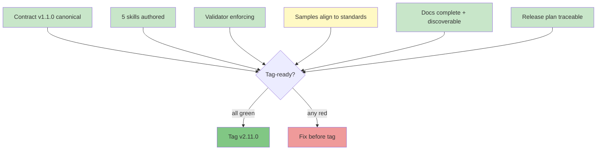
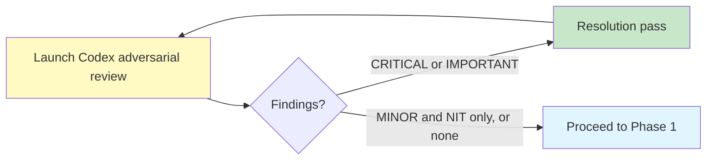
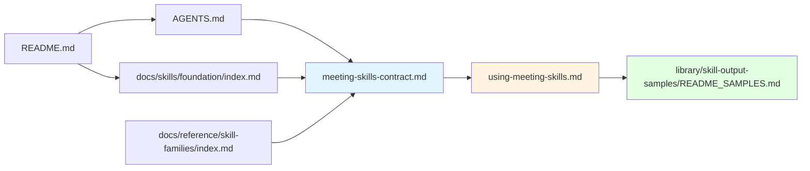
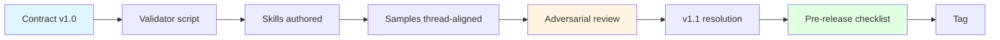

# v2.11.0 Pre-Release Document Fidelity + Quality Checklist

**Purpose**: Holistic checklist for evaluating whether v2.11.0 is tag-ready. Goes beyond the mechanical CI checks to verify documentation fidelity, narrative coherence, and adoption-readiness across the meeting-skills-family deliverables.

**When to use**:
- Before cutting the v2.11.0 git tag
- Before requesting Codex adversarial review on a subsequent release
- As a template for future skill-family releases (replace "meeting skills" with new family name)

---

## Release state overview



Legend: green = verified complete, yellow = in progress, red = blocker.

---

## Phase 0 — Adversarial review loop (MUST run before tag)

**Added in v2.11.0 based on two rounds of Codex review experience** (see [`plan_v2.11_review-journal.md`](plan_v2.11_review-journal.md)).

Run adversarial review. After each resolution pass, re-run once more until findings stabilize below IMPORTANT severity.



**Protocol**:

1. Launch Codex adversarial review via `codex:codex-rescue` subagent with an adversarial prompt scoped to the release's canonical docs, skills, samples, and CI
2. If any CRITICAL or IMPORTANT findings surface:
   - Execute a resolution pass fixing all CRITICAL + IMPORTANT findings
   - Track MINOR + NIT separately; decide per-item whether to fix now or defer to next patch
   - **Re-run Codex** on the post-resolution state — do not assume findings don't compound
3. Repeat the loop until Codex returns zero CRITICAL and zero IMPORTANT findings
4. If MINOR + NIT findings persist at loop termination: document each in the review journal with fix-or-defer decision

**Why this is Phase 0 (not Phase 7)**: findings surfaced by adversarial review often touch the contract, skill files, or samples — i.e., they force re-runs of Phases 1-4 mechanical checks anyway. Running adversarial review first ensures Phases 1-4 are evaluated against the final state, not an intermediate one.

**Rationale from v2.11.0 experience**:
- Round 1: 15 findings (3 CRITICAL, 7 IMPORTANT, 3 MINOR, 1 NIT)
- Round 2 (post-resolution): 11 findings (0 CRITICAL, 6 IMPORTANT, 3 MINOR, 2 NIT) — the Round 1 resolution pass itself introduced new IMPORTANT issues
- The loop terminates; it doesn't recur indefinitely. v2.11.0 converged in 2 rounds.

**Checklist**:

- [ ] Codex adversarial review round 1 executed
- [ ] All CRITICAL findings from round 1 resolved
- [ ] All IMPORTANT findings from round 1 resolved (or explicitly deferred with rationale)
- [ ] Codex adversarial review round 2 executed (post-resolution)
- [ ] All CRITICAL + IMPORTANT findings from round 2 resolved (or deferred with rationale)
- [ ] Additional rounds if round 2 surfaced new CRITICAL or IMPORTANT
- [ ] Review journal updated with all findings and resolutions

---

## Phase 1 — Mechanical CI (must all be green)

Run locally before tagging:

```bash
bash scripts/validate-meeting-skills-family.sh
bash scripts/lint-skills-frontmatter.sh
bash scripts/validate-commands.sh
bash scripts/validate-agents-md.sh
bash scripts/validate-skills-manifest.sh
bash scripts/check-count-consistency.sh   # advisory, but review output
```

Checklist:

- [ ] `validate-meeting-skills-family` green — all 5 skills conform to v1.1.0 contract
- [ ] `lint-skills-frontmatter` green — all 38 skills pass
- [ ] `validate-commands` green — all 45 commands map to valid skills
- [ ] `validate-agents-md` green — 38 skill paths match
- [ ] `validate-skills-manifest` green — v2.11.0 manifest conformant
- [ ] `check-count-consistency` drift reviewed — any flagged counts confirmed intentional-historical or fixed

---

## Phase 2 — Document fidelity

Goes beyond CI. Checks for internal consistency, narrative coherence, and surface-area completeness.

### 2a. Contract fidelity

- [ ] `docs/reference/skill-families/meeting-skills-contract.md` frontmatter shows current version
- [ ] Change log has an entry for every post-v1.0.0 change
- [ ] Every required field / enum / behavior referenced by a validator is defined in the contract
- [ ] Every example YAML in the contract uses values from the enum it documents (self-consistency check)
- [ ] Every cross-reference (skill names, file paths) uses a live path

### 2b. Skill-file fidelity

For each of the 5 meeting skills:

- [ ] SKILL.md has `classification: foundation` (phase-omitted)
- [ ] SKILL.md references the family contract
- [ ] SKILL.md has a `Zero-friction execution` section acknowledging the go-mode contract
- [ ] TEMPLATE.md includes the universal base frontmatter fields
- [ ] TEMPLATE.md has `## Shareable summary` (or `## Shareable update` for stakeholder-update)
- [ ] TEMPLATE.md has `## Sources & References` with the 4 required subsections
- [ ] EXAMPLE.md is a complete worked example with no placeholder text
- [ ] Every filename referenced in EXAMPLE.md conforms to the family naming pattern

### 2c. Sample fidelity

- [ ] Every sample file uses the `sample_{skill}_{thread}_{context}.md` filename pattern
- [ ] Every sample's thread slot is one of: `storevine | brainshelf | workbench | orbit | legacy`
- [ ] Every sample has `## Scenario` / `## Prompt` / `## Output` sections in order
- [ ] No sample has unresolved placeholders (`TBD`, `TODO`, `<placeholder>`)
- [ ] Every invented metric in samples carries the `[fictional]` marker
- [ ] Real industry data cited in Source Notes uses publicly accessible URLs
- [ ] Sample count in `library/skill-output-samples/README_SAMPLES.md` matches actual count

  **Concrete command** (v1.1.0 errata — must run, not just mentally check):

  ```bash
  # Actual sample count
  ACTUAL=$(find library/skill-output-samples/ -name "sample_*.md" | wc -l)
  # Claimed count (first number in README)
  CLAIMED=$(grep -oE '^[0-9]+ sample outputs' library/skill-output-samples/README_SAMPLES.md | head -1 | grep -oE '[0-9]+')
  echo "Actual: $ACTUAL, Claimed: $CLAIMED"
  [[ "$ACTUAL" == "$CLAIMED" ]] && echo "MATCH" || echo "DRIFT — fix before tag"
  ```

  Reviewer must paste the command output in the PR description (expected vs actual). Advisory: 109 vs 120 drift in v2.11.0 was missed because the check was written in passive voice. Don't repeat.

- [ ] Every sample file is either linked from `README_SAMPLES.md` browse tables OR explicitly categorized as legacy/orbit in the breakdown section — no unlinked-and-uncategorized samples

### 2d. Public skill doc fidelity

For each of the 5 new public skill docs at `docs/skills/foundation/foundation-meeting-*.md`:

- [ ] Frontmatter has title, description, tags
- [ ] Quick facts admonition shows Foundation / v1.0.0 / meeting / Apache-2.0
- [ ] "Try it" button shows the correct slash command
- [ ] When to Use / When NOT to Use sections populated
- [ ] How to Use shows concrete invocation examples
- [ ] Key features section highlights distinctive behaviors
- [ ] Related skills links resolve to other family members
- [ ] Page appears in mkdocs.yml Foundation nav

---

## Phase 3 — Discoverability

The family is discoverable through multiple entry points.



Checklist:

- [ ] README.md mentions v2.11.0 new capability (at tag time)
- [ ] AGENTS.md has 5 new Foundation entries with family-contract note
- [ ] `docs/skills/foundation/index.md` lists all 7 foundation skills with Meeting Skills Family subsection
- [ ] `docs/reference/skill-families/index.md` landing page links to Meeting Skills Family contract
- [ ] `docs/guides/using-meeting-skills.md` links from skill docs and contract
- [ ] `library/skill-output-samples/README_SAMPLES.md` has Browse-by-Skill rows for all 5 meeting skills
- [ ] mkdocs.yml has nav entries for: 5 skill docs under Foundation, Skill Families under Reference, Guides section

---

## Phase 4 — Release coordination

Documentation that explains what shipped and why.

- [ ] `docs/internal/release-plans/v2.11.0/plan_v2.11.0.md` — decisions table reflects final state
- [ ] `docs/internal/release-plans/v2.11.0/plan_v2.11_codex-review.md` — all 14 of 15 findings marked resolved
- [ ] `docs/internal/release-plans/v2.11.0/plan_v2.11_ci-coverage-analysis.md` — gaps documented with follow-up efforts
- [ ] `docs/internal/release-plans/v2.11.0/skills-manifest.yaml` — 6 skill entries (F-26 + 5 meeting) at v1.0.0
- [ ] `docs/internal/efforts/meeting-skills-family/plan_family-contract.md` — master plan shows all phases with completion dates
- [ ] Master plan decisions log has entry for each significant design decision
- [ ] Every new effort brief (F-17, F-18, F-25, F-26, F-27, F-28, F-29, F-30) is linked from the release plan

---

## Phase 5 — Tag-time chores

Customary at git-tag time (not at feature-complete time):

- [ ] `CHANGELOG.md` — v2.11.0 entry summarizing skills + contract + CI additions
- [ ] `docs/releases/Release_v2.11.0.md` — release notes with user-facing highlights
- [ ] `docs/releases/index.md` — v2.11.0 row added
- [ ] `.claude-plugin/plugin.json` — version bumped from 2.10.2 to 2.11.0
- [ ] `marketplace.json` — version bumped
- [ ] Git tag created and pushed

---

## Phase 6 — Post-release signals

Monitored after the tag to decide follow-up work:

- [ ] First real-world use of at least 2 of the 5 skills within 2 weeks
- [ ] Open issues or feedback tracked against each skill
- [ ] F-31 (pm-skill-validate family-awareness) triaged — add to v2.12.0 backlog if needed
- [ ] F-29 (meeting-lifecycle workflow) triaged — promote from backlog if adoption signals demand
- [ ] F-30 (adoption guide) triaged — promote if multiple teams evaluating the family

---

## Quality gates — severity tiers

Not all items block a release equally. Use this tier map when triaging what's genuinely blocking vs. fixable-in-patch:

| Tier | Blocks tag? | Examples |
|------|-------------|----------|
| **Tier 1 — hard gate** | Yes | Any CI failure; contract self-contradiction; broken cross-links in SKILL.md; missing required frontmatter field |
| **Tier 2 — soft gate** | Usually | Sample non-conformance to SAMPLE_CREATION.md; stale count references in current-state docs; missing mkdocs nav |
| **Tier 3 — hygiene** | No | Typos; wording refinements; additional mermaid diagrams; follow-up-effort backlog grooming |

Tier 1 must be green. Tier 2 must be green or explicitly accepted as known-debt in the release plan. Tier 3 is release-noted if notable; otherwise deferred.

---

## Document-fidelity heuristic: the "cold reader" test

Give the repo to someone who's never seen it. Ask them to:

1. Find out what the meeting-skills family does (expected: README or docs/index.md → Foundation → Meeting Skills Family subsection → contract)
2. Run their first meeting-agenda (expected: using-meeting-skills.md guide)
3. Understand why contract v1.1.0 changed from v1.0.0 (expected: contract change log)
4. Find the adversarial review findings (expected: release plan → codex-review doc)
5. Know what's deferred for v2.12.0 (expected: release plan → open questions + F-29/F-30 effort briefs)

If any of these require more than 2 clicks from a natural entry point, fix the navigation before tagging.

---

## Template for future skill-family releases

When the next family ships (potentially Research Family or Delivery Family per the skill-families index):



Reuse this checklist for each family. The pattern is: contract first, skills against the contract, validator enforces the contract, samples demonstrate the contract, adversarial review stress-tests the contract, resolution pass closes gaps, pre-release checklist confirms fidelity, tag.

---

## Change log for this checklist

| Date | Change |
|------|--------|
| 2026-04-17 | Initial checklist created for v2.11.0 meeting-skills-family release. Based on lessons from the v2.11.0 cycle (Codex adversarial review, CI coverage analysis, sample-standards discovery). |
