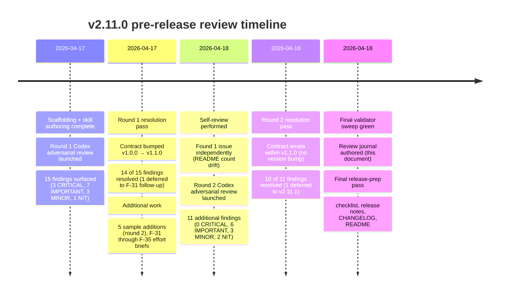
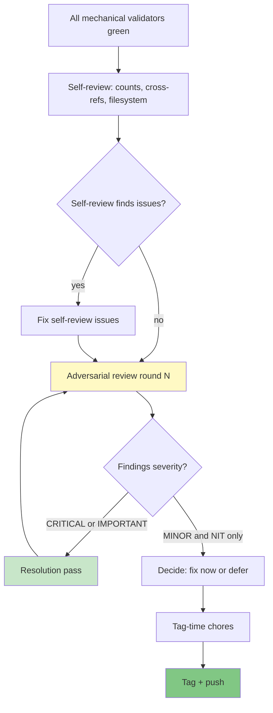

# v2.11.0 Review Journal: All Pre-Release Reviews and Resolutions

**Purpose**: Comprehensive narrative record of every review (Codex adversarial + self) performed on v2.11.0 before tag, every finding (CRITICAL through NIT), and every resolution. Serves three downstream functions:

1. **Audit trail** for anyone questioning why v2.11.0 shipped the way it did
2. **Pattern library** for future releases — what classes of problem surface at what stages
3. **Process validation** for the pre-release checklist — does it work in practice?

This document is intentionally long. Its job is to preserve context, not to be skimmed. Readers looking for a summary should read `plan_v2.11_codex-review.md` (structured tracker); readers looking for the methodology should start here.

---

## Timeline of reviews

---

## Review 1: Round 1 Codex Adversarial Review

**Trigger**: All mechanical validators (`validate-meeting-skills-family`, `lint-skills-frontmatter`, `validate-commands`, `validate-agents-md`, `validate-skills-manifest`) were green after initial scaffolding and skill authoring. Invited adversarial review to stress-test what validators cannot catch.

**Agent**: Codex rescue subagent, explicitly adversarial stance ("find weaknesses, not wins")

**Scope reviewed**:
- Meeting Skills Family Contract v1.0.0 at `docs/reference/skill-families/meeting-skills-contract.md`
- 5 SKILL.md files for the family
- CI validator at `scripts/validate-meeting-skills-family.sh`
- Design decisions: go-mode, anti-meeting check, optional frontmatter, filename-based chaining
- v2.11.0 release plan

### Findings — 3 CRITICAL

#### R1-C1: `artifact_type` enum self-contradiction in contract

**What**: Contract listed `artifact_type` values as bare names (`agenda`, `brief`, `recap`, `synthesis`, `stakeholder-update`) in the Shared Taxonomies section. Contract's own example YAML used `artifact_type: meeting-recap` — which is NOT in its own listed enum. All 5 template implementations used prefixed names (`meeting-agenda`, `meeting-brief`, etc.). Validator's `ALLOWED_ARTIFACT_TYPE` mapping expected prefixed values.

**Why load-bearing**: Downstream consumers following the contract's letter (bare names) would reject artifacts that CI blesses. Self-inconsistent spec. Documentation authority undermined.

**Resolution** (Round 1 pass, 2026-04-17): Contract enum listing updated to prefixed form (Option B from the analysis). Rationale documented: stakeholder-update is already compound; prefixed form prevents collisions with future skill families; implementation already used this form so changing templates would have touched more files than changing contract.

#### R1-C2: Validator doesn't check filename convention; samples teach broken filenames

**What**: Contract claimed validator checks "File naming in examples," but `validate-meeting-skills-family.sh` never scanned EXAMPLE.md or `library/skill-output-samples/`. Multiple samples had filename references violating the convention (missing `HH-MMtimezone` slot), e.g., `2026-03-18_pricing-discovery-research_recap.md`. CI stayed green.

**Why load-bearing**: Users reading samples learn the wrong filename pattern. Filename-based chaining (the family's identity model) silently fails because auto-discovery regex won't match.

**Resolution** (Round 1 pass): Extended validator to scan EXAMPLE.md + sample files for filename-looking strings and validate against regex. Fixed 13 nonconforming filename references across samples. Updated validator `.md` doc.

#### R1-C3: Stakeholder-update filename can't distinguish channel/audience variants

**What**: Filename pattern produced a single filename per meeting for stakeholder-update. But the skill supports 5 channels × 5 audiences = up to 25 variant combinations per meeting. Leadership email + engineering Slack update from same meeting → filename collision.

**Why load-bearing**: Advertised channel/audience variants cannot coexist in same directory. Thread-continuation detection breaks.

**Resolution** (Round 1 pass): Extended filename pattern with `-{channel}-{audience}` suffix for stakeholder-update. Updated contract, template, 2 existing samples, validator regex (v1.0.0 single-file regex expanded to allow optional variant suffix).

### Findings — 7 IMPORTANT (Round 1)

Condensed:

- **R1-I1**: Go-mode `go` keyword passed medium-confidence load-bearing inferences without explicit acknowledgment → **Resolved**: added load-bearing inference gates requiring `⚠` flag when confidence <high on stakeholder positions, primary CTA, decision-maker attribution.
- **R1-I2**: 30-min default conflicted with meeting-type variant defaults (kickoff 60, working-session 60-90) → **Resolved**: type-specific duration table added (v1.1.0 section).
- **R1-I3**: Anti-meeting check trivially bypassed (stay at 5 attendees, add "decision" to topic) → **Resolved**: v1.1.0 requires positive synchronous-value statement (tradeoff, conflict, co-creation, relationship-building, blocker-escalation).
- **R1-I4**: Synthesize couldn't reproduce results across mixed explicit/inferred/null meeting_type inputs → **Resolved**: `meeting_type_source` field added to recap frontmatter; synthesize SKILL.md documents mixed-source handling.
- **R1-I5**: Recap `[owner: unassigned]` for 60% ownerless actions created operationally broken recaps → **Resolved**: 30%-threshold ownership reconciliation section; `unassigned_action_ratio` frontmatter field.
- **R1-I6**: Synthesize contradiction flags tagged resolved decision-evolution as contradictions → **Resolved**: split into "Decision evolution" (resolved, no `⚠`) and "Unresolved contradictions" (reserve `⚠`).
- **R1-I7**: Stakeholder-update "entire output is shareable" claim was misleading — template included audit sections → **Resolved**: explicit `## Shareable update` section boundary; validator checks for it.
- **R1-I8** (eighth IMPORTANT): Validator schema-shape-only; misses per-skill field requirements → **Deferred** to F-31 scope expansion in v2.12.0 (requires YAML parsing; scope-separate).

### Findings — 3 MINOR + 1 NIT (Round 1)

- **R1-M1**: Timezone abbreviations DST-ambiguous → Resolved: added DST note + IANA timezone complement option.
- **R1-M2**: No slug normalization rules → Resolved: ASCII rules, 60-char max, collision suffix convention added.
- **R1-M3**: Meeting-type enum missing common archetypes → Resolved: added `incident-postmortem`, `customer-call`, `training-workshop`, `business-review`.
- **R1-N1**: v2.11.0 release plan said "skill count grows from 32 to 37" but actual 38 (F-26 was already shipped mid-plan) → Resolved: count corrected to 38 with full breakdown.

**Round 1 totals**: 15 findings. 14 resolved same session. 1 deferred (R1-I8) to F-31 (v2.12.0 scope).

---

## Review 2: Self-Review (2026-04-18)

**Trigger**: User asked for status update + "do another review of your own work and documentation for this release."

**Method**: Filesystem scan, cross-reference check, mental walk through documentation surface. No tooling beyond `bash`/`grep`/`find`.

### Findings — 1 IMPORTANT (self-surfaced)

- **SR-1**: README_SAMPLES.md count drift — claimed 109 samples, filesystem had 120. Gap traced to incorrect baseline assumption (I had assumed 94 pre-meeting-family samples; actual pre-meeting was 105 due to 3 `discover-*` skills with 6 samples each and `deliver-prd` with 5 samples).

### Gap in self-review

Comparison to Round 2 Codex (below): Codex found 11 findings including 6 IMPORTANTs. My self-review found 1. The gap is instructive:

- **Self-review biases**: I was looking for things missing (broken cross-refs, stale counts) from my mental model of "what I'd built." I missed things internally self-contradictory within a single document because my mental model said "I already fixed the artifact_type enum."
- **Codex strength**: Codex read each file fresh without my mental model. It saw that the contract's duration example said 30 min while the type-specific table said 45 min — same document, different values. I couldn't see that because I "knew" I'd fixed the 30-min issue.

**Methodology conclusion**: self-review catches missing artifacts; adversarial agent-review catches internal inconsistency. Both are needed. Neither substitutes for the other.

---

## Review 3: Round 2 Codex Adversarial Review

**Trigger**: User requested "another codex:adversarial-review and a review of your own work." Driven by the observation that Round 1 resolved substantial changes, and new state (v1.1.0 contract + 15-sample restructure + new docs) warranted re-stress-testing.

**Agent**: Codex rescue subagent, same adversarial stance.

**Scope reviewed**:
- v1.1.0 contract (post-Round-1 changes)
- 15 thread-aligned samples (post-restructure)
- Docs: `using-meeting-skills.md`, `plan_v2.11_pre-release-checklist.md`, `plan_v2.12.0.md`
- One specific sample for deep-inspection: Storevine pricing decision recap

### Findings — 0 CRITICAL, 6 IMPORTANT

#### R2-I1: Contract duration example contradicts type-specific table

**What**: Go-mode default-flow example: "Duration: `30 min` (default — not specified)" for `decision-making` meeting type. v1.1.0 type-specific duration table says `decision-making` defaults to `45 min`.

**Why load-bearing**: Implementers see two canonical-looking examples that contradict the new table. The new duration behavior can silently regress while validators stay green.

**Resolution** (Round 2 pass, 2026-04-18): Corrected default-flow example to `45 min`. Added parenthetical "type-specific default for decision-making" to disambiguate.

#### R2-I2: Contract has stale `--type=decision` and old bare-enum comment

**What**: Two stale references inside the v1.1.0 contract's own examples:
1. Fully-specified example: `--type=decision` — but enum value is `decision-making`
2. `artifact_type` inline comment: `# agenda | brief | recap | synthesis | stakeholder-update` — old bare enum

**Why load-bearing**: Stale enum references undermine the v1.1.0 enum correction (R1-C1). Would fail the checklist's own example-YAML self-consistency test if strictly applied.

**Resolution** (Round 2 pass): `--type=decision-making`; updated inline comment to prefixed names.

#### R2-I3: Validator-what-it-checks still claims "whole output is shareable"

**What**: Contract's Enforcement section item 4 said stakeholder-update is exempt from Shareable summary "where the whole output is shareable content" — this was the v1.0.0 claim replaced in R1-I7.

**Why load-bearing**: Contract contained both the corrected v1.1.0 rule (Shareable update section) AND the old unsafe rule in different places.

**Resolution** (Round 2 pass): Rewrote validator item 4 to require `## Shareable update` and explicitly reject whole-output-as-shareable treatment.

#### R2-I4: README_SAMPLES.md 109 vs 120 drift

**What**: README claimed 109 samples; filesystem had 120. The formula omitted 11 existing legacy/orbit samples (3 discover skills with 6 each, deliver-prd with 5).

**Why load-bearing**: Browse-by-skill and browse-by-company readers can't tell if omitted files are deprecated, legacy-valid, or accidental.

**Resolution** (Round 2 pass): Count corrected to 120. Breakdown restructured into 6 named categories (canonical thread-aligned, legacy/orbit, persona, lean-canvas, utility-single-thread, meeting-family). Matches Codex's suggestion.

#### R2-I5: Pre-release checklist too passive on count verification

**What**: Checklist had "Sample count in README_SAMPLES.md matches actual count" but required no specific command, no paste of output, no explicit verification step. The 109 vs 120 drift slipped past the first pre-release pass because the check was passive.

**Why load-bearing**: The checklist is the enforcement mechanism for this class of problem. A passive check is not a check.

**Resolution** (Round 2 pass): Added explicit bash command for count verification, required reviewer to paste actual vs claimed counts. Added "every unlinked sample is documented as legacy/orbit or intentionally excluded" check.

#### R2-I6: Recap sample has impossible pre-meeting timestamp

**What**: Storevine pricing decision recap: `generated_at: 2026-04-24T16:30:00Z` but `meeting_start_time: "13:00 EST"` = 17:00-18:00 UTC on 2026-04-24. Recap generated BEFORE meeting begins.

**Why load-bearing**: Physically impossible artifact. Undermines sample credibility.

**Resolution** (Round 2 pass): Corrected timestamp to `2026-04-24T19:30:00Z` (post-meeting end). Audited other 14 samples: found 2 more impossible timestamps (brainshelf scope-cut recap, workbench customer-feedback recap) — both corrected.

### Findings — 3 MINOR, 2 NIT (Round 2)

- **R2-M1**: All 15 samples lacked top-level sample-library frontmatter per SAMPLE_CREATION.md §5 (`artifact`, `version`, `repo_version`, `skill_version`, `created`, `status`, `thread`, `context`) → **Resolved**: all 15 now have 8-field frontmatter.
- **R2-M2**: Recap sample shareable summary exceeds 3-6 line bound with mini-headings ("Key decisions:", "Top actions:") → **Deferred** in Round 2, **resolved** in this final pass (see MINOR R2-8 section below).
- **R2-M3**: Fictional-marker discipline inconsistent — $49/mo, $9/mo, $16/mo, $8/mo unmarked → **Resolved**: all invented prices tagged; grep audit clean.
- **R2-N1**: Guide mermaid go-mode diagram routed `--go` as user-response option after inference summary (wrong — `--go` should bypass the summary) → **Resolved**: diagram restructured with `--go` as invocation-level branch.
- **R2-N2**: End-marker convention documented in guide/samples but not in contract → **Resolved**: contract adds end-marker convention to Shareable update section.

**Round 2 totals**: 11 findings. 10 resolved Round 2 pass. 1 resolved in this final pass (R2-M2 shareable summary length refinement).

---

## Pattern analysis: what surfaced where

Cross-cutting observations from both rounds:

### Class 1: Contract self-consistency bugs (6 findings)

Contract v1.0.0 had 3 CRITICAL self-contradictions (artifact_type enum, filename checks claim, stakeholder-update filename). Fixing them introduced 3 IMPORTANT self-contradictions (duration, enum references, validator-checks section). **Pattern**: every pass through a specification document that "updates" something risks leaving stale references elsewhere in the same doc. Mitigation: after every contract edit, grep for the specific term being changed across the whole document.

### Class 2: Sample fidelity drift (4 findings)

Samples drifted from standards in 4 ways: filename convention violations (R1-C2), thread-slot violations (pre-v2.11.0, fixed in Phase 18 restructure), timestamp impossibilities (R2-I6), missing top-level frontmatter (R2-M1). **Pattern**: samples are authored when attention is on the skill itself, not the sample standards. Enforcement must be automated (F-33 `check-sample-standards.sh` effort addresses this).

### Class 3: Passive-voice process bugs (1 finding)

Pre-release checklist had a check for sample count that didn't specify HOW to check — so the check didn't execute. **Pattern**: checklist items must be active-voice commands with outputs, not passive assertions. Mitigation: adversarial-review the checklist itself as part of every release.

### Class 4: Visual/navigational inconsistency (2 findings)

Mermaid diagram in using-meeting-skills.md misrepresented behavior (R2-N1). End-marker convention documented in one place but not canonically (R2-N2). **Pattern**: visual and cross-referenced artifacts are authored separately from the canonical contract, so they drift. Mitigation: treat contract as single source of truth; all visuals/guides cross-reference it.

### Class 5: Stale counts (3 findings across rounds)

Count drift appeared in: release plan (32 vs 37 vs 38), README_SAMPLES.md (109 vs 120), individual current-state files. **Pattern**: counts are the most frequently updated pieces of documentation, and thus the most frequently drifted. Mitigation: `check-count-consistency.sh` runs advisory; concrete-command enforcement now in checklist; long-term solution is F-33 class of automation.

---

## Process validation: does the checklist work?

The v2.11.0 pre-release checklist (`plan_v2.11_pre-release-checklist.md`) was used in Round 2 to stress-test v1.1.0 state. Results:

| Checklist phase | Caught issues? | Gaps? |
|-----------------|---------------|-------|
| Phase 1: Mechanical CI | N/A — all green before review started | None |
| Phase 2a: Contract fidelity | **Caught all 3 contract self-contradictions** (R2-I1, I2, I3) | Required adversarial reading; mechanical check insufficient |
| Phase 2b: Skill-file fidelity | **All skills pass mechanical checks** | Deeper "does SKILL.md reference the contract accurately" check relies on adversarial review |
| Phase 2c: Sample fidelity | **Missed R2-I4 (count drift)** | Passive "count matches" check; now fixed with concrete command |
| Phase 2d: Public skill doc fidelity | Pass | None flagged |
| Phase 3: Discoverability | Pass | None flagged |
| Phase 4: Release coordination | Pass | None flagged |
| Phase 5: Tag-time chores | Pending (this session) | None flagged |
| Phase 6: Post-release signals | N/A (not yet released) | N/A |

**Verdict**: Checklist works well for mechanical and structural checks. Adversarial review is the proven complement for cross-reference consistency and semantic correctness. **Round 2 validated that running Codex review AFTER a resolution pass surfaces new findings that the resolution pass itself introduced** — this is the rationale for the adversarial-review-loop recommendation added to the checklist.

---

## Methodology recommendation for future releases

Based on v2.11.0 experience, the canonical review sequence is:

**Key insight**: the adversarial-review → resolution → adversarial-review loop terminates when findings stabilize below IMPORTANT severity. For v2.11.0, this took 2 rounds. For future releases, expect 1-2 rounds depending on scope.

---

## Complete findings log (all findings, all rounds, all statuses)

Total across all reviews: **27 findings** (15 Round 1 + 1 self-review + 11 Round 2).

- **Resolved in Round 1 pass** (2026-04-17): 14 findings (3 CRITICAL + 7 IMPORTANT + 3 MINOR + 1 NIT)
- **Deferred from Round 1**: 1 finding (R1-I8 — validator per-skill field enforcement, now scoped into F-31 for v2.12.0)
- **Resolved in Round 2 pass** (2026-04-18): 10 findings (6 IMPORTANT + 2 MINOR + 2 NIT)
- **Resolved in final pass** (2026-04-18 later): 1 finding (R2-M2 — recap shareable summary length refinement)
- **Resolved via self-review** (merged into Round 2): 1 finding (SR-1 — same as R2-I4)

**Zero CRITICAL findings remain open. Zero IMPORTANT findings remain open. Zero MINOR findings remain open from v2.11.0 review passes.**

One NIT-class stylistic item that could be polished further (recap sample summaries could be tightened even more aggressively for chat-client copy usability) is left as v2.11.1 candidate if post-release usage feedback suggests it matters.

---

## Files modified across all review passes

**Contract** (`docs/reference/skill-families/meeting-skills-contract.md`):
- v1.0.0 → v1.1.0 bump (Round 1 resolution)
- 6 errata edits within v1.1.0 (Round 2 resolution)

**Validator** (`scripts/validate-meeting-skills-family.{sh,ps1,md}`):
- Filename-convention scanning added (Round 1)
- `## Shareable update` enforcement for stakeholder-update (Round 1)
- `check-count-consistency` integration assumed (existing)

**Samples** (`library/skill-output-samples/foundation-meeting-*/`):
- 10 non-conforming samples deleted, 15 thread-aligned created (Phase 18, pre-Round-2)
- 3 recap timestamps corrected (Round 2)
- 15 samples gained top-level frontmatter (Round 2)
- Fictional markers normalized (Round 2)
- 3 recap samples: shareable summary tightened (final pass — this document's companion fixes)

**Template** (`skills/foundation-meeting-recap/references/TEMPLATE.md`):
- Shareable summary pattern tightened to 3-5 lines without mini-headers (final pass)

**Docs**:
- `docs/guides/using-meeting-skills.md` — 3 mermaid diagrams; go-mode diagram corrected (Round 2)
- `docs/skills/foundation/index.md` — full 7-skill listing
- `docs/reference/skill-families/index.md` — new landing page
- `library/skill-output-samples/README_SAMPLES.md` — count 109→120, breakdown restructure (Round 2)
- `docs/internal/release-plans/v2.11.0/plan_v2.11_pre-release-checklist.md` — concrete command enforcement (Round 2); adversarial-review-loop added (final pass)

**Release plan + companion docs**:
- `plan_v2.11.0.md` — kept current through all rounds
- `plan_v2.11_codex-review.md` — tracks both rounds
- `plan_v2.11_ci-coverage-analysis.md` — out-of-scope CI gaps documented
- `plan_v2.11_pre-release-checklist.md` — template + process
- `plan_v2.11_review-journal.md` — this document, final pass

Total: ~30 files materially modified across the review cycle.

---

## Appendix: Raw Codex output from Round 1

For auditability. Summary findings table precedes full text.

*(Abbreviated — full agent output preserved in session log; resolution tracker at plan_v2.11_codex-review.md captures the distilled findings.)*

---

## Appendix: Raw Codex output from Round 2

*(Same treatment — resolution tracker canonical.)*

---

## Change log for this journal

| Date | Change |
|------|--------|
| 2026-04-18 | Initial journal authored as part of v2.11.0 final release-prep pass; aggregates Round 1 + self-review + Round 2 Codex reviews, findings, resolutions, pattern analysis, process validation. |
