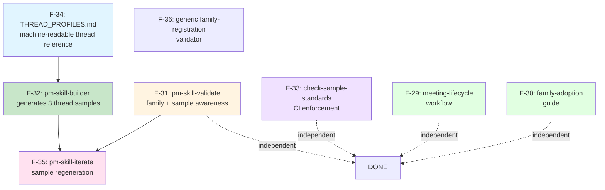

# v2.12.0 Release Plan: Sample Automation + Meeting-Skills Ecosystem (stub)

Status: Stub (planning not yet started)
Owner: Maintainers
Type: Feature release (minor)
Stub created: 2026-04-18 (same session as v2.11.0 completion)

## Release Theme (draft)

Two parallel threads that emerged during v2.11.0 execution:

1. **Sample automation loop**. close the "samples as a dependency you can't forget" gap discovered when the meeting-skills family's initial sample round violated SAMPLE_CREATION.md conventions. Make sample creation and maintenance automatic across `/pm-skill-builder`, `/pm-skill-validate`, `/pm-skill-iterate`.
2. **Meeting-skills ecosystem continuation**. land the workflow that chains the 5 meeting skills (F-29) and the team-level adoption guide (F-30) that v2.11.0 deferred pending real-world usage signals.

Also lands: pm-skill-validate gains family-awareness (Codex IMPORTANT #8 deferred from v2.11.0).

Theme is aspirational at stub time; final scope depends on adoption signals from v2.11.0 and any new efforts that surface between now and v2.12.0 kickoff.

## Context

v2.11.0 shipped the Meeting Skills Family (5 skills + contract + enforcing CI) plus `foundation-lean-canvas`. During that release, two observations drove the v2.12.0 backlog:

1. **The samples problem**. meeting-skills samples were the last thing authored and the most error-prone. The initial 10 samples violated SAMPLE_CREATION.md and required a full restructure. Root cause: sample creation sits outside the `/pm-skill-builder` workflow and outside CI enforcement. A user can ship a skill with no samples, non-conforming samples, or silently drifted samples. The sample-automation thread (F-31 through F-35) closes this gap end-to-end.

2. **The meeting-skills ecosystem**. the 5 skills ship as individually invokable in v2.11.0. A workflow (F-29) that chains them and a team-level adoption guide (F-30) were deliberately deferred to let real-world usage inform better design. v2.12.0 is the earliest reasonable release to include them.

### Prerequisites

- [ ] v2.11.0 tagged and pushed
- [ ] At least 2 weeks of real-world usage signal on meeting-skills before locking F-29 workflow design
- [ ] At least one external team evaluating adoption before locking F-30 guide design
- [ ] F-34 (THREAD_PROFILES.md) extraction completed, unblocking F-32

---

## Efforts (draft slate, subject to re-prioritization)

| ID | Name | Type | Effort Brief | Status |
|----|------|------|-------------|--------|
| **F-29** | [Meeting Lifecycle Workflow](../../efforts/F-29-workflow-meeting-lifecycle.md) | Feature | [brief](../../efforts/F-29-workflow-meeting-lifecycle.md) | Backlog |
| **F-30** | [Family Adoption Guide](../../efforts/F-30-meeting-skills-family-adoption-guide.md) | Feature | [brief](../../efforts/F-30-meeting-skills-family-adoption-guide.md) | Backlog |
| **F-31** | [pm-skill-validate Family + Sample Awareness](../../efforts/F-31-pm-skill-validate-family-sample-awareness.md) | Feature (utility-skill update) | [brief](../../efforts/F-31-pm-skill-validate-family-sample-awareness.md) | Backlog |
| **F-32** | [pm-skill-builder Sample Generation](../../efforts/F-32-pm-skill-builder-sample-generation.md) | Feature (utility-skill update) | [brief](../../efforts/F-32-pm-skill-builder-sample-generation.md) | Backlog (blocked on F-34) |
| **F-33** | [check-sample-standards CI Script](../../efforts/F-33-check-sample-standards-ci.md) | Infrastructure | [brief](../../efforts/F-33-check-sample-standards-ci.md) | Backlog |
| **F-34** | [THREAD_PROFILES.md Reference](../../efforts/F-34-thread-profiles-reference.md) | Infrastructure | [brief](../../efforts/F-34-thread-profiles-reference.md) | Backlog |
| **F-35** | [pm-skill-iterate Sample Regeneration](../../efforts/F-35-pm-skill-iterate-sample-regeneration.md) | Feature (utility-skill update) | [brief](../../efforts/F-35-pm-skill-iterate-sample-regeneration.md) | Backlog (blocked on F-31 + F-32) |
| **F-36** | [Generic Skill-Family-Registration Validator](../../efforts/F-36-generic-family-registration-validator.md) | Infrastructure | [brief](../../efforts/F-36-generic-family-registration-validator.md) | Backlog (surfaced by post-v2.11.0 CI audit; closes gap G2) |

### Dependency graph

**Critical path**: F-34 → F-32 → F-35. Everything else ships in parallel.

### Effort sizing (rough)

- F-34: ~2-3 days (extraction from prose to structured form)
- F-32: ~5-7 days (builder extension + scenario generation logic)
- F-31: ~5-7 days (validator extension for family + sample)
- F-33: ~3-4 days (new CI script, pattern reusable from validate-meeting-skills-family)
- F-35: ~4-5 days (iterate extension; reuses F-32 logic)
- F-29: ~5-7 days (workflow authoring + tailoring based on v2.11.0 usage signals)
- F-30: ~3-5 days (adoption guide authoring)

Total ~30-40 person-days if serial; ~15-20 days if parallelized across the dependency graph.

---

## Decisions (to make during planning)

| Decision | Status | Notes |
|----------|--------|-------|
| **Version** | Pending | Likely v2.12.0 (minor). new features, no breaking changes |
| **Full vs. staged slate** | Pending | Option: full (7 efforts) in one release OR split sample-automation (F-31/32/33/34) from ecosystem (F-29/30) across v2.12.0 + v2.13.0 |
| **F-29 workflow design** | Pending | Depends on v2.11.0 real-world usage feedback. wait 2 weeks minimum |
| **F-30 guide design** | Pending | Depends on at least one team's adoption experience |
| **Sample-automation rollout** | Pending | Advisory-first for F-33 CI (2 weeks), enforcing after |
| **Backward compatibility** | Pending | F-32 generates samples for new skills; existing skills without samples remain valid (not retroactive) unless F-31 is configured to fail on missing samples |
| **HISTORY.md first entries** | Pending | F-31, F-32, F-35 all produce the first HISTORY.md for their respective utility skills (v1.0.0 → v1.1.0) |

---

## Deliverables (by effort, summarized)

### F-29: Meeting Lifecycle Workflow
- `_workflows/workflow-meeting-lifecycle.md`
- `commands/workflow-meeting-lifecycle.md`
- `docs/workflows/workflow-meeting-lifecycle.md`
- Cross-links from 5 meeting-skill public docs

### F-30: Family Adoption Guide
- `docs/guides/meeting-skills-family-adoption.md`
- mkdocs.yml nav entry
- Cross-links from contract + family-skill docs

### F-31: pm-skill-validate Family + Sample Awareness
- `skills/utility-pm-skill-validate/SKILL.md` updated
- `skills/utility-pm-skill-validate/references/TEMPLATE.md` updated
- `skills/utility-pm-skill-validate/references/EXAMPLE.md` updated
- `skills/utility-pm-skill-validate/HISTORY.md` NEW
- `docs/skills/utility/utility-pm-skill-validate.md` refreshed

### F-32: pm-skill-builder Sample Generation
- `skills/utility-pm-skill-builder/SKILL.md` updated
- `skills/utility-pm-skill-builder/references/TEMPLATE.md` updated
- `skills/utility-pm-skill-builder/references/EXAMPLE.md` updated
- `skills/utility-pm-skill-builder/HISTORY.md` NEW
- `docs/skills/utility/utility-pm-skill-builder.md` refreshed

### F-33: check-sample-standards CI Script
- `scripts/check-sample-standards.sh` + `.ps1` + `.md`
- `.github/workflows/validation.yml` (+1 step, advisory)
- `scripts/README_SCRIPTS.md` entry

### F-34: THREAD_PROFILES.md Reference
- `library/skill-output-samples/THREAD_PROFILES.md`
- `library/skill-output-samples/README_SAMPLES.md` cross-link update

### F-35: pm-skill-iterate Sample Regeneration
- `skills/utility-pm-skill-iterate/SKILL.md` updated
- `skills/utility-pm-skill-iterate/references/TEMPLATE.md` updated
- `skills/utility-pm-skill-iterate/references/EXAMPLE.md` updated
- `skills/utility-pm-skill-iterate/HISTORY.md` NEW
- `docs/skills/utility/utility-pm-skill-iterate.md` refreshed

### Cross-cutting (common to all utility-skill updates)
- `skills-manifest.yaml` entries for utility-skill version bumps (v1.0.0 → v1.1.0 × 3)
- AGENTS.md entries refreshed if descriptions change
- CHANGELOG.md v2.12.0 entry

---

## CI That Applies

| Workflow | Checks | Notes |
|----------|--------|-------|
| `lint-skills-frontmatter` | Utility skills' frontmatter after v1.1.0 bumps | Must pass |
| `validate-commands` | No new commands (existing `/pm-skill-builder`, `/pm-skill-validate`, `/pm-skill-iterate` unchanged) | Must pass |
| `validate-agents-md` | Description refreshes reflected | Must pass |
| `validate-meeting-skills-family` | No family-contract changes expected | Must pass |
| `validate-skills-manifest` | v2.12.0 manifest with utility-skill version bumps | Must pass |
| `validate-skill-history` | 3 new HISTORY.md files (F-31, F-32, F-35) conform to governance | Must pass |
| **`check-sample-standards`** (new, F-33) | All samples in `library/skill-output-samples/` conform | Advisory first 2 weeks, then enforcing |
| `check-count-consistency` | Counts unchanged from v2.11.0 (no new skills) | Advisory |

---

## MCP Impact

| Question | Answer |
|----------|--------|
| New MCP tools needed? | **No**. MCP server frozen per M-22 (v2.11.0 decision) |
| Separate MCP release required? | **No**. MCP decoupled |
| Utility-skill updates visible to MCP users? | Only if MCP unfreezes; behavior changes in pm-skill-builder/validate/iterate would be visible at that point |

---

## Open Questions

1. **F-29 + F-30 real-world wait**: how long post-v2.11.0 do we wait for usage feedback before locking designs? Proposal: 2-4 weeks.
2. **Slate scope**: 7 efforts together, or split across v2.12.0 + v2.13.0? Size estimate suggests full slate is feasible but large. Decide at planning kickoff.
3. **Retroactive sample application**: once F-32 is in builder, do we regenerate samples for existing skills that lack them? Would be a separate data-migration effort. Tracked as candidate F-36 if pursued.
4. **M-22 residual**: if M-22 MCP decoupling ships with v2.11.0, v2.12.0 has no MCP work. If M-22 slips, it lands here. Confirm M-22 status before v2.12.0 kickoff.
5. **New efforts surfacing**: backlog items F-07 (market-sizing), F-08 (survey-analysis), F-14 (workflow-builder), F-20 (slideshow-themer), F-21 (content-voice), F-22 (prototype-creator), F-23 (prototype-styler) are still in the broader backlog. Do any get pulled into v2.12.0? Decide at planning kickoff.
6. **Contract bump trigger**: F-31 might surface findings that require a Meeting Skills Family Contract v1.2.0. Keep an eye out during validator-refactor work.

---

## What this stub does NOT contain (deferred to planning kickoff)

- Final decisions table (entries are drafts)
- Exact timing / milestones
- Assignment decisions (which agent handles which effort)
- Codex adversarial review planning
- Pre-release checklist invocation (happens during release, not during planning)

When planning kicks off (post-v2.11.0 + 2-4 weeks of signal), expand this stub into a full release plan following the v2.11.0 plan structure (which is the template).

---

## Related

- v2.11.0 release plan: [`../v2.11.0/plan_v2.11.0.md`](../v2.11.0/plan_v2.11.0.md)
- v2.11.0 Codex review + CI coverage analysis: [`../v2.11.0/plan_v2.11_codex-review.md`](../v2.11.0/plan_v2.11_codex-review.md), [`../v2.11.0/plan_v2.11_ci-coverage-analysis.md`](../v2.11.0/plan_v2.11_ci-coverage-analysis.md)
- Pre-release checklist template: [`../v2.11.0/plan_v2.11_pre-release-checklist.md`](../v2.11.0/plan_v2.11_pre-release-checklist.md)
- Meeting Skills Family contract: [`../../../reference/skill-families/meeting-skills-contract.md`](../../../reference/skill-families/meeting-skills-contract.md)
- Backlog canonical: [`../../backlog-canonical.md`](../../backlog-canonical.md)

---

## Change log for this stub

| Date | Change |
|------|--------|
| 2026-04-18 | Stub created at end of v2.11.0 completion session; captures 7 efforts that surfaced or were deferred during v2.11.0 (F-29, F-30, F-31-F-35) |
| 2026-04-18 | F-36 added post-v2.11.0 tag. Surfaced by CI audit (`docs/internal/audit-ci/2026-04-18_ci-audit_post-v2.11.0.md`) as gap G2 (generic family-registration validator). Scales beyond meeting-skills-family to future skill families without per-family hardcoding. |
