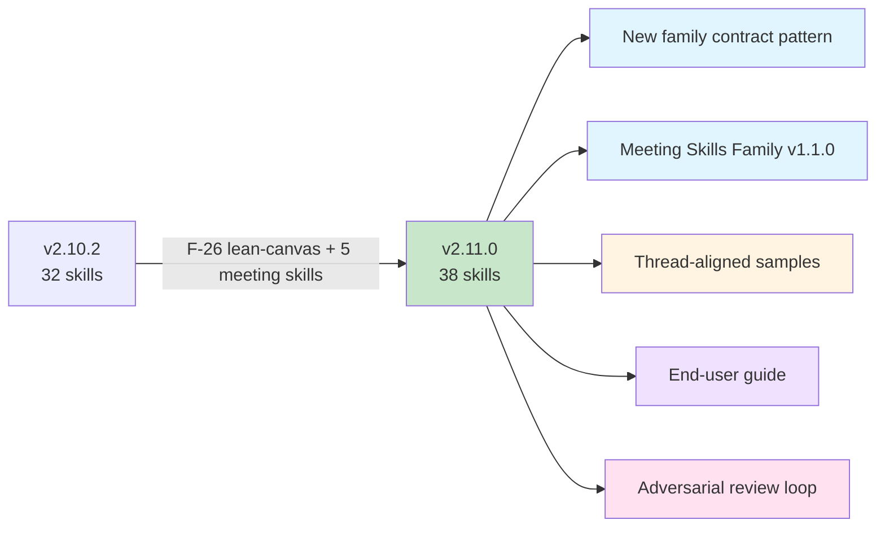

# Release v2.11.0. Meeting Skills Family + Lean Canvas

**Released**: 2026-04-18
**Type**: Feature release (minor)
**Skill count**: 32 → 38 (+6)
**Key theme**: Foundation-phase expansion + first cross-cutting skill-family contract

---

## Highlights

### 6 new foundation-phase skills

- **`foundation-lean-canvas`** (`/lean-canvas`). one-page business thesis across 9 interlocking blocks with optional HTML visual rendering (F-26, shipped to main mid-plan 2026-04-15)
- **`foundation-meeting-agenda`** (`/meeting-agenda`). attendee-facing structural doc with time-boxed topics, type tags, owners, and prep
- **`foundation-meeting-brief`** (`/meeting-brief`). user's private strategic prep with stakeholder reads, ranked outcomes, anticipated Q&A
- **`foundation-meeting-recap`** (`/meeting-recap`). post-meeting topic-segmented summary with decisions bold-flagged and actions inline
- **`foundation-meeting-synthesize`** (`/meeting-synthesize`). cross-meeting archaeology surfacing patterns, trajectories, and contradictions across recaps
- **`foundation-stakeholder-update`** (`/stakeholder-update`). async outward communication with 5 channel variants (slack, teams, email, notion, exec-memo) × 5 audience variants

### Meeting Skills Family Contract (v1.1.0)

First canonical cross-cutting skill-family contract at [`docs/reference/skill-families/meeting-skills-contract.md`](../reference/skill-families/meeting-skills-contract.md). Defines shared behavioral pattern (zero-friction execution / go-mode), frontmatter schema, filename-based chaining, universal output requirements, and 6 shared taxonomies across the 5 meeting skills.

**Enforced by** `scripts/validate-meeting-skills-family.sh` (and `.ps1`). runs in CI on every PR touching family files. Checks:
- Each SKILL.md references the contract
- Each SKILL.md has a Zero-friction execution section
- Each TEMPLATE.md has the required shareable-summary (or shareable-update for stakeholder-update) + sources-section structure
- Filename convention conformance (scans EXAMPLE.md + library samples)
- `artifact_type` matches the skill

**Contract key decisions**:
- Go-mode execution (infer → brief summary → `go` or corrections; `--go` flag bypasses checkpoint)
- Load-bearing inference gates (`⚠` flag when stakeholder positions / primary CTA / decision-maker attribution are inferred below-high confidence)
- Anti-meeting check requires positive synchronous-value statement
- Type-specific duration defaults (30 min only for standup/1-on-1/exec-briefing/other; 45 for decision-making; 60 for planning/review/project-kickoff/working-session)
- Stakeholder-update explicit `## Shareable update` boundary section
- Filename pattern `YYYY-MM-DD_HH-MMtimezone_title_artifact-type.md` with `-{channel}-{audience}` variant suffix for stakeholder-update

### New pattern: `docs/reference/skill-families/`

The contract lives in a new public directory pattern designed to host future cross-cutting skill-family contracts. [`docs/reference/skill-families/index.md`](../reference/skill-families/index.md) is the landing page; Meeting Skills Contract is the first entry. Future candidate families: Research Family, Delivery Family.

### Thread-aligned library samples (15 new, 120 total)

Library grew from 94 → 120 samples (all counted correctly per v2.11.0 errata). The 5 new meeting skills ship with 3 samples each following the canonical storevine/brainshelf/workbench thread pattern and conforming to [`SAMPLE_CREATION.md`](../../library/skill-output-samples/SAMPLE_CREATION.md). Each sample has Scenario / Prompt / Output structure, fictional-marker discipline, and top-level sample-library frontmatter (8 keys).

### End-user guide

[`docs/guides/using-meeting-skills.md`](../guides/using-meeting-skills.md). narrative walkthrough from first-meeting through cross-meeting synthesis. 3 mermaid diagrams covering:

1. The family's 5 skills at a glance
2. Go-mode decision flow (invocation → inference → checkpoint → output)
3. End-to-end chain sequence from brief/agenda → meeting → recap → stakeholder-update → synthesize

### Adversarial review loop (process improvement)

v2.11.0 was the first release reviewed by 2 rounds of Codex adversarial review. Findings:
- **Round 1**: 15 findings (3 CRITICAL, 7 IMPORTANT, 3 MINOR, 1 NIT). 14 resolved same session; 1 deferred to F-31 (v2.12.0)
- **Round 2** (post-resolution): 11 findings (0 CRITICAL, 6 IMPORTANT, 3 MINOR, 2 NIT). 10 resolved same session; 1 stylistic refinement resolved in final pass

Process learnings codified in:
- [`plan_v2.11_review-journal.md`](../internal/release-plans/v2.11.0/plan_v2.11_review-journal.md). comprehensive narrative of all reviews, findings, resolutions, pattern analysis
- [`plan_v2.11_pre-release-checklist.md`](../internal/release-plans/v2.11.0/plan_v2.11_pre-release-checklist.md). now starts with Phase 0 Adversarial Review Loop ("re-run until findings stabilize below IMPORTANT severity"), added based on v2.11.0 experience

### v2.12.0 backlog established

Seven efforts queued for next release, split into two threads:

**Sample-automation loop** (closes the "samples as a dependency you can't forget" gap discovered in this release):
- F-31: pm-skill-validate gains family + sample awareness
- F-32: pm-skill-builder generates 3 thread-aligned sample drafts automatically
- F-33: `check-sample-standards.sh` CI script enforces SAMPLE_CREATION.md compliance
- F-34: `THREAD_PROFILES.md` machine-readable reference
- F-35: pm-skill-iterate offers sample regeneration on skill change

**Meeting-skills ecosystem**:
- F-29: `workflow-meeting-lifecycle` that chains all 5 meeting skills
- F-30: `meeting-skills-family-adoption.md` team-level migration guide

Stub at [`plan_v2.12.0.md`](../internal/release-plans/v2.12.0/plan_v2.12.0.md).

---

## Upgrade notes

### From v2.10.x

No breaking changes. All existing skills unchanged. New skills are additive.

New capabilities:
- `/lean-canvas`, `/meeting-agenda`, `/meeting-brief`, `/meeting-recap`, `/meeting-synthesize`, `/stakeholder-update` slash commands now available
- Meeting Skills Family Contract is canonical. read it before authoring meeting-family skills
- CI validator `validate-meeting-skills-family` runs automatically

### For teams already using internal meeting templates

See [`docs/guides/using-meeting-skills.md`](../guides/using-meeting-skills.md). A team-level adoption guide (F-30) is planned for v2.12.0 after usage signals inform its design.

### MCP decoupling reminder

Per M-22 (decided in v2.11.0 planning), `pm-skills-mcp` is frozen and no longer gates release. MCP tools for the 6 new skills are NOT shipped in v2.11.0. If you use MCP, the server is at its v2.10.x snapshot. Revisit when team adoption creates demand.

---

## Statistics

| Metric | v2.10.2 | v2.11.0 | Delta |
|--------|---------|---------|-------|
| Total skills | 32 | 38 | +6 |
| Phase skills | 25 | 25 | 0 |
| Foundation skills | 1 | 7 | +6 |
| Utility skills | 6 | 6 | 0 |
| Slash commands | 39 | 45 | +6 |
| Workflows | 9 | 9 | 0 |
| Library samples | 94 | 120 | +26 (includes legacy samples recount) |
| CI scripts | ~15 | 16 | +1 (new family validator) |
| Skill-family contracts | 0 | 1 | +1 (meeting-skills family) |

---

## Files of note

### For end users

- [Family contract](../reference/skill-families/meeting-skills-contract.md). authoritative spec
- [Using the Meeting Skills Family](../guides/using-meeting-skills.md). narrative guide with diagrams
- [Skill Families index](../reference/skill-families/index.md). cross-cutting pattern landing page
- [Foundation skills index](../skills/foundation/index.md). all 7 foundation skills listed
- 15 sample outputs across storevine/brainshelf/workbench threads

### For maintainers

- [v2.11.0 release plan](../internal/release-plans/v2.11.0/plan_v2.11.0.md)
- [Review journal](../internal/release-plans/v2.11.0/plan_v2.11_review-journal.md)
- [Codex review tracker](../internal/release-plans/v2.11.0/plan_v2.11_codex-review.md). Round 1 + 2 findings
- [CI coverage analysis](../internal/release-plans/v2.11.0/plan_v2.11_ci-coverage-analysis.md)
- [Pre-release checklist template](../internal/release-plans/v2.11.0/plan_v2.11_pre-release-checklist.md)
- [Family authoring plan](../internal/efforts/meeting-skills-family/plan_family-contract.md)

---

## Acknowledgments

The Meeting Skills Family emerged from a design-session collaboration that produced two `_NOTES/` documents articulating a 5-skill family with shared contracts. Two rounds of Codex adversarial review materially improved the release before tag. The v2.12.0 sample-automation effort slate was scoped from pain discovered during v2.11.0 execution.
