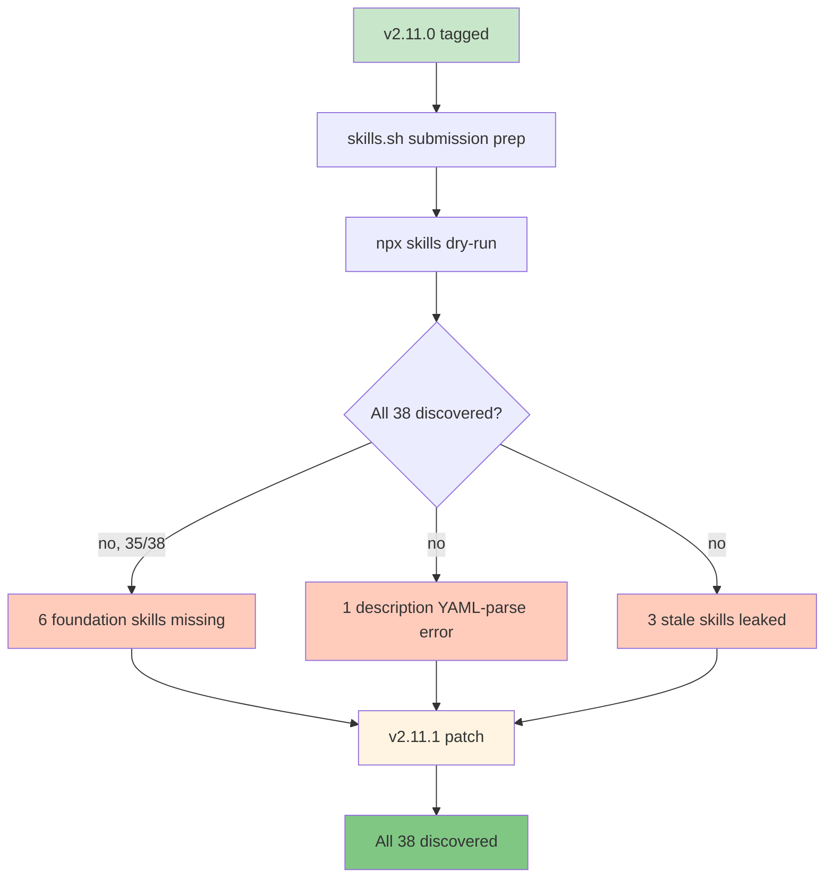

# Release v2.11.1. skills.sh CLI Compatibility Patch

**Released**: 2026-04-22
**Type**: Patch release
**Skill count**: 38 (unchanged)
**Key theme**: Distribution compatibility; unblock open-ecosystem installation

---

## TL;DR

You can now install the full pm-skills library in one command:

```bash
npx skills add product-on-purpose/pm-skills
```

Before this patch, the open [`skills` CLI](https://github.com/vercel-labs/skills) could only discover 32 of the 38 skills in the repo. Six foundation skills from v2.11.0 silently dropped out of the install because of a YAML-frontmatter quirk that our existing lint did not catch. v2.11.1 fixes that, hardens the lint so it cannot happen again, and removes some stale pre-v1 files that were shipping as phantom bonus skills.

No behavioral changes. If the skills work for you today, they still work. If you could not install them via the `skills` CLI yesterday, you can now.

---

## What changed



### Fixed

- **Leading HTML comments** on six foundation SKILL.md files were breaking the open `skills` CLI YAML parser. Each of these files is now clean:
  - `foundation-lean-canvas`
  - `foundation-meeting-agenda`
  - `foundation-meeting-brief`
  - `foundation-meeting-recap`
  - `foundation-meeting-synthesize`
  - `foundation-stakeholder-update`

- **`foundation-meeting-synthesize` description** had an inline `": "` (colon-space) that strict YAML parsers interpret as a nested key-value separator, truncating the description. The description was reworded into two sentences; version bumped 1.0.0 → 1.0.1.

- **25 stale files** under `.claude/skills/` (relics from pre-v1 personal setup: `init-project`, `init-project-jpkb`, `wrap-session`) were showing up as phantom bonus skills on install. Removed from git. The path was already in `.gitignore`; these files predated the rule.

### Added

- **`skills` CLI install path** as the recommended first option in the README:
  ```bash
  npx skills add product-on-purpose/pm-skills
  ```
  Works with Claude Code, Cursor, GitHub Copilot, Cline, and any agent supported by the open `skills` CLI.

- **New skills.sh shield badge** in the README header.

- **New row in the README Installation Options table** for the `skills` CLI path.

- **Two new lint rules** in `scripts/lint-skills-frontmatter.sh/.ps1`:
  - First line of every SKILL.md must be the YAML `---` delimiter. No preamble, comments, or attribution headers above it.
  - Unquoted `description` fields must not contain inline `": "`. If you need a colon, wrap the full value in double quotes.

- **Distribution plan** at `docs/internal/distribution/2026-04-22_skills-sh.md` documenting the full six-phase skills.sh submission approach.

### Changed

- **Em-dash sweep completion**: 376 tracked files had 5,805 em-dash characters replaced with `.` per the 2026-04-13 standing style rule. Completes a previously partial sweep across the full repo. Zero behavioral change. Bundled into this patch to keep the main branch clean.
- **Stale skill-count reconciliation**: 5 current-state references to `27 skills` or `31 skills` updated to `38 skills` in `docs/agent-skill-anatomy.md`, `docs/skills/utility/utility-pm-skill-builder.md`, `scripts/README_SCRIPTS.md`, `skills/utility-pm-skill-builder/SKILL.md`, and its `references/EXAMPLE.md`. Historical per-release count snapshots in the README "What's New" sections are intentionally preserved as accurate records of past release states.

- **README version badge** bumped from 2.11.0 to 2.11.1.

---

## Why this matters

pm-skills is designed to work across the entire AI-agent ecosystem. Three valid install paths have always been supported: git clone, ZIP download, MCP server. v2.11.1 adds a fourth: the open `skills` CLI, which is the install mechanism behind the [skills.sh directory](https://skills.sh).

The bug we found is the kind of subtle divergence that happens when your local validator and the real consumer use different parsing strategies. Our lint was line-based and accepted the files; the CLI used a full YAML library and rejected them. The new lint rules close the gap.

---

## Upgrade guide

If you installed pm-skills before v2.11.1, you have two options:

### Option A: Stay on v2.11.0 (no action needed)

The skills you already have keep working. Nothing is broken for you.

### Option B: Switch to the `skills` CLI path

If you want the fastest install or want access to the foundation skills that were not discoverable before:

```bash
# From a fresh directory or after removing previous install
npx skills add product-on-purpose/pm-skills
```

All 38 skills land in your agent's default skills directory.

---

## Validation

- All 38 SKILL.md files pass `scripts/lint-skills-frontmatter.sh`
- `npx skills add <local path> -l` discovers exactly 38 skills (zero diff against the `skills/` directory)
- No em-dash characters remain in tracked files
- Skill behavior unchanged (no SKILL.md content was altered except one description reword and one version bump)

---

## Links

- [Full changelog entry](../../CHANGELOG.md#2111--2026-04-22)
- [Internal release plan](../internal/release-plans/v2.11.1/plan_v2.11.1.md)
- [skills.sh distribution plan](../internal/distribution/2026-04-22_skills-sh.md)
- [Open `skills` CLI (vercel-labs/skills)](https://github.com/vercel-labs/skills)
- [skills.sh directory](https://skills.sh)
