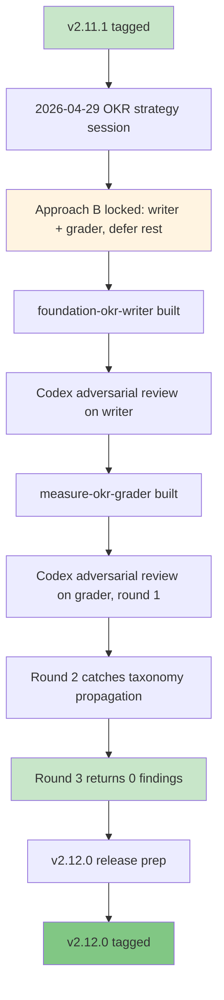

# Release v2.12.0. OKR Skills Launch

**Released**: 2026-05-01
**Type**: Feature release (minor)
**Skill count**: 40 (up from 38)
**Key theme**: OKR Skills set; full quarterly write-and-score cycle

---

## TL;DR

You can now run a complete quarterly OKR cycle through pm-skills. The new pair:

```
/okr-writer    # at cycle start: draft, review, rewrite, or coach OKRs
/okr-grader    # at cycle close: score, interpret evidence, prepare next cycle
```

Both skills ship together so the type enum (`committed | aspirational | learning | operational_health | compliance_or_safety`) is consistent across the write-and-score handoff, and so users do not see a writer that points to a not-yet-existing grader.

The grader enforces the misuse failure modes that make OKRs dangerous: it refuses to retroactively change targets, refuses to retroactively shrink committed scope to claim a pass, refuses to soften committed misses with aspirational scoring, refuses to average failed guardrails into the primary objective score, and refuses to use OKR scores as individual performance ratings.

Six thread-aligned library samples (3 per skill across storevine, brainshelf, and workbench) demonstrate the full surface: aspirational sweet-spot scoring, committed-fail handling, compliance_or_safety partial-coverage, indicator-class guardrail rules, retention-thesis invalidation, and the all-three-empowerment-modes (empowered, mixed, feature-team).

No behavioral changes to any pre-existing skill (a small cross-reference cleanup in the writer now points to the grader directly, since the grader exists).

---

## What changed



### Added

- **`foundation-okr-writer`** with command `/okr-writer`. Drafts, reviews, rewrites, and coaches outcome-based OKR sets across team, department, product, product-area, and company scopes. Five entry modes are detected from user phrasing:
  - **Guided** (default, moderate engagement): brief diagnostic, draft, score, surface issues, ask for confirmation.
  - **One-Shot** via `--oneshot`: complete OKR set in one pass with all assumptions labeled.
  - **Sustained Coach**: iterative loop, one component at a time, re-scored each turn.
  - **Audit Only**: score and critique an existing OKR set; no new drafts unless asked.
  - **Rewrite**: convert flawed OKRs, feature lists, or roadmap items into outcome-shaped OKRs.

  An empowered-team diagnostic captures whether the team can change initiatives mid-cycle if KRs are not moving, and adds a conditional Disclosure section to the artifact when feature-team signals are present rather than refusing to operate.

- **`measure-okr-grader`** with command `/okr-grader`. Scores completed OKRs against the canonical type enum:
  - `aspirational`: numeric on the 0 to 1 scale; sweet spot 0.6 to 0.7.
  - `committed`: pass or fail against the target; nothing below 1.0 is a pass.
  - `compliance_or_safety`: binary; no partial credit; no retroactive scope shrinkage.
  - `operational_health`: pass | fail | drift-within-tolerance against the threshold band.
  - `learning`: validated | invalidated | partially-validated | insufficient-evidence; no numeric score.

  Indicator class `guardrail` is independent of OKR type and adds a never-averaged-into-primary-score rule. Two special states prevent the most common misinterpretations: `not-yet-observable` for cycle-window extensions past close (90-day cohorts that finish in the next quarter) and `not-yet-fully-observable` for committed or compliance_or_safety KRs with partial coverage (cannot be retroactively shrunk to claim a pass on the observed subset).

- **6 thread-aligned library samples** in `library/skill-output-samples/`. 3 per skill (storevine, brainshelf, workbench).

  The storevine Campaigns thread now spans `measure-experiment-results`, `foundation-okr-writer`, and `measure-okr-grader` for a complete write-and-score arc on a single product context. Brainshelf samples demonstrate a retention-thesis invalidation: an at-scale replication study returned 1.6x vs the 3.4x observed in the original beta cohort. Workbench samples exercise the conventions the storevine and brainshelf samples do not: committed KR fail (10 of 12 onboardings, not softened to 0.83 aspirational), compliance_or_safety KR not-yet-fully-observable (1 of 3 audits completed, not retroactively scoped to claim a pass), and committed KR with `guardrail` indicator class.

- **`docs/skills/foundation/foundation-okr-writer.md`** and **`docs/skills/measure/measure-okr-grader.md`** mirror pages auto-generated by `scripts/generate-skill-pages.py`. Both skills appear in `mkdocs.yml` nav.

### Changed

- **`foundation-okr-writer/SKILL.md`** cross-reference cleanups now that the grader exists: line 45 redirects scoring users to `/okr-grader` directly; line 184 drops the "planned for a later release" framing. No behavioral change to the writer.

- **`utility-pm-skill-builder`** packet-format simplification (silent). The Step 5 Skill Implementation Packet was reduced from 13 to 12 items in the prior session. Nothing downstream depended on the removed item; the packet format change does not affect any shipped skill or sample. Bundled silently with the OKR launch per design.

- **README.md** skill counts updated 38 → 40 (26 phase + 8 foundation + 6 utility), version badge bumped 2.11.1 → 2.12.0.

- **`.claude-plugin/plugin.json`** and **`marketplace.json`** version bumped to 2.12.0; descriptions updated to reflect 40 skills and the new OKR Skills set.

- **`library/skill-output-samples/README_SAMPLES.md`** updated: total samples 120 → 126, total skills 38 → 40, Browse-by-Skill table extended, all three thread tables extended with OKR rows, footer version refreshed.

### Infrastructure / process

- **Phase 0 Adversarial Review Loop** applied per the v2.11.0 codification. Both skills passed through Codex adversarial review before commit:
  - The writer's review caught 1 generator-script bug (HTML attribution comment rendering as page H1 across all skill pages) and 1 nonexistent-command directive (the writer redirected scoring users to `/okr-grader` while the grader did not yet exist). Both resolved before the writer commit.
  - The grader's review took 3 rounds to converge. Round 1 caught 1 HIGH finding (workbench sample taught users to violate the grader's own compliance scoring rule by retroactively shrinking the committed scope) and 2 MEDIUM findings (`/define-hypothesis` nonexistent slash command in samples; OKR-type vs indicator-class taxonomy drift in SKILL.md). Round 2 caught 2 MEDIUM findings (taxonomy drift propagation to TEMPLATE.md and sample KR3 framings). Round 3 returned 0 findings. All resolved before the grader commit.

- **Em-dash sweep extension** across the auto-generated `docs/skills/` mirror to keep the mirror in sync with the standing no-em-dash rule applied to source SKILL.md files.

- **`docs/internal/audit-ci/` consolidated** into `docs/internal/audit/_archived/` to flatten the audit-history tree.

---

## Why this matters

OKRs are easy to ship as artifacts and very hard to ship as a working operating system. The literature converges on the same set of failure modes: feature-delivery KRs disguised as outcomes, fabricated baselines, missing evidence sources, naive cascading, compensation coupling, and committed misses softened by aspirational interpretation at cycle close.

The pm-skills contribution is to make those failure modes hard to ship past. The writer is a coach, not a template filler: it diagnoses empowered-team context, separates outcomes from work, applies the canonical OKR type enum, and runs a Quality Audit Rubric on every draft. The grader is an evidence interpreter, not an arithmetic engine: it scores per the type, applies indicator-class rules independently, and refuses the misuse patterns even when the user (or stakeholder) asks for them.

Both skills ship at the same time so the cross-skill hand-off is coherent at first appearance. The 6 thread samples cover the empowerment spectrum (empowered for storevine and brainshelf, mixed for workbench) and the OKR type spectrum (aspirational sweet-spot, deferred not-yet-observable, committed fail, compliance_or_safety partial coverage, indicator-class guardrail).

This is the first release where the new OKR Skills set ships with a Phase 0 Adversarial Review Loop trail in the release notes. The 3-round convergence on the grader is concrete evidence that adversarial review catches design-level pedagogical bugs (the workbench sample taught users to violate the rule the skill is supposed to enforce) that traditional review would have missed.

---

## Validation

- All 40 SKILL.md files pass `scripts/lint-skills-frontmatter.sh`
- `scripts/validate-commands.sh` passes (40 / 40 commands resolve to canonical SKILL.md paths)
- `scripts/validate-agents-md.sh` passes (40 skill paths matched in AGENTS.md)
- `scripts/generate-skill-pages.py` regenerates the docs/skills mirror without diff drift
- Codex adversarial review converged on stable findings (3 rounds for the grader, 1 round for the writer)
- Zero em-dash characters in tracked files
- Zero references to the silently removed Quality Forecast / K/P/C/W zone classification in tracked files

---

## Upgrade guide

If you installed pm-skills before v2.12.0, you have two options:

### Option A: Stay on v2.11.1 (no action needed)

The skills you already have keep working. v2.12.0 is purely additive for the OKR work; the only modification to a pre-existing skill is two cross-reference lines in `foundation-okr-writer` (which itself shipped in this release).

### Option B: Pull the OKR Skills set

Pull the v2.12.0 tag and the new commands appear:

```
/okr-writer    # at cycle start
/okr-grader    # at cycle close
```

Use the writer to draft or audit a quarterly OKR set. At cycle close, feed the OKR set plus final KR values to the grader for scoring, evidence interpretation, learning synthesis, and next-cycle recommendations.

---

## Links

- [Full changelog entry](../../CHANGELOG.md#2120--2026-05-01)
- [Internal release plan](../internal/release-plans/v2.12.0/plan_v2.12.0.md)
- [Skills manifest](../internal/release-plans/v2.12.0/skills-manifest.yaml)
- [foundation-okr-writer](../skills/foundation/foundation-okr-writer.md)
- [measure-okr-grader](../skills/measure/measure-okr-grader.md)
- [Library samples for foundation-okr-writer](https://github.com/product-on-purpose/pm-skills/tree/main/library/skill-output-samples/foundation-okr-writer)
- [Library samples for measure-okr-grader](https://github.com/product-on-purpose/pm-skills/tree/main/library/skill-output-samples/measure-okr-grader)
