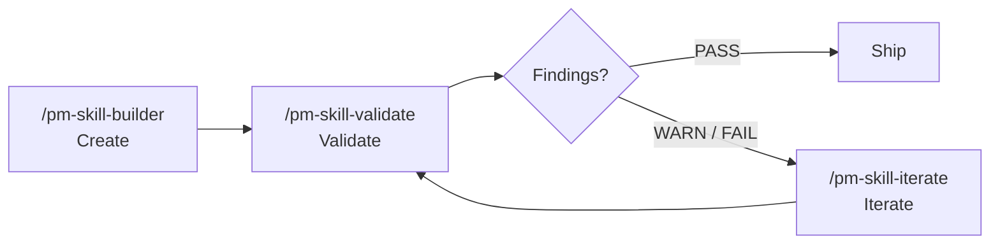

# PM-Skills v2.8.0 Release Notes

**Date**: 2026-04-03
**Status**: Ready for tag

---

## Executive Summary

v2.8.0 completes the **PM skill lifecycle**: **Create → Validate → Iterate**. Building on the PM Skill Builder shipped in v2.7.0, this release adds two companion utility skills . a validator that audits skills against conventions and quality criteria, and an iterator that applies targeted improvements. Together, the three tools form a self-reinforcing system for skill quality.

The release also introduces **skill versioning governance** (SemVer rules, HISTORY.md, skills-manifest.yaml), **advisory CI** for version tracking, and a **lifecycle guide** documenting workflow patterns.

**By the numbers:**
- **29 skills** (up from 27): 25 domain + 1 foundation + 3 utility
- **30 command docs** (up from 28): 29 skill commands + 1 workflow bundle
- **2 new CI scripts** (advisory): skill history + manifest validation
- **1 new public guide**: PM-Skill Lifecycle

---

## What's New and Why It Matters

### New Skill: `utility-pm-skill-validate` (F-10)

**What**: A utility skill that audits an existing pm-skills skill against structural conventions (mirroring CI) and LLM-assessed quality criteria.

**Why it matters**: CI catches structural issues (missing files, bad frontmatter), but can't assess quality . is the output contract complete? Does the example fill all template sections? Are checklist items testable? The validator goes deeper, producing a structured report with severity-graded findings and actionable recommendations that the iterator can consume.

**Key design decisions** (informed by Codex review):
- Pipe-delimited report format (`STATUS | TIER | CHECK-ID | message`) with `Report schema: v1` for forward compatibility
- Two-tier assessment rebaselined against actual shipped library . validates *current conventions* and surfaces the *v2.8 standard* as suggestions
- Tier 2 findings capped at WARN (except placeholder leakage which is objectively grounded)
- Single-skill detailed mode + batch Tier-1-only summary

**Use it**: `/pm-skill-validate deliver-prd`

**Issue**: [#121](https://github.com/product-on-purpose/pm-skills/issues/121)

---

### New Skill: `utility-pm-skill-iterate` (F-11)

**What**: A utility skill that applies targeted improvements to an existing skill based on feedback, validation reports, or convention changes.

**Why it matters**: Before the iterator, improving a skill meant manual editing with no structured workflow. The iterator normalizes any input (validation report, free text, convention change) into a structured change list, previews proposed edits as before/after blocks, and writes on confirmation. It also suggests version bumps and offers to maintain HISTORY.md.

**Key design decisions** (informed by Codex review):
- Before/after preview with stale-preview guard (re-reads files before writing)
- Version bump class suggested but not auto-written . prevents compounding across multiple iterations
- HISTORY.md creation offered at the second-version trigger point; format validated before append
- Unified flow with explicit input normalization step

**Use it**: `/pm-skill-iterate deliver-prd "output contract should list all template sections"`

**Issue**: [#122](https://github.com/product-on-purpose/pm-skills/issues/122)

---

### Lifecycle Guide (D-03)

**What**: `docs/pm-skill-lifecycle.md` . a public guide explaining the Create → Validate → Iterate lifecycle.

**Why it matters**: Three independent tools need a guide that explains how they work as a system. The guide includes four workflow patterns (new skill, improve existing, convention change, feedback loop), a CI vs validator comparison, and the quality standard model.

---

### CI: Skill Versioning Validation (M-18)

**What**: Two new advisory CI scripts: `validate-skill-history` and `validate-skills-manifest`.

**Why it matters**: As skills iterate through the lifecycle, version history (HISTORY.md) and release manifests (skills-manifest.yaml) need to stay in sync with frontmatter. These scripts catch drift automatically.

Both run with `continue-on-error: true` . advisory for now, blocking once adoption grows.

---

### Skill Versioning Governance

**What**: `docs/internal/skill-versioning.md` . defines how skill versions are tracked independently of repo versions.

**Key concepts**:
- Each skill has its own SemVer version in frontmatter, decoupled from the repo version
- `skills-manifest.yaml` in each release folder records which skill versions changed
- `HISTORY.md` per skill is created when a skill ships its second version
- Tie-breaker rule: new compliance requirement = major, additive/optional = minor, clarification only = patch

---

## The Complete Lifecycle

See `docs/pm-skill-lifecycle.md` for detailed workflow patterns.

---

## Infrastructure

- `docs/internal/releases/` renamed to `docs/internal/release-plans/` for clarity (34 files updated)
- `docs/internal/release-plans/v2.7.0/skills-manifest.yaml` . retroactive first use of manifest convention
- `docs/internal/release-plans/v2.8.0/` . full release governance with phased execution plan and Codex design review
- `docs/internal/backlog-canonical.md` updated with v2.8.0 assignments

---

## MCP Note

`pm-skills-mcp` needs a corresponding update after this release:
- Re-embed skills: `scripts/embed-skills.js` against the v2.8.0 tag
- New tools: `pm_pm_skill_validate`, `pm_pm_skill_iterate`
- Verify `utility-` prefix stripping produces correct tool names
- Both new skills read existing skill directories . verify MCP embedded content is sufficient
