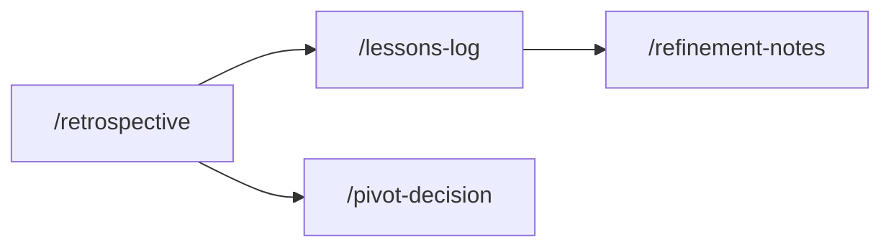

# Iterate Skills

## How these skills connect

## Skills in this phase

| Skill | Description | Command |
|-------|-------------|---------|
| [iterate-lessons-log](iterate-lessons-log.md) | Creates a structured lessons learned entry for organizational memory. Use after ... | `/lessons-log` |
| [iterate-pivot-decision](iterate-pivot-decision.md) | Documents a strategic pivot or persevere decision with the evidence, analysis, a... | `/pivot-decision` |
| [iterate-refinement-notes](iterate-refinement-notes.md) | Documents backlog refinement session outcomes including stories refined, estimat... | `/refinement-notes` |
| [iterate-retrospective](iterate-retrospective.md) | Facilitates and documents a team retrospective capturing what went well, what to... | `/retrospective` |
