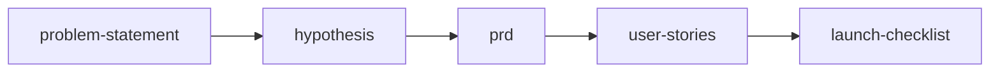

# Feature Kickoff Workflow

> Quick-start workflow for feature development

Feature Kickoff is a streamlined workflow for developing well-understood features where requirements are relatively clear and deep discovery isn't needed. It gets you from problem to launch efficiently.

## Workflow Metadata

| Field | Value |
|-------|-------|
| **Workflow** | Feature Kickoff |
| **Command** | `/workflow-feature-kickoff` |
| **Skills** | `define-problem-statement` → `define-hypothesis` → `deliver-prd` → `deliver-user-stories` → `deliver-launch-checklist` |
| **Phases Covered** | Define, Deliver |
| **Estimated Duration** | 4-6 hours |
| **Prerequisite Inputs** | A feature idea or customer request |
| **Final Output** | Sprint-ready user stories with launch plan |

---

## Overview

```
┌──────────────────────────────────────────────────────────────┐
│                                                              │
│  problem-statement → hypothesis → prd → user-stories → launch│
│                                                              │
└──────────────────────────────────────────────────────────────┘
```



This workflow assumes:
- The problem space is understood
- Users/customers are known
- Solution direction is clear
- Focus is on execution, not exploration

---

## When to Use

**Use Feature Kickoff when:**

- Building incremental features on existing products
- Requirements are clear from customer requests or internal needs
- Team has context on the problem space
- Similar features have been built before
- Time-to-market is a priority

**Don't use Feature Kickoff when:**

- Entering new markets or user segments → Use [Triple Diamond](triple-diamond.md)
- High uncertainty about problem or solution → Use [Lean Startup](lean-startup.md)
- Strategic pivots or major direction changes → Use [Triple Diamond](triple-diamond.md)
- Complex stakeholder alignment needed → Add discovery phase

---

## Core Sequence

### Step 1: Problem Statement

**Skill:** [`define-problem-statement`](../skills/define/define-problem-statement.md)

**Purpose:** Ensure everyone agrees on what problem we're solving before diving into solutions.

**Time:** 30 minutes - 1 hour

**Key Outputs:**
- Clear problem framing
- User impact articulated
- Success criteria defined
- Scope boundaries set

**Example output:**
> Mobile users abandon checkout 73% of the time because the 4-step process is too long. Success means reducing abandonment to under 60% within 3 months.

---

### Step 2: Hypothesis

**Skill:** [`define-hypothesis`](../skills/define/define-hypothesis.md)

**Purpose:** State what we believe will solve the problem and how we'll know if we're right.

**Time:** 15-30 minutes

**Key Outputs:**
- Testable hypothesis statement
- Primary success metric
- Secondary/guardrail metrics

**Example output:**
> We believe that simplifying checkout to a single page for returning users will reduce abandonment from 73% to 55% as measured by checkout completion rate, without negatively impacting average order value.

---

### Step 3: PRD

**Skill:** [`deliver-prd`](../skills/deliver/deliver-prd.md)

**Purpose:** Specify what we're building in enough detail for engineering to execute.

**Time:** 1-2 hours

**Key Outputs:**
- Requirements specification
- Scope (in/out)
- Technical considerations
- Success metrics
- Dependencies and risks

**Tip:** For Feature Kickoff, keep the PRD concise. Focus on what's needed to build and ship, not exhaustive documentation.

---

### Step 4: User Stories

**Skill:** [`deliver-user-stories`](../skills/deliver/deliver-user-stories.md)

**Purpose:** Break the PRD into implementable, estimable stories for sprint planning.

**Time:** 30 minutes - 1 hour

**Key Outputs:**
- User stories with acceptance criteria
- INVEST-compliant stories
- Story points/estimates
- Dependencies identified

**Story format:**
```
As a [persona], I want [action] so that [benefit]

Acceptance Criteria:
- Given [context], when [action], then [result]
```

---

### Step 5: Launch Checklist

**Skill:** [`deliver-launch-checklist`](../skills/deliver/deliver-launch-checklist.md)

**Purpose:** Ensure nothing is forgotten before shipping.

**Time:** 30 minutes to create, ongoing to complete

**Key Outputs:**
- Cross-functional checklist
- Owner assignments
- Go/no-go criteria
- Rollback plan

---

## Complete Feature Kickoff

```
Day 1:  Problem Statement (team alignment)
        ↓
Day 1:  Hypothesis (testable assumption)
        ↓
Day 1-2: PRD (specification)
        ↓
Day 2:  User Stories (sprint-ready tickets)
        ↓
Sprint: Development
        ↓
Launch: Launch Checklist (pre-launch validation)
```

**Total time to kickoff:** 4-6 hours (can be done in one day)

---

## Optional Extensions

Add these skills when the situation calls for more depth:

### Before PRD

| Add When | Skill |
|----------|-------|
| Complex UX decisions | [`develop-design-rationale`](../skills/develop/develop-design-rationale.md) |
| Technical uncertainty | [`develop-spike-summary`](../skills/develop/develop-spike-summary.md) |
| Architecture impact | [`develop-adr`](../skills/develop/develop-adr.md) |

### During Development

| Add When | Skill |
|----------|-------|
| Complex feature | [`deliver-edge-cases`](../skills/deliver/deliver-edge-cases.md) |
| Needs measurement | [`measure-instrumentation-spec`](../skills/measure/measure-instrumentation-spec.md) |

### After Launch

| Add When | Skill |
|----------|-------|
| A/B testing | [`measure-experiment-design`](../skills/measure/measure-experiment-design.md) |
| Team reflection | [`iterate-retrospective`](../skills/iterate/iterate-retrospective.md) |
| Communication | [`deliver-release-notes`](../skills/deliver/deliver-release-notes.md) |

---

## Example: Feature Kickoff in Action

### Context
E-commerce platform adding "Save for Later" feature to shopping cart.

### Step 1: Problem Statement

**Problem:** Users often leave items in cart that they're not ready to buy today, then forget about them. Cart clutter leads to decision fatigue and abandoned carts.

**User Impact:** 35% of cart items sit for 7+ days untouched. Users report "cart anxiety" in interviews.

**Success Criteria:**
- Reduce untouched cart items from 35% to 20%
- Increase cart-to-purchase conversion by 5%

---

### Step 2: Hypothesis

> We believe that adding a "Save for Later" section below the cart will help users organize their shopping intentions, reducing cart anxiety, because it separates "ready to buy" from "considering" items.

**Primary metric:** Cart-to-purchase conversion rate
**Guardrail:** Average order value (should not decrease)

---

### Step 3: PRD Summary

**In Scope:**
- "Save for Later" button on each cart item
- Separate "Saved Items" section below cart
- Move back to cart functionality
- Persisted for logged-in users

**Out of Scope:**
- Guest user persistence
- Wishlists (separate feature)
- Social sharing of saved items

---

### Step 4: User Stories (excerpt)

**US-001: Save item for later**
> As a shopper, I want to move an item from my cart to "Saved for Later" so that I can keep it visible without cluttering my active cart.

Acceptance Criteria:
- Given I have items in my cart
- When I click "Save for Later" on an item
- Then the item moves to the Saved Items section
- And the cart total updates to exclude that item

**US-002: Move saved item to cart**
> As a shopper, I want to move a saved item back to my cart so that I can purchase it when I'm ready.

---

### Step 5: Launch Checklist (excerpt)

- [x] Feature complete in staging
- [x] QA sign-off
- [x] Mobile responsive verified
- [x] Analytics events implemented
- [ ] Support team briefed
- [ ] A/B experiment configured (10% rollout)
- [ ] Rollback plan documented

---

## Tips for Effective Kickoffs

### Do

- Time-box each step to maintain momentum
- Include engineering in PRD creation
- Define "done" before starting
- Keep documents lightweight for simple features

### Don't

- Skip the problem statement ("we know what to build")
- Over-document for small features
- Forget instrumentation until launch
- Treat kickoff as a handoff.it's a collaboration

---

## Quick Reference

| Step | Skill | Time | Output |
|------|-------|------|--------|
| 1 | problem-statement | 30-60 min | Problem framing doc |
| 2 | hypothesis | 15-30 min | Testable hypothesis |
| 3 | prd | 1-2 hrs | Requirements spec |
| 4 | user-stories | 30-60 min | Sprint-ready stories |
| 5 | launch-checklist | 30 min | Pre-launch checklist |

**Total:** ~4-6 hours to kick off a feature

---

## Quality Checklist

Before considering this workflow complete, verify:

- [ ] Problem statement has measurable success criteria
- [ ] Hypothesis is specific and falsifiable
- [ ] PRD scope is clear (in/out)
- [ ] User stories have Given/When/Then acceptance criteria
- [ ] Launch checklist has owners for every item

---

## See Also

- [Triple Diamond Workflow](triple-diamond.md) . For comprehensive product development
- [Lean Startup Workflow](lean-startup.md) . For rapid hypothesis validation

---

*Part of [PM-Skills](https://github.com/product-on-purpose/pm-skills/blob/main/README.md) . Open source Product Management skills for AI agents*

