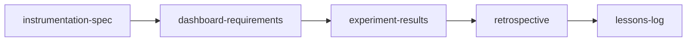

# Post-Launch Learning Workflow

> **Set up measurement, evaluate results, and capture learnings after a feature ships.**

---

## Workflow Metadata

| Field | Value |
|-------|-------|
| **Workflow** | Post-Launch Learning |
| **Command** | `/workflow-post-launch-learning` |
| **Skills** | `instrumentation-spec` -> `dashboard-requirements` -> `experiment-results` -> `retrospective` -> `lessons-log` |
| **Phases Covered** | Measure, Iterate |
| **Estimated Duration** | 3-6 hours (spread across pre-launch prep + post-launch evaluation) |
| **Prerequisite Inputs** | A shipped (or about-to-ship) feature with defined success metrics |
| **Final Output** | A complete learning cycle: instrumented tracking, dashboard, evaluated results, team retrospective, and documented lessons |

---

## When to Use This Workflow

Use the Post-Launch Learning workflow when:

- A feature has shipped (or is about to ship) and you need to set up proper measurement
- You launched something but never circled back to evaluate whether it worked
- You want to build a "measure and learn" habit into your team's workflow
- You need to decide whether to invest further in a shipped feature or move on
- You want to capture institutional knowledge so the team does not repeat mistakes

**Do NOT use this workflow when:**

- You are designing an experiment before building anything (use [Lean Startup](lean-startup.md) instead)
- You have not shipped yet and are still in the planning phase (use [Feature Kickoff](feature-kickoff.md) instead)
- You need to define what to build (use [Customer Discovery](customer-discovery.md) or [Product Strategy](product-strategy.md) instead)

---

## Workflow Steps

### Step 1: Instrumentation Spec (Pre-Launch or Immediately Post-Launch)

**Skill:** [`instrumentation-spec`](../skills/measure/measure-instrumentation-spec.md)
**Command:** `/instrumentation-spec`

**What you do:**

Define the events, properties, and tracking requirements needed to measure this feature's performance. Ideally done before launch, but can be done immediately after if tracking was not included in the initial release.

**Input requirements:**

- Feature description and user flows
- Success metrics from the PRD or launch plan
- Analytics platform(s) in use (e.g., Amplitude, Mixpanel, GA4, custom)

**Output:** An instrumentation spec with event taxonomy, event properties, user properties, and implementation guidance for engineering.

**Handoff to next step:** The event taxonomy and tracked metrics become the data sources for your dashboard. Share the spec with engineering for implementation (or verification if already implemented).

---

### Step 2: Dashboard Requirements

**Skill:** [`dashboard-requirements`](../skills/measure/measure-dashboard-requirements.md)
**Command:** `/dashboard-requirements`

**What you do:**

Define the analytics dashboard that will let you monitor the feature's performance over time. Specify which metrics to display, how to segment them, alert thresholds, and refresh cadence.

**Input requirements:**

- Instrumentation spec from Step 1
- Success metrics and targets from the PRD or launch plan
- Audience for the dashboard (PM only? Leadership? The whole team?)

**Output:** Dashboard requirements including metric definitions, visualizations, segmentation dimensions, alert thresholds, and access/sharing settings.

**Handoff to next step:** Allow sufficient time for data to accumulate (typically 2-4 weeks for feature adoption metrics, longer for retention or revenue metrics). Then move to Step 3 to evaluate results.

---

### Step 3: Experiment Results

**Skill:** [`experiment-results`](../skills/measure/measure-experiment-results.md)
**Command:** `/experiment-results`

**What you do:**

Evaluate the feature's performance against the success metrics defined in your PRD or launch plan. Even if you did not run a formal A/B test, this skill structures the analysis of outcomes vs. expectations.

**Input requirements:**

- Dashboard data after sufficient observation period
- Original success metrics and targets
- Any qualitative signals (support tickets, user feedback, NPS changes)

**Output:** An experiment results document with metric performance vs. targets, statistical analysis (if applicable), qualitative findings, and a recommendation (iterate, scale, sunset, or pivot).

**Handoff to next step:** The results and recommendation feed into the team retrospective. Prepare to discuss not just *what* happened but *why* and *what would you do differently*.

---

### Step 4: Retrospective

**Skill:** [`retrospective`](../skills/iterate/iterate-retrospective.md)
**Command:** `/retrospective`

**What you do:**

Facilitate a team retrospective covering the entire lifecycle of this feature: from planning through launch through measurement. Focus on process improvements, not just outcomes.

**Input requirements:**

- Experiment results from Step 3
- Team observations and feedback
- Timeline of key decisions, delays, or pivots during development

**Output:** A retrospective document with what went well, what did not go well, action items with owners and deadlines, and process improvement recommendations.

**Handoff to next step:** The retrospective's insights and action items should be distilled into durable lessons that outlive the specific feature context.

---

### Step 5: Lessons Log

**Skill:** [`lessons-log`](../skills/iterate/iterate-lessons-log.md)
**Command:** `/lessons-log`

**What you do:**

Distill the retrospective findings into reusable lessons that build organizational memory. Each lesson should be specific enough to be actionable and general enough to apply beyond this single feature.

**Input requirements:**

- Retrospective document from Step 4
- Any patterns you have noticed across multiple features or sprints

**Output:** A lessons log entry (or entries) with lesson title, context, insight, recommended action, and applicability tags.

---

## Context Flow Diagram

```
Shipped Feature + Success Metrics
       |
       v
[instrumentation-spec]        <-- Ideally pre-launch
  Event taxonomy, tracking plan
       |
       v
[dashboard-requirements]
  Metrics dashboard spec
       |
       |  ~~~ Wait for data (2-4+ weeks) ~~~
       |
       v
[experiment-results]
  Performance vs. targets, recommendation
       |
       v
[retrospective]
  What worked, what didn't, action items
       |
       v
[lessons-log]
  Durable organizational learnings
```



---

## Tips and Variations

**Split execution:** Steps 1-2 should happen at or before launch. Steps 3-5 happen weeks later after data accumulates. Plan the gap intentionally; do not let it stretch indefinitely.

**Lightweight version:** If you already have tracking and dashboards in place, skip Steps 1-2 and start at Step 3 (experiment-results).

**Continuous version:** For features with ongoing iteration, run Steps 3-5 on a regular cadence (e.g., monthly) to track performance trends over time.

**Pairing with other workflows:**
- Natural successor to [Feature Kickoff](feature-kickoff.md) (which ends at launch; this picks up after)
- Can trigger a new [Lean Startup](lean-startup.md) cycle if results suggest pivoting
- Can trigger a new [Sprint Planning](sprint-planning.md) cycle if results suggest iterating

**Anti-pattern to avoid:** Do not skip Steps 4-5. Many teams instrument and measure but never close the loop with retrospective and lessons. The learning compounds over time; the measurement alone does not.

---

## Quality Checklist

Before considering this workflow complete, verify:

- [ ] Instrumentation spec covers both success metrics AND diagnostic metrics (so you can debug, not just report)
- [ ] Dashboard is designed for its actual audience (executive dashboards differ from team dashboards)
- [ ] Experiment results include both quantitative AND qualitative signals
- [ ] Results document includes a clear recommendation (iterate, scale, sunset, or pivot), not just data
- [ ] Retrospective action items have owners and deadlines (not just "we should do better")
- [ ] Lessons log entries are generalizable beyond the specific feature
- [ ] The learning cycle is closed: lessons should visibly influence future planning

---

## See Also

- [Feature Kickoff](feature-kickoff.md) . The workflow that typically precedes this one, ending at launch
- [Lean Startup](lean-startup.md) . If results suggest pivoting, use this to design the next experiment
- [Sprint Planning](sprint-planning.md) . If results suggest iterating, use this to plan the next sprint

---

*Part of [PM-Skills](https://github.com/product-on-purpose/pm-skills/blob/main/README.md) . Open source Product Management skills for AI agents*
