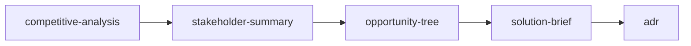

# Product Strategy Workflow

> **Frame a major initiative with competitive context, stakeholder alignment, and documented architectural decisions.**

---

## Workflow Metadata

| Field | Value |
|-------|-------|
| **Workflow** | Product Strategy |
| **Command** | `/workflow-product-strategy` |
| **Skills** | `competitive-analysis` -> `stakeholder-summary` -> `opportunity-tree` -> `solution-brief` -> `adr` |
| **Phases Covered** | Discover, Define, Develop |
| **Estimated Duration** | 4-8 hours |
| **Prerequisite Inputs** | A strategic initiative, market opportunity, or executive directive that requires structured analysis before committing to a solution |
| **Final Output** | A solution brief backed by competitive intelligence, stakeholder mapping, prioritized opportunities, and documented architectural decisions |

---

## When to Use This Workflow

Use the Product Strategy workflow when:

- You are kicking off a major initiative that spans multiple quarters or teams
- Leadership has identified a strategic direction and you need to frame it rigorously before building a PRD
- You need to build a compelling case that includes market context, not just customer needs
- You are entering a new market segment or responding to competitive pressure
- The initiative involves significant architectural decisions that should be documented early

**Do NOT use this workflow when:**

- You are working on a small feature with clear requirements (use [Feature Kickoff](feature-kickoff.md) instead)
- You are focused purely on customer research without a strategic framing (use [Customer Discovery](customer-discovery.md) instead)
- You need the full lifecycle from discovery through delivery (use [Triple Diamond](triple-diamond.md) instead)
- You are doing rapid experimentation to validate a hypothesis (use [Lean Startup](lean-startup.md) instead)

---

## Workflow Steps

### Step 1: Competitive Analysis

**Skill:** [`competitive-analysis`](../skills/discover/discover-competitive-analysis.md)
**Command:** `/competitive-analysis`

**What you do:**

Map the competitive landscape relevant to your initiative. Identify direct competitors, adjacent competitors, and alternative solutions. Document their strengths, weaknesses, positioning, and recent moves.

**Input requirements:**

- The strategic initiative or market opportunity you are exploring
- Known competitors (the skill will help identify others)
- Specific dimensions to evaluate (features, pricing, market positioning, technology approach)

**Output:** A competitive analysis document with landscape overview, competitor profiles, feature/capability comparison, gap analysis, and strategic implications.

**Handoff to next step:** The "Gap Analysis" and "Strategic Implications" sections inform your stakeholder conversations. Understanding where competitors are strong and weak helps you frame the initiative in terms stakeholders care about.

---

### Step 2: Stakeholder Summary

**Skill:** [`stakeholder-summary`](../skills/discover/discover-stakeholder-summary.md)
**Command:** `/stakeholder-summary`

**What you do:**

Map the stakeholder landscape for this initiative. Identify who has influence, who is affected, what each stakeholder cares about, and how to engage them. This step ensures you are building the right thing for the right audience, including internal audiences.

**Input requirements:**

- Competitive analysis from Step 1 (provides market context)
- The initiative scope and known organizational dynamics
- Any existing stakeholder relationships or political considerations

**Output:** A stakeholder map with influence/interest grid, individual stakeholder profiles, communication preferences, engagement strategy, and potential blockers.

**Handoff to next step:** Stakeholder needs and priorities inform the opportunity tree's outcome selection. If your VP of Engineering cares about scalability and your CPO cares about time-to-market, those become constraints on which opportunities you prioritize.

---

### Step 3: Opportunity Tree

**Skill:** [`opportunity-tree`](../skills/define/define-opportunity-tree.md)
**Command:** `/opportunity-tree`

**What you do:**

Build a Teresa Torres-style opportunity tree anchored to the strategic outcome this initiative targets. Map opportunities (customer needs and market gaps from Steps 1-2) and potential solution directions.

**Input requirements:**

- Competitive gaps and strategic implications from Step 1
- Stakeholder priorities and constraints from Step 2
- Target business outcome (revenue, retention, market share, etc.)

**Output:** An opportunity tree with the target outcome, prioritized opportunity nodes, and initial solution hypotheses for the top opportunities.

**Handoff to next step:** Select the top 1-2 opportunities and their most promising solution hypotheses. These become the foundation for the solution brief.

---

### Step 4: Solution Brief

**Skill:** [`solution-brief`](../skills/develop/develop-solution-brief.md)
**Command:** `/solution-brief`

**What you do:**

Create a concise, one-page solution pitch for the selected opportunity. The brief should be compelling enough to secure resources but concise enough for executive review.

**Input requirements:**

- Selected opportunity and solution hypothesis from Step 3
- Competitive positioning from Step 1 (why this solution wins)
- Stakeholder priorities from Step 2 (frame benefits in their terms)

**Output:** A solution brief with problem summary, proposed solution, key benefits, success metrics, risks, and resource requirements.

**Handoff to next step:** Any significant technical decisions embedded in the solution brief should be formalized as Architecture Decision Records. Common triggers: technology selection, build vs. buy, integration approach, data model changes.

---

### Step 5: Architecture Decision Record

**Skill:** [`adr`](../skills/develop/develop-adr.md)
**Command:** `/adr`

**What you do:**

Document the key architectural decisions implied by the solution brief. Each ADR captures the decision context, options considered, decision made, and consequences. This creates a durable record of *why* decisions were made, not just *what* was decided.

**Input requirements:**

- Solution brief from Step 4
- Technical constraints and considerations
- Options that were evaluated and rejected (and why)

**Output:** One or more ADRs in Nygard format, each documenting a significant technical decision with status, context, decision, and consequences.

---

## Context Flow Diagram

```
Strategic Initiative / Market Opportunity
       |
       v
[competitive-analysis]
  Market landscape, gaps, implications
       |
       v
[stakeholder-summary]
  Influence map, priorities, engagement plan
       |
       v
[opportunity-tree]
  Prioritized opportunities, solution hypotheses
       |
       v
[solution-brief]
  One-page solution pitch
       |
       v
[adr]
  Documented architectural decisions
```



---

## Tips and Variations

**Abbreviated version:** For initiatives where the competitive landscape is well-known, start at Step 2 (stakeholder-summary) and reference existing competitive intelligence rather than producing a fresh analysis.

**Extended version:** After completing this workflow, feed the solution brief directly into the [Feature Kickoff](feature-kickoff.md) workflow to move from strategy to execution (solution-brief -> hypothesis -> prd -> user-stories -> launch-checklist).

**Multiple ADRs:** Complex initiatives may produce 2-5 ADRs. Common decision categories:
- Technology/framework selection
- Build vs. buy vs. partner
- Data architecture
- Integration approach
- Security/compliance model

**Board-ready output:** Steps 1-4 together produce a strong strategic narrative for board or executive presentations. The competitive analysis provides market context, stakeholder summary shows organizational readiness, and the solution brief delivers the pitch.

**Pairing with other workflows:**
- Precedes [Feature Kickoff](feature-kickoff.md) or [Sprint Planning](sprint-planning.md) for execution
- Complements [Customer Discovery](customer-discovery.md) (use Customer Discovery for the "why," Product Strategy for the "where")

---

## Quality Checklist

Before considering this workflow complete, verify:

- [ ] Competitive analysis covers direct competitors, adjacent players, AND alternative solutions (not just feature-for-feature comparison)
- [ ] Stakeholder map identifies both supporters and potential blockers
- [ ] Opportunity tree is anchored to a measurable business outcome
- [ ] Solution brief is concise enough for a 5-minute executive read
- [ ] Solution brief frames benefits in stakeholder terms (from Step 2), not just customer terms
- [ ] ADRs document rejected alternatives, not just the chosen option
- [ ] ADRs include consequences (both positive and negative) of each decision
- [ ] There is a clear evidence trail from competitive gaps -> opportunities -> solution -> decisions

---

## See Also

- [Customer Discovery](customer-discovery.md) . When you need more research before committing to a strategic direction
- [Stakeholder Alignment](stakeholder-alignment.md) . To get buy-in on the strategy from leadership and cross-functional partners
- [Technical Discovery](technical-discovery.md) . For evaluating technical feasibility of the proposed solution

---

*Part of [PM-Skills](https://github.com/product-on-purpose/pm-skills/blob/main/README.md) . Open source Product Management skills for AI agents*
