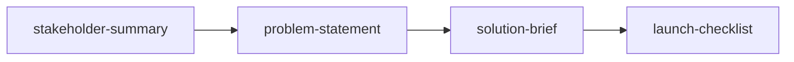

# Stakeholder Alignment Workflow

> **Build a compelling case for leadership buy-in before committing resources.**

---

## Workflow Metadata

| Field | Value |
|-------|-------|
| **Workflow** | Stakeholder Alignment |
| **Command** | `/workflow-stakeholder-alignment` |
| **Skills** | `stakeholder-summary` -> `problem-statement` -> `solution-brief` -> `launch-checklist` |
| **Phases Covered** | Discover, Define, Deliver |
| **Estimated Duration** | 2-4 hours |
| **Prerequisite Inputs** | An initiative that needs leadership or cross-functional approval before proceeding |
| **Final Output** | A stakeholder-aware pitch package: who cares, what the problem is, what you propose, and what launch looks like |

---

## When to Use This Workflow

Use the Stakeholder Alignment workflow when:

- You need executive or cross-functional approval before committing engineering resources
- You are presenting to leadership and need a structured narrative (not a PRD)
- Multiple stakeholders have competing priorities and you need to frame your initiative in terms they each care about
- You are navigating organizational politics and want to de-risk the approval process
- You are proposing something that crosses team boundaries and requires coordinated buy-in

**Do NOT use this workflow when:**

- You already have approval and need to move to execution (use [Feature Kickoff](feature-kickoff.md) or [Sprint Planning](sprint-planning.md) instead)
- Your audience is the engineering team, not leadership (use [Feature Kickoff](feature-kickoff.md) instead)
- You need deep competitive or market analysis (use [Product Strategy](product-strategy.md) instead)
- You are validating demand, not seeking approval (use [Lean Startup](lean-startup.md) instead)

---

## Workflow Steps

### Step 1: Stakeholder Summary

**Skill:** [`stakeholder-summary`](../skills/discover/discover-stakeholder-summary.md)
**Command:** `/stakeholder-summary`

**What you do:**

Map every stakeholder who has influence over or is affected by this initiative. Understand their priorities, concerns, communication preferences, and decision-making criteria.

**Input requirements:**

- The initiative you are seeking approval for
- Organizational context: who are the decision-makers, influencers, and affected parties?
- Any known political dynamics, recent decisions, or competing initiatives

**Output:** A stakeholder map with influence/interest grid, individual profiles (what they care about, potential objections), and an engagement strategy.

**Handoff to next step:** Use the "What They Care About" and "Potential Objections" sections to shape how you frame the problem statement. A CFO cares about cost; a CTO cares about technical debt; a CPO cares about user impact. Frame accordingly.

---

### Step 2: Problem Statement

**Skill:** [`problem-statement`](../skills/define/define-problem-statement.md)
**Command:** `/problem-statement`

**What you do:**

Frame the problem in terms that resonate with your stakeholder audience. This is not a neutral, research-driven problem statement (that is what [Customer Discovery](customer-discovery.md) produces). This is a persuasive, stakeholder-aware framing.

**Input requirements:**

- Stakeholder priorities and concerns from Step 1
- Customer evidence or business data that supports the problem's importance
- Business impact: revenue at risk, cost of inaction, competitive exposure

**Output:** A problem statement that connects customer pain to business impact, framed in the language your stakeholders use.

**Handoff to next step:** The problem statement's "Impact Assessment" and "Success Criteria" sections directly inform the solution brief. The problem framing sets up the "why" that makes the solution brief's "what" compelling.

---

### Step 3: Solution Brief

**Skill:** [`solution-brief`](../skills/develop/develop-solution-brief.md)
**Command:** `/solution-brief`

**What you do:**

Propose a solution in a concise, executive-ready format. The brief should answer: what you propose, why it solves the problem, what success looks like, what it costs, and what the risks are.

**Input requirements:**

- Problem statement from Step 2
- Stakeholder priorities from Step 1 (frame benefits per stakeholder)
- Rough scope, timeline, and resource requirements

**Output:** A one-page solution brief with proposed approach, key benefits (mapped to stakeholder priorities), success metrics, resource ask, risks, and mitigations.

**Handoff to next step:** Once the solution brief is approved (or as part of the pitch), include a concrete launch plan to demonstrate execution readiness. Nothing builds stakeholder confidence like showing you have thought through the "how," not just the "what."

---

### Step 4: Launch Checklist

**Skill:** [`launch-checklist`](../skills/deliver/deliver-launch-checklist.md)
**Command:** `/launch-checklist`

**What you do:**

Create a comprehensive launch checklist that demonstrates you have thought through every aspect of execution: engineering readiness, QA, documentation, support training, communications, rollback plan, and success measurement.

**Input requirements:**

- Solution brief from Step 3
- Known constraints (timeline, team size, dependencies)
- Launch expectations (big-bang vs. phased rollout, internal vs. external)

**Output:** A launch checklist organized by category (engineering, QA, docs, support, marketing, analytics) with owners, deadlines, and status tracking.

---

## Context Flow Diagram

```
Initiative Needing Approval
       |
       v
[stakeholder-summary]
  Who cares, what they care about
       |
       v
[problem-statement]
  Stakeholder-framed problem
       |
       v
[solution-brief]
  Executive-ready pitch
       |
       v
[launch-checklist]
  Execution readiness plan
```



---

## Tips and Variations

**Pre-meeting prep:** Run Steps 1-3 before your pitch meeting. Bring the launch checklist as a "we are ready to execute" signal, but do not lead with it.

**Objection handling:** Use the stakeholder summary's "Potential Objections" to proactively address concerns in your solution brief. Each objection should have a corresponding mitigation or framing.

**Async approval:** If your organization uses async decision-making (e.g., Amazon-style 6-pagers), Steps 2-3 together form the core of your written proposal. The stakeholder summary is your prep work; the launch checklist is your appendix.

**Iterative alignment:** For politically complex initiatives, share the problem statement (Step 2) with key stakeholders individually before the group pitch. Incorporate their feedback before presenting the solution brief. This "pre-wire" approach dramatically increases approval rates.

**Pairing with other workflows:**
- After approval, transition to [Feature Kickoff](feature-kickoff.md) (the problem statement and solution brief feed directly into hypothesis and PRD)
- If stakeholder feedback reveals you need more evidence, loop back to [Customer Discovery](customer-discovery.md)

---

## Quality Checklist

Before considering this workflow complete, verify:

- [ ] Stakeholder map is complete (no one who could block or derail was missed)
- [ ] Problem statement uses stakeholder language, not PM jargon
- [ ] Problem statement quantifies business impact (dollars, users, or competitive risk)
- [ ] Solution brief is genuinely one page (or 5-minute read max)
- [ ] Solution brief maps each benefit to a specific stakeholder priority
- [ ] Resource ask is concrete (team size, timeline, dependencies), not vague
- [ ] Launch checklist demonstrates execution maturity without over-engineering
- [ ] Risks are acknowledged with mitigations, not hidden or minimized

---

## See Also

- [Product Strategy](product-strategy.md) . For deeper strategic analysis including competitive landscape and opportunity mapping
- [Feature Kickoff](feature-kickoff.md) . After approval, move to execution with the full problem-to-launch flow
- [Customer Discovery](customer-discovery.md) . If stakeholders want more evidence before committing

---

*Part of [PM-Skills](https://github.com/product-on-purpose/pm-skills/blob/main/README.md) . Open source Product Management skills for AI agents*
