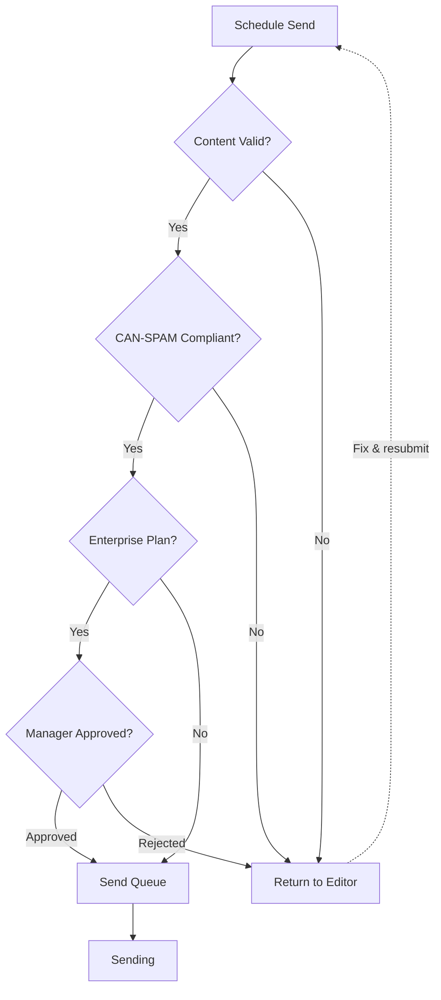

<!-- PM-Skills | https://github.com/product-on-purpose/pm-skills | Apache 2.0 -->
---
artifact: mermaid-diagram
version: "1.0"
repo_version: "2.10.0"
skill_version: "1.0.0"
created: 2026-04-11
status: sample
thread: storevine
context: Storevine B2B ecommerce platform . mermaid flowchart for Campaigns email send approval workflow
---

## Scenario

Storevine's growth PM needed a visual for the PRD showing how a merchant's email campaign moves through the approval and send workflow. Stakeholders kept asking what happens between clicking "Schedule Send" and the email actually going out. A text description was not sticking, so the PM used the mermaid diagrams skill to create a flowchart with the planning worksheet approach.

---

## Prompt

```
/mermaid-diagrams

I need a flowchart showing the Campaigns email send approval workflow. When a merchant clicks "Schedule Send," the campaign goes through content validation, compliance checks (CAN-SPAM), optional manager approval (for merchants on the Enterprise plan), and then queues for send. If any check fails, the merchant gets sent back to the editor with specific errors. I want to show this in the Campaigns PRD.
```

---

## Output

# Mermaid Diagram Planning Worksheet

## 1. Diagram Purpose

**What I'm showing:** The decision path a campaign follows from "Schedule Send" through validation, compliance, optional approval, and final send queue -- including failure paths back to the editor.
**Audience:** Engineering leads and merchant success stakeholders reading the Campaigns PRD.
**Where this will appear:** Campaigns PRD, "Send Workflow" section.

## 2. Cardinal Rule Check

- [x] This shows branching, relationships, or flow that a list would flatten
- [x] A numbered list or table would NOT communicate this more clearly

There are three decision points (content validation, CAN-SPAM compliance, manager approval) and a conditional branch (Enterprise plan check). A list would hide the branching and the two different failure return paths.

## 3. Diagram Type Selection

**Selected type:** Flowchart
**Why this type:** Multiple decision diamonds with branching outcomes and a conditional gate -- flowcharts handle this precisely.
**Considered alternatives:** Sequence diagram (would show participants but obscure the decision logic); state diagram (focuses on lifecycle states, not the process flow).

## 4. Node Inventory

| Node/Entity | Role/Label | Notes |
|-------------|-----------|-------|
| schedule | Schedule Send | Entry point -- merchant action |
| validate | Content Valid? | Checks for empty fields, broken images |
| compliance | CAN-SPAM Compliant? | Unsubscribe link, physical address, subject line |
| planCheck | Enterprise Plan? | Conditional gate for approval |
| approval | Manager Approval? | Enterprise-only review step |
| queue | Send Queue | Campaign enters delivery pipeline |
| editor | Return to Editor | Failure path with specific errors |
| sent | Sending | Terminal -- handoff to email service |

**Total node count:** 8 (within flowchart limit of 12)

## 5. Draft Mermaid Code



## 6. Validation Checklist

- [x] Renders without error (tested in mermaid.live)
- [x] Cardinal rule satisfied -- a list or table would not communicate this more clearly
- [x] Not a linear sequence -- has branching, relationships, or hierarchy
- [x] Labels with spaces/special characters are quoted
- [x] Special characters escaped where needed
- [x] Node count within type limit (8 of 12)
- [x] Colors are accessible (using default mermaid theme, no custom colors)
- [x] Color is never the sole differentiator -- shapes and labels distinguish elements
- [x] Has descriptive title and surrounding context in the PRD
- [x] `%%` comments document the diagram purpose

**What this communicates:** The diagram reveals that campaign sending is not a single action -- it passes through up to three gates depending on plan tier. The dotted "Fix & resubmit" line back to the start makes it clear that failures are recoverable, not terminal. Enterprise merchants can immediately see their additional approval step, and engineering can see that the compliance check is independent of plan tier.
