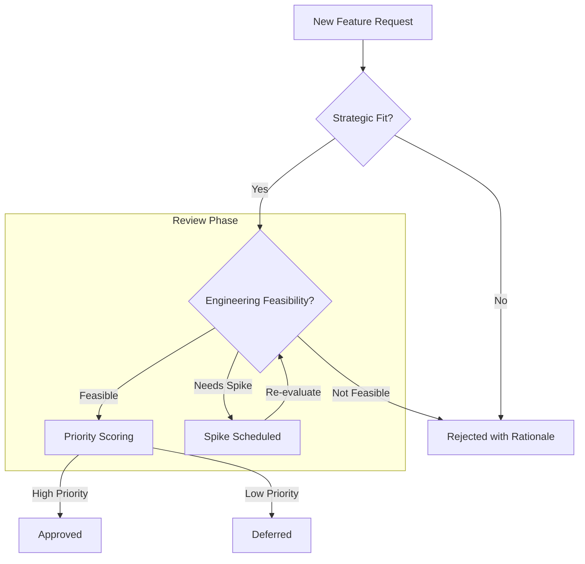
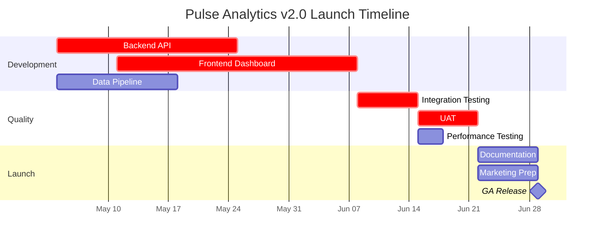
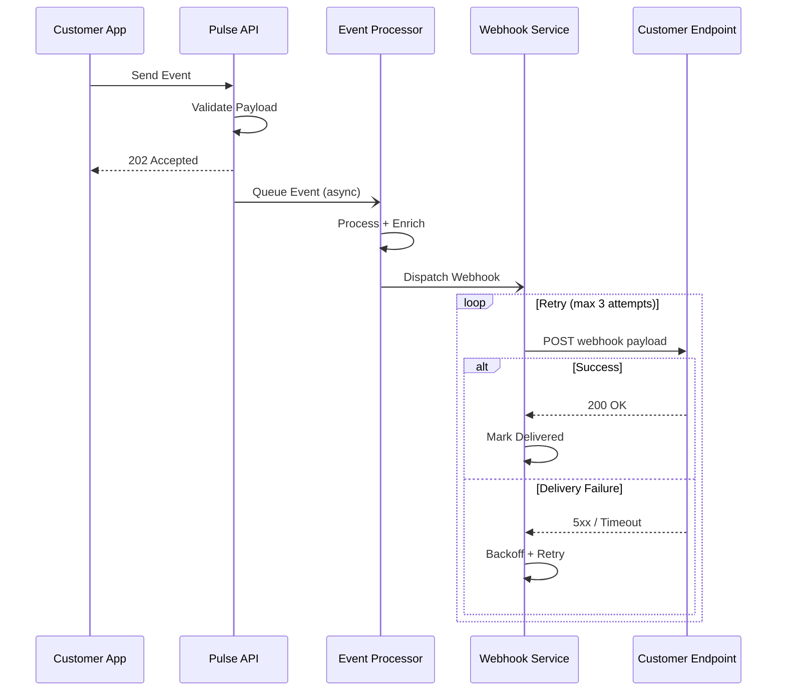
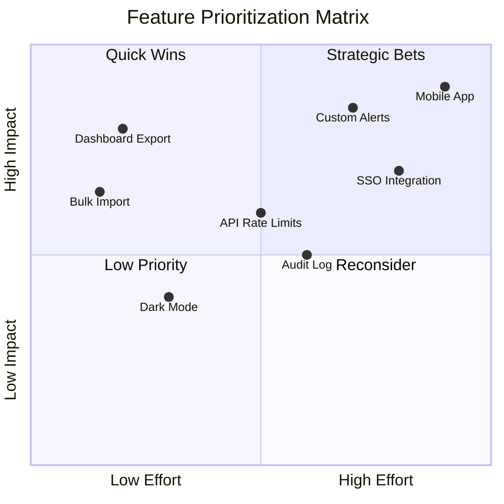

# Worked Example: Diagrams for Pulse Analytics v2.0 Launch

This example walks through four diagrams a PM would create while preparing Pulse Analytics v2.0 for launch. Each diagram follows the planning worksheet from `TEMPLATE.md` before writing any mermaid code.

---

## Example 1: Flowchart -- Feature Approval Workflow

**Context:** The PRD needs a visual showing how new feature requests move through the approval process. Stakeholders keep asking "what happens after I submit a request?" and a text description has not stuck.

### Filled Worksheet

**What I'm showing:** The decision path a feature request follows from submission to approval, deferral, or rejection.
**Audience:** Engineering leads and business stakeholders reading the PRD.
**Where this will appear:** Pulse Analytics v2.0 PRD, "Process" section.

**Cardinal Rule Check:**
- [x] This shows branching, relationships, or flow that a list would flatten
- [x] A numbered list or table would NOT communicate this more clearly

There are two decision points (strategic fit, feasibility) and a retry loop (spike). A list would hide the branching.

**Selected type:** Flowchart
**Why this type:** Multiple decision diamonds with branching outcomes -- flowcharts are built for this.
**Considered alternatives:** State diagram (possible, but the focus is on the process, not lifecycle states).

**Node Inventory:**

| Node/Entity | Role/Label | Notes |
|-------------|-----------|-------|
| request | New Feature Request | Entry point |
| strategic | Strategic Fit? | Decision diamond |
| feasibility | Engineering Feasibility? | Decision diamond |
| scoring | Priority Scoring | Process step |
| approved | Approved | Terminal -- goes to backlog |
| deferred | Deferred | Terminal |
| spike | Spike Scheduled | Loops back to feasibility |
| rejected | Rejected with Rationale | Terminal |

**Total node count:** 8 (within flowchart limit of 12)

### Resulting Diagram

**What this communicates:** The diagram reveals that feature approval is not a straight line -- it has two independent gates (strategic and technical) and a retry loop for spikes. Stakeholders can immediately see that "needs spike" is not a rejection, it feeds back into the process. This branching structure would collapse into ambiguity in a numbered list.

---

## Example 2: Gantt -- Launch Timeline

**Context:** The roadmap presentation needs a timeline showing the 8-week path to GA release, with dependencies visible so leadership can see which delays would cascade.

### Filled Worksheet

**What I'm showing:** The 8-week launch timeline for Pulse Analytics v2.0 with task dependencies and critical path.
**Audience:** Leadership team and cross-functional partners in the roadmap review.
**Where this will appear:** Roadmap deck, "Timeline" slide.

**Cardinal Rule Check:**
- [x] This shows branching, relationships, or flow that a list would flatten
- [x] A numbered list or table would NOT communicate this more clearly

Parallel tracks (dev, QA, launch) with dependencies between them -- a list cannot show which tasks block others.

**Selected type:** Gantt
**Why this type:** Time-based schedule with parallel tracks and dependencies. Gantt charts are purpose-built for this.
**Considered alternatives:** Timeline (good for milestones, but does not show task duration or dependencies).

**Node Inventory:**

| Node/Entity | Role/Label | Notes |
|-------------|-----------|-------|
| backend | Backend API | 3 weeks |
| frontend | Frontend Dashboard | 4 weeks, starts week 2 |
| pipeline | Data Pipeline | 2 weeks |
| integration | Integration Testing | 1 week, after backend + frontend |
| uat | UAT | 1 week, after integration testing |
| perf | Performance Testing | 3 days, parallel to UAT |
| docs | Documentation | 1 week |
| marketing | Marketing Prep | 1 week |
| ga | GA Release | Milestone |

**Total node count:** 9 tasks (within Gantt limit of 20)

### Resulting Diagram

**What this communicates:** The Gantt chart exposes the critical path: Backend API must finish before Integration Testing can start, and any delay in that chain pushes GA. It also shows that Data Pipeline and Performance Testing are off the critical path -- they have slack. A bullet list of tasks with dates would hide these dependency relationships entirely.

---

## Example 3: Sequence -- Webhook Integration Flow

**Context:** The technical spec needs to show how webhook delivery works across five services, including the async handoff and retry behavior. Engineers reviewing the spec need to see the exact message flow.

### Filled Worksheet

**What I'm showing:** The multi-service interaction flow for webhook event delivery, including async processing and retry logic.
**Audience:** Backend engineers and integration partners reading the technical spec.
**Where this will appear:** Pulse Analytics v2.0 Technical Spec, "Webhook Architecture" section.

**Cardinal Rule Check:**
- [x] This shows branching, relationships, or flow that a list would flatten
- [x] A numbered list or table would NOT communicate this more clearly

Five participants exchanging messages with async boundaries, a retry loop, and conditional behavior (success vs. failure). This is inherently a multi-party interaction.

**Selected type:** Sequence
**Why this type:** Multi-party message exchange with async boundaries and conditional flows -- sequence diagrams show this precisely.
**Considered alternatives:** Flowchart (would work for the overall flow, but loses the participant swimlanes that make service responsibilities clear).

**Node Inventory:**

| Node/Entity | Role/Label | Notes |
|-------------|-----------|-------|
| CustomerApp | Customer App | External caller |
| PulseAPI | Pulse API | Entry point, sync response |
| EventProcessor | Event Processor | Async processing |
| WebhookService | Webhook Service | Delivery + retry |
| CustomerEndpoint | Customer Endpoint | External receiver |

**Total node count:** 5 participants (within sequence limit of 6)

### Resulting Diagram

**What this communicates:** The sequence diagram makes three things visible that prose obscures. First, the sync/async boundary: the customer gets 202 immediately while processing happens in the background. Second, the retry loop with backoff is a distinct phase, not buried in a paragraph. Third, the alt block shows that success and failure are handled differently at the same interaction point. Engineers can trace the exact message flow between services without reading paragraphs of text.

---

## Example 4: Quadrant -- Feature Prioritization

**Context:** The planning meeting needs a visual to drive prioritization discussion. Eight candidate features need to be evaluated on two dimensions: engineering effort and user impact.

### Filled Worksheet

**What I'm showing:** Relative positioning of 8 candidate features on effort vs. impact dimensions to guide prioritization.
**Audience:** Product and engineering leads in the quarterly planning meeting.
**Where this will appear:** Planning meeting deck, "Prioritization" slide.

**Cardinal Rule Check:**
- [x] This shows branching, relationships, or flow that a list would flatten
- [x] A numbered list or table would NOT communicate this more clearly

Two-dimensional positioning reveals clusters and outliers that a sorted list on a single dimension would miss. Features in the "quick wins" quadrant are only visible when both dimensions are plotted.

**Selected type:** Quadrant
**Why this type:** Two-axis comparison with labeled quadrants -- purpose-built for 2D prioritization.
**Considered alternatives:** None -- no other mermaid type handles 2D scatter positioning.

**Node Inventory:**

| Node/Entity | Role/Label | Notes |
|-------------|-----------|-------|
| Dashboard Export | Quick Win | Low effort, high impact |
| Custom Alerts | Strategic Bet | High effort, high impact |
| Dark Mode | Low Priority | Low effort, low impact |
| API Rate Limits | Near boundary | Medium effort, medium impact |
| SSO Integration | Strategic Bet | High effort, high impact |
| Bulk Import | Quick Win | Low effort, high impact |
| Audit Log | Near boundary | Medium effort, medium impact |
| Mobile App | Strategic Bet | Very high effort, very high impact |

**Total node count:** 8 data points (within quadrant limit of 10-12)

### Resulting Diagram

**What this communicates:** The quadrant chart instantly reveals that Dashboard Export and Bulk Import are quick wins -- high impact, low effort -- while Mobile App demands the most investment for the highest payoff. The spatial clustering makes trade-offs visible: API Rate Limits and Audit Log sit near the center, suggesting they need further analysis before committing. A ranked list sorted by impact alone would hide the effort dimension that makes prioritization actionable.

---

## Key Takeaways

- **The worksheet prevents false starts.** Inventorying nodes before writing code catches missing participants, states, or data points early -- not mid-diagram when restructuring is expensive.
- **The cardinal rule check saved work.** If any of these examples had been a simple linear sequence, the worksheet would have redirected to a list before any mermaid code was written.
- **Diagram type selection is a design decision.** Each example considered alternatives and chose the type that best matched the communication need, not the one the PM was most familiar with.
- **Context around the diagram matters.** The mermaid code block alone is not enough -- the "What this communicates" framing helps the audience know what to look for in the diagram.
