# Mermaid Diagram Type Catalog

This reference catalogs all 15 Mermaid diagram types available for Product Managers. Each entry includes when to use (and when not to), minimal syntax, realistic PM examples, rendering limits, and common pitfalls. Use the table of contents to jump to the type you need.

## Table of Contents

### Process & Flow
1. [Flowchart](#flowchart)
2. [Sequence](#sequence)
3. [State](#state)
4. [Kanban](#kanban)

### Planning & Time
5. [Gantt](#gantt)
6. [Timeline](#timeline)
7. [Quadrant](#quadrant)
8. [Pie](#pie)

### Structure & Relationships
9. [Mindmap](#mindmap)
10. [Class](#class)
11. [ER (Entity-Relationship)](#er-entity-relationship)
12. [Architecture](#architecture)

### Data & Proportions
13. [Sankey](#sankey)
14. [Treemap](#treemap)
15. [XY-Chart](#xy-chart)

---

## Process & Flow

---

### Flowchart

> Visualizes processes with branches, decisions, and validation steps.

**Use for:**
- Feature approval workflows with multiple decision gates
- User journey decision points (e.g., free vs paid path)
- Bug triage and escalation processes
- Release readiness checklists with go/no-go decisions

**Don't use for:**
- Linear sequences with no branching -- use a numbered list or Timeline instead
- Multi-party message exchange -- use [Sequence](#sequence) instead
- Status lifecycle tracking -- use [State](#state) instead

**Syntax:**

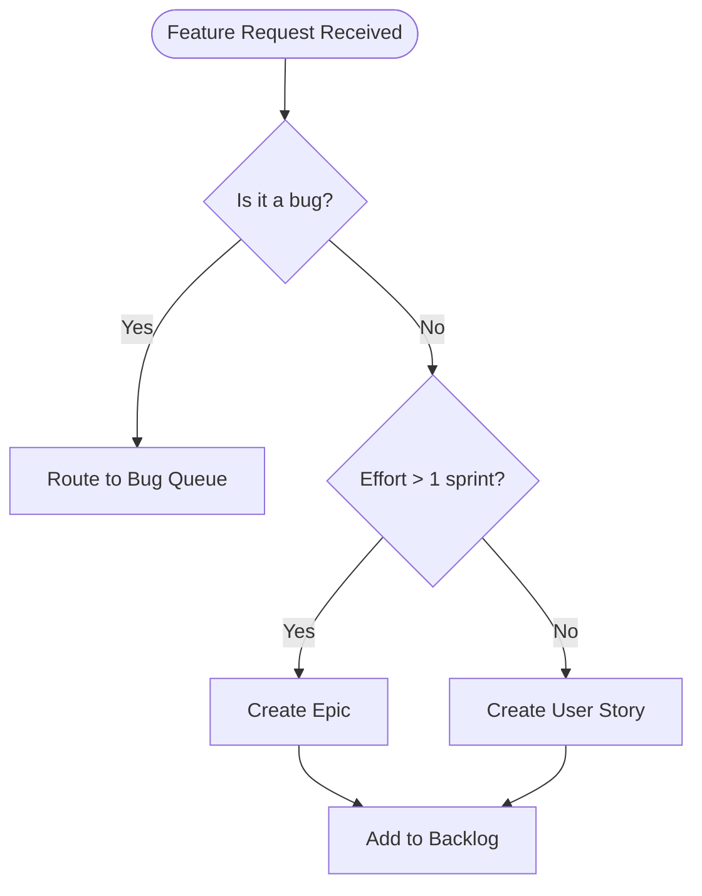

**Key Elements:**
- **Directions:** `TD` (top-down), `LR` (left-right), `BT` (bottom-top), `RL` (right-left)
- **Node shapes:** Rectangle `[text]`, Diamond `{text}`, Stadium `([text])`, Circle `((text))`, Subroutine `[[text]]`, Cylinder `[(text)]`
- **Edges:** `-->` solid arrow, `---` solid line, `-.->` dotted arrow, `==>` thick arrow, `-- label -->` labeled edge
- **Subgraphs:** Group related nodes with `subgraph Title ... end`

**Limits:**
- Keep to 12 nodes maximum for readability
- More than 3 levels of subgraph nesting can cause rendering issues
- Long labels (over 30 characters) may overlap edges

**PM Example:**

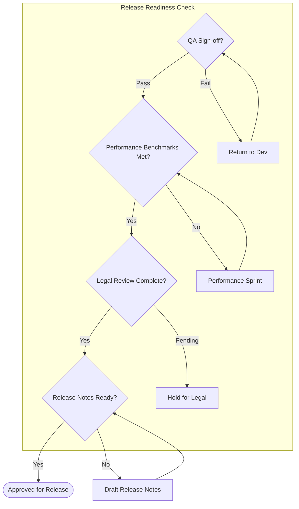

**Common Pitfalls:**
- **Special characters in labels:** Wrap labels with special characters in quotes: `A["Label with (parens)"]`
- **Wrong direction for content:** Wide processes work better with `LR`; tall decision trees work better with `TD`
- **Using flowchart for linear sequences:** If there are no branches, a numbered list or Timeline is clearer

**See Also:**
- [Sequence](#sequence) -- better when the focus is on messages between parties rather than decisions
- [State](#state) -- better when modeling lifecycle transitions rather than process steps

---

### Sequence

> Shows multi-party interactions as ordered messages over time.

**Use for:**
- API integration specs in PRDs (request/response flows)
- Service interaction documentation for engineering handoff
- User-system message flows (login, checkout, onboarding)
- Distributed system communication patterns

**Don't use for:**
- Single-party decision processes -- use [Flowchart](#flowchart) instead
- Status lifecycle modeling -- use [State](#state) instead
- Static hierarchy or structure -- use [Mindmap](#mindmap) or [Class](#class) instead

**Syntax:**

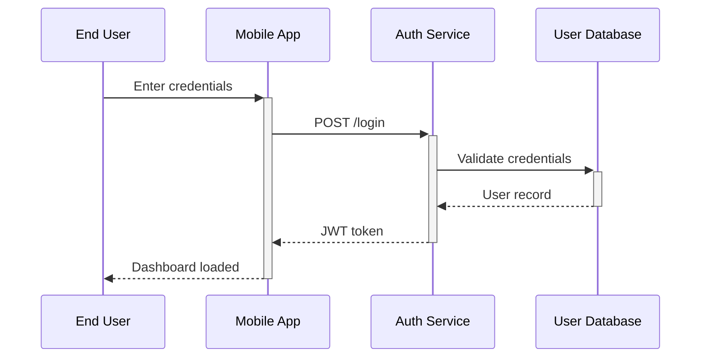

**Key Elements:**
- **Participants:** `participant X as Long Name` for aliases (quotes optional)
- **Arrows:** `->>` sync request, `-->>` response, `--)` async fire-and-forget, `--x` lost/failed message
- **Activation boxes:** `+` after arrow to activate, `-` to deactivate (shows when a participant is processing)
- **Notes:** `Note left of X: text`, `Note right of X: text`, `Note over X,Y: text`
- **Regions:** `rect rgb(200, 255, 200)` for success highlighting, `rect rgb(255, 200, 200)` for error
- **Control flow:** `loop`, `alt`/`else`, `opt`, `par`, `critical`, `break`

**Limits:**
- Keep to 6 participants maximum -- split into multiple diagrams if more are needed
- Deep nesting of `alt`/`loop` blocks (more than 3 levels) becomes hard to read
- Very long sequences (over 20 messages) should be broken into phases

**PM Example:**

```mermaid
sequenceDiagram
    participant Customer
    participant App as Checkout App
    participant Gateway as Payment Gateway
    participant Bank as Issuing Bank
    participant Notify as Notification Service

    Customer ->>+ App: Submit payment
    App ->>+ Gateway: Charge $49.99
    Gateway ->>+ Bank: Authorize transaction
    alt Approved
        Bank -->>- Gateway: Authorization code
        Gateway -->>- App: Payment confirmed
        App -)+ Notify: Send receipt email
        Notify --)- App: Email queued
        App -->>- Customer: Order confirmation
    else Declined
        Bank -->>- Gateway: Decline reason
        Gateway -->>- App: Payment failed
        App -->>- Customer: Retry or use different card
    end
```

**Common Pitfalls:**
- **Too many participants:** More than 6 makes the diagram unreadable -- split into sub-flows
- **Missing activation boxes:** Without `+`/`-`, it is unclear which service is processing at any moment
- **No error path shown:** Always include an `alt`/`else` for failure scenarios -- PMs need to see both paths

**See Also:**
- [Flowchart](#flowchart) -- better when you need decision diamonds rather than message arrows
- [Architecture](#architecture) -- better for showing service topology without message-level detail

---

### State

> Models lifecycle transitions between defined statuses.

**Use for:**
- Feature lifecycle (draft, review, approved, in-dev, released)
- Ticket status workflows (open, in-progress, blocked, closed)
- Entity state machines (order: placed, paid, shipped, delivered)
- Subscription lifecycle (trial, active, past-due, cancelled)

**Don't use for:**
- Processes with complex branching logic -- use [Flowchart](#flowchart) instead
- Multi-party message flows -- use [Sequence](#sequence) instead
- Project timelines with dates -- use [Gantt](#gantt) instead

**Syntax:**

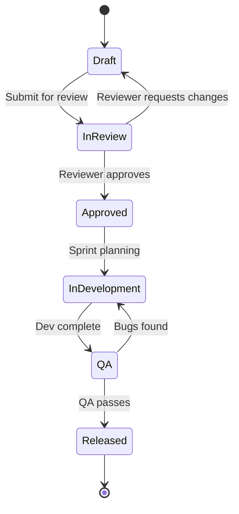

**Key Elements:**
- **State declaration:** `state "Display Name" as id` for readable labels
- **Start/end markers:** `[*]` for both initial and terminal states
- **Transitions:** `StateA --> StateB: label` for labeled transitions
- **Composite states:** Nest states inside a parent state for sub-workflows
- **Choice/fork/join:** `<<choice>>`, `<<fork>>`, `<<join>>` for complex routing
- **Styling:** Use `class StateName className` -- do NOT use `:::` syntax

**Limits:**
- Keep to 10 states maximum for readability
- Composite (nested) states add complexity -- limit to one level of nesting
- Diagrams with many bidirectional transitions become tangled above 8 states

**PM Example:**

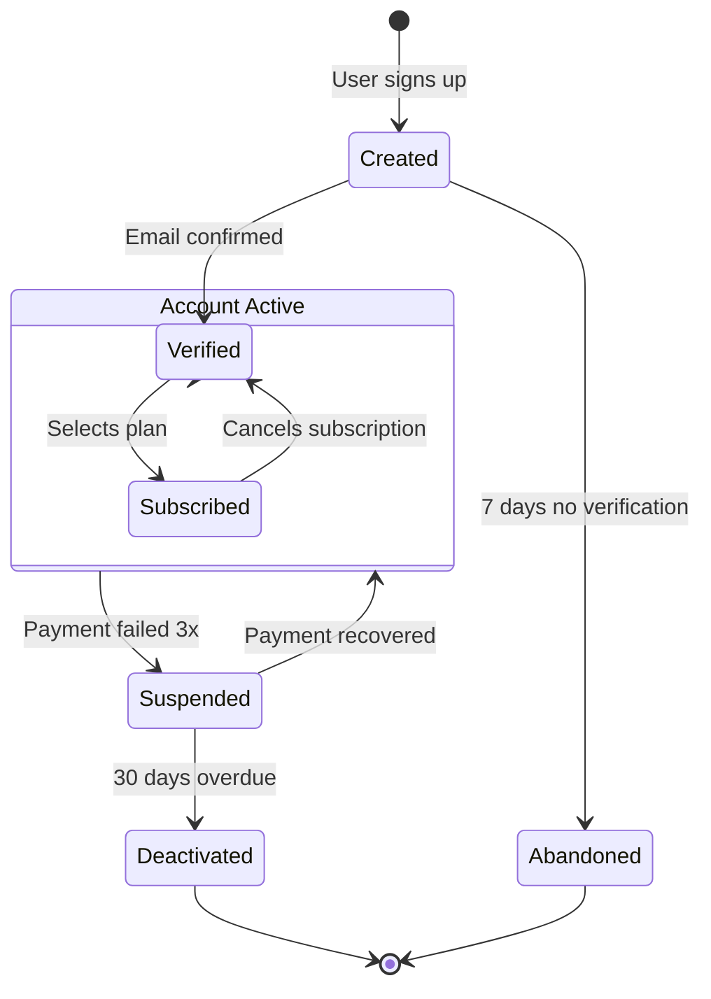

**Common Pitfalls:**
- **Using `:::` for styling:** The `:::` syntax is unreliable in state diagrams -- use the `class` keyword instead
- **Forgetting reverse transitions:** Real workflows often allow going back (e.g., from review back to draft) -- show these
- **Missing terminal states:** Every state machine needs at least one path to `[*]` or the diagram implies the entity lives forever

**See Also:**
- [Flowchart](#flowchart) -- better for process steps with decisions rather than entity lifecycles
- [Kanban](#kanban) -- better for showing current work items in stages rather than transition rules

---

### Kanban

> Displays workflow stages with task cards for static documentation.

**Use for:**
- Sprint board documentation in retrospective decks
- Deployment pipeline stage visualization
- Content workflow visualization (draft, editing, published)
- Service lifecycle stages with team ownership

**Don't use for:**
- Live task tracking -- use Jira, Linear, or Trello instead
- Status transitions with rules -- use [State](#state) instead
- Timeline-based planning -- use [Gantt](#gantt) instead

**Syntax:**

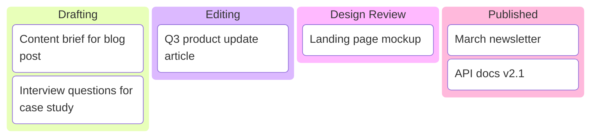

**Key Elements:**
- **Columns:** Defined by unindented text lines -- these are your workflow stages
- **Task items:** Indented under their column
- **Metadata:** `@{assigned: Team, priority: High, ticket: FEAT-123}` on task items
- **Priority values:** Very High, High, Low, Very Low

**Limits:**
- Keep to 10-15 tasks across 3-5 columns for readability
- This is a static snapshot -- it does not update automatically
- Very long task names wrap poorly in narrow renders

**PM Example:**

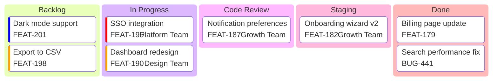

**Common Pitfalls:**
- **Using for live tracking:** Kanban diagrams are static documentation -- use your project management tool for real-time boards
- **Too many columns:** More than 5 columns compress horizontally and become unreadable
- **Forgetting indentation:** Task items must be indented under their column or they create new columns

**See Also:**
- [State](#state) -- better for modeling the rules of transitions between stages
- [Gantt](#gantt) -- better when tasks have dates and dependencies

---

## Planning & Time

---

### Gantt

> Shows project timelines with task durations, dependencies, and milestones.

**Use for:**
- Release planning with task dependencies
- Sprint capacity visualization across workstreams
- Migration timelines with sequential phases
- Launch coordination across multiple teams

**Don't use for:**
- Past event documentation -- use [Timeline](#timeline) instead
- Decision processes -- use [Flowchart](#flowchart) instead
- Proportional data -- use [Pie](#pie) or [XY-Chart](#xy-chart) instead

**Syntax:**

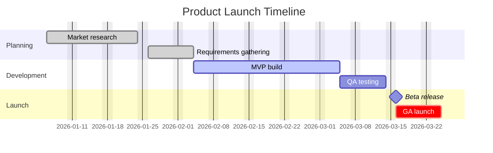

**Key Elements:**
- **Date format:** `dateFormat YYYY-MM-DD`
- **Task syntax:** `TaskName :id, startDate, duration` or `TaskName :id, after otherId, duration`
- **Duration units:** `d` (days), `w` (weeks), `h` (hours)
- **Task states:** `done` (completed), `active` (in progress), `crit` (critical path), `milestone` (zero duration marker)
- **Sections:** Group tasks by phase or team
- **Exclusions:** `excludes weekends` or `excludes 2026-12-25`

**Limits:**
- Keep to 20 tasks maximum for readability
- Very long timelines (over 6 months with daily granularity) compress dates into unreadable labels
- Section names cannot contain special characters

**PM Example:**

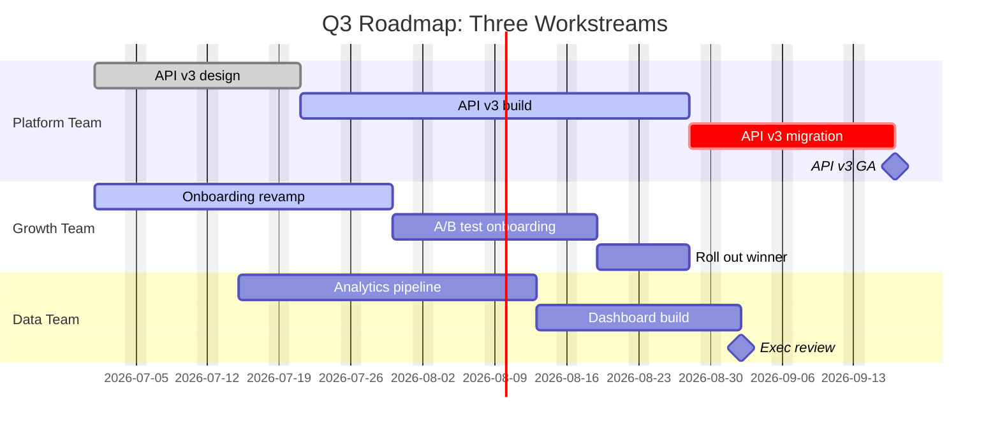

**Common Pitfalls:**
- **Not marking critical path:** Use `crit` on tasks that block the launch date so stakeholders see what cannot slip
- **Missing dependencies:** Without `after` links, everything renders as parallel work -- which misleads about the real schedule
- **Unrealistic durations:** Gantt charts create visual commitments -- round-trip these with your team before sharing

**See Also:**
- [Timeline](#timeline) -- better for past events or milestones without task durations
- [Kanban](#kanban) -- better for showing current work status without dates

---

### Timeline

> Displays chronological events or milestones along a time axis.

**Use for:**
- Product version history for onboarding docs
- Team milestones and achievements for retrospectives
- Incident postmortem event sequences
- Quarterly achievement summaries for leadership updates

**Don't use for:**
- Future planning with dependencies -- use [Gantt](#gantt) instead
- Process flows with decisions -- use [Flowchart](#flowchart) instead
- Multi-party interactions over time -- use [Sequence](#sequence) instead

**Syntax:**

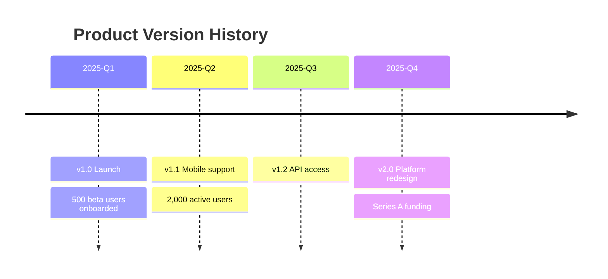

**Key Elements:**
- **Title:** `title Timeline Title` on the first line
- **Periods:** Left-aligned text defines time periods (dates, quarters, sprints)
- **Events:** `: Event description` after the period, one per line
- **Multiple events:** Additional `: Event` lines under the same period
- **Sections:** Group periods into named sections for phased timelines

**Limits:**
- Keep to approximately 15 events total for readability
- Very long event descriptions wrap unpredictably
- No support for dependencies or durations -- this is milestones only

**PM Example:**

```mermaid
timeline
    title Incident Response: Payment Outage (March 15)
    section Detection
        09:00 : Monitoring alert triggered
               : PagerDuty pages on-call engineer
        09:05 : Confirmed: payment API returning 503s
    section Response
        09:10 : Incident channel opened
               : Engineering lead joins
        09:25 : Root cause identified: database connection pool exhausted
        09:35 : Hotfix deployed to staging
    section Recovery
        09:50 : Hotfix deployed to production
        10:05 : Payment success rate back to 99.9%
        10:30 : All-clear communicated to support team
    section Follow-up
        March 16 : Postmortem drafted
        March 18 : Action items assigned in sprint
```

**Common Pitfalls:**
- **Using for future planning:** Timeline has no concept of dependencies or duration -- use Gantt for planning
- **Inconsistent time intervals:** Mixing "Q1 2025" with "January 5" in the same diagram confuses readers
- **Too many events per period:** More than 3 events per period makes the timeline cluttered

**See Also:**
- [Gantt](#gantt) -- better for forward-looking plans with task durations and dependencies

---

### Quadrant

> Places items on a 2D grid for prioritization and comparison.

**Use for:**
- Backlog prioritization (effort vs impact)
- Buy/build/partner decision frameworks
- Feature effort-impact analysis for roadmap planning
- Risk-likelihood mapping for launch readiness

**Don't use for:**
- Time-series data -- use [XY-Chart](#xy-chart) instead
- Proportional breakdowns -- use [Pie](#pie) instead
- Process flows -- use [Flowchart](#flowchart) instead

**Syntax:**

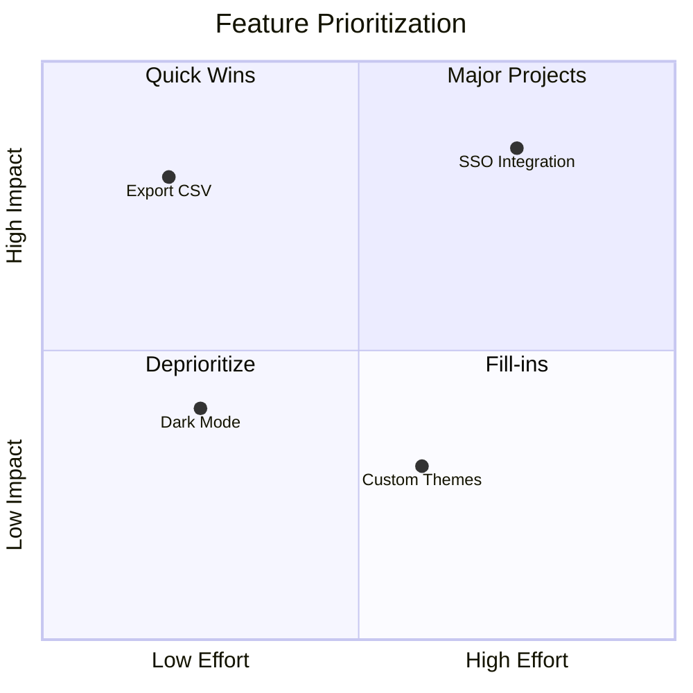

**Key Elements:**
- **Axes:** `x-axis Low Label --> High Label` and `y-axis Low Label --> High Label`
- **Quadrant names:** `quadrant-1` (top-right), `quadrant-2` (top-left), `quadrant-3` (bottom-left), `quadrant-4` (bottom-right)
- **Points:** `Label: [x, y]` where x and y range from 0.01 to 0.99
- **Positioning convention:** quadrant-2 (top-left) is typically "Quick Wins" in effort/impact matrices

**Limits:**
- Keep to 10-12 points maximum -- more becomes unreadable
- Point labels should be under 12 characters to avoid overlap
- Values at extremes (below 0.05 or above 0.95) render at the very edge and may be cut off

**PM Example:**

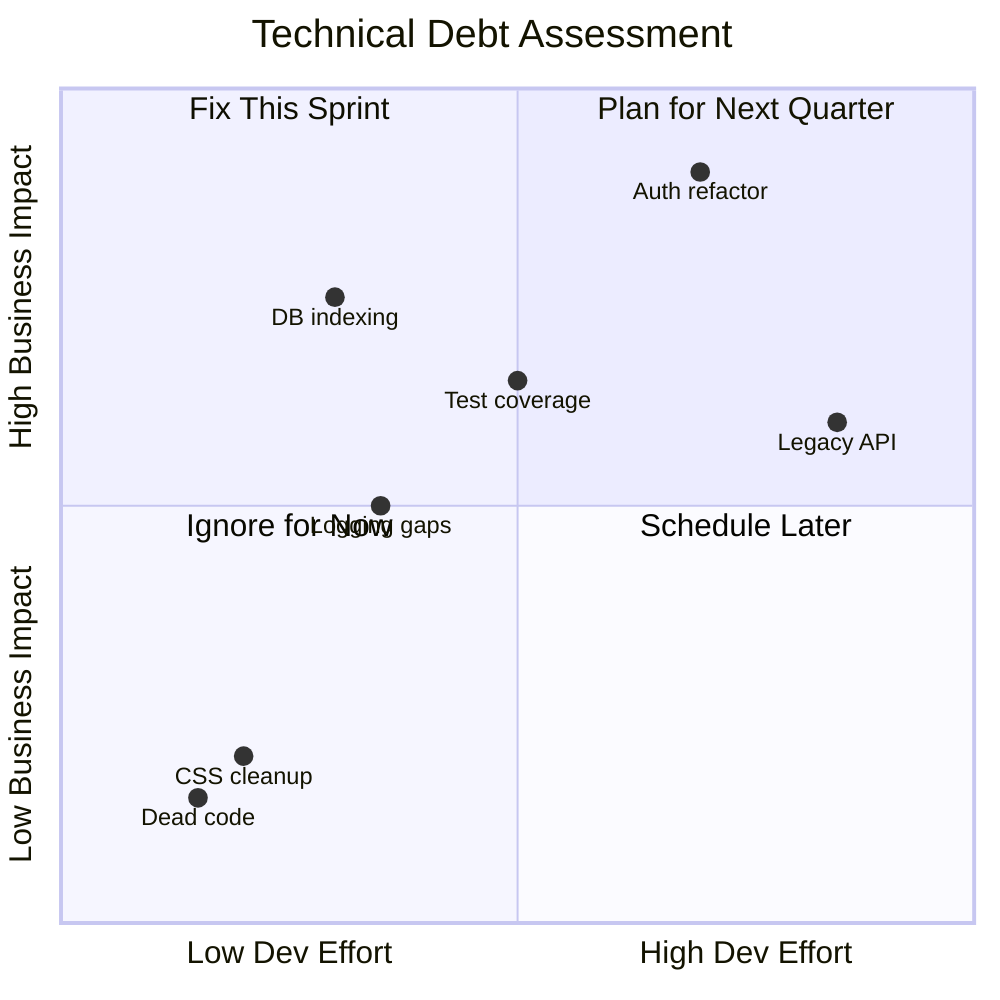

**Common Pitfalls:**
- **Too many points:** More than 12 points overlap and the chart becomes a blob -- group similar items
- **Labels too long:** Keep labels under 12 characters or they overlap adjacent points
- **Forgetting axis direction labels:** Without "Low --> High" on axes, readers cannot interpret which quadrant is desirable

**See Also:**
- [XY-Chart](#xy-chart) -- better for plotting trends over time rather than comparing items on two dimensions
- [Pie](#pie) -- better for showing proportional breakdown rather than relative positioning

---

### Pie

> Shows parts of a whole as proportional slices.

**Use for:**
- Budget allocation breakdowns
- Survey result distributions
- Time allocation across activities
- Feature category breakdowns for portfolio reviews

**Don't use for:**
- Comparisons across time periods -- use [XY-Chart](#xy-chart) instead
- Hierarchical proportions -- use [Treemap](#treemap) instead
- Roughly equal-sized categories -- use a simple table instead

**Syntax:**

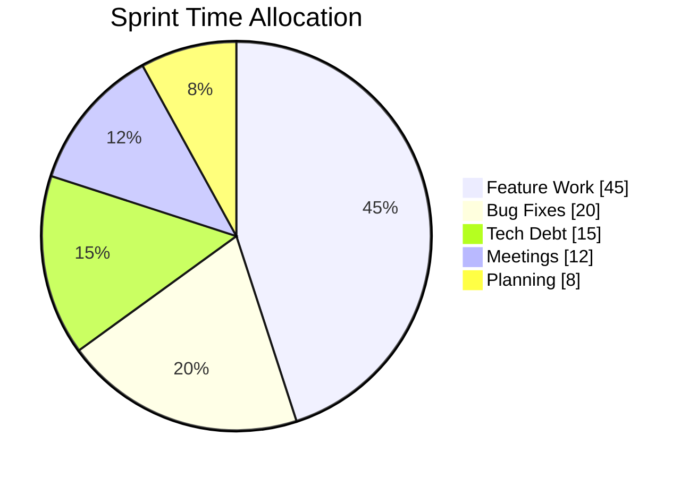

**Key Elements:**
- **Header:** `pie showData` -- the `showData` flag displays percentage labels on slices
- **Title:** `title Chart Title` on the next line
- **Slices:** `"Label" : value` -- values are proportional, they do not need to sum to 100
- **Ordering:** List slices from largest to smallest for visual clarity

**Limits:**
- Keep to 3-7 slices -- more than 7 becomes visually cluttered
- Group small categories (under 5%) into an "Other" slice
- Very long labels wrap or overlap the chart

**PM Example:**

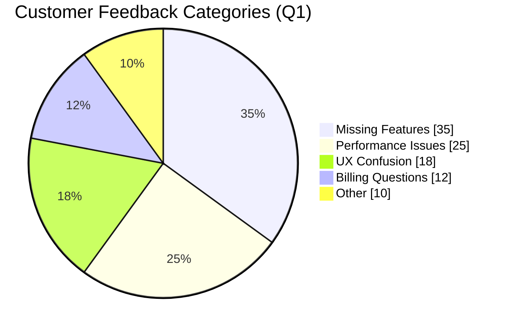

**Common Pitfalls:**
- **More than 7 slices:** Small slices become invisible slivers -- aggregate into "Other"
- **Using for time-series comparisons:** Pie charts show one moment in time -- use XY-Chart for trends
- **All slices roughly equal:** If categories are nearly the same size, a table communicates more clearly

**See Also:**
- [Treemap](#treemap) -- better for hierarchical proportions (e.g., categories with subcategories)
- [XY-Chart](#xy-chart) -- better for comparing values across time periods

---

## Structure & Relationships

---

### Mindmap

> Displays concept hierarchies radiating from a central topic.

**Use for:**
- Feature breakdown and decomposition for planning
- Brainstorming session capture and organization
- Knowledge domain mapping for onboarding docs
- Stakeholder mapping by department or domain

**Don't use for:**
- Sequential workflows -- use [Flowchart](#flowchart) instead
- Data relationships with cardinality -- use [ER](#er-entity-relationship) instead
- Time-ordered events -- use [Timeline](#timeline) instead

**Syntax:**

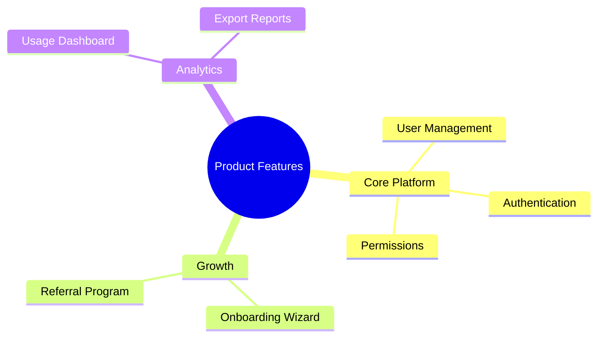

**Key Elements:**
- **Root node:** Double parentheses `((Root Topic))`
- **Node shapes:** Circle `(())`, Square `[]`, Rounded `()`, Cloud `))text((`, Hexagon `{{text}}`
- **Hierarchy:** Defined by indentation -- each indent level creates a child node
- **Icons:** Font Awesome icons with `::icon(fa fa-users)` after a node
- **Depth:** Keep to 3-4 levels maximum for readability

**Limits:**
- 4 levels of depth is the practical maximum before text becomes too small
- Balance branch width -- one branch with 10 children next to one with 2 looks awkward
- Very long node labels push branches apart and waste space

**PM Example:**

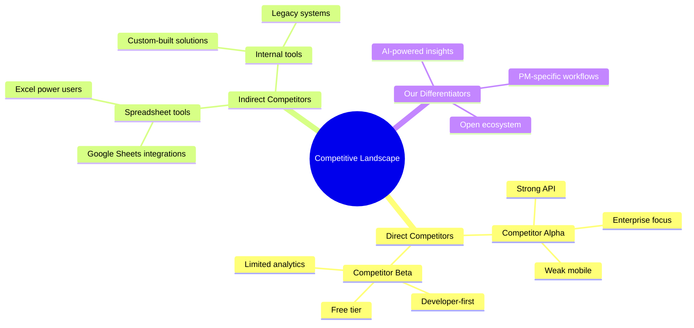

**Common Pitfalls:**
- **Unbalanced depth:** One branch 5 levels deep while another has 1 level makes the map lopsided and hard to scan
- **Using for workflows:** Mindmaps show hierarchy, not sequence -- use Flowchart for processes
- **Too many nodes at one level:** More than 6 siblings at the same level creates clutter -- group into subcategories

**See Also:**
- [Flowchart](#flowchart) -- better when relationships involve flow direction or decisions
- [Class](#class) -- better when you need to show attributes and methods, not just hierarchy

---

### Class

> Documents object structures, API contracts, and interface definitions.

**Use for:**
- API contract documentation between your product and partners
- Domain model visualization for PRD technical context
- Service interface specs for integration planning
- Integration point mapping across systems

**Don't use for:**
- Data storage relationships with cardinality -- use [ER](#er-entity-relationship) instead
- Runtime message flows -- use [Sequence](#sequence) instead
- Feature hierarchies -- use [Mindmap](#mindmap) instead

**Syntax:**

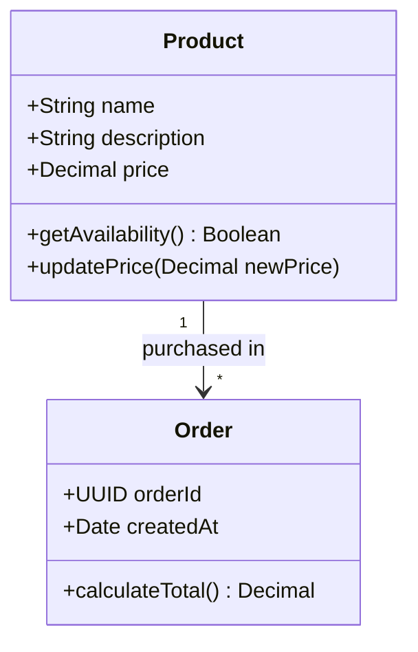

**Key Elements:**
- **Visibility:** `+` public, `-` private, `#` protected, `~` package
- **Stereotypes:** `<<interface>>`, `<<service>>`, `<<enumeration>>` above the class name
- **Relationships:** Inheritance `<|--`, Composition `*--`, Aggregation `o--`, Association `-->`, Dependency `..>`
- **Cardinality:** `"1" -- "*"`, `"0..1" -- "1..*"` on relationship lines
- **Generics:** `~T~` for parameterized types
- **Namespaces:** Group related classes with `namespace GroupName { ... }`

**Limits:**
- Keep to 8 classes maximum per diagram
- Limit methods/attributes to the most important 4-6 per class
- Complex inheritance hierarchies (more than 3 levels) become tangled

**PM Example:**

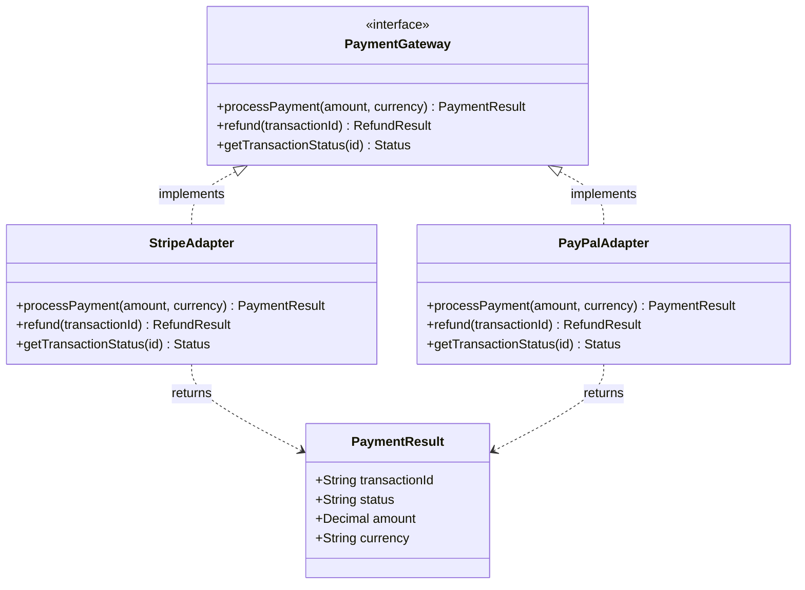

**Common Pitfalls:**
- **Showing implementation details:** PMs should focus on interfaces and contracts, not private methods -- keep it to the public surface
- **Too many methods listed:** Listing every method clutters the diagram -- show only the ones relevant to your audience
- **Confusing composition vs aggregation:** Composition (`*--`) means "cannot exist without" (e.g., Order contains OrderLines); Aggregation (`o--`) means "can exist independently" (e.g., Team has Members)

**See Also:**
- [ER (Entity-Relationship)](#er-entity-relationship) -- better for data storage relationships with foreign keys
- [Architecture](#architecture) -- better for showing service topology without implementation detail

---

### ER (Entity-Relationship)

> Models data entities and their storage relationships.

**Use for:**
- Data model documentation for engineering handoff
- Domain entity relationships for PRD context sections
- Database migration planning and impact analysis
- Data dictionary visualization for analytics teams

**Don't use for:**
- API behavior and methods -- use [Class](#class) instead
- Runtime message flows -- use [Sequence](#sequence) instead
- Concept hierarchies without relationships -- use [Mindmap](#mindmap) instead

**Syntax:**

```mermaid
erDiagram
    CUSTOMER ||--o{ ORDER : places
    ORDER ||--|{ ORDER_LINE : contains
    ORDER_LINE }o--|| PRODUCT : references

    CUSTOMER {
        uuid id PK
        string name
        string email
    }
    ORDER {
        uuid id PK
        uuid customer_id FK
        date created_at
        string status
    }
```

**Key Elements:**
- **Entity attributes:** `type name PK`, `type name FK`, or just `type name`
- **Cardinality symbols:**
  - `||--||` one-to-one
  - `||--o{` one-to-many
  - `o{--o{` many-to-many
  - `||--o|` one-to-zero-or-one
- **Relationship labels:** Descriptive verbs in quotes after the colon (e.g., `: places`, `: contains`)
- **Key markers:** `PK` for primary key, `FK` for foreign key

**Limits:**
- Keep to 8-10 entities maximum per diagram
- Limit attributes to key fields (3-6 per entity) -- full schemas belong in documentation, not diagrams
- Many-to-many relationships render as crossing lines when there are more than 6 entities

**PM Example:**

```mermaid
erDiagram
    TENANT ||--|{ WORKSPACE : owns
    WORKSPACE ||--|{ PROJECT : contains
    PROJECT ||--o{ FEATURE : tracks
    FEATURE }o--o{ TAG : labeled_with
    TENANT ||--|{ USER : has
    USER }o--o{ WORKSPACE : belongs_to

    TENANT {
        uuid id PK
        string name
        string plan
        date created_at
    }
    WORKSPACE {
        uuid id PK
        uuid tenant_id FK
        string name
        string slug
    }
    PROJECT {
        uuid id PK
        uuid workspace_id FK
        string name
        string status
    }
    FEATURE {
        uuid id PK
        uuid project_id FK
        string title
        string priority
        date target_date
    }
    USER {
        uuid id PK
        uuid tenant_id FK
        string email
        string role
    }
```

**Common Pitfalls:**
- **Showing all fields:** Listing every database column makes the diagram unreadable -- focus on keys and business-critical attributes
- **Missing cardinality:** Without `||`, `o{`, etc., the diagram does not communicate the most important information -- how entities relate
- **Unlabeled relationships:** A line between two entities without a verb label (`: places`) forces readers to guess the relationship meaning

**See Also:**
- [Class](#class) -- better when you need to show behavior (methods) alongside data, not just storage structure

---

### Architecture

> Shows service topology, infrastructure layout, and system boundaries.

> **Note:** This is an experimental diagram type, available since Mermaid v11.1.0. Syntax may change in future releases.

**Use for:**
- System architecture documentation for PRDs and design docs
- Infrastructure dependency mapping for platform planning
- Service mesh visualization for microservices products
- Deployment topology documentation for ops handoff

**Don't use for:**
- Message-level interaction detail -- use [Sequence](#sequence) instead
- Simple process flows with under 10 components -- use [Flowchart](#flowchart) instead
- Data storage relationships -- use [ER](#er-entity-relationship) instead

**Syntax:**

```mermaid
architecture-beta
    group webapp(cloud)[Web Application]

    service client(internet)[Browser Client] in webapp
    service api(server)[API Gateway] in webapp
    service db(database)[PostgreSQL] in webapp

    client:R --> L:api
    api:R --> L:db
```

**Key Elements:**
- **Groups:** Logical boundaries with `group name(icon)[Label]`
- **Services:** `service name(icon)[Label]` optionally `in groupName`
- **Built-in icons:** `cloud`, `database`, `disk`, `internet`, `server`
- **Edge directions:** `T` (top), `B` (bottom), `L` (left), `R` (right) -- specify connection points on each service
- **Nesting:** Groups can be nested inside other groups for layered architecture

**Limits:**
- Keep to 10-20 services for readability
- Edge direction syntax (`T`, `B`, `L`, `R`) is required -- undirected edges are not supported
- Limited icon library compared to general-purpose diagramming tools

**PM Example:**

```mermaid
architecture-beta
    group cloud(cloud)[Production Environment]
    group frontend(cloud)[Frontend Layer] in cloud
    group backend(cloud)[Backend Services] in cloud
    group data(cloud)[Data Layer] in cloud

    service cdn(internet)[CDN] in frontend
    service spa(server)[React SPA] in frontend
    service gateway(server)[API Gateway] in backend
    service auth(server)[Auth Service] in backend
    service core(server)[Core Service] in backend
    service notify(server)[Notification Service] in backend
    service pg(database)[PostgreSQL] in data
    service redis(database)[Redis Cache] in data
    service s3(disk)[Object Storage] in data

    cdn:R --> L:spa
    spa:B --> T:gateway
    gateway:R --> L:auth
    gateway:B --> T:core
    core:R --> L:notify
    core:B --> T:pg
    core:B --> T:redis
    notify:B --> T:s3
```

**Common Pitfalls:**
- **Too much detail:** Keep to service boundaries -- internal component details belong in engineering docs, not PM architecture diagrams
- **Missing grouping:** Without groups, services float without context -- always group by logical boundary (frontend, backend, data)
- **Not marking external dependencies:** Clearly separate internal services from external ones (payment gateways, third-party APIs) using distinct groups

**See Also:**
- [Flowchart](#flowchart) -- simpler alternative for architectures with fewer than 10 components
- [Sequence](#sequence) -- better when you need to show the order of messages between services

---

## Data & Proportions

---

### Sankey

> Visualizes flows of quantities between nodes, showing how totals split and merge.

> **Note:** This is an experimental diagram type, available since Mermaid v10.3.0. Syntax may change in future releases.

**Use for:**
- Budget flow tracking (total budget splitting across departments, then programs)
- User conversion funnels (visitors to signups to active users)
- Resource allocation flows (headcount distribution across teams and projects)
- Revenue stream mapping (total revenue by source, then by product line)

**Don't use for:**
- Circular flows (not supported) -- use [Flowchart](#flowchart) instead
- Simple proportions without flow -- use [Pie](#pie) instead
- Time-series comparisons -- use [XY-Chart](#xy-chart) instead

**Syntax:**

```mermaid
sankey-beta

Marketing Budget,Digital Ads,45000
Marketing Budget,Content,30000
Marketing Budget,Events,25000
Digital Ads,Google Ads,25000
Digital Ads,Social Media,20000
Content,Blog,18000
Content,Video,12000
```

**Key Elements:**
- **Format:** CSV-like rows with `Source,Target,Value`
- **Flow direction:** Left to right, automatically arranged
- **Width:** Flow width is proportional to the value
- **Multi-level:** Sources can be targets of other flows, creating cascading breakdowns

**Limits:**
- Keep to 5-15 nodes across all levels
- No circular flows -- a node cannot be both upstream and downstream of the same node
- Flows under 5% of the total become very thin lines -- aggregate them into an "Other" category

**PM Example:**

```mermaid
sankey-beta

Website Visitors,Signed Up,12000
Website Visitors,Bounced,38000
Signed Up,Completed Onboarding,8000
Signed Up,Abandoned Onboarding,4000
Completed Onboarding,Free Plan Active,5500
Completed Onboarding,Upgraded to Pro,2000
Completed Onboarding,Churned in Week 1,500
Free Plan Active,Converted to Pro,1200
Free Plan Active,Still on Free,4300
```

**Common Pitfalls:**
- **Circular references:** Mermaid Sankey does not support cycles -- if your flow is circular, use Flowchart instead
- **Too many tiny flows:** Flows representing under 5% of the total become invisible lines -- aggregate small categories
- **Unlabeled nodes:** Node names are the only labels -- make them descriptive (e.g., "Signed Up" not "Step 2")

**See Also:**
- [Pie](#pie) -- better for simple proportional breakdowns without flow direction
- [Flowchart](#flowchart) -- better when you need decision logic, not just quantity flows

---

### Treemap

> Displays hierarchical data as nested rectangles sized by value.

> **Note:** This is an experimental diagram type, available since Mermaid v10.3.0. Syntax may change in future releases.

**Use for:**
- Error distribution by service and error type
- Feature usage broken down by category and subcategory
- Cost breakdown by department and line item
- Content inventory by section and page count

**Don't use for:**
- Flat (non-hierarchical) proportions -- use [Pie](#pie) instead
- Flow between categories -- use [Sankey](#sankey) instead
- Time-series comparisons -- use [XY-Chart](#xy-chart) instead

**Syntax:**

```mermaid
treemap
    Root
        Platform
            API Errors 450
            Auth Failures 120
            Timeout Issues 80
        Frontend
            Rendering Bugs 200
            Form Validation 90
        Mobile
            Crash Reports 310
            UI Glitches 60
```

**Key Elements:**
- **Hierarchy:** Defined by indentation, just like Mindmap
- **Parent nodes:** Do not have values -- their size is the sum of children
- **Leaf nodes:** Must have numeric values -- these determine rectangle size
- **Depth:** Keep to 2-3 levels for readability

**Limits:**
- Approximately 30 leaf nodes maximum before labels overlap
- 2-3 levels of depth is the practical limit
- Values below 2% of the total become invisible rectangles

**PM Example:**

```mermaid
treemap
    Support Tickets
        Billing
            Payment Failed 245
            Refund Request 180
            Invoice Question 95
        Product
            Feature Request 320
            Bug Report 275
            How-To Question 150
        Account
            Login Issues 190
            Permission Errors 85
            Profile Updates 40
        Integrations
            API Errors 110
            Webhook Failures 70
            OAuth Issues 55
```

**Common Pitfalls:**
- **Too many levels:** More than 3 levels makes inner rectangles too small to read -- flatten your hierarchy
- **Tiny values:** Items below 2% of the total are invisible slivers -- aggregate them into an "Other" node
- **Values on parent nodes:** Parent nodes must not have values -- their area is automatically calculated from their children

**See Also:**
- [Pie](#pie) -- better for flat proportions with 3-7 categories and no hierarchy
- [Mindmap](#mindmap) -- better when you want to show hierarchy without proportional sizing

---

### XY-Chart

> Plots data points on X and Y axes as lines or bars for trend visualization.

> **Note:** This is an experimental diagram type, available since Mermaid v10.0.0. Syntax may change in future releases.

**Use for:**
- KPI tracking over time (MRR, DAU, NPS trends)
- A/B test results comparison across metrics
- Feature adoption curves post-launch
- Performance benchmarks across releases

**Don't use for:**
- Parts of a whole -- use [Pie](#pie) instead
- Duration-based task planning -- use [Gantt](#gantt) instead
- 2D item comparison -- use [Quadrant](#quadrant) instead

**Syntax:**

```mermaid
xychart-beta
    title Monthly Active Users
    x-axis ["Jan", "Feb", "Mar", "Apr", "May", "Jun"]
    y-axis "Users (thousands)" 0 --> 50
    line [12, 18, 22, 28, 35, 42]
```

**Key Elements:**
- **Header:** `xychart-beta`
- **Axes:** `x-axis [labels]` with quoted strings, `y-axis "Label" min --> max`
- **Data series:** `line [values]` for trend lines, `bar [values]` for bar charts
- **Multiple series:** Add additional `line` or `bar` rows for comparison
- **Mixed charts:** Combine `bar` and `line` in the same chart

**Limits:**
- Keep to 4 data series (lines/bars) maximum per chart
- 6-8 data points per series is optimal for readability
- Very large value ranges compress smaller values into the baseline

**PM Example:**

```mermaid
xychart-beta
    title Feature Adoption: First 8 Weeks Post-Launch
    x-axis ["Wk 1", "Wk 2", "Wk 3", "Wk 4", "Wk 5", "Wk 6", "Wk 7", "Wk 8"]
    y-axis "Active Users" 0 --> 5000
    bar [200, 800, 1500, 2200, 2800, 3400, 3900, 4200]
    line [200, 800, 1500, 2200, 2800, 3400, 3900, 4200]
```

**Common Pitfalls:**
- **Too many lines:** More than 4 overlapping lines become impossible to distinguish -- split into multiple charts
- **Inconsistent x-axis intervals:** Mixing weeks and months on the same axis distorts trends -- keep intervals uniform
- **No axis labels or units:** Without units on the y-axis (e.g., "Users (thousands)"), readers cannot interpret the values

**See Also:**
- [Gantt](#gantt) -- better when you need duration bars for project planning, not data trends
- [Quadrant](#quadrant) -- better for comparing items on two dimensions at a single point in time

---

## Quick Reference: Choosing the Right Type

| If you need to show... | Use this type |
|---|---|
| Process with decisions | [Flowchart](#flowchart) |
| Messages between services | [Sequence](#sequence) |
| Status lifecycle | [State](#state) |
| Work items in stages | [Kanban](#kanban) |
| Project schedule | [Gantt](#gantt) |
| Past milestones | [Timeline](#timeline) |
| 2D prioritization | [Quadrant](#quadrant) |
| Parts of a whole | [Pie](#pie) |
| Concept hierarchy | [Mindmap](#mindmap) |
| API contracts | [Class](#class) |
| Data model | [ER](#er-entity-relationship) |
| System topology | [Architecture](#architecture) |
| Quantity flows | [Sankey](#sankey) |
| Hierarchical proportions | [Treemap](#treemap) |
| Metrics over time | [XY-Chart](#xy-chart) |
