# PM Use Cases: Task-to-Diagram Quick Reference

This guide helps you find the right diagram type by starting from what you're trying to communicate, rather than from a diagram type you already know.

## Quick-Reference Table

| # | PM Task | Primary Type | Alternative |
|---|---------|-------------|-------------|
| 1 | Showing a decision or approval process | Flowchart | State |
| 2 | Specifying multi-service interactions | Sequence | Flowchart |
| 3 | Mapping feature lifecycle or status transitions | State | Flowchart |
| 4 | Tracking work stages | Kanban | State |
| 5 | Planning a release or sprint timeline | Gantt | Timeline |
| 6 | Documenting version history or milestones | Timeline | Gantt |
| 7 | Prioritizing backlog items (2D) | Quadrant | . |
| 8 | Showing allocation or composition | Pie | Treemap |
| 9 | Decomposing a problem or brainstorming | Mindmap | . |
| 10 | Documenting domain models or data relationships | ER | Class |
| 11 | Mapping API or object contracts | Class | ER |
| 12 | Showing system topology or infrastructure | Architecture | Flowchart |
| 13 | Visualizing flow quantities or budget allocation | Sankey | Pie |
| 14 | Showing hierarchical proportional data | Treemap | Pie |
| 15 | Displaying trends or time-series metrics | XY-Chart | . |

---

### Use Case 1: Showing a Decision or Approval Process

**Best diagram type:** Flowchart | **Alternative:** State

A flowchart naturally maps to how PMs think about approval gates: requests come in, conditions are evaluated, and outcomes branch. The diamond decision nodes make branching logic visible in a way that prose obscures.

**Example:** Feature request triage . an incoming request flows through feasibility check and priority assessment, then gets approved, deferred, or rejected.

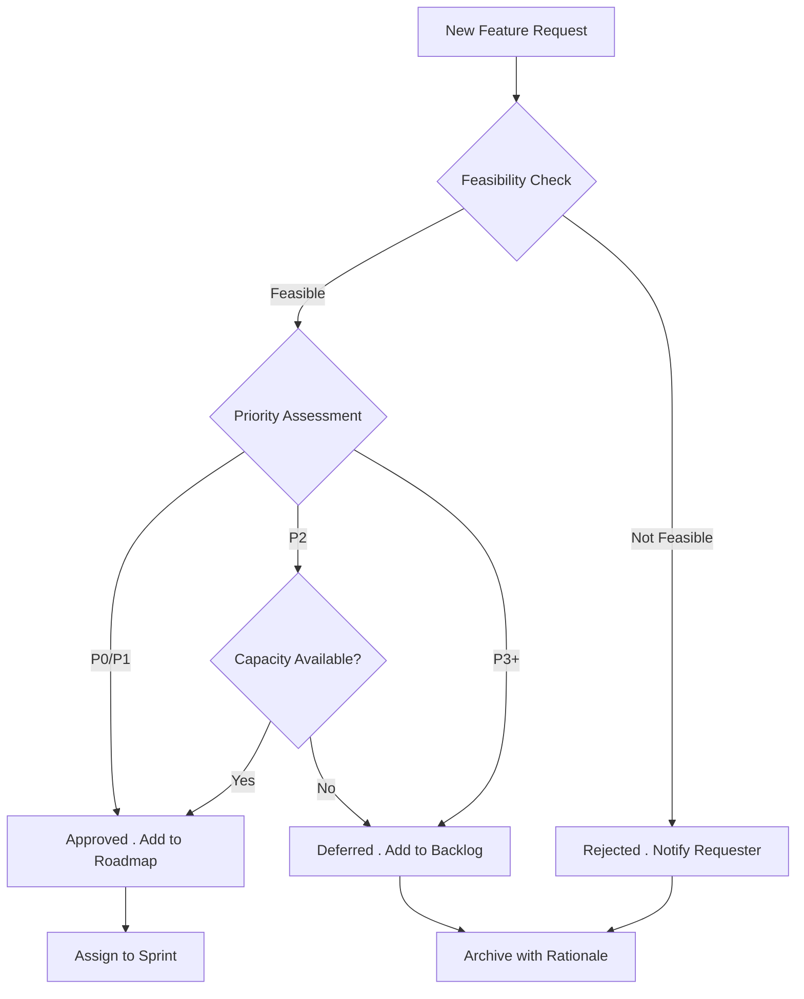

**When to use the alternative instead:** Use a State diagram when the emphasis is on the request's status over time rather than the branching logic of the triage process.

> See `diagram-catalog.md#flowchart` for full syntax reference.

---

### Use Case 2: Specifying Multi-Service Interactions

**Best diagram type:** Sequence | **Alternative:** Flowchart

Sequence diagrams show the back-and-forth between systems in time order. When you need to communicate "the app calls the API, which calls the payment service, which responds with a token," sequence diagrams make the call chain and response flow unmistakable.

**Example:** Mobile app checkout flow between the app, API gateway, payment service, and notification service.

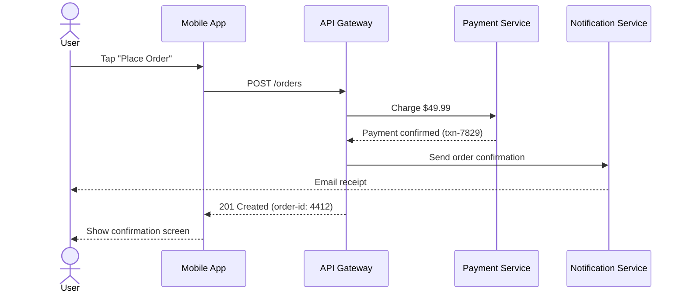

**When to use the alternative instead:** Use a Flowchart when the interaction is simple (two services, no branching) and you care more about the decision logic than the call sequence.

> See `diagram-catalog.md#sequence` for full syntax reference.

---

### Use Case 3: Mapping Feature Lifecycle or Status Transitions

**Best diagram type:** State | **Alternative:** Flowchart

State diagrams focus on what states a thing can be in and what triggers transitions between them. This is ideal for lifecycle questions: "Can a feature go from QA back to Development? Under what conditions?"

**Example:** Feature status lifecycle from idea through release.

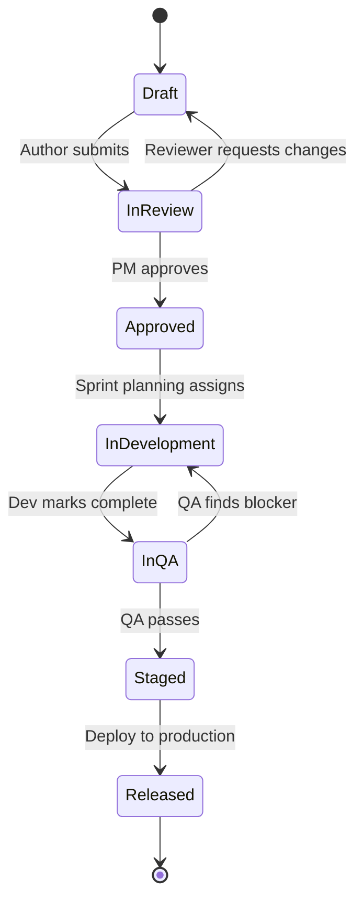

**When to use the alternative instead:** Use a Flowchart when you need to show the decision logic that determines transitions, rather than just listing the valid transitions themselves.

> See `diagram-catalog.md#state` for full syntax reference.

---

### Use Case 4: Tracking Work Stages

**Best diagram type:** Kanban | **Alternative:** State

Kanban diagrams show work items distributed across pipeline stages. They answer the question "Where is everything right now?" rather than "How does something move through stages?"

**Example:** Content creation pipeline for a product launch blog series.

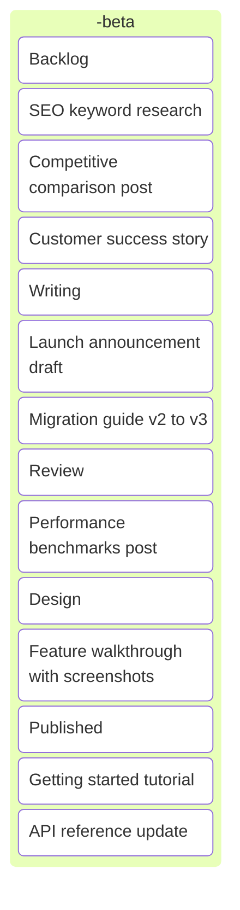

**When to use the alternative instead:** Use a State diagram when you need to document the rules governing how items move between columns, rather than showing a snapshot of current work distribution.

> See `diagram-catalog.md#kanban` for full syntax reference.

---

### Use Case 5: Planning a Release or Sprint Timeline

**Best diagram type:** Gantt | **Alternative:** Timeline

Gantt charts show tasks with durations, dependencies, and parallel tracks. They answer scheduling questions: "Can QA start before design finishes? When is the critical path?"

**Example:** Mobile app v3.0 release plan across 6 weeks.

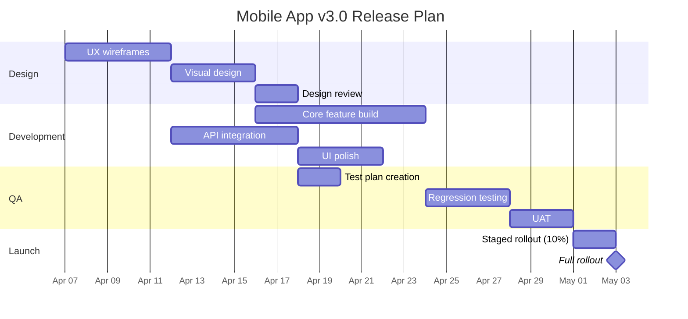

**When to use the alternative instead:** Use a Timeline when you need a simpler, milestone-focused view without task durations or dependencies . for example, a quarterly roadmap for executives.

> See `diagram-catalog.md#gantt` for full syntax reference.

---

### Use Case 6: Documenting Version History or Milestones

**Best diagram type:** Timeline | **Alternative:** Gantt

Timelines show milestones in chronological order without the complexity of durations and dependencies. They are ideal for "here is what we shipped and when" communications.

**Example:** Product evolution over 4 quarters showing key features shipped.

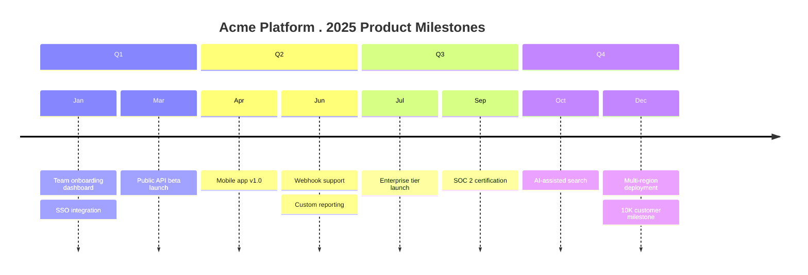

**When to use the alternative instead:** Use a Gantt chart when stakeholders need to see how long each effort took, not just when milestones landed.

> See `diagram-catalog.md#timeline` for full syntax reference.

---

### Use Case 7: Prioritizing Backlog Items (2D)

**Best diagram type:** Quadrant | **Alternative:** .

Quadrant charts place items on two axes, making trade-offs visible at a glance. The classic PM use is effort vs. impact, but any two-dimensional prioritization (risk vs. value, urgency vs. importance) works.

**Example:** Q4 feature prioritization on effort vs. user impact axes.

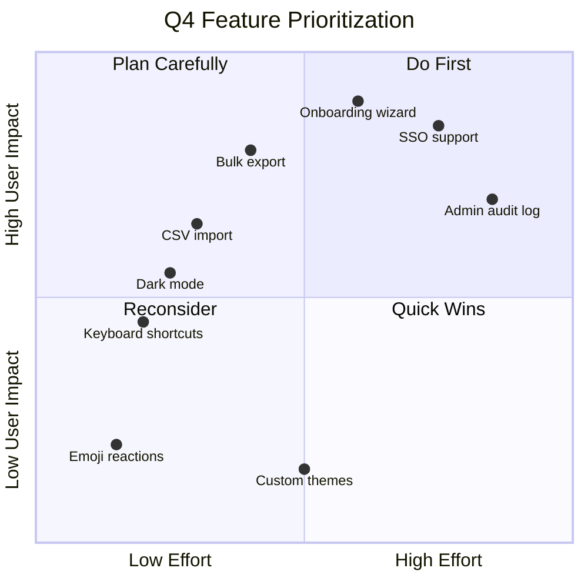

> See `diagram-catalog.md#quadrant` for full syntax reference.

---

### Use Case 8: Showing Allocation or Composition

**Best diagram type:** Pie | **Alternative:** Treemap

Pie charts show how a whole breaks into parts. They work well when the total adds up to 100% and you have 3-7 slices. Beyond that, smaller slices become unreadable.

**Example:** Engineering team time allocation across work categories.

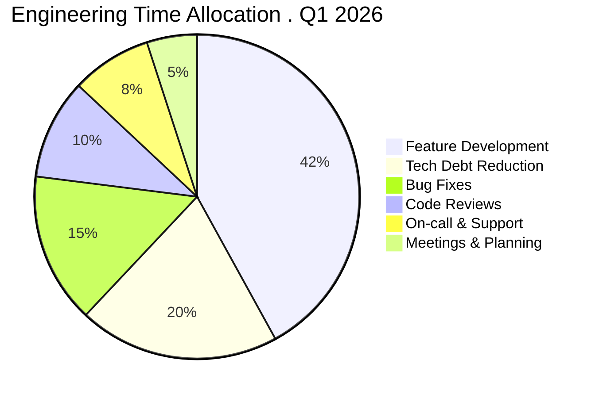

**When to use the alternative instead:** Use a Treemap when you have hierarchical categories (e.g., Feature Development breaks into sub-projects) or more than 7 slices.

> See `diagram-catalog.md#pie` for full syntax reference.

---

### Use Case 9: Decomposing a Problem or Brainstorming

**Best diagram type:** Mindmap | **Alternative:** .

Mindmaps radiate outward from a central topic, making them natural for brainstorming and problem decomposition. They show hierarchy without implying sequence or flow.

**Example:** User onboarding improvement . branches for key improvement areas with sub-items.

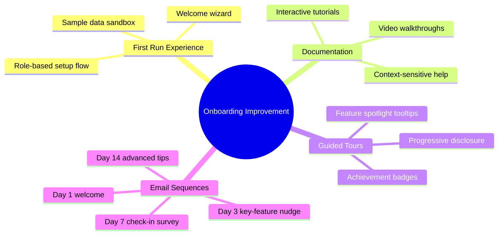

> See `diagram-catalog.md#mindmap` for full syntax reference.

---

### Use Case 10: Documenting Domain Models or Data Relationships

**Best diagram type:** ER | **Alternative:** Class

Entity-relationship diagrams show the objects in your domain and how they relate, including cardinality (one-to-many, many-to-many). They are the standard for communicating data models to engineers.

**Example:** E-commerce domain model with core entities and cardinality.

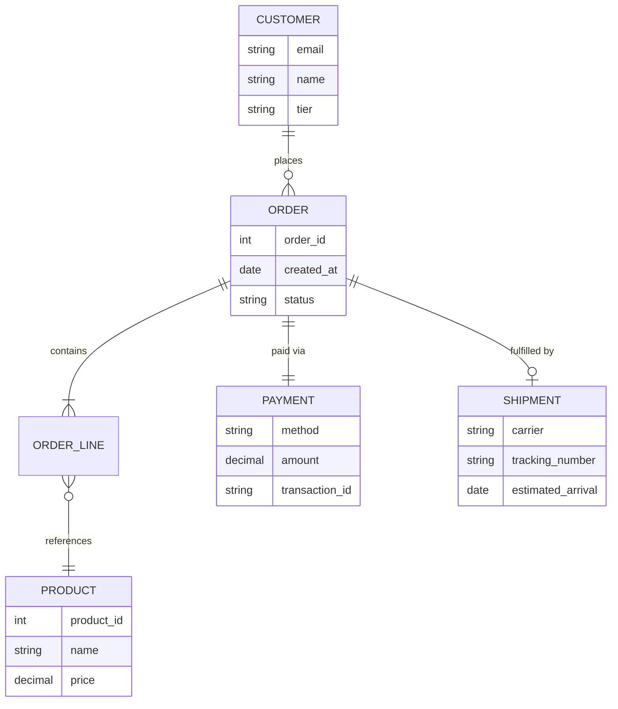

**When to use the alternative instead:** Use a Class diagram when you need to show methods and interfaces (behavioral contracts) in addition to data attributes.

> See `diagram-catalog.md#er-entity-relationship` for full syntax reference.

---

### Use Case 11: Mapping API or Object Contracts

**Best diagram type:** Class | **Alternative:** ER

Class diagrams show objects with their attributes, methods, and relationships (inheritance, composition). Use them when you need to communicate behavioral contracts . not just "what data exists" but "what operations are available."

**Example:** Notification service API contracts showing services, templates, channels, and delivery status.

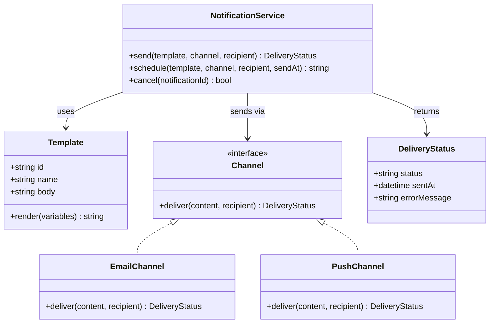

**When to use the alternative instead:** Use an ER diagram when the focus is on data relationships and cardinality rather than methods and interfaces.

> See `diagram-catalog.md#class` for full syntax reference.

---

### Use Case 12: Showing System Topology or Infrastructure

**Best diagram type:** Architecture | **Alternative:** Flowchart

> **Note:** Architecture diagrams are **experimental** (Mermaid v11.1.0+). Verify support in your rendering environment before using.

Architecture diagrams show services, databases, and infrastructure grouped by logical boundaries. They communicate "what talks to what" at a system level with purpose-built iconography.

**Example:** SaaS platform topology with web, API, worker, and data tiers.

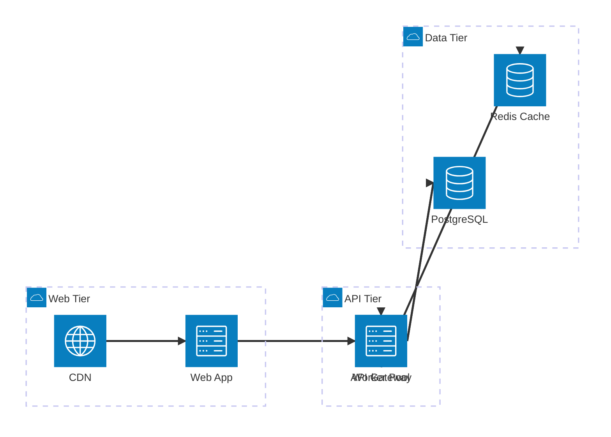

**When to use the alternative instead:** Use a Flowchart when architecture diagram support is unavailable in your environment, or when you need to show decision logic within the system flow.

> See `diagram-catalog.md#architecture` for full syntax reference.

---

### Use Case 13: Visualizing Flow Quantities or Budget Allocation

**Best diagram type:** Sankey | **Alternative:** Pie

> **Note:** Sankey diagrams are **experimental** (Mermaid v10.3.0+). Verify support in your rendering environment before using.

Sankey diagrams show flows between nodes with width proportional to quantity. They excel at showing how a budget, traffic, or resource pool splits and re-splits across categories.

**Example:** Marketing budget flow from total allocation down through channels and sub-channels.

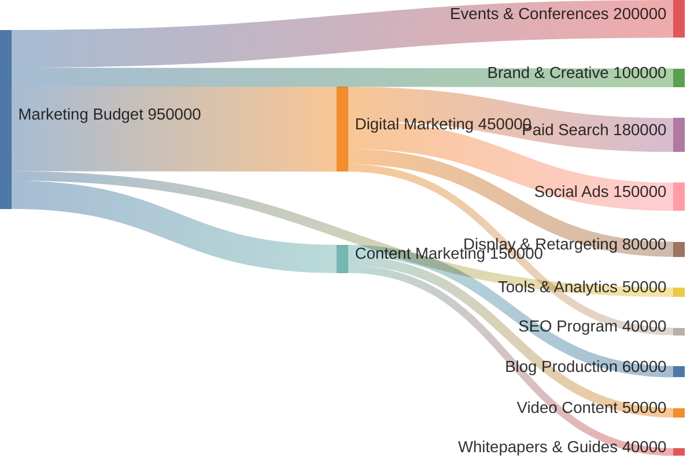

**When to use the alternative instead:** Use a Pie chart when you only need to show the top-level split without showing how categories subdivide further.

> See `diagram-catalog.md#sankey` for full syntax reference.

---

### Use Case 14: Showing Hierarchical Proportional Data

**Best diagram type:** Treemap | **Alternative:** Pie

> **Note:** Treemap diagrams are **experimental** (Mermaid v10.3.0+). Verify support in your rendering environment before using.

Treemaps show hierarchical data as nested rectangles sized by value. They reveal both the hierarchy and the relative magnitude of each segment simultaneously.

**Example:** Support ticket volume by product area and issue type.

**When to use the alternative instead:** Use a Pie chart when data is flat (single level, no hierarchy) and has fewer than 7 categories.

> See `diagram-catalog.md#treemap` for full syntax reference.

---

### Use Case 15: Displaying Trends or Time-Series Metrics

**Best diagram type:** XY-Chart | **Alternative:** .

> **Note:** XY-Chart is **experimental** (Mermaid v10.0.0+). Verify support in your rendering environment before using.

XY-Charts display data points on x and y axes, supporting bar and line charts. They are the right choice for showing metrics over time . adoption curves, revenue trends, or sprint velocity.

**Example:** Weekly active users over 8 weeks post-launch for two product cohorts.

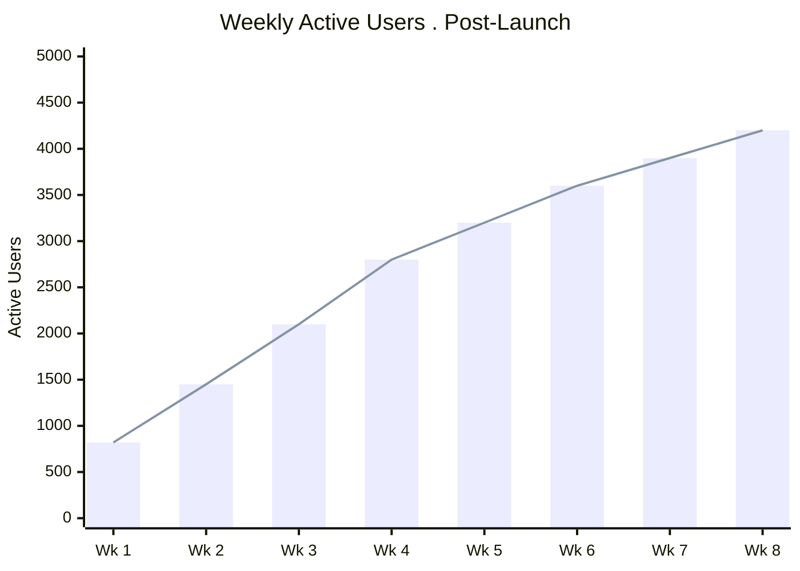

> See `diagram-catalog.md#xy-chart` for full syntax reference.

---

## Choosing Between Primary and Alternative

When the quick-reference table lists an alternative, here is the deciding factor:

| Primary | Alternative | Choose the alternative when... |
|---------|-------------|-------------------------------|
| Flowchart | State | Focus is on valid states, not decision logic |
| Sequence | Flowchart | Interaction is simple with no async or parallel calls |
| State | Flowchart | You need to show the decision logic behind transitions |
| Kanban | State | You need transition rules, not a snapshot of current work |
| Gantt | Timeline | Audience needs milestones only, not task durations |
| Timeline | Gantt | Audience needs to see durations and dependencies |
| Pie | Treemap | Data has nested categories or more than 7 segments |
| ER | Class | You need to show methods and behavioral contracts |
| Class | ER | Focus is on data relationships and cardinality |
| Architecture | Flowchart | Your environment does not support architecture diagrams |
| Sankey | Pie | You only need a single-level breakdown |
| Treemap | Pie | Data is flat with fewer than 7 categories |
