# Mermaid Syntax Guide for Product Managers

A practical reference for writing valid, readable mermaid diagrams.

---

## 1. Label Quoting Rules

Mermaid uses certain characters and words as syntax. When those appear inside your
node labels, wrap the label in double quotes.

**Quote when your label contains:**
- Spaces (`User Login Flow`)
- Special characters (`>`, `<`, `-`, `#`, parentheses, brackets, braces)
- Reserved words used as node IDs: `end`, `graph`, `subgraph`, `click`, `style`, `class`, `default`

**How to quote:** Wrap the entire label in double quotes inside the shape brackets.

### Before/After Examples

**Failure 1 -- Parentheses in label without quotes:**
```mermaid
%% BROKEN: parentheses are interpreted as node shape delimiters
flowchart LR
    A[User Login (SSO)] --> B[Dashboard]
```
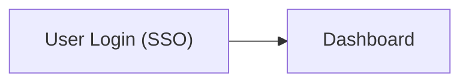

**Failure 2 -- Reserved word `end` as a node label:**
```mermaid
flowchart TD
    start --> process --> end
```
Mermaid interprets `end` as the closing keyword for a subgraph. Fix:
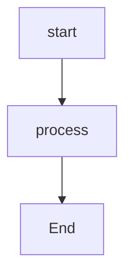

**Failure 3 -- Parentheses in label:**
```mermaid
flowchart LR
    A[Calculate ROI (annualized)] --> B[Report]
```
The parentheses conflict with mermaid's shape syntax. Fix:
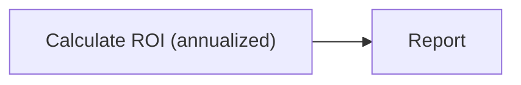

**Failure 4 -- Angle bracket in label:**
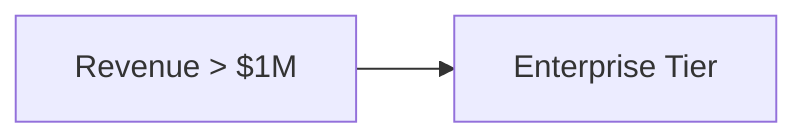
The `>` is interpreted as an asymmetric shape. Fix:


---

## 2. Special Character Escaping

### Characters That Conflict with Mermaid Syntax

| Character | Mermaid Meaning | Problem in Labels |
|-----------|----------------|-------------------|
| `>` | Asymmetric shape, edge arrow | Breaks node shape parsing |
| `<` | Edge arrow | Breaks edge parsing |
| `-` | Edge connector | Can be misread as an edge |
| `#` | Mermaid Unicode escape prefix (`#35;` = `#`) | Triggers entity lookup |
| `(` `)` | Round node shape | Breaks shape brackets |
| `[` `]` | Square node shape | Breaks shape brackets |
| `{` `}` | Diamond node shape | Breaks shape brackets |

### Characters That Conflict with Markdown Renderers

| Character | Markdown Meaning | Effect |
|-----------|-----------------|--------|
| `>` at line start | Blockquote | Line removed from diagram |
| `<word>` | HTML tag | Swallowed or rendered as HTML |
| `-` at line start | List item | Breaks diagram structure |

### Escaping Strategies

**Strategy 1: Quote the whole label (preferred)**
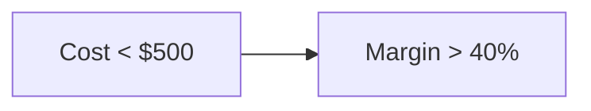

**Strategy 2: HTML entities (last resort)**

Use when quoting alone does not resolve the issue:


Common HTML entities: `&gt;` for `>`, `&lt;` for `<`, `&amp;` for `&`. For `#`, use Mermaid's native escape `#35;` (not HTML `&#35;`).

**General rule:** Try double-quoting first. Only use HTML entities if quoting fails.

---

## 3. Node Declaration Order

In flowcharts, declare a node (give it a shape and label) before referencing it in
edges. Mermaid will not always fail on out-of-order declarations, but it can produce
unexpected shapes or missing labels.

**Failure -- node referenced before declaration:**
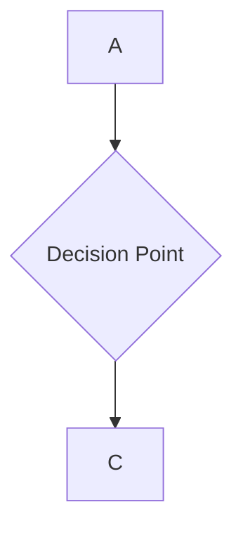
Node B may render as a plain rectangle instead of a diamond because the edge
`A --> B` was parsed before the diamond shape was declared.

**Fix -- declare first, then connect:**
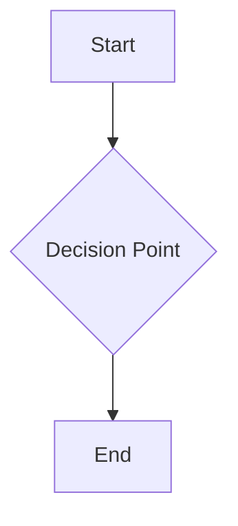

**When this matters most:** Flowcharts and subgraphs. Sequence and state diagrams
handle declaration order more flexibly.

**Practical tip:** Group all node declarations at the top, then list all edges below.

---

## 4. Direction and Layout

### Direction Options

Set direction on the first line after the diagram type keyword:

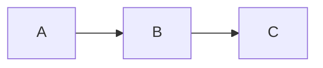

| Direction | Meaning | Best For |
|-----------|---------|----------|
| `TD` or `TB` | Top to bottom (default) | Hierarchies, org charts, decision trees |
| `LR` | Left to right | Process flows, timelines, pipelines |
| `BT` | Bottom to top | Rarely used; escalation paths |
| `RL` | Right to left | Rarely used; right-to-left reading contexts |

### When to Use Each

- **TD** -- Default. Parent-child relationships, approval chains, tree structures.
- **LR** -- Sequences over time: user journeys, release pipelines, workflow steps.
- **BT and RL** -- Rarely needed. Only if the content has a strong spatial metaphor.

### ELK Layout Engine for Complex Diagrams

When the default layout produces excessive edge crossings or overlapping nodes, try
the ELK renderer:

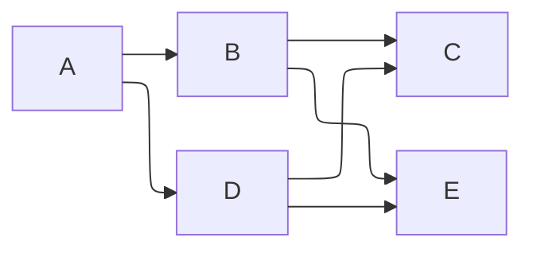

ELK produces cleaner layouts for diagrams with many crossing edges but renders slower.

### Troubleshooting Edge Crossings

1. **Change direction** -- Switch between TD and LR to untangle edges.
2. **Reorder node declarations** -- Layout depends partly on declaration order.
3. **Add intermediate nodes** -- Insert a routing node to control edge paths:
   ```mermaid
   flowchart LR
       A --> B
       B --> mid[ ] --> C
       style mid width:0px,height:0px
   ```
   Note: Invisible node techniques vary by renderer. Test in your target environment.

---

## 5. Styling and Accessibility

### Semantic Color Palette

WCAG AA compliant (minimum 3:1 contrast ratio). Use consistently across all diagrams.

| Meaning | Background | Text | Use For |
|---------|-----------|------|---------|
| Success | `#d4edda` | `#155724` | Completed, approved, live |
| Error | `#f8d7da` | `#721c24` | Failed, blocked, rejected |
| Warning | `#fff3cd` | `#856404` | At risk, needs attention |
| Info | `#cce5ff` | `#004085` | Informational, in progress |
| Neutral | `#e2e3e5` | `#383d41` | Default, no status |

### Accessibility Rules

1. **Dark text on light backgrounds, always.**
2. **Never rely on color alone.** Use labels ("BLOCKED", "DONE") and shapes
   (diamonds for decisions, rectangles for actions) so colorblind readers can
   understand the diagram without seeing any color.
3. **WCAG AA minimum:** 3:1 contrast ratio for graphical elements.

### Applying Styles

Syntax differs by diagram type:

**Flowchart -- use `:::className`:**
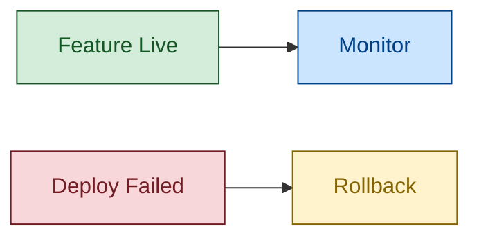

**State diagram -- use `class` statement:**
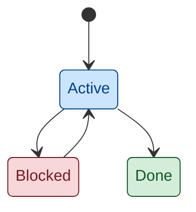

---

## 6. Comments

Use `%%` to add comments. Comments are not rendered -- they exist for maintainers.

### Comment Categories

Use a prefix to signal the comment's purpose:

| Prefix | Purpose | Example |
|--------|---------|---------|
| `MEANING` | Why this diagram exists | `%% MEANING: Shows the approval chain for enterprise deals` |
| `COLOR` | Why a specific color was chosen | `%% COLOR: Red = blocked by legal review` |
| `GOTCHA` | Non-obvious syntax or workaround | `%% GOTCHA: "end" is reserved; use endNode as ID` |

### Example

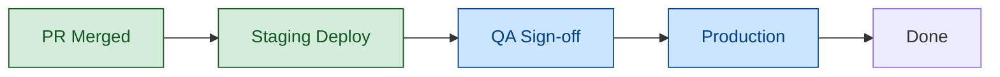

---

## 7. Configuration Blocks

### Theme Selection

Mermaid ships with five built-in themes:

| Theme | When to Use |
|-------|-------------|
| `base` | Recommended when applying custom colors. Starts minimal so your colors show cleanly. |
| `default` | Fine for most diagrams with no custom styling. |
| `dark` | When embedding in a dark-mode interface. |
| `forest` | Green-toned; rarely needed. |
| `neutral` | Grayscale; good for print. |

### Configuration Syntax

Place the init block on the very first line of the diagram, before the diagram type:

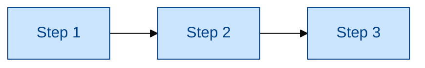

### When to Configure vs. When to Use Defaults

**Use defaults** for quick diagrams and internal docs.

**Configure** when embedding in a themed site, enforcing brand colors, or the
default theme clashes with surrounding content. Most PM diagrams are fine with
defaults plus `classDef` on individual nodes.

---

## 8. Node and Participant Limits

These are guidelines, not hard rules -- but exceeding them usually means the diagram
should be split.

| Diagram Type | Recommended Max | Notes |
|-------------|----------------|-------|
| Flowchart | 12 nodes | Split with subgraphs above 12 |
| Sequence | 6 participants | Use aliases for long names |
| Class | 8 classes | Split by domain boundary |
| ER | 8-10 entities | Focus on one bounded context |
| State | 10 states | Use composite states for complex machines |
| Gantt | 20 tasks | Group with sections |
| Mindmap | 4 levels deep | Balance branch width |
| Pie | 3-7 slices | Group small items into "Other" |
| Quadrant | 10-12 points | Keep labels under 12 characters |
| Kanban | 10-15 tasks | 3-5 columns |
| Architecture | 10-20 services | Group with subgraphs |
| Timeline | ~15 events | Use sections for eras |
| Sankey | 5-15 nodes | Aggregate tiny flows into "Other" |
| Treemap | ~30 leaf nodes | 2-3 levels max |
| XY-Chart | 4 lines, 6-8 points | More lines or points obscures trends |

### When You Exceed the Limit

1. **Split into multiple diagrams.** "System Overview" + "Payment Detail" beats one
   mega-diagram.
2. **Use subgraphs or sections.** Group related nodes into clusters.
3. **Aggregate small items.** Combine minor categories into "Other" (pie, Sankey)
   or collapse low-traffic paths (flowcharts).

---

## 9. Pre-Commit Validation Checklist

Run through this list before finalizing any diagram:

1. **Paste into [mermaid.live](https://mermaid.live)** -- Does it render without errors?
2. **All labels with spaces are quoted** -- Search for `[` and check that labels
   containing spaces use `["..."]` syntax.
3. **No unescaped special characters in labels** -- Check for `>`, `<`, `(`, `)`,
   `#` inside labels.
4. **Node count within type-specific limit** -- Count your nodes against the table
   in section 8.
5. **Direction makes sense** -- LR for timelines and process flows, TD for
   hierarchies and trees.
6. **Colors tested in both light and dark mode** -- Paste into mermaid.live and
   toggle the theme.
7. **No linear sequences that should be lists** -- If your "diagram" is just
   A --> B --> C --> D with no branching, a numbered list communicates the same
   information more simply.
8. **Labels are readable at normal zoom** -- If you have to zoom in to read labels,
   the diagram has too many nodes or labels are too long.

---

## 10. Common Rendering Failures

| Symptom | Cause | Fix |
|---------|-------|-----|
| Blank diagram | Typo in diagram type keyword or malformed init block | Verify spelling of the diagram type keyword. Prefer `flowchart` over legacy `graph` for new diagrams |
| Missing node | Node referenced in an edge but never declared with a shape | Declare the node with a label before using it in edges |
| Broken arrow | Wrong arrow syntax for the diagram type (e.g., `-->` in a sequence diagram) | Use `->>` for sequence diagrams, `-->` for flowcharts |
| Label shows raw text | Unquoted label with special characters | Wrap label in double quotes: `["label text"]` |
| Diagram too wide | Using TD (top-down) for a long sequential process | Switch to LR (left-right) direction |
| Nodes overlap | Too many nodes without subgraph grouping | Reduce node count or group with subgraphs |
| Colors invisible in dark mode | Light text color on what becomes a light background | Use the semantic palette from section 5; test in dark mode |
| "Parse error" message | Reserved word (`end`, `graph`, `default`) used as a bare node ID | Rename the node ID and use quotes for the display label |
| Subgraph won't connect to outside nodes | Wrong syntax for connecting from inside a subgraph | Connect using node IDs, not the subgraph ID, or use `subgraph id -->` syntax |
| Timeline entries missing | Wrong indentation or missing section headers | Each event must be indented under a section; check whitespace |

---

**Quick reference:** Quote labels with spaces (`["label"]`). TD for trees, LR for
processes. Use the five semantic colors. If it feels crowded, split the diagram.
Always paste into mermaid.live before committing.
